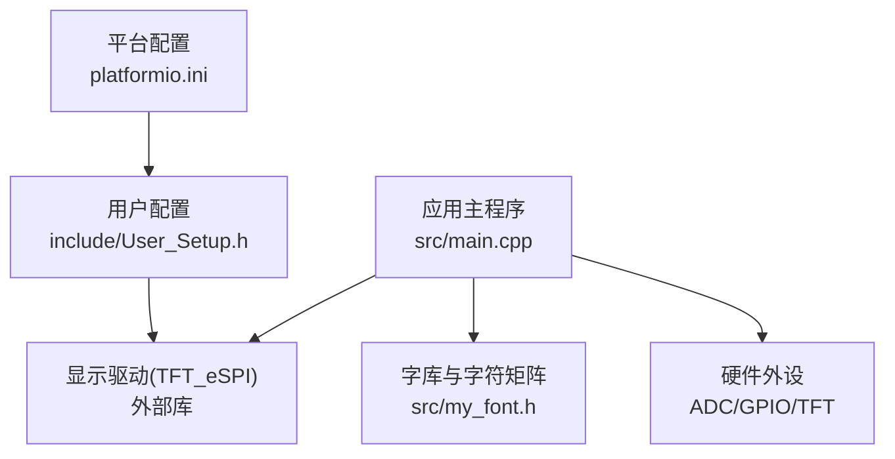
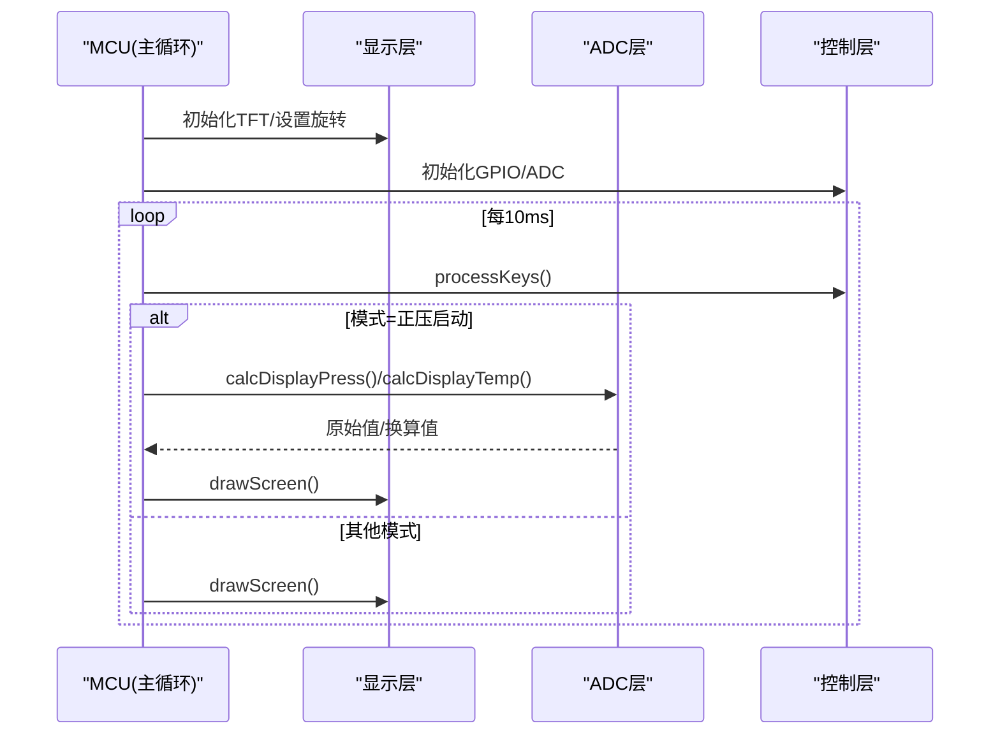
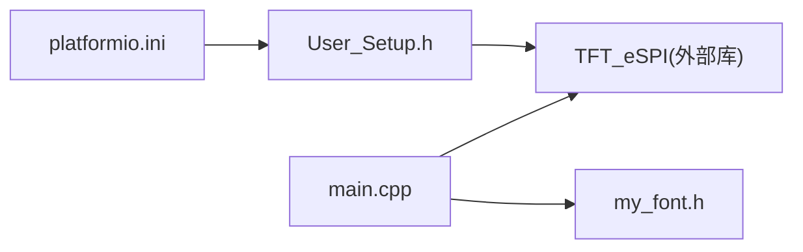

# API参考手册

<cite>
**本文引用的文件**   
- [src/main.cpp](file://src/main.cpp)
- [include/User_Setup.h](file://include/User_Setup.h)
- [src/my_font.h](file://src/my_font.h)
- [platformio.ini](file://platformio.ini)
</cite>

## 目录
1. [简介](#简介)
2. [项目结构](#项目结构)
3. [核心组件](#核心组件)
4. [架构总览](#架构总览)
5. [详细组件分析](#详细组件分析)
6. [依赖关系分析](#依赖关系分析)
7. [性能考虑](#性能考虑)
8. [故障排查指南](#故障排查指南)
9. [结论](#结论)
10. [附录：集成与使用示例](#附录集成与使用示例)

## 简介
本API参考手册面向在GD32F103RCT6平台上运行的正压防爆控制系统，覆盖以下公共接口与能力：
- ADC读取接口（压力、温度）
- 显示绘制函数（TFT屏幕UI、中文混合字符串、按钮等）
- 控制接口（按键输入、蜂鸣器、继电器输出）
- 计算接口（压力/温度换算、校准）

文档提供参数说明、返回值约定、错误处理策略、性能建议与最佳实践，并给出完整的代码示例路径与集成指南。

## 项目结构
本项目采用Arduino框架，基于PlatformIO构建，使用TFT_eSPI驱动并行接口的ILI9486屏，内置自定义中文字库与系统主逻辑。

图表来源
- [platformio.ini:1-45](file://platformio.ini#L1-L45)
- [include/User_Setup.h:14-47](file://include/User_Setup.h#L14-L47)
- [src/main.cpp:10-13](file://src/main.cpp#L10-L13)

章节来源
- [platformio.ini:1-45](file://platformio.ini#L1-L45)
- [include/User_Setup.h:14-47](file://include/User_Setup.h#L14-L47)
- [src/main.cpp:10-13](file://src/main.cpp#L10-L13)

## 核心组件
- ADC子系统：初始化、通道采样、软件触发转换、结果读取
- 显示子系统：TFT初始化、页面绘制、中文混合字符串渲染、按钮绘制
- 控制子系统：按键消抖与状态机、蜂鸣器提示、继电器控制
- 计算子系统：压力/温度换算、校准偏移与斜率

章节来源
- [src/main.cpp:74-101](file://src/main.cpp#L74-L101)
- [src/main.cpp:144-155](file://src/main.cpp#L144-L155)
- [src/main.cpp:157-165](file://src/main.cpp#L157-L165)
- [src/main.cpp:111-142](file://src/main.cpp#L111-L142)
- [src/main.cpp:103-109](file://src/main.cpp#L103-L109)
- [src/main.cpp:311-363](file://src/main.cpp#L311-L363)

## 架构总览
系统以单任务轮询为主，setup完成硬件与字体初始化，loop周期内执行按键扫描、计时更新、传感器采集与界面刷新。

图表来源
- [src/main.cpp:365-432](file://src/main.cpp#L365-L432)
- [src/main.cpp:303-309](file://src/main.cpp#L303-L309)
- [src/main.cpp:144-155](file://src/main.cpp#L144-L155)

## 详细组件分析

### ADC读取接口
- 功能概述
  - 初始化ADC1时钟、复位与自校准、采样时间配置、单次转换模式
  - 支持任意通道读取，内部包含硬件就绪检查与超时等待
- 关键函数与行为
  - adcInit(): 开启ADC1时钟、执行复位与自校准、关闭扫描与连续模式、配置采样时间、使能ADON
  - adcReadChannel(ch): 若未就绪则自动初始化；设置SQR3为指定通道、清零SR、短延时后软件触发SWSTART；等待EOC标志位后返回数据寄存器DR
- 参数与返回值
  - 输入: ch (uint8_t)，范围0~31，对应ADC通道号
  - 返回: uint16_t，0~4095的12位ADC原始值；若硬件未就绪返回0
- 错误处理
  - 硬件未就绪时返回0，调用方应做异常分支处理
  - 转换超时保护：等待EOC带计数上限，避免死等
- 性能与精度
  - 采样时间配置为较高采样率，适合一般工业环境
  - 建议在应用层进行多次采样滤波（如均值滤波）提升稳定性
- 使用示例路径
  - 初始化与校准流程：[src/main.cpp:365-388](file://src/main.cpp#L365-L388)
  - 压力/温度换算调用：[src/main.cpp:144-155](file://src/main.cpp#L144-L155)

章节来源
- [src/main.cpp:74-101](file://src/main.cpp#L74-L101)
- [src/main.cpp:365-388](file://src/main.cpp#L365-L388)
- [src/main.cpp:144-155](file://src/main.cpp#L144-L155)

### 显示绘制函数
- 功能概述
  - 基于TFT_eSPI实现全屏填充、矩形绘制、文本输出、中文混合字符串渲染、菜单按钮绘制
- 关键函数与行为
  - drawMixedString(str, x, y, color, scale, bold): 解析UTF-8串，识别汉字与ASCII，分别调用点阵绘制或标准字体输出
  - drawChineseChar(ch, x, y, color, scale, bold): 根据字库索引查找16x16点阵，按像素块绘制，支持缩放与加粗
  - drawBtn(idx, label, color): 绘制底部三按钮布局，居中显示标签
  - drawMainPage/drawPressureScreen/drawSettingsMenu/drawDebugScreen: 各页面绘制逻辑
  - drawScreen(): 根据全局mode调度具体页面绘制
- 参数与返回值
  - 坐标与颜色：int x/y，uint16_t color（TFT_eSPI颜色常量）
  - 缩放与加粗：float scale，bool bold
  - 无显式返回值，副作用为屏幕更新
- 错误处理
  - 字库缺失字符将跳过绘制，不会崩溃
  - 建议在上层保证坐标不越界
- 性能与优化
  - 中文绘制为逐像素填充，频繁刷新可能影响帧率；建议局部刷新或降低刷新频率
  - 批量绘制前可缓存常用字符串宽度以减少重复计算
- 使用示例路径
  - 中文绘制入口：[src/main.cpp:111-142](file://src/main.cpp#L111-L142)
  - 按钮绘制：[src/main.cpp:157-165](file://src/main.cpp#L157-L165)
  - 页面绘制与调度：[src/main.cpp:167-309](file://src/main.cpp#L167-L309)

章节来源
- [src/main.cpp:111-142](file://src/main.cpp#L111-L142)
- [src/main.cpp:157-165](file://src/main.cpp#L157-L165)
- [src/main.cpp:167-309](file://src/main.cpp#L167-L309)

### 控制接口
- 功能概述
  - 按键输入消抖与状态切换、蜂鸣器提示、继电器控制（进气、排气、送电、警报）
- 关键函数与行为
  - beep(n, onMs, offMs): 产生n次蜂鸣，每次onMs高电平，间隔offMs低电平
  - processKeys(): 检测KEY1/KEY2/KEY3下降沿，带消抖与蜂鸣反馈，依据当前mode切换界面或控制状态
  - 主循环中根据模式控制INLET_RELAY/EXHAUST_RELAY/POWER_RELAY
- 参数与返回值
  - beep: n(uint8_t), onMs(uint16_t), offMs(uint16_t)，无返回值
  - processKeys: 无参，无返回值，副作用为状态变量与GPIO更新
- 错误处理
  - 按键消抖防止误触；蜂鸣阻塞式实现，注意不要在高频刷新路径中调用
- 使用示例路径
  - 蜂鸣器：[src/main.cpp:103-109](file://src/main.cpp#L103-L109)
  - 按键处理：[src/main.cpp:311-363](file://src/main.cpp#L311-L363)
  - 继电器控制：[src/main.cpp:398-423](file://src/main.cpp#L398-L423)

章节来源
- [src/main.cpp:103-109](file://src/main.cpp#L103-L109)
- [src/main.cpp:311-363](file://src/main.cpp#L311-L363)
- [src/main.cpp:398-423](file://src/main.cpp#L398-L423)

### 计算接口
- 功能概述
  - 将ADC原始值转换为工程单位（Pa、℃），支持校准偏移与斜率
- 关键函数与行为
  - calcDisplayPress(): 对压力通道进行N次采样求平均，应用校准偏移与斜率，负值截断为0
  - calcDisplayTemp(): 对温度通道采样，结合系数与参考电压换算为摄氏度
- 参数与返回值
  - 无输入参数
  - 返回: float，分别为压力(Pa)与温度(℃)
- 错误处理
  - 压力结果小于0时归零，避免负值显示
  - 温度换算依赖TEMP_COEFF与参考电压，需确保校准正确
- 使用示例路径
  - 压力/温度换算：[src/main.cpp:144-155](file://src/main.cpp#L144-L155)
  - 校准初始值采集：[src/main.cpp:382-386](file://src/main.cpp#L382-L386)

章节来源
- [src/main.cpp:144-155](file://src/main.cpp#L144-L155)
- [src/main.cpp:382-386](file://src/main.cpp#L382-L386)

### 数据结构定义
- 中文字库结构体
  - CHINESE_16: index(字符串键)、matrix(16x16点阵，32字节)
  - ASCII_16: ch(字符)、matrix(8x16点阵，16字节)
- 字库数组
  - font_16[]: 存储多个汉字的点阵数据，供drawChineseChar检索
- 使用示例路径
  - 结构体定义与字库数组：[src/my_font.h:7-18](file://src/my_font.h#L7-L18)

章节来源
- [src/my_font.h:7-18](file://src/my_font.h#L7-L18)

## 依赖关系分析
- 构建与编译
  - platformio.ini定义了目标板、框架、库依赖与宏定义，启用并行8位总线、STM端口B数据总线、ILI9486驱动、平滑字体等
- 用户配置
  - include/User_Setup.h映射引脚、选择驱动、启用字体集与平滑字体
- 应用依赖
  - src/main.cpp依赖TFT_eSPI与my_font.h，直接操作ADC与GPIO

图表来源
- [platformio.ini:1-45](file://platformio.ini#L1-L45)
- [include/User_Setup.h:14-47](file://include/User_Setup.h#L14-L47)
- [src/main.cpp:10-13](file://src/main.cpp#L10-L13)

章节来源
- [platformio.ini:1-45](file://platformio.ini#L1-L45)
- [include/User_Setup.h:14-47](file://include/User_Setup.h#L14-L47)
- [src/main.cpp:10-13](file://src/main.cpp#L10-L13)

## 性能考虑
- ADC采样
  - 单次转换+软件触发，适合低频采集；如需更高吞吐可考虑DMA或多通道序列
  - 应用层已对压力进行8次均值滤波，建议保持或根据噪声特性调整
- 显示刷新
  - 全页刷新开销较大，建议仅刷新变化区域或使用双缓冲
  - 中文绘制为逐像素填充，减少频繁重绘与缩放比例过大带来的额外开销
- 控制响应
  - 蜂鸣器为阻塞式，避免在高频刷新路径调用；按键消抖阈值合理，可根据实际手感微调
- 内存与Flash
  - 字库占用Flash空间，按需裁剪字库可减少体积

## 故障排查指南
- 屏幕无显示
  - 检查User_Setup.h与platformio.ini中的引脚宏是否与实际硬件一致
  - 确认TFT_eSPI初始化成功与旋转方向设置
- ADC读数异常
  - 检查adcHwReady标志与校准流程是否执行
  - 验证通道号与物理引脚映射是否正确
- 中文显示乱码或缺字
  - 确认字库中包含所需字符；缺失字符将被跳过
- 按键无响应
  - 检查INPUT_PULLUP配置与消抖时间；确认按键按下为低电平
- 蜂鸣器不响
  - 检查蜂鸣器引脚输出与delay调用位置

章节来源
- [include/User_Setup.h:42-47](file://include/User_Setup.h#L42-L47)
- [src/main.cpp:74-101](file://src/main.cpp#L74-L101)
- [src/main.cpp:311-363](file://src/main.cpp#L311-L363)

## 结论
本系统围绕ADC采集、TFT显示与控制输出构建了清晰的API边界。通过合理的校准与滤波、页面调度与中文渲染，实现了正压防爆控制的交互与监控。遵循本文的性能建议与最佳实践，可在资源受限的MCU上获得稳定可靠的运行效果。

## 附录：集成与使用示例

### 集成步骤
- 构建环境
  - 使用PlatformIO，目标板genericSTM32F103RC，框架Arduino
  - 依赖库TFT_eSPI版本^2.5.43
- 引脚与驱动配置
  - 在User_Setup.h中确认并行8位总线、PB数据总线、ILI9486驱动与引脚映射
- 初始化顺序
  - setup中初始化串口、TFT、GPIO、ADC，并进行零点校准
  - 首次进入主页绘制

章节来源
- [platformio.ini:1-45](file://platformio.ini#L1-L45)
- [include/User_Setup.h:14-47](file://include/User_Setup.h#L14-L47)
- [src/main.cpp:365-388](file://src/main.cpp#L365-L388)

### 使用示例（路径引用）
- 读取压力与温度并显示
  - 换算函数：[src/main.cpp:144-155](file://src/main.cpp#L144-L155)
  - 页面绘制：[src/main.cpp:190-252](file://src/main.cpp#L190-L252)
- 绘制中文与按钮
  - 中文绘制：[src/main.cpp:111-142](file://src/main.cpp#L111-L142)
  - 按钮绘制：[src/main.cpp:157-165](file://src/main.cpp#L157-L165)
- 控制继电器与蜂鸣器
  - 蜂鸣器：[src/main.cpp:103-109](file://src/main.cpp#L103-L109)
  - 继电器控制：[src/main.cpp:398-423](file://src/main.cpp#L398-L423)
- 按键交互
  - 按键处理：[src/main.cpp:311-363](file://src/main.cpp#L311-L363)