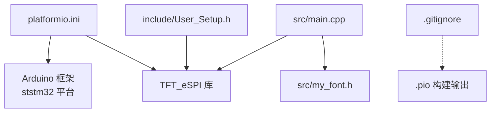
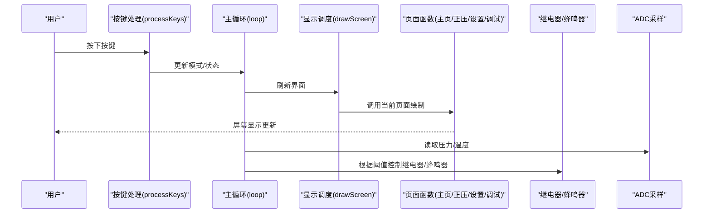
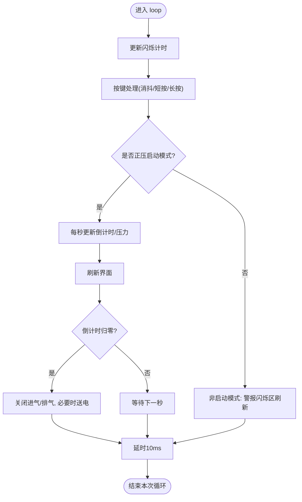
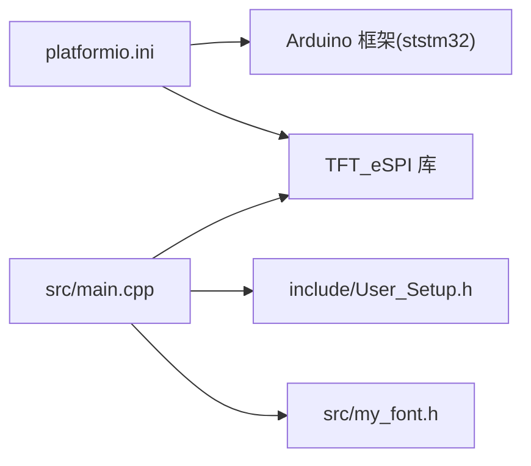

# 开发环境搭建

<cite>
**本文引用的文件**   
- [platformio.ini](file://platformio.ini)
- [include/User_Setup.h](file://include/User_Setup.h)
- [src/main.cpp](file://src/main.cpp)
- [src/my_font.h](file://src/my_font.h)
- [.gitignore](file://.gitignore)
</cite>

## 目录
1. [简介](#简介)
2. [项目结构](#项目结构)
3. [核心组件](#核心组件)
4. [架构总览](#架构总览)
5. [详细组件分析](#详细组件分析)
6. [依赖关系分析](#依赖关系分析)
7. [性能与优化建议](#性能与优化建议)
8. [故障诊断指南](#故障诊断指南)
9. [结论](#结论)
10. [附录：版本控制与团队协作流程](#附录版本控制与团队协作流程)

## 简介
本指南面向使用 GD32F103RCT6 的嵌入式团队，提供基于 PlatformIO + Arduino 框架的一站式开发环境搭建说明。内容涵盖：
- 平台与工具链配置（PlatformIO、ST-Link 调试/烧录）
- 依赖库安装与构建宏定义
- 硬件连接验证与基本测试方法
- 固件烧录步骤与常见问题排查
- 性能优化建议
- 版本控制最佳实践与团队协作流程

本项目采用 Arduino 框架驱动 ILI9486 驱动的 3.5 寸 480x320 TFT 屏（8位并行），并集成 ADC 采集、按键输入、蜂鸣器与继电器控制等外设，实现正压防爆控制系统的人机交互界面与控制逻辑。

## 项目结构
仓库采用按功能分层的组织方式：
- include：用户自定义头文件（TFT_eSPI 的用户配置）
- lib：第三方库存放位置（由 PlatformIO 自动管理）
- src：应用源码（主程序与自定义字库）
- test：测试用例占位
- platformio.ini：构建环境与依赖配置
- .gitignore：忽略编译产物与 IDE 缓存

图示来源
- [platformio.ini:1-45](file://platformio.ini#L1-L45)
- [include/User_Setup.h:1-74](file://include/User_Setup.h#L1-L74)
- [src/main.cpp:1-433](file://src/main.cpp#L1-L433)
- [src/my_font.h:1-845](file://src/my_font.h#L1-L845)
- [.gitignore:1-6](file://.gitignore#L1-L6)

章节来源
- [platformio.ini:1-45](file://platformio.ini#L1-L45)
- [include/User_Setup.h:1-74](file://include/User_Setup.h#L1-L74)
- [src/main.cpp:1-433](file://src/main.cpp#L1-L433)
- [src/my_font.h:1-845](file://src/my_font.h#L1-L845)
- [.gitignore:1-6](file://.gitignore#L1-L6)

## 核心组件
- 构建与环境配置（platformio.ini）
  - 平台：ststm32；板型：genericSTM32F103RC；框架：arduino
  - 上传与调试协议：stlink
  - 串口监视波特率：115200
  - 依赖库：TFT_eSPI（bodmer/TFT_eSPI@^2.5.43）
  - 构建宏：启用并行 8bit 总线、端口映射、ILI9486 驱动、字体加载等
- 显示驱动配置（include/User_Setup.h）
  - 定义 STM32 兼容、8位并行接口、PB0-PB7 数据总线、控制引脚 DC/CS/WR/RD/RST
  - 选择 ILI9486 驱动，开启多种内置字体与平滑字体支持
- 应用主程序（src/main.cpp）
  - 初始化串口、TFT、GPIO、ADC，完成传感器零点校准
  - 实现多页面 UI（主页、正压启动、系统设置、系统调试）
  - 按键消抖与模式切换、倒计时与压力阈值判断、警报与消音状态
  - 蜂鸣器提示、继电器控制（进气/排气/送电/报警）
- 中文字库（src/my_font.h）
  - 16x16 点阵汉字数组，包含界面所需常用词汇
  - 配合 drawMixedString/drawChineseChar 进行混合中英文绘制

章节来源
- [platformio.ini:1-45](file://platformio.ini#L1-L45)
- [include/User_Setup.h:1-74](file://include/User_Setup.h#L1-L74)
- [src/main.cpp:1-433](file://src/main.cpp#L1-L433)
- [src/my_font.h:1-845](file://src/my_font.h#L1-L845)

## 架构总览
下图展示了从用户操作到屏幕更新与外设控制的调用链路。

图示来源
- [src/main.cpp:311-363](file://src/main.cpp#L311-L363)
- [src/main.cpp:390-433](file://src/main.cpp#L390-L433)
- [src/main.cpp:167-309](file://src/main.cpp#L167-L309)
- [src/main.cpp:74-101](file://src/main.cpp#L74-L101)

## 详细组件分析

### 构建与依赖（platformio.ini）
- 关键项
  - platform/board/framework：指定 ststm32 平台、genericSTM32F103RC 板型、Arduino 框架
  - upload_protocol/debug_protocol：stlink（需安装 ST-Link 驱动与工具链）
  - monitor_speed：115200（与 main.cpp 中 Serial.begin 一致）
  - lib_deps：TFT_eSPI 库版本约束
  - build_flags：启用并行 8bit、端口映射、ILI9486 驱动、字体加载、16bit 总线标志等
- 注意事项
  - 若更换屏幕驱动或引脚，需同步修改 platformio.ini 中的宏与 User_Setup.h 中的定义
  - 确保 ST-Link 驱动已正确安装，且设备管理器中可见

章节来源
- [platformio.ini:1-45](file://platformio.ini#L1-L45)

### 显示驱动配置（User_Setup.h）
- 接口与引脚
  - 8位并行数据总线 PB0-PB7，控制引脚 PA2(PA2=DC)、PA4(CS)、PA5(WR)、PA3(RD)、PA1(RST)
- 驱动与字体
  - 选择 ILI9486 驱动
  - 启用 GLCD、Font2/4/6/7/8、GFXFF 自由字体与平滑字体
- 兼容性
  - 通过 #define STM32 启用 STM32 优化路径（GD32 兼容）

章节来源
- [include/User_Setup.h:1-74](file://include/User_Setup.h#L1-L74)

### 应用主程序（main.cpp）
- 初始化流程（setup）
  - 串口初始化（115200）、TFT 初始化与横屏旋转
  - GPIO 方向与初始电平设置（蜂鸣器、按键上拉、继电器低电平关闭）
  - ADC 初始化与校准（压力/温度零点采样）
  - 首次绘制主页
- 主循环（loop）
  - 闪烁计时（警报闪烁）
  - 按键处理（消抖、短按/长按分支）
  - 正压启动模式：倒计时、压力采样、阈值判断、继电器动作
  - 非启动模式下的警报闪烁区域局部刷新
- 关键模块
  - ADC 采样：单次转换、等待 EOC、返回原始值
  - 压力/温度换算：线性系数与偏移量
  - 中文绘制：逐字查找点阵矩阵，按缩放与加粗参数绘制
  - 菜单按钮布局：统一计算坐标与文本居中

图示来源
- [src/main.cpp:390-433](file://src/main.cpp#L390-L433)
- [src/main.cpp:311-363](file://src/main.cpp#L311-L363)
- [src/main.cpp:144-155](file://src/main.cpp#L144-L155)

章节来源
- [src/main.cpp:1-433](file://src/main.cpp#L1-L433)

### 中文字库（my_font.h）
- 数据结构
  - CHINESE_16：索引字符串 + 16x16 点阵矩阵
  - ASCII_16：单字符 + 8x16 点阵矩阵
- 使用方式
  - 在 main.cpp 中通过 drawChineseChar/drawMixedString 遍历字库匹配字符并绘制
- 扩展建议
  - 新增字符时保持索引与矩阵格式一致，避免越界与乱码

章节来源
- [src/my_font.h:1-845](file://src/my_font.h#L1-L845)
- [src/main.cpp:111-142](file://src/main.cpp#L111-L142)

## 依赖关系分析
- 外部依赖
  - TFT_eSPI：通过 PlatformIO 自动下载与管理
  - ST-Link：用于烧录与调试（需在主机安装驱动与工具链）
- 内部依赖
  - main.cpp 依赖 User_Setup.h（TFT 引脚与驱动配置）
  - main.cpp 依赖 my_font.h（中文点阵资源）
  - platformio.ini 集中声明所有构建宏与依赖

图示来源
- [platformio.ini:1-45](file://platformio.ini#L1-L45)
- [include/User_Setup.h:1-74](file://include/User_Setup.h#L1-L74)
- [src/main.cpp:1-433](file://src/main.cpp#L1-L433)
- [src/my_font.h:1-845](file://src/my_font.h#L1-L845)

章节来源
- [platformio.ini:1-45](file://platformio.ini#L1-L45)
- [include/User_Setup.h:1-74](file://include/User_Setup.h#L1-L74)
- [src/main.cpp:1-433](file://src/main.cpp#L1-L433)
- [src/my_font.h:1-845](file://src/my_font.h#L1-L845)

## 性能与优化建议
- 显示刷新优化
  - 仅对变化区域进行局部刷新（如警报闪烁区），减少全屏重绘
  - 合理设置字体大小与数量，避免过多大字号绘制
- 按键与事件
  - 使用消抖与时间戳去重，降低无效中断与重复处理
- ADC 采样
  - 适当增加采样次数并取均值，提升稳定性
  - 将高频采样与 UI 刷新解耦，避免阻塞
- 内存与存储
  - 字库位于 Flash，注意整体代码体积与可用空间
  - 谨慎使用动态分配，优先静态缓冲与全局变量

[本节为通用指导，不直接分析具体文件]

## 故障诊断指南
- 无法烧录/调试
  - 检查 ST-Link 驱动是否正确安装，设备管理器中是否识别
  - 确认 platformio.ini 中 upload_protocol/debug_protocol 设置为 stlink
  - 检查接线：SWDIO/SWCLK/GND/VCC 是否牢固
- 屏幕无显示或花屏
  - 核对 User_Setup.h 与 platformio.ini 中的引脚定义是否一致
  - 确认驱动型号（ILI9486）与实际屏幕控制器匹配
  - 检查并行数据线 PB0-PB7 与控制线 DC/CS/WR/RD/RST 的连线
- 串口无输出
  - 确认 main.cpp 中 Serial.begin 波特率与监视器一致（115200）
  - 检查 USB 转串口驱动与 COM 端口号
- 按键无响应或误触发
  - 检查按键上拉配置与消抖逻辑
  - 观察 processKeys 中的下降沿检测与时间戳条件
- 压力/温度读数异常
  - 检查 ADC 通道与引脚对应关系（PC4/PC5）
  - 校准阶段零点采样是否稳定，必要时延长采样时间

章节来源
- [platformio.ini:1-45](file://platformio.ini#L1-L45)
- [include/User_Setup.h:1-74](file://include/User_Setup.h#L1-L74)
- [src/main.cpp:366-388](file://src/main.cpp#L366-L388)
- [src/main.cpp:311-363](file://src/main.cpp#L311-L363)
- [src/main.cpp:74-101](file://src/main.cpp#L74-L101)

## 结论
本项目以 PlatformIO + Arduino 为核心，结合 TFT_eSPI 并行驱动与自定义字库，实现了 GD32F103RCT6 上的正压防爆控制系统人机界面与基础控制逻辑。通过合理的构建宏与配置，可快速搭建开发环境并完成调试与部署。建议在后续迭代中持续优化显示刷新策略与采样算法，完善错误处理与日志输出，以提升系统稳定性与可维护性。

[本节为总结性内容，不直接分析具体文件]

## 附录：版本控制与团队协作流程
- 仓库清理
  - .gitignore 已排除 .pio 构建输出与 VSCode 缓存，避免提交无关文件
- 分支策略
  - 建议使用 feature/* 分支进行功能开发，合并至 main 前进行代码审查与测试
- 提交规范
  - 提交信息应包含变更范围与简要说明（例如：feat: 增加系统设置密码校验）
- 协作流程
  - 新功能先创建分支，完成后发起 Pull Request，至少一名成员审查后合并
  - 发布前执行全量构建与基本功能回归测试，记录版本号与变更日志

章节来源
- [.gitignore:1-6](file://.gitignore#L1-L6)