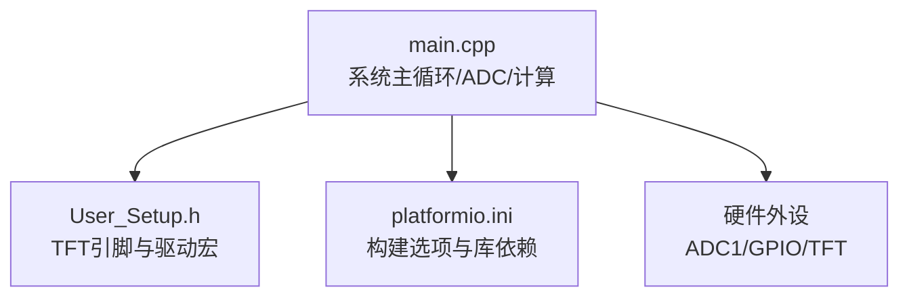
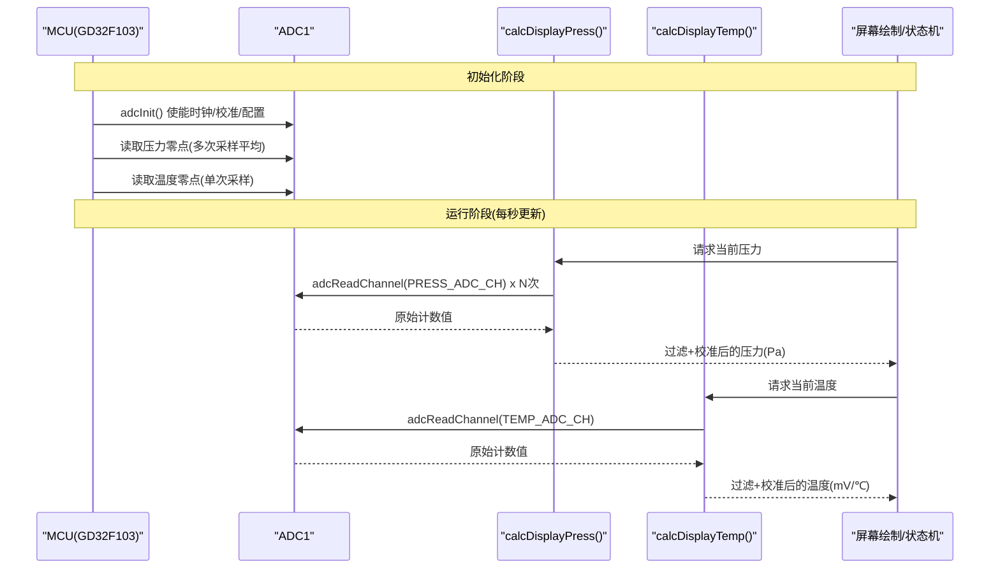
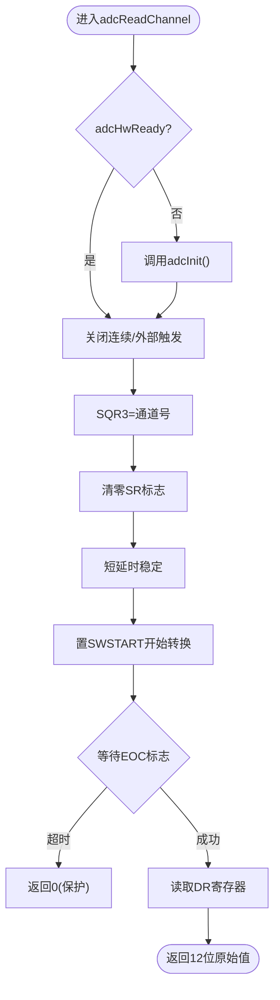
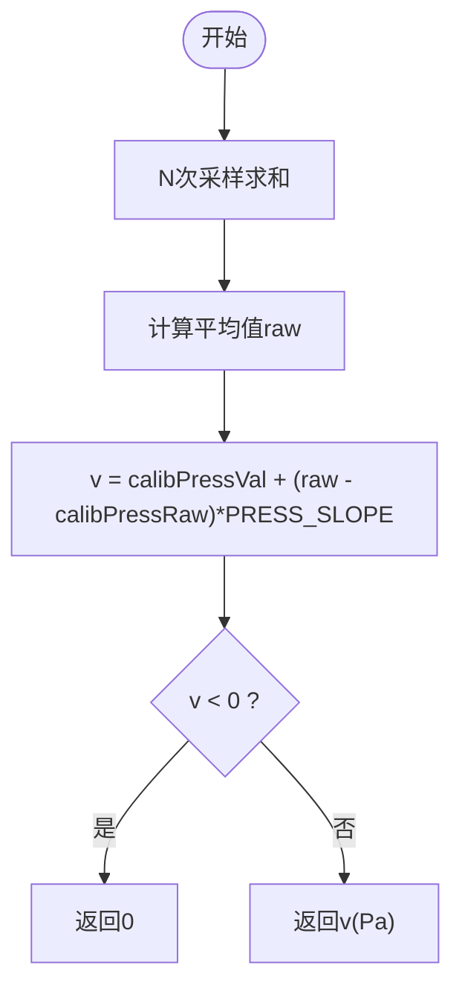
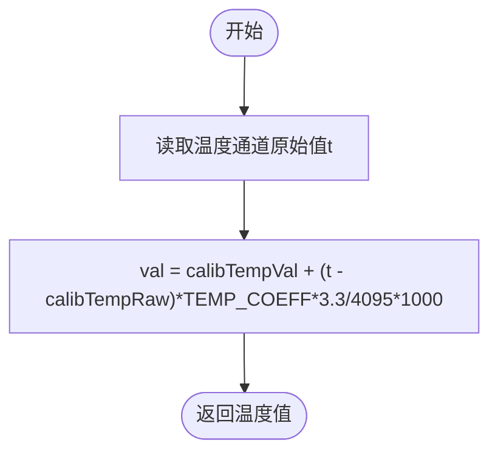
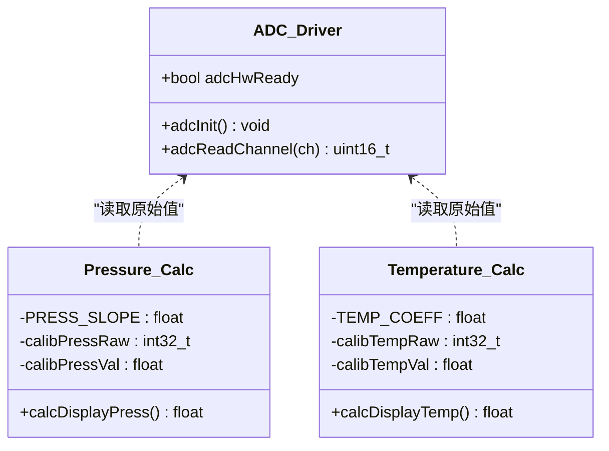
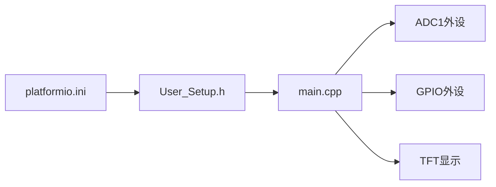

# 传感器数据采集

<cite>
**本文引用的文件**   
- [src/main.cpp](file://src/main.cpp)
- [include/User_Setup.h](file://include/User_Setup.h)
- [platformio.ini](file://platformio.ini)
</cite>

## 目录
1. [简介](#简介)
2. [项目结构](#项目结构)
3. [核心组件](#核心组件)
4. [架构总览](#架构总览)
5. [详细组件分析](#详细组件分析)
6. [依赖关系分析](#依赖关系分析)
7. [性能考虑](#性能考虑)
8. [故障排查指南](#故障排查指南)
9. [结论](#结论)
10. [附录：关键流程与示例路径](#附录关键流程与示例路径)

## 简介
本文件面向GD32F103RCT6正压防爆控制系统的“传感器数据采集模块”，聚焦ADC驱动的完整实现与压力/温度传感器的数据处理链路。内容涵盖：
- ADC初始化流程、寄存器配置与单次转换过程
- PC4(压力，ADC通道14)与PC5(温度，ADC通道15)的引脚与通道配置
- calcDisplayPress()与calcDisplayTemp()的数据转换算法（滤波、校准、单位换算）
- 校准机制：原始零点calibPressRaw/calibTempRaw的获取与系数calibPressVal/calibTempVal的应用
- PRESS_SLOPE与TEMP_COEFF系数的作用与调整方法
- 常见问题定位与优化建议（读数不稳定、校准不准确、采样速度慢）

## 项目结构
本项目为Arduino框架下的GD32F103RCT6工程，主逻辑位于src/main.cpp；TFT显示驱动通过User_Setup.h与platformio.ini进行引脚与编译宏配置。

图表来源
- [src/main.cpp:1-12](file://src/main.cpp#L1-L12)
- [include/User_Setup.h:14-47](file://include/User_Setup.h#L14-L47)
- [platformio.ini:1-45](file://platformio.ini#L1-L45)

章节来源
- [src/main.cpp:1-20](file://src/main.cpp#L1-L20)
- [include/User_Setup.h:14-47](file://include/User_Setup.h#L14-L47)
- [platformio.ini:1-45](file://platformio.ini#L1-L45)

## 核心组件
- ADC驱动层
  - adcInit(): 使能ADC1时钟、执行内部校准、配置扫描/连续/外部触发、设置采样时间、启动ADC
  - adcReadChannel(ch): 单通道单次转换，等待EOC标志并读取数据寄存器
- 传感器计算层
  - calcDisplayPress(): 对压力通道多次采样取平均，应用零点偏移与斜率系数，输出Pa
  - calcDisplayTemp(): 对温度通道单次采样，应用零点偏移与温度系数，输出mV（或按注释换算为℃）
- 校准参数
  - calibPressRaw/calibTempRaw: 上电零点原始值
  - calibPressVal/calibTempVal: 零点偏移量
  - PRESS_SLOPE/TEMP_COEFF: 线性化系数

章节来源
- [src/main.cpp:75-101](file://src/main.cpp#L75-L101)
- [src/main.cpp:145-156](file://src/main.cpp#L145-L156)
- [src/main.cpp:45-50](file://src/main.cpp#L45-L50)
- [src/main.cpp:382-386](file://src/main.cpp#L382-L386)

## 架构总览
下图展示从ADC硬件到上层显示的调用链路与数据流向。

图表来源
- [src/main.cpp:75-101](file://src/main.cpp#L75-L101)
- [src/main.cpp:145-156](file://src/main.cpp#L145-L156)
- [src/main.cpp:410-416](file://src/main.cpp#L410-L416)

## 详细组件分析

### ADC驱动实现与寄存器配置
- 时钟与复位校准
  - 使能ADC1时钟后，先写RSTCAL位进行内部校准复位，再写CAL位完成校准，等待标志清除
- 工作模式
  - 关闭扫描模式与连续转换，禁用外部触发，采用软件触发单次转换
- 采样时间
  - 针对通道10与通道0分别设置SMPR1/SMPR2采样周期，提高抗噪能力
- 单次转换流程
  - 选择序列寄存器SQR3的低5位写入目标通道号，清空SR标志，延时稳定后置SWSTART，轮询EOC标志后读取DR

图表来源
- [src/main.cpp:75-101](file://src/main.cpp#L75-L101)

章节来源
- [src/main.cpp:75-101](file://src/main.cpp#L75-L101)

### 传感器通道与引脚配置
- 压力传感器
  - 引脚: PC4
  - ADC通道: 14
- 温度传感器
  - 引脚: PC5
  - ADC通道: 15
- GPIO配置
  - 在setup中设置为模拟输入模式，供ADC使用

章节来源
- [src/main.cpp:16-21](file://src/main.cpp#L16-L21)
- [src/main.cpp:376-377](file://src/main.cpp#L376-L377)

### 压力计算算法 calcDisplayPress()
- 滤波处理
  - 对压力通道进行N次采样并求算术平均，降低随机噪声
- 校准与线性化
  - 以零点原始值calibPressRaw为基准，叠加偏移calibPressVal，再乘以斜率PRESS_SLOPE
- 单位与限幅
  - 输出单位为Pa，负值钳制为0

图表来源
- [src/main.cpp:145-152](file://src/main.cpp#L145-L152)

章节来源
- [src/main.cpp:145-152](file://src/main.cpp#L145-L152)

### 温度计算算法 calcDisplayTemp()
- 采样
  - 对温度通道进行一次采样
- 校准与线性化
  - 以零点原始值calibTempRaw为基准，叠加偏移calibTempVal，再乘以温度系数TEMP_COEFF
- 单位换算
  - 乘以参考电压比例因子与缩放系数，得到mV或按注释换算为℃

图表来源
- [src/main.cpp:153-156](file://src/main.cpp#L153-L156)

章节来源
- [src/main.cpp:153-156](file://src/main.cpp#L153-L156)

### 校准机制与初始值获取
- 上电零点采集
  - 压力零点: 连续多次采样求平均，赋值给calibPressRaw
  - 温度零点: 单次采样，赋值给calibTempRaw
- 运行时校准
  - 用户可通过界面修改calibPressVal与calibTempVal，作为零点偏移
- 系数定义
  - PRESS_SLOPE: 压力线性化斜率
  - TEMP_COEFF: 温度线性化系数

章节来源
- [src/main.cpp:45-50](file://src/main.cpp#L45-L50)
- [src/main.cpp:382-386](file://src/main.cpp#L382-L386)

### 代码级类图（数据流与职责）

图表来源
- [src/main.cpp:75-101](file://src/main.cpp#L75-L101)
- [src/main.cpp:145-156](file://src/main.cpp#L145-L156)
- [src/main.cpp:45-50](file://src/main.cpp#L45-L50)

## 依赖关系分析
- 构建与显示驱动
  - platformio.ini定义了TFT_eSPI库依赖及并行总线宏，User_Setup.h提供具体引脚映射
- 主程序依赖
  - main.cpp包含TFT_eSPI头文件，并在setup中初始化TFT与ADC
- 外设依赖
  - ADC1用于压力/温度采集；GPIO用于按键、继电器与蜂鸣器；TFT用于人机交互

图表来源
- [platformio.ini:1-45](file://platformio.ini#L1-L45)
- [include/User_Setup.h:14-47](file://include/User_Setup.h#L14-L47)
- [src/main.cpp:10-12](file://src/main.cpp#L10-L12)

章节来源
- [platformio.ini:1-45](file://platformio.ini#L1-L45)
- [include/User_Setup.h:14-47](file://include/User_Setup.h#L14-L47)
- [src/main.cpp:10-12](file://src/main.cpp#L10-L12)

## 性能考虑
- 采样速率
  - 压力计算每循环内做N次采样，主循环每秒刷新一次，整体吞吐受限于loop中的1秒调度
- 滤波策略
  - 算术平均简单有效，若噪声较大可考虑滑动窗口或一阶低通滤波
- 转换开销
  - 单次转换需等待EOC标志，避免忙等过长影响实时性；必要时可在非阻塞任务中分步执行
- 功耗与稳定性
  - 合理设置采样时间，兼顾速度与精度；确保参考电压稳定

[本节为通用指导，不直接分析具体文件]

## 故障排查指南
- 传感器读数不稳定
  - 检查采样时间是否足够大（SMPR1/SMPR2），必要时增大
  - 增加滤波次数N或改用低通滤波
  - 确认PC4/PC5走线远离干扰源，必要时加RC滤波
- 校准不准确
  - 重新采集零点：确保在无负载/标准状态下采集calibPressRaw/calibTempRaw
  - 调整calibPressVal/calibTempVal进行零点修正
  - 根据实际量程微调PRESS_SLOPE与TEMP_COEFF
- 采样速度慢
  - 减少每次采样的N值
  - 将ADC读取放入定时器中断或独立任务，避免阻塞主循环
  - 确认未误开启连续转换或外部触发导致额外开销

章节来源
- [src/main.cpp:75-101](file://src/main.cpp#L75-L101)
- [src/main.cpp:145-156](file://src/main.cpp#L145-L156)
- [src/main.cpp:382-386](file://src/main.cpp#L382-L386)

## 结论
本模块基于GD32F103RCT6的ADC1实现了压力与温度的采集与显示。通过合理的初始化、稳定的采样与清晰的校准流程，系统在正压防爆控制场景中具备较好的可用性与可扩展性。后续可根据实际需求引入更稳健的滤波与标定策略，并优化采样时序以提升实时性。

[本节为总结，不直接分析具体文件]

## 附录：关键流程与示例路径
- ADC初始化与单次转换
  - 参考路径: [adcInit()/adcReadChannel:75-101](file://src/main.cpp#L75-L101)
- 压力计算（滤波+校准+单位）
  - 参考路径: [calcDisplayPress:145-152](file://src/main.cpp#L145-L152)
- 温度计算（校准+单位换算）
  - 参考路径: [calcDisplayTemp:153-156](file://src/main.cpp#L153-L156)
- 上电零点采集
  - 参考路径: [setup中零点采集:382-386](file://src/main.cpp#L382-L386)
- 通道与引脚定义
  - 参考路径: [引脚与通道常量:16-21](file://src/main.cpp#L16-L21)
- TFT显示驱动配置
  - 参考路径: [User_Setup.h:14-47](file://include/User_Setup.h#L14-L47), [platformio.ini:10-45](file://platformio.ini#L10-L45)