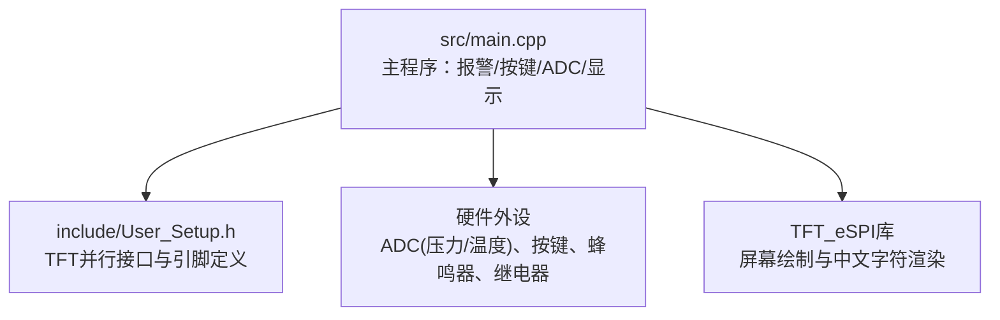
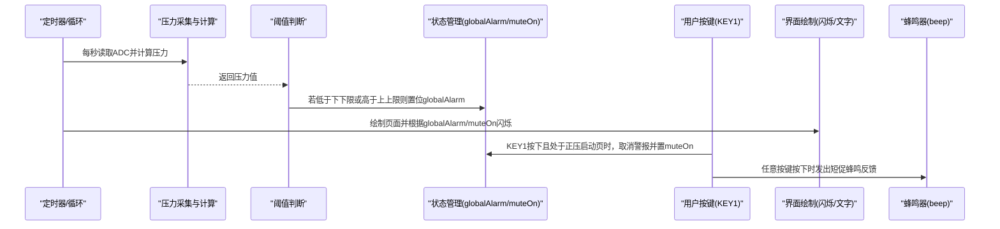
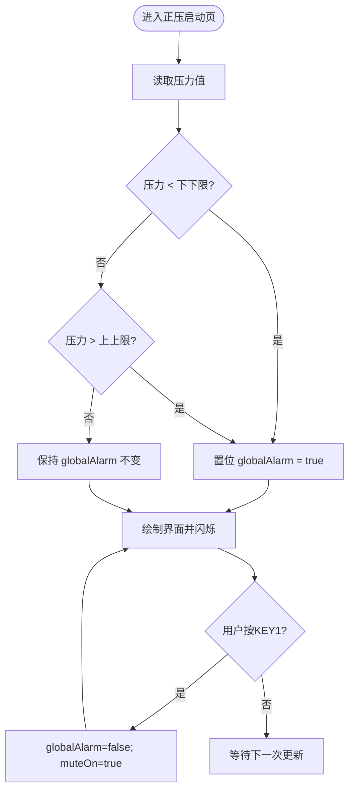
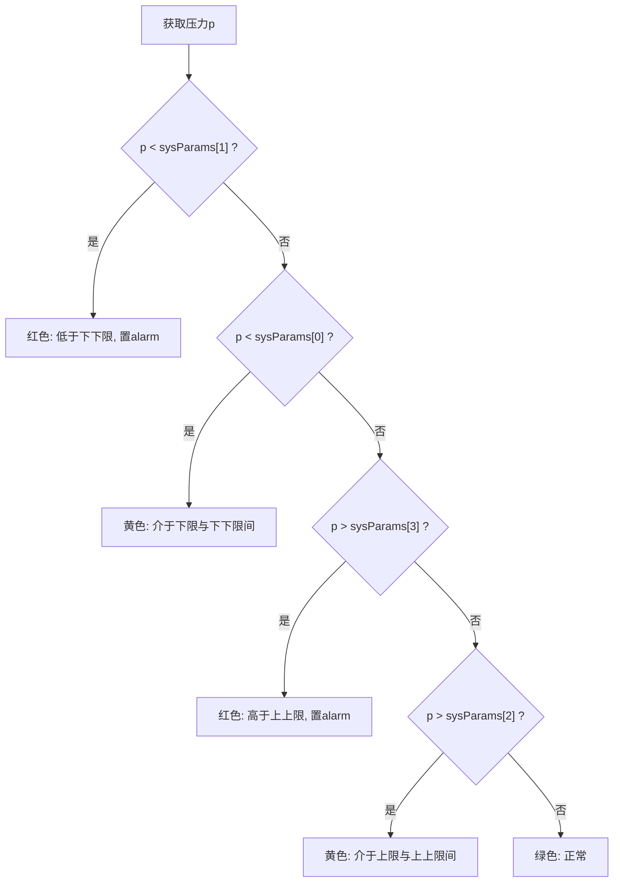
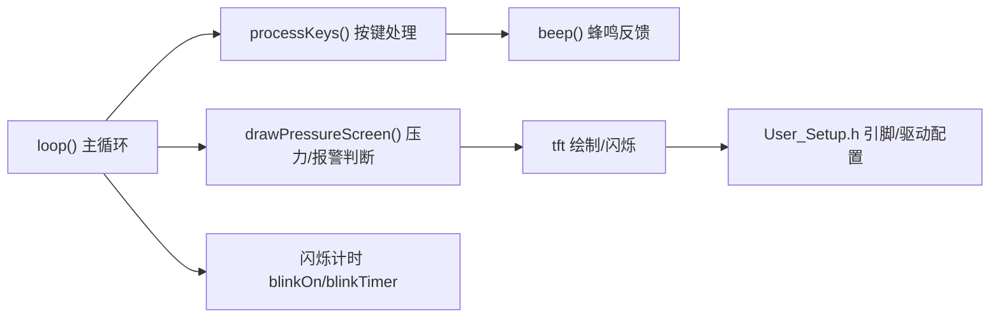

# 报警处理系统

<cite>
**本文引用的文件**
- [src/main.cpp](file://src/main.cpp)
- [include/User_Setup.h](file://include/User_Setup.h)
</cite>

## 目录
1. [简介](#简介)
2. [项目结构](#项目结构)
3. [核心组件](#核心组件)
4. [架构总览](#架构总览)
5. [详细组件分析](#详细组件分析)
6. [依赖关系分析](#依赖关系分析)
7. [性能与实时性考虑](#性能与实时性考虑)
8. [故障排查指南](#故障排查指南)
9. [结论](#结论)
10. [附录：关键流程示例](#附录关键流程示例)

## 简介
本文件面向GD32F103RCT6正压防爆控制系统的“报警处理系统”，聚焦以下目标：
- 全局警报状态 globalAlarm 的管理机制（触发、消音 muteOn、声光联动）
- 压力阈值判断逻辑，基于 sysParams 数组的四级报警（下限、下下限、上限、上上限）
- 温度超限报警逻辑（基于 sysParams[4] 温度上限参数）
- 蜂鸣器 beep() 的实现与消音状态下的声音控制策略
- 视觉指示：红色闪烁、警报文字显示、用户确认操作
- 提供从压力检测、阈值比较、警报设置到用户响应的完整流程说明
- 常见问题：误报警、警报冲突、声音干扰等问题的定位与解决建议

## 项目结构
仓库包含一个主程序与TFT驱动配置头文件。报警相关逻辑集中在主程序中，屏幕驱动引脚映射在配置头文件中。

图表来源
- [src/main.cpp:1-434](file://src/main.cpp#L1-L434)
- [include/User_Setup.h:1-74](file://include/User_Setup.h#L1-L74)

章节来源
- [src/main.cpp:1-434](file://src/main.cpp#L1-L434)
- [include/User_Setup.h:1-74](file://include/User_Setup.h#L1-L74)

## 核心组件
- 全局状态变量
  - globalAlarm：全局警报标志位，用于跨页面提示与闪烁
  - muteOn：消音标志位，记录用户已确认但条件未消除时的“静音”状态
  - blinkOn/blinkTimer：实现固定周期闪烁（约500ms）
- 系统参数 sysParams[6]
  - sysParams[0]：压力下限
  - sysParams[1]：压力下下限
  - sysParams[2]：压力上限
  - sysParams[3]：压力上上限
  - sysParams[4]：温度上限
  - sysParams[5]：换气时间（秒）
- 传感器与计算
  - 压力：ADC通道14，采样滤波后转换为Pa
  - 温度：ADC通道15，线性系数换算为摄氏度
- 人机交互
  - 按键KEY1/KEY2/KEY3，带消抖与蜂鸣反馈
  - 屏幕绘制：主页、正压启动页、系统设置、调试页
- 执行机构
  - 进气/排气继电器、送电继电器、外部警报继电器（当前代码未直接驱动ALARM_RELAY）

章节来源
- [src/main.cpp:26-43](file://src/main.cpp#L26-L43)
- [src/main.cpp:74-101](file://src/main.cpp#L74-L101)
- [src/main.cpp:145-156](file://src/main.cpp#L145-L156)
- [src/main.cpp:312-364](file://src/main.cpp#L312-L364)
- [src/main.cpp:366-433](file://src/main.cpp#L366-L433)

## 架构总览
整体数据流与控制流如下：
- 每1秒更新一次压力值并刷新界面
- 根据压力阈值判定是否置位 globalAlarm
- 用户在正压启动页按KEY1可“取消警报”，将 globalAlarm 清零并置位 muteOn
- 主页与正压启动页均会依据 globalAlarm/muteOn 进行红/黄闪烁与文字提示
- 蜂鸣器 beep() 用于按键反馈；当前未在报警时自动发声

图表来源
- [src/main.cpp:391-433](file://src/main.cpp#L391-L433)
- [src/main.cpp:191-253](file://src/main.cpp#L191-L253)
- [src/main.cpp:312-364](file://src/main.cpp#L312-L364)
- [src/main.cpp:103-109](file://src/main.cpp#L103-L109)

## 详细组件分析

### 全局警报状态管理（globalAlarm 与 muteOn）
- 触发条件
  - 当压力低于 sysParams[1]（下下限）或高于 sysParams[3]（上上限）时，置位 globalAlarm
- 消音功能
  - 在正压启动页，用户按KEY1且当前存在 globalAlarm 时，清除 globalAlarm 并置位 muteOn，表示“已确认但未恢复”
- 视觉指示
  - 主页：当 globalAlarm 为真且在闪烁周期内，左上角以红色背景+白色“警报”文字闪烁
  - 正压启动页：右上角区域根据 globalAlarm/muteOn 分别显示红色“警报”或黄色“消音”，并以相同频率闪烁
- 状态复位
  - 当前代码未实现“条件恢复后自动清除 muteOn”的逻辑，需后续扩展

图表来源
- [src/main.cpp:217-226](file://src/main.cpp#L217-L226)
- [src/main.cpp:236-245](file://src/main.cpp#L236-L245)
- [src/main.cpp:324-336](file://src/main.cpp#L324-L336)
- [src/main.cpp:426-430](file://src/main.cpp#L426-L430)

章节来源
- [src/main.cpp:217-226](file://src/main.cpp#L217-L226)
- [src/main.cpp:236-245](file://src/main.cpp#L236-L245)
- [src/main.cpp:324-336](file://src/main.cpp#L324-L336)
- [src/main.cpp:426-430](file://src/main.cpp#L426-L430)

### 压力阈值判断逻辑（四级报警）
- 参数定义
  - sysParams[0]：压力下限
  - sysParams[1]：压力下下限
  - sysParams[2]：压力上限
  - sysParams[3]：压力上上限
- 判断规则
  - 低于下下限：严重报警（红色），置位 globalAlarm
  - 介于下限与下下限之间：预警（黄色）
  - 高于上上限：严重报警（红色），置位 globalAlarm
  - 介于上限与上上限之间：预警（黄色）
- 显示
  - 中间状态条颜色与文案随区间变化
  - 同时显示“换气开启压力”参考值

图表来源
- [src/main.cpp:217-226](file://src/main.cpp#L217-L226)
- [src/main.cpp:228-234](file://src/main.cpp#L228-L234)

章节来源
- [src/main.cpp:217-226](file://src/main.cpp#L217-L226)
- [src/main.cpp:228-234](file://src/main.cpp#L228-L234)

### 温度超限报警逻辑
- 参数
  - sysParams[4]：温度上限（单位：℃）
- 现状
  - 代码中提供了温度读取与显示，但未实现基于 sysParams[4] 的报警逻辑
- 建议实现
  - 在主循环中读取 tempVal，并与 sysParams[4] 比较
  - 超过上限时置位 globalAlarm 或在独立温度报警标志位中记录
  - 在界面增加温度超限提示与声光联动

章节来源
- [src/main.cpp:153-156](file://src/main.cpp#L153-L156)
- [src/main.cpp:293-297](file://src/main.cpp#L293-L297)

### 蜂鸣器 beep() 与声音控制
- 实现要点
  - beep(n, onMs, offMs)：输出n次短促蜂鸣，onMs/offMs控制开/关时长
  - 当前仅在按键按下时调用 beep(1) 作为操作反馈
- 消音状态下的声音控制
  - 当前未在报警时自动发声，因此不存在“报警声音被消音屏蔽”的情况
  - 建议在后续版本中引入“报警声音策略”：
    - 当 globalAlarm 为真且 muteOn 为假时，周期性触发蜂鸣
    - 当 muteOn 为真时，仅保留视觉闪烁，不发声
- 注意
  - 避免在长延时阻塞中频繁调用 beep()，以免卡顿界面刷新

章节来源
- [src/main.cpp:103-109](file://src/main.cpp#L103-L109)
- [src/main.cpp:318-364](file://src/main.cpp#L318-L364)

### 视觉指示与用户确认
- 主页
  - 当 globalAlarm 为真且在闪烁周期内，左上角以红色背景+白色“警报”文字闪烁
- 正压启动页
  - 右上角区域：
    - globalAlarm 为真：红色“警报”闪烁
    - muteOn 为真：黄色“消音”闪烁
  - 底部按钮：
    - 当 globalAlarm 为真时，左侧按钮高亮，点击后“取消警报”（实际效果为清除 globalAlarm 并置位 muteOn）
- 闪烁机制
  - 使用 blinkOn 与 blinkTimer 实现约500ms翻转，所有需要闪烁的区域统一读取该标志

章节来源
- [src/main.cpp:184-188](file://src/main.cpp#L184-L188)
- [src/main.cpp:236-245](file://src/main.cpp#L236-L245)
- [src/main.cpp:247-253](file://src/main.cpp#L247-L253)
- [src/main.cpp:391-395](file://src/main.cpp#L391-L395)
- [src/main.cpp:426-430](file://src/main.cpp#L426-L430)

## 依赖关系分析
- 模块耦合
  - 主循环负责调度：按键处理、压力更新、界面绘制、闪烁计时
  - 压力阈值判断与 globalAlarm 置位位于绘制函数内部，属于“显示即判断”的紧耦合设计
  - 蜂鸣器与按键松耦合，通过 processKeys 调用
- 外部依赖
  - TFT_eSPI 库用于屏幕绘制
  - User_Setup.h 定义了并行接口与引脚映射

图表来源
- [src/main.cpp:391-433](file://src/main.cpp#L391-L433)
- [src/main.cpp:312-364](file://src/main.cpp#L312-L364)
- [src/main.cpp:191-253](file://src/main.cpp#L191-L253)
- [include/User_Setup.h:1-74](file://include/User_Setup.h#L1-L74)

章节来源
- [src/main.cpp:391-433](file://src/main.cpp#L391-L433)
- [include/User_Setup.h:1-74](file://include/User_Setup.h#L1-L74)

## 性能与实时性考虑
- 阻塞式 delay()
  - 主循环末尾有 delay(10)，按键响应与界面刷新基本满足需求
  - 若后续加入周期性蜂鸣，应避免在长延时中阻塞，建议使用非阻塞计时
- ADC 采样
  - 压力采用多次采样求平均，有助于抑制噪声
  - 单次转换等待轮询，需注意在高频调用时的CPU占用
- 闪烁频率
  - 500ms 翻转频率适中，兼顾可视性与功耗

[本节为通用指导，无需特定文件引用]

## 故障排查指南
- 误报警（频繁触发/抖动）
  - 现象：压力在阈值附近波动导致 globalAlarm 反复置位
  - 排查与建议：
    - 检查压力采样次数与滤波算法是否足够
    - 引入迟滞区间（例如上下限各加回差）减少临界抖动
    - 对瞬时尖峰做去极值或滑动窗口处理
- 警报冲突（多源报警）
  - 现状：仅压力报警置位 globalAlarm，温度报警尚未接入
  - 建议：为不同报警源维护独立标志位，最终聚合到 globalAlarm，便于区分与统计
- 声音干扰
  - 现状：仅在按键时蜂鸣，无报警声音
  - 建议：
    - 引入“报警声音策略”：仅在 globalAlarm 为真且 muteOn 为假时发声
    - 使用非阻塞方式生成节拍，避免阻塞界面刷新
    - 合理设置占空比与间隔，降低听觉疲劳
- 消音后无法自动恢复
  - 现状：muteOn 一旦置位不会自动清除
  - 建议：当压力恢复到安全区间后，自动清除 muteOn，并在界面提示“已恢复”

章节来源
- [src/main.cpp:217-226](file://src/main.cpp#L217-L226)
- [src/main.cpp:324-336](file://src/main.cpp#L324-L336)
- [src/main.cpp:103-109](file://src/main.cpp#L103-L109)

## 结论
- 当前系统实现了基于压力的四级阈值判断与全局警报状态管理，具备基本的声光提示能力（视觉为主）
- 温度超限报警尚未实现，可在现有框架上快速扩展
- 蜂鸣器目前仅用于按键反馈，建议完善“报警声音策略”与“消音状态下的声音控制”
- 建议引入迟滞与非阻塞设计，提升抗扰度与实时性

[本节为总结性内容，无需特定文件引用]

## 附录：关键流程示例

### 示例一：压力检测→阈值比较→警报设置→用户响应
- 步骤
  - 进入正压启动页后，每秒读取压力并计算
  - 若压力低于下下限或高于上上限，置位 globalAlarm
  - 界面右上角显示红色“警报”并闪烁
  - 用户按KEY1“取消警报”，清除 globalAlarm 并置位 muteOn，界面切换为黄色“消音”闪烁
- 对应源码位置
  - 压力读取与计算：[calcDisplayPress:145-152](file://src/main.cpp#L145-L152)
  - 阈值判断与 globalAlarm 置位：[drawPressureScreen 压力状态段:217-226](file://src/main.cpp#L217-L226)
  - 用户按键取消警报：[processKeys KEY1分支:324-336](file://src/main.cpp#L324-L336)
  - 界面闪烁与文字：[主页/正压启动页警报区:184-188](file://src/main.cpp#L184-L188), [正压启动页右上角:236-245](file://src/main.cpp#L236-L245)

章节来源
- [src/main.cpp:145-152](file://src/main.cpp#L145-L152)
- [src/main.cpp:217-226](file://src/main.cpp#L217-L226)
- [src/main.cpp:324-336](file://src/main.cpp#L324-L336)
- [src/main.cpp:184-188](file://src/main.cpp#L184-L188)
- [src/main.cpp:236-245](file://src/main.cpp#L236-L245)

### 示例二：温度超限报警（待实现）
- 步骤
  - 在主循环中读取 tempVal
  - 与 sysParams[4] 比较，超过上限时置位 globalAlarm 或新增 temperatureAlarm 标志
  - 在界面增加温度超限提示，并可联动蜂鸣器
- 参考位置
  - 温度读取：[calcDisplayTemp:153-156](file://src/main.cpp#L153-L156)
  - 调试页温度显示：[drawDebugScreen:293-297](file://src/main.cpp#L293-L297)

章节来源
- [src/main.cpp:153-156](file://src/main.cpp#L153-L156)
- [src/main.cpp:293-297](file://src/main.cpp#L293-L297)

### 示例三：蜂鸣器 beep() 的使用与扩展
- 现状
  - 按键按下时调用 beep(1) 提供短促反馈
- 扩展建议
  - 在 globalAlarm 为真且 muteOn 为假时，使用非阻塞计时周期性触发 beep()
  - 在 muteOn 为真时，仅保留视觉闪烁，不发声

章节来源
- [src/main.cpp:103-109](file://src/main.cpp#L103-L109)
- [src/main.cpp:318-364](file://src/main.cpp#L318-L364)