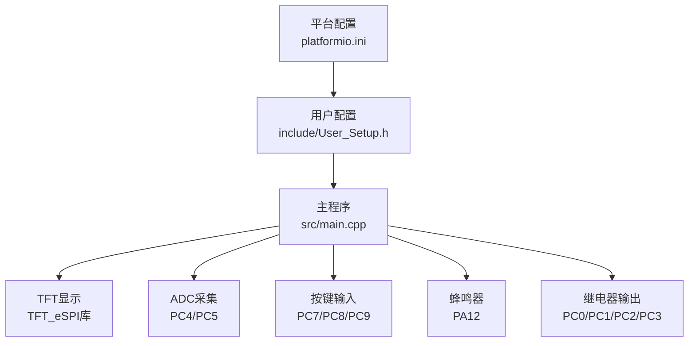
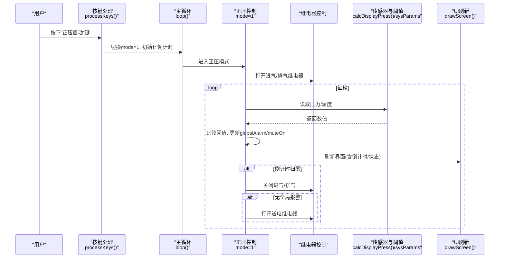
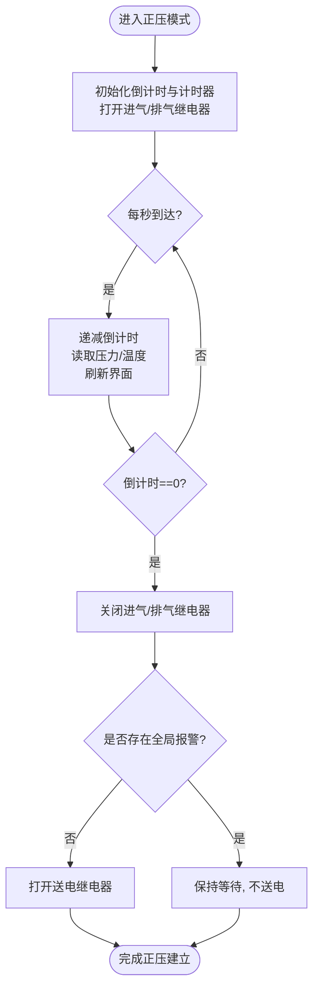
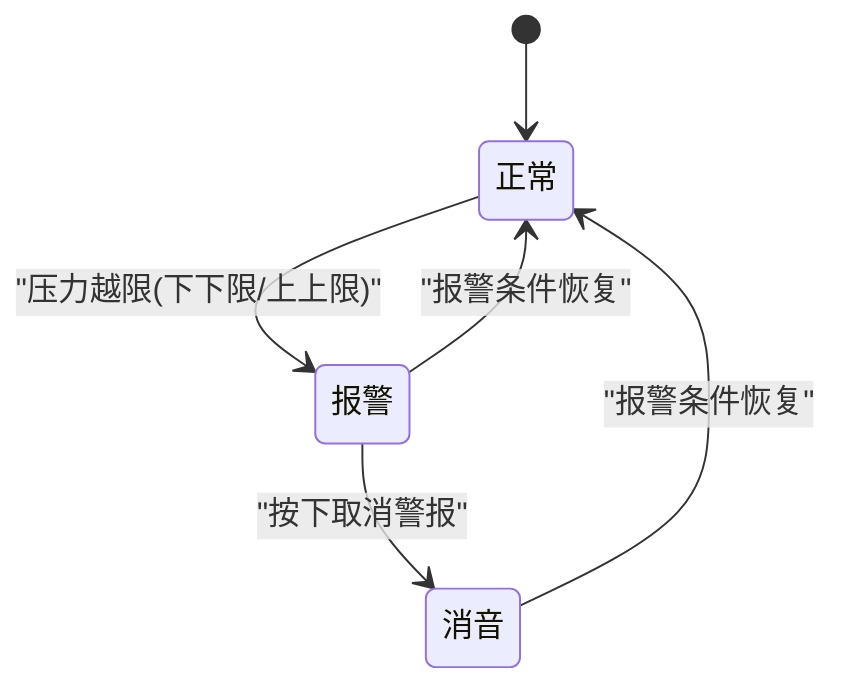
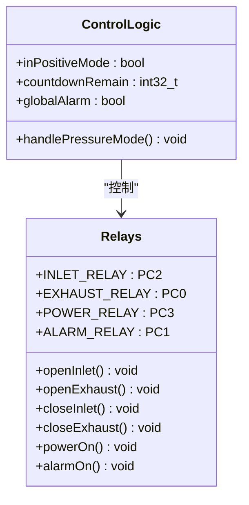
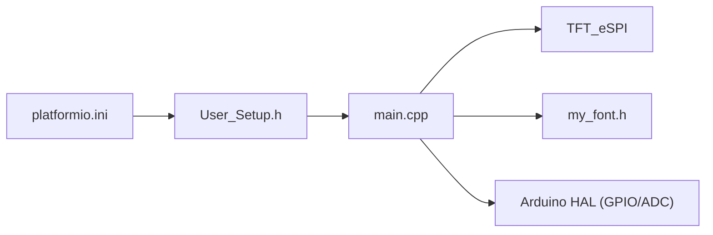

# 控制系统逻辑

<cite>
**本文引用的文件**   
- [src/main.cpp](file://src/main.cpp)
- [include/User_Setup.h](file://include/User_Setup.h)
- [platformio.ini](file://platformio.ini)
</cite>

## 目录
1. [简介](#简介)
2. [项目结构](#项目结构)
3. [核心组件](#核心组件)
4. [架构总览](#架构总览)
5. [详细组件分析](#详细组件分析)
6. [依赖关系分析](#依赖关系分析)
7. [性能与实时性考虑](#性能与实时性考虑)
8. [故障排查指南](#故障排查指南)
9. [结论](#结论)
10. [附录：关键流程示例（代码片段路径）](#附录关键流程示例代码片段路径)

## 简介
本文件面向GD32F103RCT6正压防爆控制系统的“控制系统逻辑”，聚焦以下目标：
- 深入解释正压控制算法的实现，包括 inPositiveMode 状态管理、countdownRemain 倒计时控制和 relays 继电器控制时序。
- 详细说明报警处理机制，包括 globalAlarm 全局警报状态、muteOn 消音功能以及声光报警的触发条件。
- 记录 sysParams[6] 系统参数数组的作用，涵盖压力下限、下下限、上限、上上限、温度上限和换气时间的阈值判断逻辑。
- 解释继电器控制策略，包括 INLET_RELAY 进气、EXHAUST_RELAY 排气、POWER_RELAY 送电和 ALARM_RELAY 警报的控制时序。
- 记录 beep() 蜂鸣器控制函数实现与报警声音反馈机制。
- 提供具体代码示例路径，展示正压建立流程、报警处理和继电器控制。
- 给出常见问题解决方案：控制逻辑冲突、报警误触发、继电器抖动等。

## 项目结构
本项目为基于Arduino框架的嵌入式应用，使用TFT_eSPI驱动3.5寸横屏显示，硬件引脚在User_Setup中配置，主程序位于main.cpp。

图表来源
- [platformio.ini:1-45](file://platformio.ini#L1-L45)
- [include/User_Setup.h:14-47](file://include/User_Setup.h#L14-L47)
- [src/main.cpp:10-21](file://src/main.cpp#L10-L21)

章节来源
- [platformio.ini:1-45](file://platformio.ini#L1-L45)
- [include/User_Setup.h:14-47](file://include/User_Setup.h#L14-L47)
- [src/main.cpp:10-21](file://src/main.cpp#L10-L21)

## 核心组件
- 系统参数 sysParams[6]：定义压力下限、下下限、上限、上上限、温度上限、换气时间。用于阈值比较与倒计时初始化。
- 状态变量：inPositiveMode（是否处于正压模式）、countdownRemain（剩余换气秒数）、globalAlarm（全局报警标志）、muteOn（消音标志）。
- 传感器与计算：压力与温度通过ADC读取并校准换算，得到当前柜内压力与温度值。
- 人机交互：按键去抖与短按响应，屏幕绘制主页、正压启动界面、设置与调试界面。
- 执行机构：四个继电器（进气、排气、送电、警报）与蜂鸣器。

章节来源
- [src/main.cpp:26-43](file://src/main.cpp#L26-L43)
- [src/main.cpp:145-156](file://src/main.cpp#L145-L156)
- [src/main.cpp:312-364](file://src/main.cpp#L312-L364)
- [src/main.cpp:103-109](file://src/main.cpp#L103-L109)

## 架构总览
整体控制流由主循环驱动，按键中断式扫描，正压模式进入后开启进气与排气风机进行换气，倒计时结束后根据报警状态决定是否送电；同时持续监测压力与温度，超限时置位全局报警并闪烁提示。

图表来源
- [src/main.cpp:392-433](file://src/main.cpp#L392-L433)
- [src/main.cpp:312-364](file://src/main.cpp#L312-L364)
- [src/main.cpp:145-156](file://src/main.cpp#L145-L156)
- [src/main.cpp:26-43](file://src/main.cpp#L26-L43)

## 详细组件分析

### 系统参数 sysParams[6] 与阈值判断
- 索引与含义：
  - sysParams[0]：压力下限
  - sysParams[1]：压力下下限
  - sysParams[2]：压力上限
  - sysParams[3]：压力上上限
  - sysParams[4]：温度上限
  - sysParams[5]：换气时间（秒）
- 压力阈值判断逻辑（在正压界面绘制时执行）：
  - 若当前压力 < 下下限 → 红色告警文本，置位全局报警
  - 若当前压力 < 下限 → 黄色警告文本
  - 若当前压力 > 上上限 → 红色告警文本，置位全局报警
  - 若当前压力 > 上限 → 黄色警告文本
- 温度阈值：
  - 当前代码未对温度上限进行直接控制或报警判定，仅用于显示。可在后续扩展中加入温度超限报警逻辑。

章节来源
- [src/main.cpp:26-28](file://src/main.cpp#L26-L28)
- [src/main.cpp:218-226](file://src/main.cpp#L218-L226)

### 正压控制算法与状态机
- 状态变量：
  - inPositiveMode：标记是否处于正压建立阶段
  - countdownRemain：剩余换气秒数
  - modeTimer：用于1秒周期计时
- 进入正压模式（mode=1）：
  - 首次进入时设置 inPositiveMode=true，初始化倒计时为换气时间，记录开始时间，打开进气与排气继电器，刷新界面。
- 每秒更新：
  - 递减倒计时，读取压力值，刷新界面。
  - 当倒计时归零：关闭进气与排气；若无全局报警则打开送电继电器。
- 退出正压模式：
  - 从正压界面返回主页时，强制关闭进气与排气继电器，重置 inPositiveMode。

图表来源
- [src/main.cpp:392-433](file://src/main.cpp#L392-L433)
- [src/main.cpp:312-364](file://src/main.cpp#L312-L364)

章节来源
- [src/main.cpp:392-433](file://src/main.cpp#L392-L433)
- [src/main.cpp:312-364](file://src/main.cpp#L312-L364)

### 报警处理机制
- 全局报警 globalAlarm：
  - 当压力低于下下限或高于上上限时置位。
  - 主页与正压界面右上角以红色闪烁显示“警报”。
- 消音 muteOn：
  - 在正压界面按下“取消警报”按钮时置位，表示已确认但尚未消除报警源。
  - 消音状态下界面以黄色闪烁显示“消音”。
- 声光报警：
  - 视觉：界面背景块与文字颜色变化，且每500ms翻转一次 blinkOn 实现闪烁。
  - 听觉：按键操作时调用 beep() 提供短促反馈；当前未在报警持续期间自动发声。

图表来源
- [src/main.cpp:218-226](file://src/main.cpp#L218-L226)
- [src/main.cpp:237-245](file://src/main.cpp#L237-L245)
- [src/main.cpp:324-335](file://src/main.cpp#L324-L335)
- [src/main.cpp:392-433](file://src/main.cpp#L392-L433)

章节来源
- [src/main.cpp:218-226](file://src/main.cpp#L218-L226)
- [src/main.cpp:237-245](file://src/main.cpp#L237-L245)
- [src/main.cpp:324-335](file://src/main.cpp#L324-L335)
- [src/main.cpp:392-433](file://src/main.cpp#L392-L433)

### 继电器控制策略与时序
- 引脚定义：
  - INLET_RELAY = PC2（进气）
  - EXHAUST_RELAY = PC0（排气）
  - POWER_RELAY = PC3（送电）
  - ALARM_RELAY = PC1（警报）
- 控制时序：
  - 进入正压模式：打开进气与排气继电器，进行换气。
  - 倒计时结束：关闭进气与排气；若无全局报警则打开送电继电器。
  - 退出正压模式：强制关闭进气与排气继电器。
- 注意：
  - 当前代码未对ALARM_RELAY进行控制，如需外部声光报警器联动，可在此处增加逻辑。

图表来源
- [src/main.cpp:16-18](file://src/main.cpp#L16-L18)
- [src/main.cpp:377-381](file://src/main.cpp#L377-L381)
- [src/main.cpp:404-422](file://src/main.cpp#L404-L422)
- [src/main.cpp:353-355](file://src/main.cpp#L353-L355)

章节来源
- [src/main.cpp:16-18](file://src/main.cpp#L16-L18)
- [src/main.cpp:377-381](file://src/main.cpp#L377-L381)
- [src/main.cpp:404-422](file://src/main.cpp#L404-L422)
- [src/main.cpp:353-355](file://src/main.cpp#L353-L355)

### 蜂鸣器 beep() 与声音反馈
- 实现要点：
  - 通过数字引脚PA12输出高低电平，按指定次数n发出蜂鸣，onMs/offMs控制单次响铃时长与间隔。
- 使用场景：
  - 按键短按时提供即时反馈，避免误触带来的不确定性。
- 建议扩展：
  - 可在报警持续期间加入周期性蜂鸣提示，增强现场感知。

章节来源
- [src/main.cpp:103-109](file://src/main.cpp#L103-L109)
- [src/main.cpp:324-364](file://src/main.cpp#L324-L364)

### 传感器与校准
- ADC通道：
  - 压力：PC4（ADC14）
  - 温度：PC5（ADC15）
- 校准：
  - 启动时采样若干次压力零点作为基准，温度零点同理。
  - 显示值通过线性斜率与偏移修正，确保读数准确。
- 滤波：
  - 压力采用多次采样求平均以降低噪声。

章节来源
- [src/main.cpp:74-101](file://src/main.cpp#L74-L101)
- [src/main.cpp:145-156](file://src/main.cpp#L145-L156)

## 依赖关系分析
- 平台与库：
  - platformio.ini 定义了STM32F103RC板型、Arduino框架、TFT_eSPI库及并行接口宏。
  - User_Setup.h 配置了TFT并行数据总线与引脚映射。
- 主程序依赖：
  - TFT_eSPI用于显示中文混合字符串与图形。
  - Arduino GPIO与ADC API用于外设控制。
  - 自定义字体 my_font.h 提供24x24点阵汉字支持。

图表来源
- [platformio.ini:1-45](file://platformio.ini#L1-L45)
- [include/User_Setup.h:14-47](file://include/User_Setup.h#L14-L47)
- [src/main.cpp:10-11](file://src/main.cpp#L10-L11)

章节来源
- [platformio.ini:1-45](file://platformio.ini#L1-L45)
- [include/User_Setup.h:14-47](file://include/User_Setup.h#L14-L47)
- [src/main.cpp:10-11](file://src/main.cpp#L10-L11)

## 性能与实时性考虑
- 主循环延时：
  - 使用delay(10)降低CPU占用，但会限制按键响应与界面刷新频率。对于需要更快响应的场景，建议改用非阻塞计时（millis）调度。
- 显示刷新：
  - 每次压力更新都调用drawScreen()，可能带来较大开销。可引入脏矩形或最小化重绘策略。
- ADC采样：
  - 压力采样采用8次平均，温度单次采样。可根据环境噪声调整采样次数与滤波算法。
- 定时器替代：
  - 当前使用millis差值判断1秒周期，建议引入硬件定时器或RTOS任务提升稳定性。

[本节为通用指导，不涉及具体文件分析]

## 故障排查指南
- 控制逻辑冲突
  - 现象：退出正压模式后仍有风机运行。
  - 排查：检查从正压界面返回主页时的继电器关闭逻辑是否被执行。
  - 参考路径：[src/main.cpp:353-355](file://src/main.cpp#L353-L355)
- 报警误触发
  - 现象：压力波动导致频繁报警。
  - 排查：检查阈值设置是否合理，适当增加迟滞区间；优化ADC滤波与采样次数。
  - 参考路径：[src/main.cpp:218-226](file://src/main.cpp#L218-L226), [src/main.cpp:145-156](file://src/main.cpp#L145-L156)
- 继电器抖动
  - 现象：继电器频繁切换或动作不稳定。
  - 排查：检查是否在短时间内重复开关；增加软件去抖与最小动作间隔。
  - 参考路径：[src/main.cpp:404-422](file://src/main.cpp#L404-L422)
- 蜂鸣无声
  - 现象：按键无蜂鸣反馈。
  - 排查：确认PA12引脚配置与beep()调用是否正确。
  - 参考路径：[src/main.cpp:103-109](file://src/main.cpp#L103-L109), [src/main.cpp:324-364](file://src/main.cpp#L324-L364)
- 温度报警缺失
  - 现象：温度超过上限未报警。
  - 排查：当前未实现温度超限逻辑，需扩展阈值判断与报警置位。
  - 参考路径：[src/main.cpp:26-28](file://src/main.cpp#L26-L28)

章节来源
- [src/main.cpp:353-355](file://src/main.cpp#L353-L355)
- [src/main.cpp:218-226](file://src/main.cpp#L218-L226)
- [src/main.cpp:145-156](file://src/main.cpp#L145-L156)
- [src/main.cpp:404-422](file://src/main.cpp#L404-L422)
- [src/main.cpp:103-109](file://src/main.cpp#L103-L109)
- [src/main.cpp:324-364](file://src/main.cpp#L324-L364)
- [src/main.cpp:26-28](file://src/main.cpp#L26-L28)

## 结论
本控制系统实现了基于压力阈值的正压防爆控制逻辑，具备倒计时换气、继电器顺序控制与基础声光报警能力。通过sysParams[6]灵活配置阈值与换气时间，满足现场需求。建议在后续版本中完善温度报警、优化显示刷新与定时调度，并增加ALARM_RELAY联动以提升安全等级。

[本节为总结，不涉及具体文件分析]

## 附录：关键流程示例（代码片段路径）
- 正压建立流程
  - 进入正压模式与初始化：[src/main.cpp:392-408](file://src/main.cpp#L392-L408)
  - 每秒更新与倒计时归零处理：[src/main.cpp:410-423](file://src/main.cpp#L410-L423)
- 报警处理流程
  - 压力阈值判断与全局报警置位：[src/main.cpp:218-226](file://src/main.cpp#L218-L226)
  - 消音与界面指示：[src/main.cpp:237-245](file://src/main.cpp#L237-L245)
  - 取消警报按键处理：[src/main.cpp:324-335](file://src/main.cpp#L324-L335)
- 继电器控制时序
  - 打开进气/排气：[src/main.cpp:404-406](file://src/main.cpp#L404-L406)
  - 关闭进气/排气与送电逻辑：[src/main.cpp:418-422](file://src/main.cpp#L418-L422)
  - 退出正压模式关闭风机：[src/main.cpp:353-355](file://src/main.cpp#L353-L355)
- 蜂鸣器反馈
  - beep()实现：[src/main.cpp:103-109](file://src/main.cpp#L103-L109)
  - 按键反馈调用：[src/main.cpp:324-364](file://src/main.cpp#L324-L364)