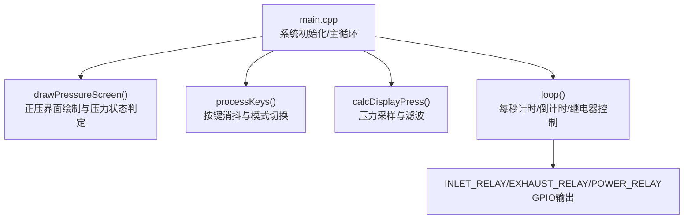
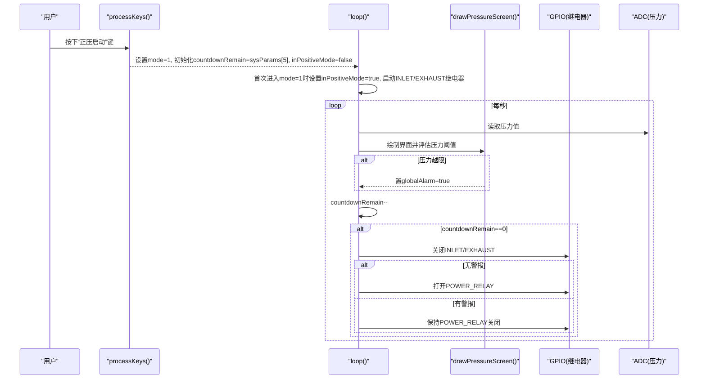
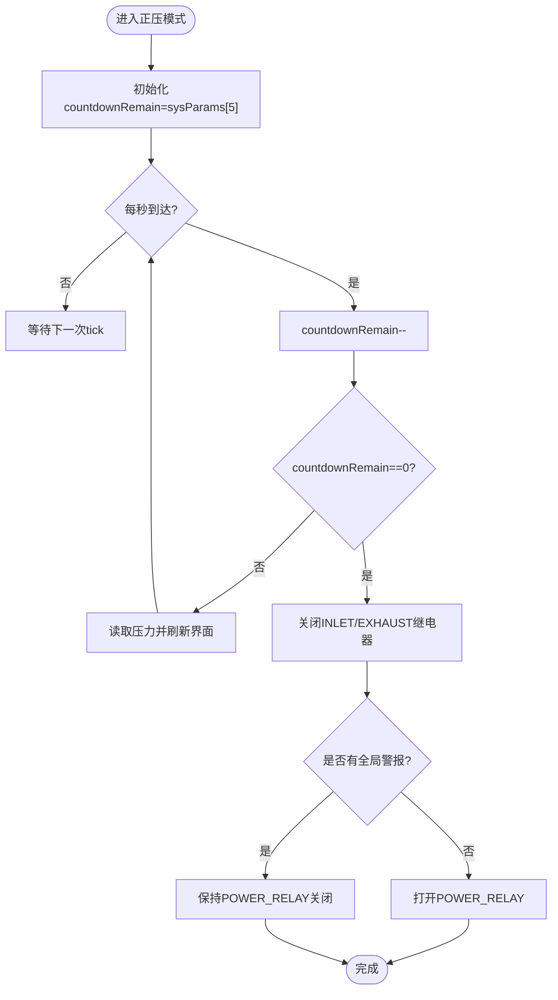
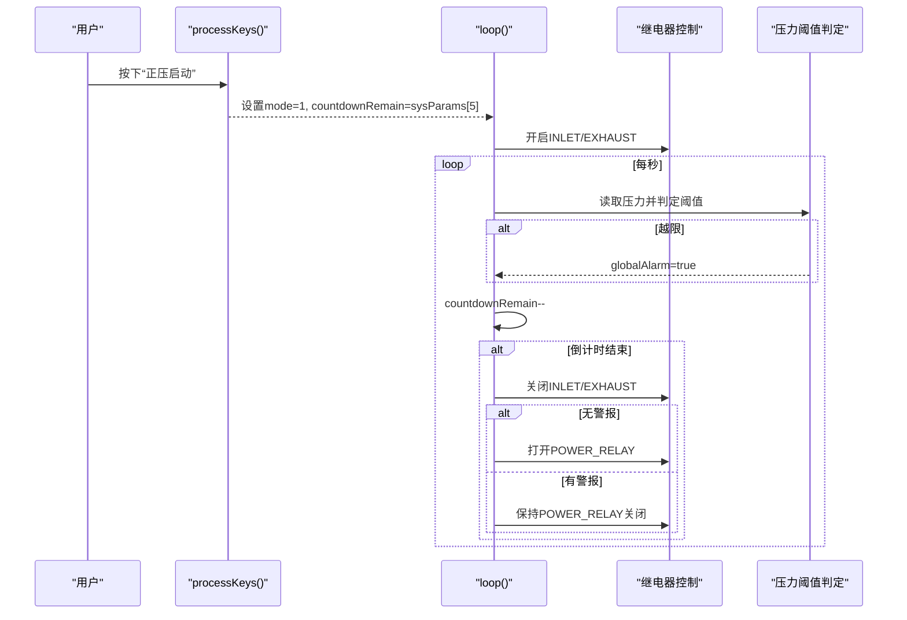
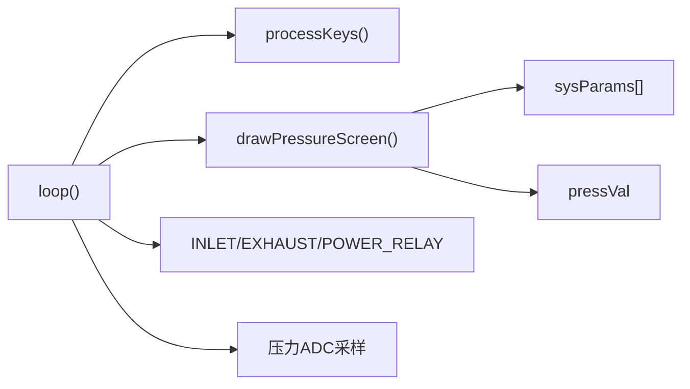
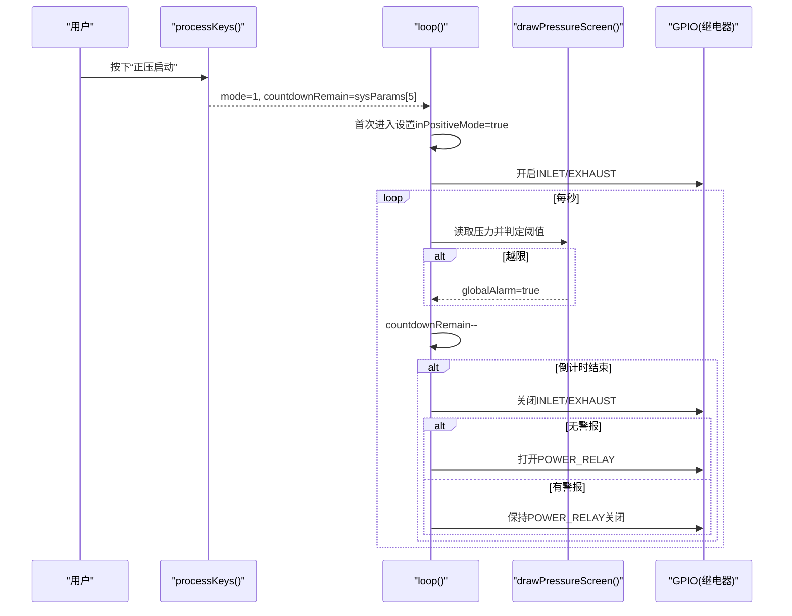

# 正压控制算法

<cite>
**本文引用的文件**   
- [src/main.cpp](file://src/main.cpp)
</cite>

## 目录
1. [简介](#简介)
2. [项目结构](#项目结构)
3. [核心组件](#核心组件)
4. [架构总览](#架构总览)
5. [详细组件分析](#详细组件分析)
6. [依赖关系分析](#依赖关系分析)
7. [性能与实时性考虑](#性能与实时性考虑)
8. [故障排查指南](#故障排查指南)
9. [结论](#结论)
10. [附录：关键流程时序图](#附录关键流程时序图)

## 简介
本文件面向GD32F103RCT6正压防爆控制系统，聚焦“正压控制算法”的实现与原理说明。重点覆盖以下方面：
- inPositiveMode状态管理逻辑（进入条件、倒计时控制机制、继电器控制策略）
- countdownRemain倒计时变量的工作流程（sysParams[5]换气时间参数使用、递减逻辑、完成后继电器动作）
- 正压建立完整时序（进气/排气继电器开启时机、压力监测过程、送电继电器控制）
- 与压力阈值判断的交互关系及安全性保障
- 常见问题处理（倒计时中断、继电器抖动、压力异常等）
- 从mode=1进入、倒计时开始、压力实时监测到最终送电完成的步骤化说明

## 项目结构
本项目为单文件实现，包含硬件引脚定义、ADC采集、按键处理、显示绘制以及主循环控制逻辑。正压控制相关代码集中在同一文件中，便于快速定位与理解。

图表来源
- [src/main.cpp:367-389](file://src/main.cpp#L367-L389)
- [src/main.cpp:392-433](file://src/main.cpp#L392-L433)
- [src/main.cpp:192-253](file://src/main.cpp#L192-L253)
- [src/main.cpp:318-364](file://src/main.cpp#L318-L364)
- [src/main.cpp:146-156](file://src/main.cpp#L146-L156)

章节来源
- [src/main.cpp:1-434](file://src/main.cpp#L1-L434)

## 核心组件
- 状态变量
  - mode：系统模式（0主页、1正压启动、2设置、3调试）
  - inPositiveMode：是否处于正压运行阶段
  - countdownRemain：剩余换气倒计时秒数
  - pressVal：当前柜内压力值（Pa）
  - globalAlarm/muteOn：全局警报与消音标志
  - blinkTimer/blinkOn：报警闪烁计时与标志
- 系统参数
  - sysParams[6]：下限、下下限、上限、上上限、温度上限、换气时间（秒）
  - sysParams[5]即“换气时间”，用于设定正压建立阶段的倒计时时长
- 硬件引脚
  - INLET_RELAY（PC2）、EXHAUST_RELAY（PC0）、POWER_RELAY（PC3）、ALARM_RELAY（PC1）
  - 压力传感器ADC通道（PC4/ADC14），温度传感器ADC通道（PC5/ADC15）
- 关键函数
  - drawPressureScreen()：绘制正压界面并依据压力阈值更新警报状态
  - processKeys()：按键消抖与模式切换，含返回主页时关闭进气/排气继电器
  - loop()：每秒更新倒计时与压力，并在倒计时结束时执行继电器切换

章节来源
- [src/main.cpp:26-43](file://src/main.cpp#L26-L43)
- [src/main.cpp:16-20](file://src/main.cpp#L16-L20)
- [src/main.cpp:192-253](file://src/main.cpp#L192-L253)
- [src/main.cpp:318-364](file://src/main.cpp#L318-L364)
- [src/main.cpp:392-433](file://src/main.cpp#L392-L433)

## 架构总览
正压控制采用“事件驱动+周期任务”的轻量架构：
- 事件驱动：按键触发模式切换与操作（如取消警报、返回主页）
- 周期任务：每1秒更新倒计时与压力，驱动继电器动作与界面刷新
- 安全联动：压力越限立即置位全局警报；倒计时结束且无警报才允许送电

图表来源
- [src/main.cpp:318-364](file://src/main.cpp#L318-L364)
- [src/main.cpp:392-433](file://src/main.cpp#L392-L433)
- [src/main.cpp:192-253](file://src/main.cpp#L192-L253)
- [src/main.cpp:146-156](file://src/main.cpp#L146-L156)

## 详细组件分析

### inPositiveMode状态管理逻辑
- 进入条件
  - 用户在主页按下“正压启动”键后，将mode设为1，并将countdownRemain初始化为sysParams[5]，同时标记initialCheckDone=true，此时inPositiveMode仍为false，等待loop中首次检测
- 首次进入正压阶段
  - 当mode==1且!inPositiveMode时，loop中将inPositiveMode置true，再次确保countdownRemain=sysParams[5]，记录modeTimer，并立即开启INLET_RELAY与EXHAUST_RELAY
- 退出条件
  - 在正压模式下按“返回主页”键，会重置inPositiveMode=false，并关闭INLET_RELAY与EXHAUST_RELAY，回到主页
- 设计要点
  - 使用inPositiveMode避免重复开启继电器与重复初始化倒计时
  - 通过modeTimer实现非阻塞的1秒周期任务

章节来源
- [src/main.cpp:318-364](file://src/main.cpp#L318-L364)
- [src/main.cpp:392-433](file://src/main.cpp#L392-L433)

### countdownRemain倒计时变量工作流程
- 初始化
  - 由sysParams[5]提供“换气时间”（单位秒），在按键进入或首次进入正压阶段时被赋值给countdownRemain
- 递减逻辑
  - 每1秒（基于millis()与modeTimer比较）执行一次递减，直到归零
- 完成后的动作
  - 关闭INLET_RELAY与EXHAUST_RELAY
  - 若当前无全局警报（!globalAlarm），则打开POWER_RELAY完成送电
- 可视化流程图

图表来源
- [src/main.cpp:392-433](file://src/main.cpp#L392-L433)
- [src/main.cpp:192-253](file://src/main.cpp#L192-L253)

章节来源
- [src/main.cpp:26-43](file://src/main.cpp#L26-L43)
- [src/main.cpp:392-433](file://src/main.cpp#L392-L433)

### 正压建立流程的完整时序
- 进气继电器(INLET_RELAY)与排气继电器(EXHAUST_RELAY)
  - 在首次进入正压阶段时同时开启，以加速柜内气体置换
  - 倒计时结束后统一关闭
- 压力监测过程
  - 每1秒读取压力值并进行简单滤波（多次采样取平均）
  - 根据sysParams中的阈值进行状态判定与警报置位
- 送电继电器(POWER_RELAY)控制逻辑
  - 仅在倒计时结束且无全局警报时才会打开
  - 若在倒计时期间出现压力越限，globalAlarm被置位，即使倒计时结束也不会送电

图表来源
- [src/main.cpp:318-364](file://src/main.cpp#L318-L364)
- [src/main.cpp:392-433](file://src/main.cpp#L392-L433)
- [src/main.cpp:192-253](file://src/main.cpp#L192-L253)

章节来源
- [src/main.cpp:192-253](file://src/main.cpp#L192-L253)
- [src/main.cpp:392-433](file://src/main.cpp#L392-L433)

### 与压力阈值判断的交互关系与安全策略
- 阈值体系
  - sysParams[0]：下限
  - sysParams[1]：下下限
  - sysParams[2]：上限
  - sysParams[3]：上上限
- 判定规则
  - 低于下下限或高于上上限：红色警报，置globalAlarm=true
  - 介于下限与下下限之间或上限与上上限之间：黄色提示
- 安全策略
  - 只要存在全局警报，即使倒计时结束也不允许送电
  - 用户可在正压界面点击“取消警报”进行消音（仅消音，不改变实际压力状态）

章节来源
- [src/main.cpp:192-253](file://src/main.cpp#L192-L253)
- [src/main.cpp:318-364](file://src/main.cpp#L318-L364)

### 具体步骤示例（从mode=1进入至送电完成）
- 步骤1：用户在主页按下“正压启动”键，进入mode=1，初始化countdownRemain=sysParams[5]
- 步骤2：loop首次检测到mode=1且!inPositiveMode，设置inPositiveMode=true，开启INLET/EXHAUST
- 步骤3：每秒读取压力并刷新界面，同时进行阈值判定与警报置位
- 步骤4：倒计时逐秒递减，界面同步显示剩余时间
- 步骤5：倒计时归零时关闭INLET/EXHAUST
- 步骤6：若无全局警报，打开POWER_RELAY完成送电；若有警报，保持POWER_RELAY关闭直至警报解除

章节来源
- [src/main.cpp:318-364](file://src/main.cpp#L318-L364)
- [src/main.cpp:392-433](file://src/main.cpp#L392-L433)
- [src/main.cpp:192-253](file://src/main.cpp#L192-L253)

## 依赖关系分析
- 模块耦合
  - loop()依赖processKeys()进行输入处理，依赖drawPressureScreen()进行界面与压力状态判定
  - drawPressureScreen()依赖sysParams与pressVal进行阈值判定
  - 所有继电器控制均通过GPIO直接操作
- 外部依赖
  - TFT_eSPI库用于屏幕绘制
  - GD32 HAL/寄存器访问用于ADC与GPIO控制

图表来源
- [src/main.cpp:318-364](file://src/main.cpp#L318-L364)
- [src/main.cpp:392-433](file://src/main.cpp#L392-L433)
- [src/main.cpp:192-253](file://src/main.cpp#L192-L253)
- [src/main.cpp:146-156](file://src/main.cpp#L146-L156)

章节来源
- [src/main.cpp:318-364](file://src/main.cpp#L318-L364)
- [src/main.cpp:392-433](file://src/main.cpp#L392-L433)
- [src/main.cpp:192-253](file://src/main.cpp#L192-L253)
- [src/main.cpp:146-156](file://src/main.cpp#L146-L156)

## 性能与实时性考虑
- 非阻塞计时
  - 使用millis()与modeTimer实现1秒周期任务，避免阻塞式delay影响按键响应
- 采样与滤波
  - 压力采样采用多次累加取平均，降低噪声影响
- 界面刷新频率
  - 每秒刷新一次，兼顾实时性与CPU占用
- 建议优化
  - 可将压力阈值判定与界面绘制分离，减少不必要的重绘
  - 对relay控制增加去抖与延时释放，防止机械抖动导致误动作

章节来源
- [src/main.cpp:146-156](file://src/main.cpp#L146-L156)
- [src/main.cpp:392-433](file://src/main.cpp#L392-L433)

## 故障排查指南
- 倒计时中断或不递减
  - 检查loop()中modeTimer与millis()比较逻辑是否正确
  - 确认未在其他路径修改countdownRemain
- 继电器抖动或误动作
  - 在开启/关闭继电器前后加入短延时，避免机械抖动
  - 检查按键消抖逻辑是否生效，避免误触导致频繁切换
- 压力异常或读数漂移
  - 校准ADC零点与斜率（参考初始化时的采样与校准逻辑）
  - 调整采样次数或滤波系数
- 无法送电
  - 检查是否存在全局警报（globalAlarm），如有需先消除
  - 确认倒计时已归零且INLET/EXHAUST已关闭

章节来源
- [src/main.cpp:318-364](file://src/main.cpp#L318-L364)
- [src/main.cpp:392-433](file://src/main.cpp#L392-L433)
- [src/main.cpp:192-253](file://src/main.cpp#L192-L253)
- [src/main.cpp:146-156](file://src/main.cpp#L146-L156)

## 结论
该正压控制算法以简洁的状态机与周期任务为核心，结合压力阈值判定与全局警报机制，实现了安全的正压建立流程。通过inPositiveMode与countdownRemain的配合，确保了进气/排气继电器的正确启停与送电继电器的受控闭合。对于初学者，建议从状态变量与主循环入手逐步理解；对于有经验的开发者，可在此基础上引入更完善的滤波、去抖与异常恢复策略以提升鲁棒性。

## 附录：关键流程时序图
- 正压启动序列（从按键到送电）

图表来源
- [src/main.cpp:318-364](file://src/main.cpp#L318-L364)
- [src/main.cpp:392-433](file://src/main.cpp#L392-L433)
- [src/main.cpp:192-253](file://src/main.cpp#L192-L253)