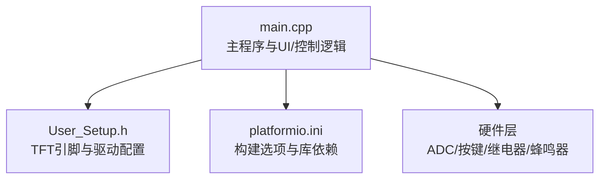
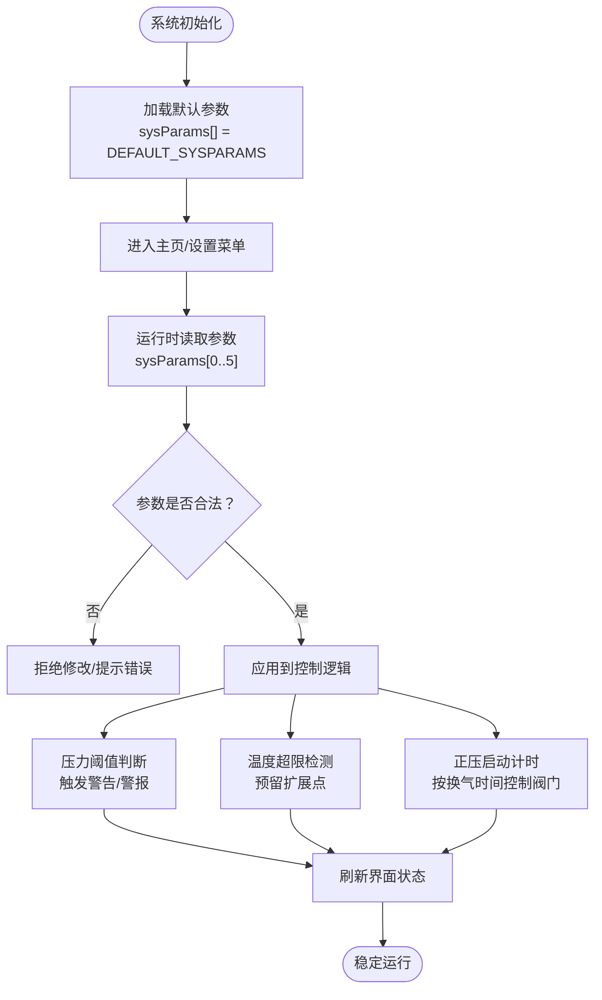
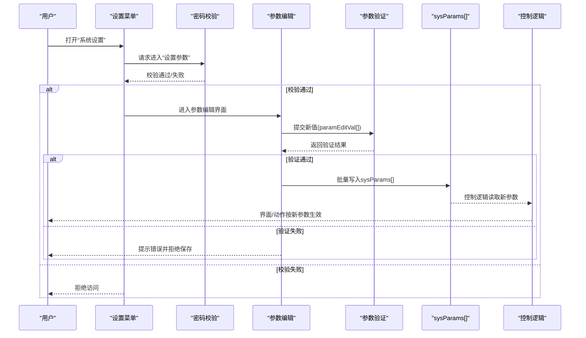
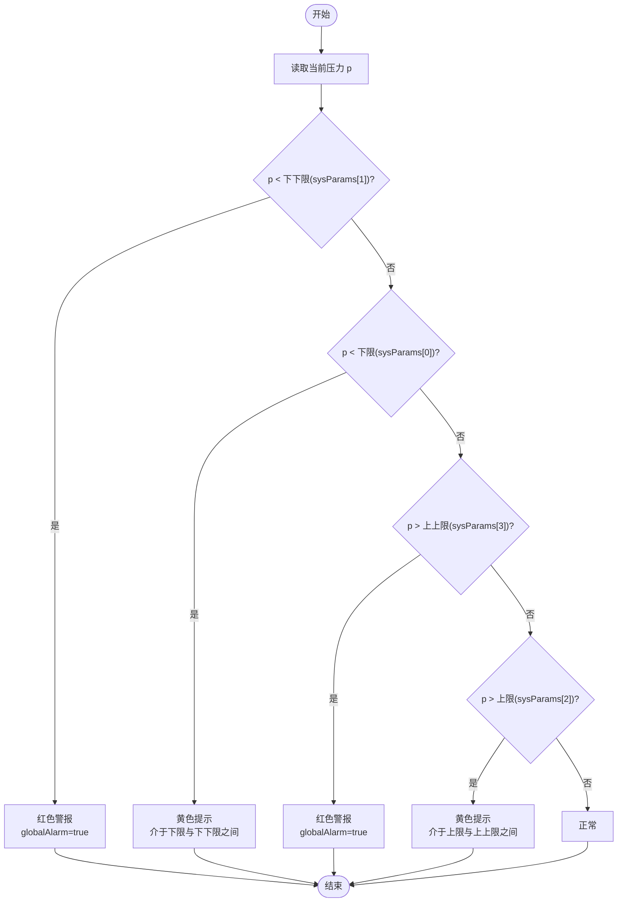
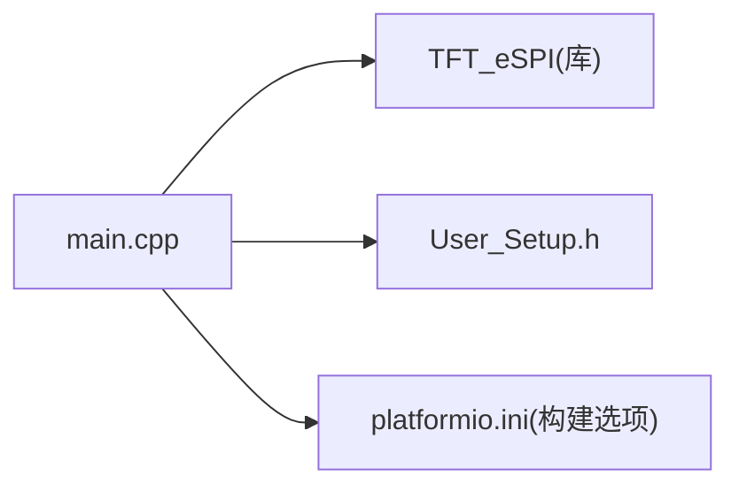

# 系统参数管理

<cite>
**本文引用的文件**
- [src/main.cpp](file://src/main.cpp)
- [include/User_Setup.h](file://include/User_Setup.h)
- [platformio.ini](file://platformio.ini)
</cite>

## 目录
1. [简介](#简介)
2. [项目结构](#项目结构)
3. [核心组件](#核心组件)
4. [架构总览](#架构总览)
5. [详细组件分析](#详细组件分析)
6. [依赖关系分析](#依赖关系分析)
7. [性能与可靠性考虑](#性能与可靠性考虑)
8. [故障排查指南](#故障排查指南)
9. [结论](#结论)
10. [附录：代码片段路径索引](#附录代码片段路径索引)

## 简介
本文件面向GD32F103RCT6正压防爆控制系统的“系统参数管理”主题，聚焦于sysParams[6]数组的结构、默认值与恢复出厂设置逻辑、参数验证与边界检查机制、用户界面交互（含密码验证）、以及参数在压力阈值判断、温度监控、正压控制时间等关键控制逻辑中的应用。文档同时提供流程图与时序图，帮助初学者理解参数的重要性，并为有经验的开发者提供可落地的实现参考。

## 项目结构
本项目为基于Arduino框架的STM32/GD32工程，使用TFT_eSPI驱动3.5寸横屏显示，通过ADC采集压力与温度，按键进行人机交互，继电器执行进气/排气/送电/报警等动作。系统参数以内存数组形式维护，当前版本未包含非易失存储（如EEPROM/Flash）持久化逻辑。

图表来源
- [src/main.cpp:1-434](file://src/main.cpp#L1-L434)
- [include/User_Setup.h:1-74](file://include/User_Setup.h#L1-L74)
- [platformio.ini:1-45](file://platformio.ini#L1-L45)

章节来源
- [src/main.cpp:1-434](file://src/main.cpp#L1-L434)
- [include/User_Setup.h:1-74](file://include/User_Setup.h#L1-L74)
- [platformio.ini:1-45](file://platformio.ini#L1-L45)

## 核心组件
- 系统参数数组 sysParams[6]：集中存放压力下限、压力下下限、压力上限、压力上上限、温度上限、换气时间等关键阈值与时间参数。
- 默认参数 DEFAULT_SYSPARAMS：用于恢复出厂设置的基准值。
- 目标密码 targetPassword：保护敏感操作（修改密码、设置参数、恢复出厂等）。
- 参数编辑缓冲 paramEditVal[6]：临时保存待提交的参数值，避免直接污染运行参数。
- 压力/温度计算与显示：基于ADC采样与校准系数，输出供界面与控制逻辑使用的数值。
- 正压启动流程：依据换气时间与压力阈值控制进气/排气继电器，并在满足条件后送电。

章节来源
- [src/main.cpp:26-31](file://src/main.cpp#L26-L31)
- [src/main.cpp:55-66](file://src/main.cpp#L55-L66)
- [src/main.cpp:145-156](file://src/main.cpp#L145-L156)
- [src/main.cpp:191-253](file://src/main.cpp#L191-L253)
- [src/main.cpp:391-433](file://src/main.cpp#L391-L433)

## 架构总览
下图展示了系统参数在“读取—校验—应用—显示—控制”闭环中的位置与作用。

图表来源
- [src/main.cpp:26-31](file://src/main.cpp#L26-L31)
- [src/main.cpp:217-234](file://src/main.cpp#L217-L234)
- [src/main.cpp:391-433](file://src/main.cpp#L391-L433)

## 详细组件分析

### 系统参数数组 sysParams[6] 结构与含义
- sysParams[0] 压力下限：当柜内压力低于该值时，视为接近危险区域，界面给出黄色提示；若进一步低于下下限则红色警报。
- sysParams[1] 压力下下限：更低的压力阈值，达到此值即触发严重警报。
- sysParams[2] 压力上限：超过该值进入黄色预警区间。
- sysParams[3] 压力上上限：超过该值触发严重警报。
- sysParams[4] 温度上限：用于温度监控的阈值（当前界面展示温度，但未见直接联动控制逻辑，可作为后续扩展点）。
- sysParams[5] 换气时间：正压启动阶段持续开启进气/排气的秒数，倒计时结束后关闭阀门并视情况送电。

使用场景示例
- 压力阈值判断：在正压启动界面中，实时比较当前压力与四个压力阈值，决定显示颜色与是否置位全局警报标志。
- 正压控制时间：进入正压模式时，将sysParams[5]作为初始倒计时，每秒递减，归零后关闭阀门。
- 温度监控：当前仅显示温度，可在未来增加温度越限告警或联锁动作。

章节来源
- [src/main.cpp:26-31](file://src/main.cpp#L26-L31)
- [src/main.cpp:217-234](file://src/main.cpp#L217-L234)
- [src/main.cpp:391-433](file://src/main.cpp#L391-L433)

### 默认参数与恢复出厂设置
- DEFAULT_SYSPARAMS：定义了一组出厂默认值，用于恢复出厂设置时将sysParams[]整体覆盖为默认值。
- 恢复出厂设置逻辑：在“系统设置”菜单中存在“恢复出厂”选项，确认后可将DEFAULT_SYSPARAMS复制到sysParams[]，从而重置所有阈值与时间。

注意
- 当前代码未实现非易失存储，重启后参数会回到内存中的当前值。若需断电保持，应引入EEPROM/Flash持久化策略。

章节来源
- [src/main.cpp:26-31](file://src/main.cpp#L26-L31)
- [src/main.cpp:255-276](file://src/main.cpp#L255-L276)

### 参数验证与边界检查机制
- 输入合法性：建议对每个参数的最小/最大值进行约束，例如压力阈值必须为非负且下限≤上限、换气时间为正整数等。
- 一致性检查：确保压力下限(sysParams[0])≥压力下下限(sysParams[1])，压力上限(sysParams[2])≤压力上上限(sysParams[3])，避免逻辑冲突导致误报。
- 越界处理：超出范围的值应被拒绝并提示用户，或在必要时自动钳制到安全范围内。
- 原子更新：采用paramEditVal[6]暂存新值，全部校验通过后一次性写入sysParams[]，防止部分更新导致的中间态异常。

说明
- 当前代码未显式实现上述验证函数，建议在“设置参数”确认后调用统一验证流程，再决定是否提交。

章节来源
- [src/main.cpp:55-66](file://src/main.cpp#L55-L66)
- [src/main.cpp:255-276](file://src/main.cpp#L255-L276)

### 用户界面交互与权限控制
- 菜单入口：“系统设置”中包含“修改密码”、“校准传感器”、“设置参数”、“恢复出厂”四项功能。
- 密码验证：targetPassword用于保护敏感操作。进入相关功能前应要求输入inputPwd并与targetPassword比对，失败则拒绝访问。
- 参数编辑：选择“设置参数”后，进入参数编辑界面，使用paramSel定位字段，paramDpos控制光标位置，paramEditVal暂存编辑值。
- 保存机制：完成编辑后，先进行参数验证，通过后批量写入sysParams[]，并刷新界面。

章节来源
- [src/main.cpp:255-276](file://src/main.cpp#L255-L276)
- [src/main.cpp:55-66](file://src/main.cpp#L55-L66)
- [src/main.cpp:29-31](file://src/main.cpp#L29-L31)

### 参数在控制系统中的应用
- 压力阈值判断：在正压启动界面中，根据当前压力与sysParams[0..3]的比较结果，设置状态文本与颜色，并在严重越限时置位全局警报标志。
- 温度监控：当前仅显示温度，可在后续增加温度越限告警或联锁（如停止进气/排气）。
- 正压控制时间：进入正压模式时，将sysParams[5]赋给倒计时变量，每秒递减；倒计时结束关闭阀门，若无警报则闭合送电继电器。

章节来源
- [src/main.cpp:217-234](file://src/main.cpp#L217-L234)
- [src/main.cpp:391-433](file://src/main.cpp#L391-L433)

### 代码级时序：从参数修改到控制生效

图表来源
- [src/main.cpp:255-276](file://src/main.cpp#L255-L276)
- [src/main.cpp:55-66](file://src/main.cpp#L55-L66)
- [src/main.cpp:29-31](file://src/main.cpp#L29-L31)

### 算法流程图：压力阈值判断

图表来源
- [src/main.cpp:217-234](file://src/main.cpp#L217-L234)

## 依赖关系分析
- main.cpp依赖TFT_eSPI库进行屏幕绘制，依赖User_Setup.h中的引脚与驱动宏定义，依赖platformio.ini中的构建选项启用并行接口与字体。
- 系统参数由main.cpp内部维护，不依赖外部模块，便于集中管理与测试。

图表来源
- [src/main.cpp:10-11](file://src/main.cpp#L10-L11)
- [include/User_Setup.h:1-74](file://include/User_Setup.h#L1-L74)
- [platformio.ini:1-45](file://platformio.ini#L1-L45)

章节来源
- [src/main.cpp:10-11](file://src/main.cpp#L10-L11)
- [include/User_Setup.h:1-74](file://include/User_Setup.h#L1-L74)
- [platformio.ini:1-45](file://platformio.ini#L1-L45)

## 性能与可靠性考虑
- 参数读写频率低：参数仅在设置界面修改时写入，运行时只读，CPU开销极小。
- 显示刷新频率高：正压模式下每秒刷新一次界面与状态，应避免在循环中进行耗时操作。
- 数据丢失风险：当前参数保存在RAM中，掉电丢失。建议引入EEPROM/Flash持久化，并在每次修改成功后立即保存。
- 并发与中断：参数修改应在主循环中完成，避免在中断中直接修改共享变量；如需跨上下文访问，应加临界区保护。

## 故障排查指南
- 参数越界
  - 现象：设置参数后出现误报或不报警。
  - 排查：检查参数一致性（下限≥下下限、上限≤上上限），添加边界检查与自动钳制。
- 数据丢失
  - 现象：重启后参数恢复为上次内存值而非期望值。
  - 排查：确认是否实现了非易失存储；若已实现，检查写入成功标志与重试机制。
- 权限绕过
  - 现象：未输入正确密码即可修改参数。
  - 排查：在进入敏感功能前强制校验targetPassword，失败则拒绝访问。
- 界面不同步
  - 现象：修改参数后界面未及时反映。
  - 排查：确保在参数提交成功后调用drawScreen()刷新界面。

章节来源
- [src/main.cpp:255-276](file://src/main.cpp#L255-L276)
- [src/main.cpp:29-31](file://src/main.cpp#L29-L31)
- [src/main.cpp:391-433](file://src/main.cpp#L391-L433)

## 结论
sysParams[6]是正压防爆控制系统的核心配置载体，直接影响压力阈值判断、温度监控与正压控制时间等关键逻辑。为确保系统安全性与可维护性，建议完善参数验证与边界检查、引入非易失存储以实现断电保持、强化密码校验与权限控制，并通过统一的参数提交流程保证原子性与一致性。

## 附录：代码片段路径索引
- 系统参数与默认值定义
  - [src/main.cpp:26-31](file://src/main.cpp#L26-L31)
- 参数编辑与密码相关变量
  - [src/main.cpp:55-66](file://src/main.cpp#L55-L66)
- 压力阈值判断与状态显示
  - [src/main.cpp:217-234](file://src/main.cpp#L217-L234)
- 正压启动与倒计时控制
  - [src/main.cpp:391-433](file://src/main.cpp#L391-L433)
- 系统设置菜单项（含“恢复出厂”）
  - [src/main.cpp:255-276](file://src/main.cpp#L255-L276)
- TFT配置与构建选项
  - [include/User_Setup.h:1-74](file://include/User_Setup.h#L1-L74)
  - [platformio.ini:1-45](file://platformio.ini#L1-L45)