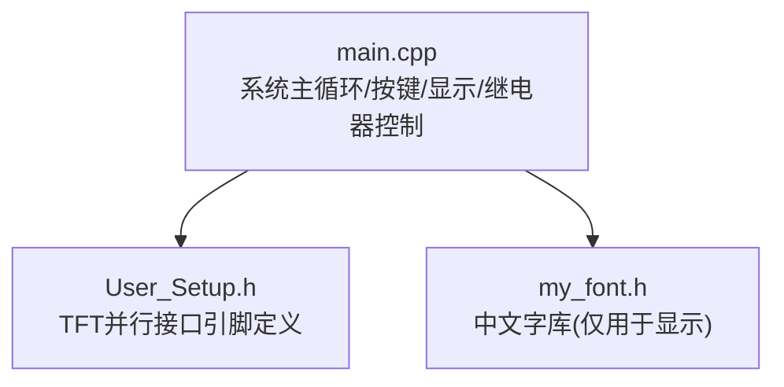
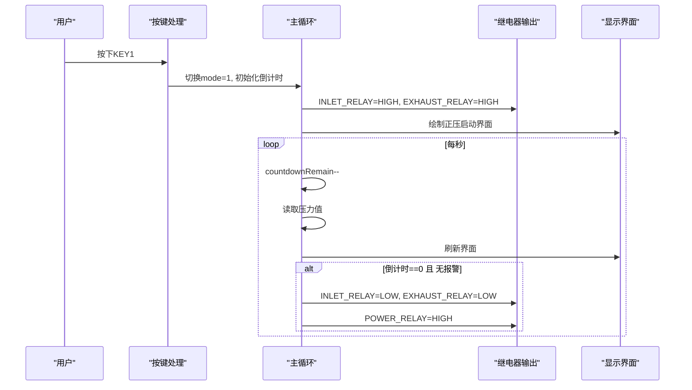
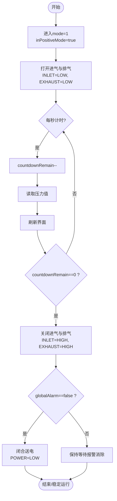
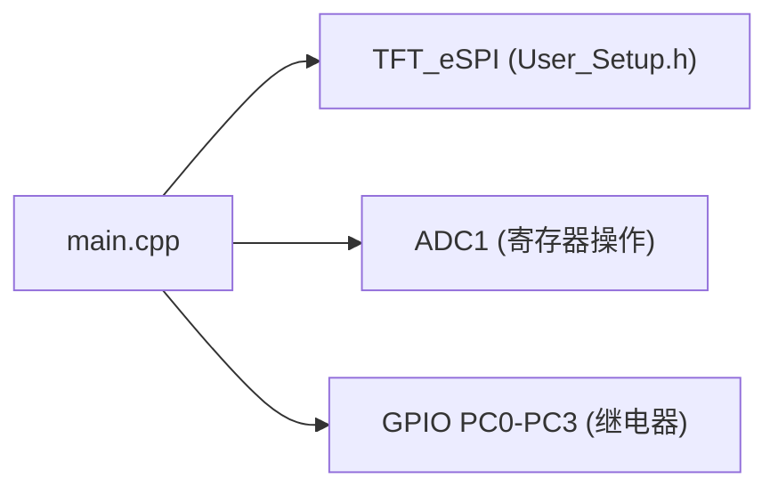

# 继电器控制逻辑

<cite>
**本文引用的文件**   
- [src/main.cpp](file://src/main.cpp)
- [include/User_Setup.h](file://include/User_Setup.h)
</cite>

## 目录
1. [简介](#简介)
2. [项目结构](#项目结构)
3. [核心组件](#核心组件)
4. [架构总览](#架构总览)
5. [详细组件分析](#详细组件分析)
6. [依赖关系分析](#依赖关系分析)
7. [性能与可靠性考虑](#性能与可靠性考虑)
8. [故障排查指南](#故障排查指南)
9. [结论](#结论)
10. [附录：关键流程代码路径](#附录关键流程代码路径)

## 简介
本文件面向GD32F103RCT6正压防爆控制系统的“继电器控制逻辑”，聚焦四个继电器的控制策略与时序：INLET_RELAY（进气）、EXHAUST_RELAY（排气）、POWER_RELAY（送电）、ALARM_RELAY（警报）。文档将解释：
- 硬件抽象层实现：引脚模式配置、数字输出控制、低电平触发电气特性说明
- 正压控制时序：进/排同时开启、压力达标后的关闭时机、送电继电器的安全联锁
- 系统模式与继电器状态关联：mode=1正压启动模式的自动控制和手动干预
- 保护机制：防止进/排冲突、异常时安全关闭、电源管理考量
- 常见问题处理：抖动、控制冲突、电气干扰等
- 初学者友好概念与进阶开发者所需的接口细节

## 项目结构
仓库采用最小化工程结构，核心控制逻辑集中在主程序文件中，TFT显示驱动通过User_Setup进行引脚映射。

图表来源
- [src/main.cpp:1-20](file://src/main.cpp#L1-L20)
- [include/User_Setup.h:1-74](file://include/User_Setup.h#L1-L74)

章节来源
- [src/main.cpp:1-20](file://src/main.cpp#L1-L20)
- [include/User_Setup.h:1-74](file://include/User_Setup.h#L1-L74)

## 核心组件
- 硬件引脚与常量定义
  - 继电器：PC0=排气(EXHAUST_RELAY)、PC1=警报(ALARM_RELAY)、PC2=进气(INLET_RELAY)、PC3=送电(POWER_RELAY)
  - 按键：PC7/PC8/PC9；蜂鸣器：PA12
  - ADC：PC4=压力(ADC14)、PC5=温度(ADC15)
- 系统参数
  - sysParams[6]：下限、下下限、上限、上上限、温度上限、换气时间
- 状态变量
  - mode：0主页、1正压启动、2设置、3调试
  - inPositiveMode：是否处于正压运行阶段
  - countdownRemain：换气倒计时
  - globalAlarm/muteOn：全局报警与消音标志
  - pressVal/tempVal：当前压力/温度
- 显示与交互
  - TFT_eSPI驱动横屏480x320，User_Setup.h配置并行总线与控制线
- 控制要点
  - 初始化时将所有继电器置为LOW（默认不吸合）
  - 正压启动时同时打开进气与排气
  - 倒计时结束后关闭进/排，并在无报警条件下闭合送电

章节来源
- [src/main.cpp:15-43](file://src/main.cpp#L15-L43)
- [src/main.cpp:26-31](file://src/main.cpp#L26-L31)
- [include/User_Setup.h:42-47](file://include/User_Setup.h#L42-L47)

## 架构总览
整体数据流与控制流如下：
- 用户按键进入mode=1后，系统进入正压启动流程
- 每1秒更新一次倒计时与压力采样，并刷新显示
- 当倒计时归零且无报警时，关闭进/排，并尝试闭合送电
- 若检测到压力越限，则置位全局报警，影响UI与后续动作

图表来源
- [src/main.cpp:318-364](file://src/main.cpp#L318-L364)
- [src/main.cpp:391-433](file://src/main.cpp#L391-L433)
- [src/main.cpp:191-253](file://src/main.cpp#L191-L253)

## 详细组件分析

### 硬件抽象层与电气特性
- 引脚模式配置
  - 所有继电器引脚均配置为OUTPUT，并在初始化时置LOW（默认不吸合）
  - 按键使用INPUT_PULLUP，按下时为LOW
  - ADC通道使用INPUT_ANALOG
- 数字输出控制
  - 使用digitalWrite直接驱动继电器模块输入端
  - 低电平触发电气特性说明：
    - 当GPIO输出为LOW时，外部继电器模块吸合（导通负载）
    - 当GPIO输出为HIGH时，外部继电器模块释放（断开负载）
    - 因此，在代码中将“吸合”理解为“写LOW”，“释放”理解为“写HIGH”
- 典型调用位置
  - 初始化：将所有继电器置LOW
  - 正压启动：INLET_RELAY和EXHAUST_RELAY置LOW以吸合
  - 结束阶段：INLET_RELAY和EXHAUST_RELAY置HIGH以释放；若无报警，POWER_RELAY置LOW以吸合

章节来源
- [src/main.cpp:366-389](file://src/main.cpp#L366-L389)
- [src/main.cpp:377-381](file://src/main.cpp#L377-L381)
- [src/main.cpp:404-422](file://src/main.cpp#L404-L422)

### 继电器控制策略与时序
- 四路继电器角色
  - INLET_RELAY（进气）：正压启动期间与排气同时开启，用于建立柜内正压
  - EXHAUST_RELAY（排气）：与进气同时开启，形成气流交换
  - POWER_RELAY（送电）：仅在正压建立完成且无报警时闭合，作为安全联锁
  - ALARM_RELAY（警报）：当前代码未对ALARM_RELAY进行主动控制，但存在全局报警标志globalAlarm用于UI闪烁提示
- 时序规则
  - 进入mode=1后，立即同时开启进气与排气
  - 每秒递减换气倒计时，并采集压力
  - 倒计时归零时：
    - 关闭进气与排气
    - 若globalAlarm为false，则闭合送电
- 压力阈值与报警
  - 根据sysParams中的上下限与上上限判断压力状态
  - 低于下下限或高于上上限时置位globalAlarm=true，并在UI上红色闪烁“警报”
  - 用户在mode=1时可取消警报（仅消音，不影响已执行的硬件动作）

图表来源
- [src/main.cpp:391-433](file://src/main.cpp#L391-L433)
- [src/main.cpp:191-253](file://src/main.cpp#L191-L253)

章节来源
- [src/main.cpp:391-433](file://src/main.cpp#L391-L433)
- [src/main.cpp:191-253](file://src/main.cpp#L191-L253)

### 系统模式与继电器状态关联
- mode=0（主页）：无自动控制，仅显示与菜单
- mode=1（正压启动）：
  - 自动：同时开启进气与排气，倒计时结束后关闭进/排，并在无报警时闭合送电
  - 手动干预：
    - KEY1：在mode=1时取消警报（仅消音）
    - KEY3：退出到mode=0，并强制关闭进气与排气
- mode=2（系统设置）：不涉及继电器控制
- mode=3（系统调试）：不涉及继电器控制

章节来源
- [src/main.cpp:318-364](file://src/main.cpp#L318-L364)
- [src/main.cpp:391-433](file://src/main.cpp#L391-L433)

### 保护与安全联锁
- 防止进/排冲突
  - 当前逻辑在mode=1时始终同时开启进/排，不存在单独开启某一侧的情况
  - 退出mode=1时会显式关闭进/排，避免残留状态
- 异常情况下的安全关闭
  - 若检测到压力越限，置位globalAlarm，UI闪烁“警报”
  - 当前代码未在报警时主动关闭进/排或送电，建议在后续版本增加“报警即停”的安全策略
- 电源管理
  - 送电仅在倒计时结束且无报警时闭合，确保先建立正压再供电
  - 建议增加“送电失败重试/超时保护”的扩展点

章节来源
- [src/main.cpp:391-433](file://src/main.cpp#L391-L433)
- [src/main.cpp:191-253](file://src/main.cpp#L191-L253)

### 完整控制流程示例（代码路径）
- 初始化配置
  - 参考路径：[src/main.cpp:366-389](file://src/main.cpp#L366-L389)
- 进入正压启动模式
  - 参考路径：[src/main.cpp:318-364](file://src/main.cpp#L318-L364)
- 启动阶段同时开启进/排
  - 参考路径：[src/main.cpp:404-407](file://src/main.cpp#L404-L407)
- 每秒更新倒计时与压力
  - 参考路径：[src/main.cpp:411-416](file://src/main.cpp#L411-L416)
- 倒计时结束关闭进/排并安全送电
  - 参考路径：[src/main.cpp:418-422](file://src/main.cpp#L418-L422)
- 手动退出模式时的安全关闭
  - 参考路径：[src/main.cpp:353-355](file://src/main.cpp#L353-L355)

## 依赖关系分析
- main.cpp依赖TFT_eSPI库进行显示，User_Setup.h定义了并行接口的引脚映射
- 继电器控制完全基于Arduino风格的API（pinMode/digitalWrite），底层由HAL/寄存器操作封装
- 压力/温度采样依赖ADC1，初始化与校准在主循环前完成

图表来源
- [include/User_Setup.h:1-74](file://include/User_Setup.h#L1-L74)
- [src/main.cpp:74-101](file://src/main.cpp#L74-L101)
- [src/main.cpp:366-389](file://src/main.cpp#L366-L389)

章节来源
- [include/User_Setup.h:1-74](file://include/User_Setup.h#L1-L74)
- [src/main.cpp:74-101](file://src/main.cpp#L74-L101)
- [src/main.cpp:366-389](file://src/main.cpp#L366-L389)

## 性能与可靠性考虑
- 实时性
  - 主循环每10ms执行一次，按键去抖30ms，足够响应
  - 每秒更新一次倒计时与压力，避免频繁IO
- 稳定性
  - 初始化时明确所有继电器为LOW，避免上电瞬态误动作
  - 退出模式时显式关闭进/排，保证状态一致
- 可扩展性
  - 建议引入状态机，将“正压建立”、“维持”、“送电”、“报警处理”等状态清晰分离
  - 增加“报警即停”策略，提升安全性

## 故障排查指南
- 继电器抖动
  - 现象：UI或负载出现闪烁
  - 排查：检查外部继电器模块是否有延时电路或RC滤波；确认GPIO输出稳定
- 控制冲突
  - 现象：进/排不同步或残留状态
  - 排查：确保退出模式时显式关闭进/排；避免多处修改同一继电器状态
- 电气干扰
  - 现象：传感器读数波动或MCU复位
  - 排查：检查ADC采样前的校准与滤波；确保继电器驱动线与信号线隔离
- 报警未生效
  - 现象：globalAlarm置位但硬件未动作
  - 排查：当前代码未对ALARM_RELAY进行控制，如需声光报警需扩展控制逻辑

章节来源
- [src/main.cpp:318-364](file://src/main.cpp#L318-L364)
- [src/main.cpp:391-433](file://src/main.cpp#L391-L433)

## 结论
该正压防爆控制系统在mode=1下实现了“进/排同时开启—倒计时结束关闭—无报警时送电”的基本安全联锁逻辑。硬件抽象层简洁明了，适合快速迭代。为进一步提升安全性与可维护性，建议：
- 引入状态机与更严格的报警处理（如报警即停）
- 完善ALARM_RELAY的控制逻辑
- 增加送电失败重试与超时保护
- 对继电器输出增加软件互斥与日志记录，便于问题定位

## 附录：关键流程代码路径
- 引脚与常量定义
  - [src/main.cpp:15-20](file://src/main.cpp#L15-L20)
- 系统参数与状态变量
  - [src/main.cpp:26-43](file://src/main.cpp#L26-L43)
- 初始化（含继电器默认状态）
  - [src/main.cpp:366-389](file://src/main.cpp#L366-L389)
- 按键处理与模式切换
  - [src/main.cpp:318-364](file://src/main.cpp#L318-L364)
- 正压启动主循环（开/关继电器与送电联锁）
  - [src/main.cpp:391-433](file://src/main.cpp#L391-L433)
- 压力阈值与报警判定（UI联动）
  - [src/main.cpp:191-253](file://src/main.cpp#L191-L253)
- TFT并行接口引脚映射
  - [include/User_Setup.h:42-47](file://include/User_Setup.h#L42-L47)