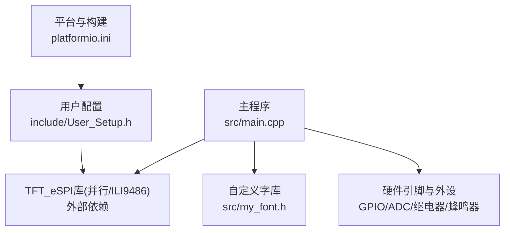
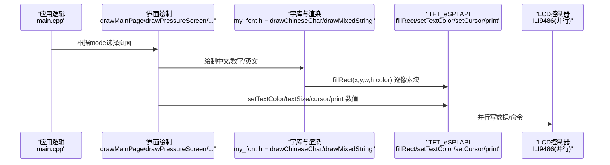
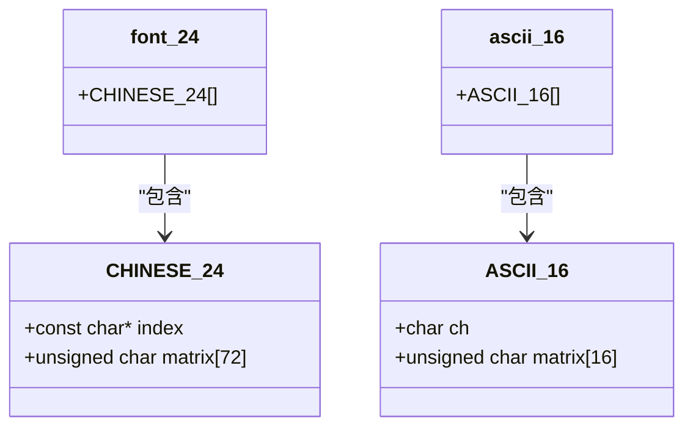
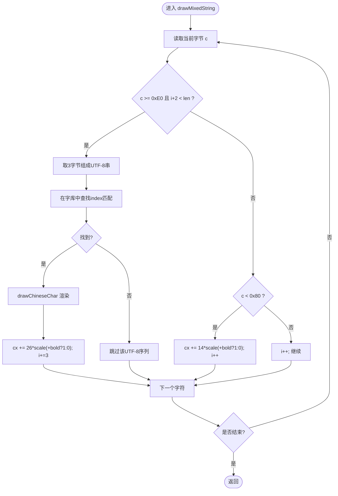
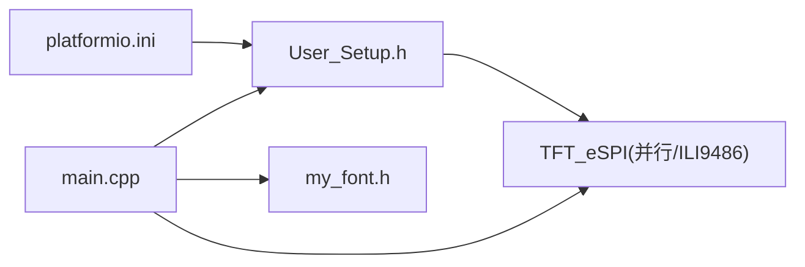

# 显示驱动系统

<cite>
**本文引用的文件**   
- [src/main.cpp](file://src/main.cpp)
- [src/my_font.h](file://src/my_font.h)
- [include/User_Setup.h](file://include/User_Setup.h)
- [platformio.ini](file://platformio.ini)
</cite>

## 目录
1. [简介](#简介)
2. [项目结构](#项目结构)
3. [核心组件](#核心组件)
4. [架构总览](#架构总览)
5. [详细组件分析](#详细组件分析)
6. [依赖关系分析](#依赖关系分析)
7. [性能考虑](#性能考虑)
8. [故障排查指南](#故障排查指南)
9. [结论](#结论)
10. [附录：使用示例与最佳实践](#附录使用示例与最佳实践)

## 简介
本文件面向GD32F103RCT6正压防爆控制系统的显示驱动子系统，聚焦于TFT_eSPI库在并行接口下的配置与使用、屏幕旋转与颜色定义、中文字体支持体系（字库数据结构、点阵存储格式、索引机制），以及中文绘制函数drawChineseChar()与drawMixedString()的实现原理。文档同时覆盖图形绘制基础API的使用方法与优化技巧，并提供常见问题定位与解决建议，兼顾初学者入门与进阶开发者的技术深度需求。

## 项目结构
本项目采用Arduino框架与PlatformIO构建，通过自定义User_Setup.h与编译宏完成TFT_eSPI的并行接口配置；主程序包含界面绘制、按键交互、传感器采集与状态机调度；字体数据以24x24点阵形式集中管理，并附带ASCII点阵表。

图表来源
- [platformio.ini:1-45](file://platformio.ini#L1-L45)
- [include/User_Setup.h:1-74](file://include/User_Setup.h#L1-L74)
- [src/main.cpp:1-434](file://src/main.cpp#L1-L434)
- [src/my_font.h:1-3569](file://src/my_font.h#L1-3569)

章节来源
- [platformio.ini:1-45](file://platformio.ini#L1-L45)
- [include/User_Setup.h:1-74](file://include/User_Setup.h#L1-L74)
- [src/main.cpp:1-434](file://src/main.cpp#L1-L434)
- [src/my_font.h:1-3569](file://src/my_font.h#L1-3569)

## 核心组件
- TFT_eSPI实例与初始化：创建TFT_eSPI对象，调用begin()与setRotation()完成硬件初始化与横屏设置。
- 并行接口配置：通过User_Setup.h与编译宏启用8位并行总线、选择ILI9486控制器、映射DC/CS/WR/RD/RST与数据总线PB0-PB7。
- 中文字库：24x24点阵汉字数组，按“索引字符串+矩阵字节”组织，提供查找与逐像素渲染能力。
- 混合字符串绘制：UTF-8解析，识别三字节中文与单字节ASCII，分别走中文字模或ASCII路径，支持缩放与加粗。
- 图形绘制基础：fillRect()/setTextColor()/setCursor()/print()等组合实现数值与文本展示。
- 界面调度：多页面绘制函数根据模式切换，统一刷新。

章节来源
- [src/main.cpp:10-14](file://src/main.cpp#L10-L14)
- [src/main.cpp:367-371](file://src/main.cpp#L367-L371)
- [include/User_Setup.h:22-36](file://include/User_Setup.h#L22-L36)
- [include/User_Setup.h:42-48](file://include/User_Setup.h#L42-L48)
- [src/my_font.h:6-16](file://src/my_font.h#L6-L16)
- [src/my_font.h:17-3555](file://src/my_font.h#L17-L3555)
- [src/main.cpp:111-143](file://src/main.cpp#L111-L143)
- [src/main.cpp:158-166](file://src/main.cpp#L158-L166)
- [src/main.cpp:168-310](file://src/main.cpp#L168-L310)

## 架构总览
下图展示了从应用层到TFT驱动的调用链路与关键模块职责。

图表来源
- [src/main.cpp:168-310](file://src/main.cpp#L168-L310)
- [src/main.cpp:111-143](file://src/main.cpp#L111-L143)
- [include/User_Setup.h:30-36](file://include/User_Setup.h#L30-L36)

## 详细组件分析

### TFT_eSPI并行接口配置与屏幕旋转
- 并行模式与控制器
  - 启用8位并行总线，选择ILI9486控制器。
  - 控制引脚：DC=PA2, CS=PA4, WR=PA5, RD=PA3, RST=PA1。
  - 数据总线：PB0-PB7作为D0-D7（低8位）。
- 构建宏与User_Setup一致性
  - platformio.ini中定义了USER_SETUP_LOADED、STM32、TFT_PARALLEL_8_BIT、STM_PORTB_DATA_BUS、ILI9486_DRIVER及所有引脚宏，确保与User_Setup.h一致。
- 屏幕旋转
  - 初始化后调用setRotation(1)设置为横屏480x320。

章节来源
- [include/User_Setup.h:22-36](file://include/User_Setup.h#L22-L36)
- [include/User_Setup.h:42-48](file://include/User_Setup.h#L42-L48)
- [platformio.ini:10-36](file://platformio.ini#L10-L36)
- [src/main.cpp:367-371](file://src/main.cpp#L367-L371)

### 颜色定义与文本样式
- 颜色常量：如TFT_WHITE/TFT_BLUE/TFT_RED/TFT_YELLOW/TFT_CYAN/TFT_DARKGREY等由TFT_eSPI提供。
- 文本样式：setTextColor(TFT_COLOR, BG_COLOR)、setTextSize(n)、setCursor(x,y)、print(...)用于快速输出数值与单位。

章节来源
- [src/main.cpp:204-215](file://src/main.cpp#L204-L215)
- [src/main.cpp:296-297](file://src/main.cpp#L296-L297)

### 中文字体支持系统
- 数据结构
  - CHINESE_24：包含index（UTF-8编码的字符）与matrix（24行×3字节/行的点阵）。
  - ASCII_16：包含单个ASCII字符与其16行×1字节/行的点阵。
- 存储布局
  - 每行24位，按8位打包为3字节，低位在前（LSB first），与渲染时的列位移匹配。
- 索引机制
  - 通过遍历font_24数组，比较index与传入的UTF-8字符串，找到对应字模后逐行逐列扫描matrix进行填充。
- 生成工具
  - 项目内提供Python脚本将字形渲染为24x24点阵并生成C数组，便于扩展字库。

图表来源
- [src/my_font.h:6-16](file://src/my_font.h#L6-L16)
- [src/my_font.h:17-3555](file://src/my_font.h#L17-L3555)
- [src/my_font.h:3556-3569](file://src/my_font.h#L3556-L3569)

章节来源
- [src/my_font.h:6-16](file://src/my_font.h#L6-L16)
- [src/my_font.h:17-3555](file://src/my_font.h#L17-L3555)
- [src/my_font.h:3556-3569](file://src/my_font.h#L3556-L3569)

### drawChineseChar()与drawMixedString()实现原理
- UTF-8处理
  - 首字节≥0xE0且后续存在两字节时，视为三字节UTF-8中文字符，拼接为临时字符串并与字库index比对。
  - 单字节ASCII直接跳过字库查找，仅更新光标位置。
- 字符矩阵渲染
  - 对每个像素(row,col)，计算matrix中的字节偏移与位掩码，若置位则调用tft.fillRect绘制一个最小矩形块。
  - 支持scale缩放与bold加粗（额外偏移一次绘制）。
- 宽度步进
  - 中文步进约26*scale（含间距），ASCII步进约14*scale（含间距），保证混排对齐。

图表来源
- [src/main.cpp:111-143](file://src/main.cpp#L111-L143)
- [src/my_font.h:6-16](file://src/my_font.h#L6-L16)

章节来源
- [src/main.cpp:111-143](file://src/main.cpp#L111-L143)
- [src/my_font.h:6-16](file://src/my_font.h#L6-L16)

### 图形绘制基础函数与优化技巧
- fillRect(x,y,w,h,color)
  - 用于绘制背景色块、按钮、状态条等大面积区域。
  - 优化建议：尽量合并相邻同色区域，减少重复绘制；优先用fillRect替代逐像素绘制。
- setTextColor(color, bg) / setTextSize(n) / setCursor(x,y) / print(...)
  - 适合绘制数值、单位与提示文本。
  - 优化建议：避免频繁改变文本属性；批量设置后再连续打印；必要时缓存固定文本的坐标与样式。
- 局部刷新
  - 对于动态区域（如倒计时、压力值），只重绘变化区域，降低全屏刷新开销。

章节来源
- [src/main.cpp:158-166](file://src/main.cpp#L158-L166)
- [src/main.cpp:204-215](file://src/main.cpp#L204-L215)
- [src/main.cpp:296-297](file://src/main.cpp#L296-L297)

### 界面布局与绘制流程
- 主页：标题、服务信息、公司名、三个菜单按钮、警报角标。
- 正压启动页：顶部状态指示、换气倒计时、柜内压力、压力状态条、底部操作按钮。
- 系统设置页：选项列表高亮、底部导航按钮。
- 系统调试页：危险警告、实时压力温度、返回与结束按钮。
- 统一调度：drawScreen()根据mode分发到具体绘制函数。

章节来源
- [src/main.cpp:168-310](file://src/main.cpp#L168-L310)

## 依赖关系分析
- 构建期依赖
  - PlatformIO声明TFT_eSPI库版本与构建宏，确保User_Setup生效。
- 运行期依赖
  - main.cpp依赖TFT_eSPI与my_font.h；User_Setup.h决定底层并行总线与控制器。
- 潜在耦合点
  - User_Setup与platformio.ini需保持一致，否则可能出现引脚映射错误或控制器不匹配。
  - 字库索引与UTF-8编码必须一致，否则无法匹配导致乱码。

图表来源
- [platformio.ini:1-45](file://platformio.ini#L1-L45)
- [include/User_Setup.h:1-74](file://include/User_Setup.h#L1-L74)
- [src/main.cpp:10-14](file://src/main.cpp#L10-L14)
- [src/my_font.h:1-16](file://src/my_font.h#L1-L16)

章节来源
- [platformio.ini:1-45](file://platformio.ini#L1-L45)
- [include/User_Setup.h:1-74](file://include/User_Setup.h#L1-L74)
- [src/main.cpp:10-14](file://src/main.cpp#L10-L14)
- [src/my_font.h:1-16](file://src/my_font.h#L1-L16)

## 性能考虑
- 并行总线优势
  - 8位并行写入显著优于SPI，适合大尺寸屏幕与高频刷新。
- 渲染策略
  - 使用fillRect批量绘制，减少函数调用与边界判断开销。
  - 中文渲染按像素块绘制，注意scale放大时矩形数量增加，应合理限制最大缩放比例。
- 刷新频率
  - 仅在数据变化时刷新相关区域；主循环中使用定时器/计数器控制刷新节奏，避免阻塞。
- 内存占用
  - 字库位于FLASH（PROGMEM），避免RAM占用；如需扩展字库，评估代码空间与启动时间。

[本节为通用指导，无需特定文件引用]

## 故障排查指南
- 字体显示异常/中文乱码
  - 检查User_Setup与platformio.ini的并行与控制器宏是否一致。
  - 确认源文件编码为UTF-8，且字库index与字符串编码一致。
  - 验证drawMixedString的UTF-8解析条件与步进宽度是否与字模尺寸匹配。
- 显示刷新慢
  - 减少全屏刷新，改为局部刷新；合并相邻同色区域；避免在热路径中进行大量字符串格式化。
  - 适当降低中文缩放比例或关闭加粗。
- 屏幕无显示或花屏
  - 核对DC/CS/WR/RD/RST与数据总线PB0-PB7接线；确认ILI9486控制器宏正确。
  - 检查tft.begin()与setRotation()调用顺序与参数。
- 数值显示错位
  - 检查setCursor与文本长度估算；混排时中文与ASCII步进差异可能导致错位，需统一布局策略。

章节来源
- [include/User_Setup.h:22-36](file://include/User_Setup.h#L22-L36)
- [include/User_Setup.h:42-48](file://include/User_Setup.h#L42-L48)
- [src/main.cpp:111-143](file://src/main.cpp#L111-L143)
- [src/main.cpp:367-371](file://src/main.cpp#L367-L371)

## 结论
本显示驱动系统基于TFT_eSPI并行接口与ILI9486控制器，结合自定义24x24点阵字库实现了稳定的中文显示与界面交互。通过合理的并行配置、局部刷新策略与字库索引机制，系统在资源受限的MCU上仍能提供流畅的用户体验。建议在后续迭代中引入更完善的字库管理与增量渲染方案，进一步提升性能与可维护性。

[本节为总结，无需特定文件引用]

## 附录：使用示例与最佳实践
- 中文显示
  - 使用drawMixedString("欢迎使用正压防爆系统", x, y, color, scale)进行标题绘制。
  - 参考路径：[src/main.cpp:175-177](file://src/main.cpp#L175-L177)
- 数值与单位显示
  - 使用setTextColor()/setTextSize()/setCursor()/print()组合输出压力与倒计时。
  - 参考路径：[src/main.cpp:204-215](file://src/main.cpp#L204-L215)
- 按钮与布局
  - 使用fillRect绘制按钮背景，drawMixedString居中显示标签。
  - 参考路径：[src/main.cpp:158-166](file://src/main.cpp#L158-L166)
- 最佳实践
  - 保持User_Setup与platformio.ini一致；避免在主循环中执行耗时操作；对动态区域采用局部刷新；合理设置中文缩放与加粗。

章节来源
- [src/main.cpp:158-166](file://src/main.cpp#L158-L166)
- [src/main.cpp:175-177](file://src/main.cpp#L175-L177)
- [src/main.cpp:204-215](file://src/main.cpp#L204-L215)