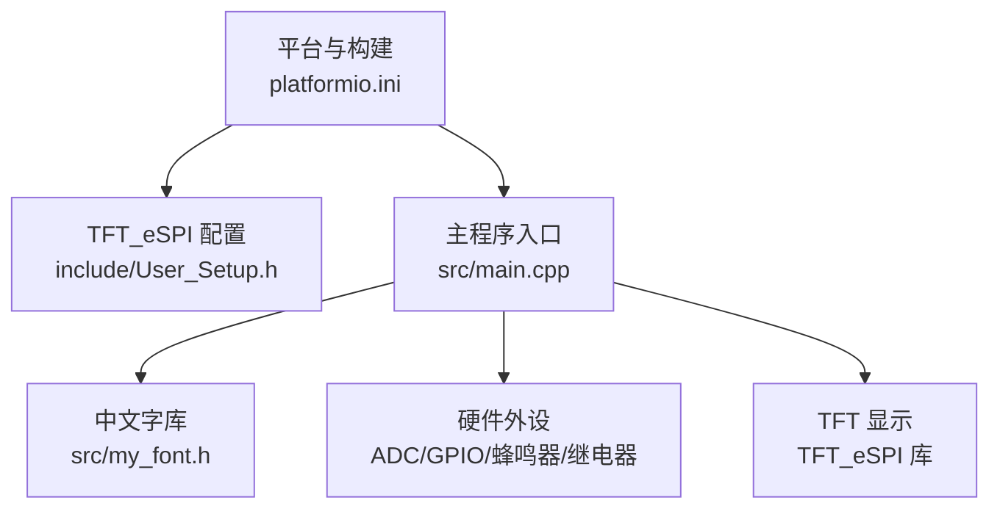
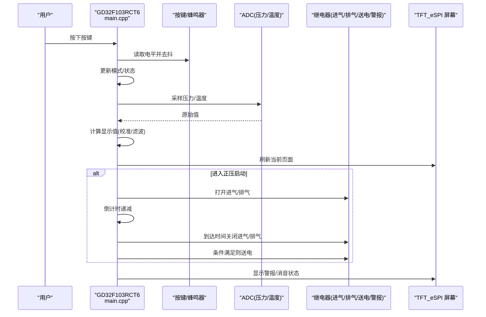
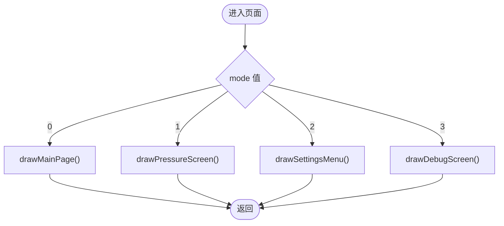
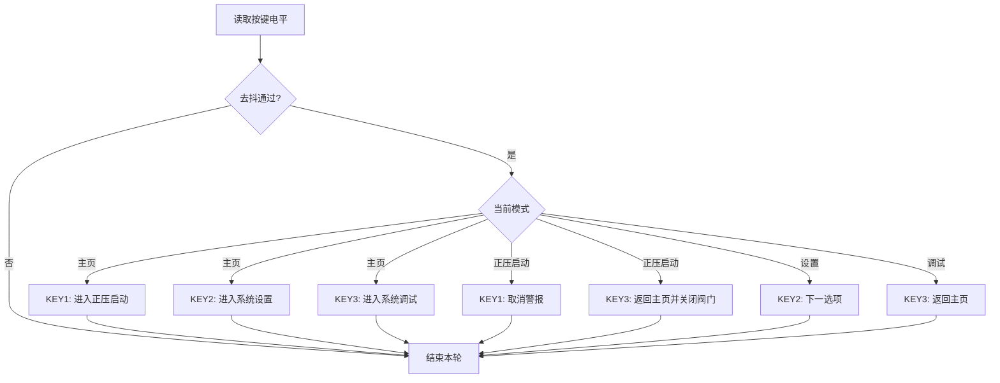
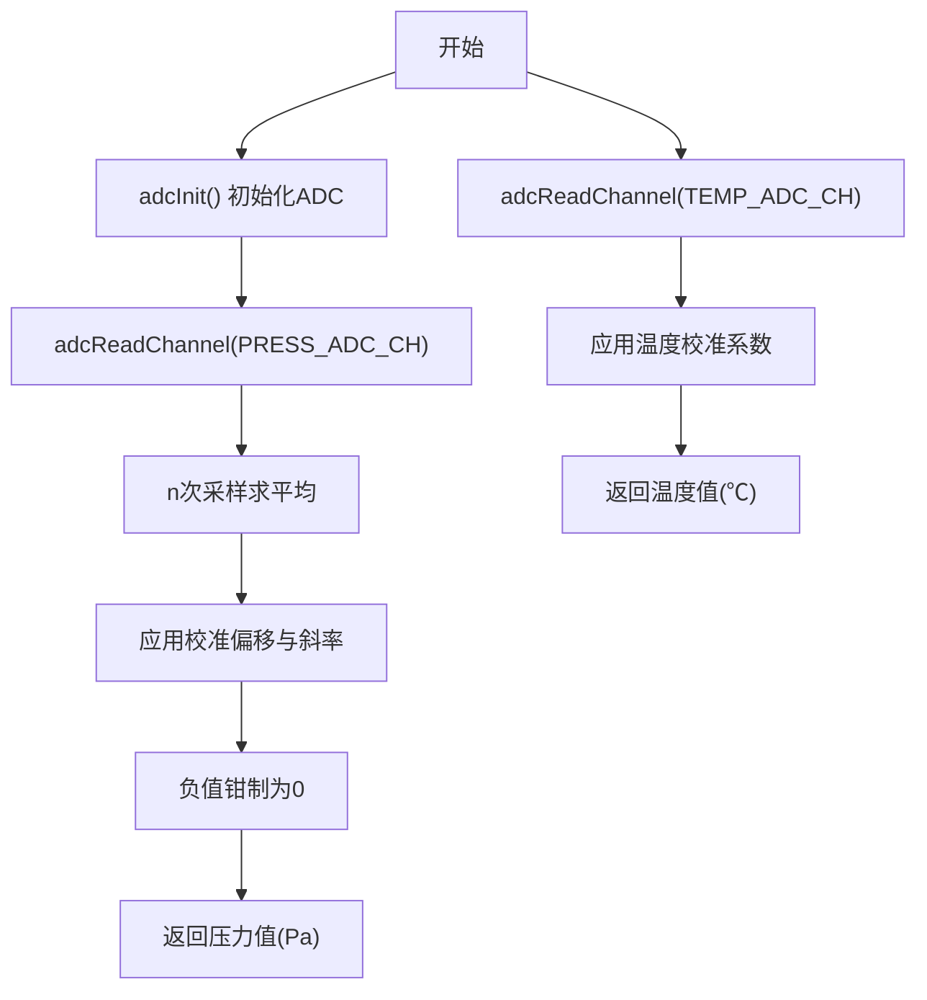
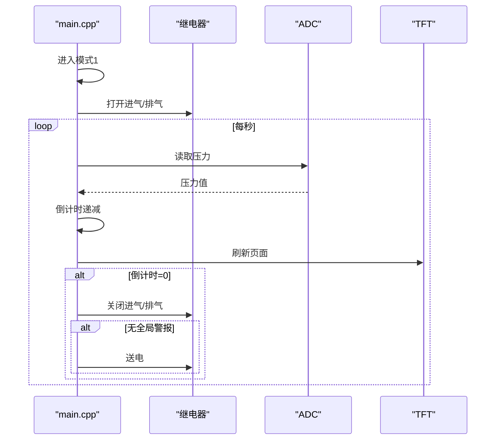
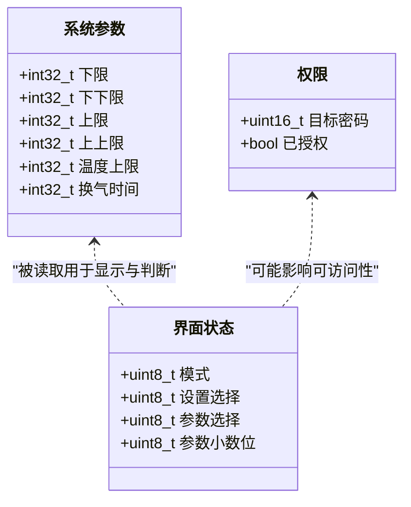
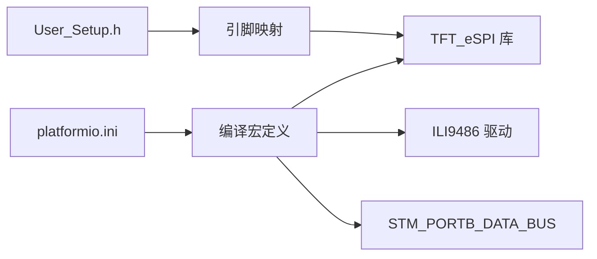

# 核心功能模块

<cite>
**本文引用的文件**   
- [src/main.cpp](file://src/main.cpp)
- [include/User_Setup.h](file://include/User_Setup.h)
- [platformio.ini](file://platformio.ini)
- [src/my_font.h](file://src/my_font.h)
</cite>

## 目录
1. [简介](#简介)
2. [项目结构](#项目结构)
3. [核心组件](#核心组件)
4. [架构总览](#架构总览)
5. [详细组件分析](#详细组件分析)
6. [依赖关系分析](#依赖关系分析)
7. [性能与资源考量](#性能与资源考量)
8. [故障排查指南](#故障排查指南)
9. [结论](#结论)
10. [附录：配置项与接口说明](#附录配置项与接口说明)

## 简介
本项目面向 GD32F103RCT6 正压防爆控制系统，提供基于 Arduino 框架的嵌入式应用。系统通过并行 TFT 屏幕进行人机交互，采集柜内压力与温度，控制进气/排气继电器，并在达到安全阈值时触发警报与消音逻辑。核心流程包括：主页导航、正压启动（换气倒计时与压力监控）、系统设置（密码、校准、参数、恢复出厂）、系统调试（实时数据查看）。

本文件聚焦“核心功能模块”的实现细节、调用关系、接口、领域模型与使用模式，并提供来自代码库的具体示例路径，帮助初学者快速上手，同时为有经验的开发者提供深入的技术参考。

## 项目结构
仓库采用最小化工程组织，核心业务逻辑集中在单一源文件中，显示驱动与字体资源分别位于 include 和 src 子目录，构建配置集中于 platformio.ini。

图表来源
- [platformio.ini:1-45](file://platformio.ini#L1-L45)
- [include/User_Setup.h:1-74](file://include/User_Setup.h#L1-L74)
- [src/main.cpp:1-433](file://src/main.cpp#L1-L433)
- [src/my_font.h:1-845](file://src/my_font.h#L1-845)

章节来源
- [platformio.ini:1-45](file://platformio.ini#L1-L45)
- [include/User_Setup.h:1-74](file://include/User_Setup.h#L1-L74)
- [src/main.cpp:1-433](file://src/main.cpp#L1-L433)
- [src/my_font.h:1-845](file://src/my_font.h#L1-845)

## 核心组件
- 显示子系统
  - 使用 TFT_eSPI 库驱动 3.5 寸 480x320 横屏，引脚映射在 User_Setup.h 与 platformio.ini 中定义。
  - 自定义中文点阵字库 my_font.h，支持混合中英文绘制。
- 输入子系统
  - 三按键（KEY1/KEY2/KEY3）带去抖处理，提供菜单导航与操作确认。
  - 蜂鸣器用于按键反馈与报警提示。
- 传感器子系统
  - ADC 采集压力与温度通道，内置校准机制（零点偏移与斜率系数）。
- 执行器子系统
  - 继电器控制：进气、排气、送电、警报输出。
- 状态机与界面调度
  - 模式变量 mode 驱动页面切换：主页、正压启动、系统设置、系统调试。
- 参数与权限
  - 系统参数数组 sysParams[6] 管理压力上下限、温度上限、换气时间等。
  - 密码校验变量 targetPassword 预留权限控制入口。

章节来源
- [src/main.cpp:15-67](file://src/main.cpp#L15-L67)
- [include/User_Setup.h:14-48](file://include/User_Setup.h#L14-L48)
- [src/my_font.h:1-200](file://src/my_font.h#L1-200)

## 架构总览
整体架构围绕“输入—处理—显示—执行”闭环展开。main.cpp 作为唯一业务入口，负责初始化、事件循环、页面渲染与设备控制；User_Setup.h 与 platformio.ini 完成底层硬件抽象与编译期配置；my_font.h 提供 UI 文本资源。

图表来源
- [src/main.cpp:311-363](file://src/main.cpp#L311-L363)
- [src/main.cpp:390-433](file://src/main.cpp#L390-L433)
- [src/main.cpp:74-101](file://src/main.cpp#L74-L101)
- [src/main.cpp:144-155](file://src/main.cpp#L144-L155)
- [src/main.cpp:167-309](file://src/main.cpp#L167-L309)

## 详细组件分析

### 显示与UI子系统
- 屏幕初始化与旋转
  - 在 setup() 中初始化 TFT 并设置为横屏 480x320。
- 中文绘制
  - drawChineseChar 与 drawMixedString 实现按点阵矩阵填充像素，支持缩放与加粗。
- 按钮布局
  - 底部通用按钮区 drawBtn 统一样式与位置，便于多页面复用。
- 页面函数
  - drawMainPage、drawPressureScreen、drawSettingsMenu、drawDebugScreen 分别对应四个模式。
  - drawScreen 根据 mode 分发到具体页面。

图表来源
- [src/main.cpp:167-309](file://src/main.cpp#L167-L309)

章节来源
- [src/main.cpp:111-165](file://src/main.cpp#L111-L165)
- [src/main.cpp:167-309](file://src/main.cpp#L167-L309)
- [src/my_font.h:1-200](file://src/my_font.h#L1-200)

### 输入与交互子系统
- 按键去抖与短按检测
  - processKeys 每轮 loop 调用，记录上次电平与时间戳，避免误触。
- 模式切换与动作
  - KEY1：主页→正压启动；正压启动→取消警报；设置/调试→返回主页。
  - KEY2：主页→系统设置；设置→下一选项。
  - KEY3：主页→系统调试；正压启动→返回主页并关闭进气/排气；设置/调试→返回主页。
- 蜂鸣器反馈
  - beep(n, onMs, offMs) 提供点击提示音。

图表来源
- [src/main.cpp:311-363](file://src/main.cpp#L311-L363)
- [src/main.cpp:103-109](file://src/main.cpp#L103-L109)

章节来源
- [src/main.cpp:311-363](file://src/main.cpp#L311-L363)
- [src/main.cpp:103-109](file://src/main.cpp#L103-L109)

### 传感器与校准子系统
- ADC 初始化
  - adcInit 启用时钟、复位与校准寄存器，配置采样时间与单次转换模式。
- 通道读取
  - adcReadChannel(ch) 选择通道、触发转换并等待 EOC 标志位返回结果。
- 压力/温度计算
  - calcDisplayPress：对压力通道多次采样求平均，结合校准偏移与斜率得到 Pa 值。
  - calcDisplayTemp：对温度通道采样，结合校准偏移与系数转换为摄氏度。

图表来源
- [src/main.cpp:74-101](file://src/main.cpp#L74-L101)
- [src/main.cpp:144-155](file://src/main.cpp#L144-L155)

章节来源
- [src/main.cpp:74-101](file://src/main.cpp#L74-L101)
- [src/main.cpp:144-155](file://src/main.cpp#L144-L155)

### 执行器与正压控制逻辑
- 继电器控制
  - INLET_RELAY（进气）、EXHAUST_RELAY（排气）、POWER_RELAY（送电）、ALARM_RELAY（警报）。
- 正压启动流程
  - 进入模式1后，打开进气与排气，启动换气倒计时。
  - 每秒更新倒计时与压力值，若倒计时归零且无全局警报，则关闭阀门并送电。
- 压力阈值判断
  - 依据 sysParams[0..3] 判定正常/预警/报警区间，并设置 globalAlarm 标志。

图表来源
- [src/main.cpp:390-433](file://src/main.cpp#L390-L433)
- [src/main.cpp:190-252](file://src/main.cpp#L190-L252)

章节来源
- [src/main.cpp:390-433](file://src/main.cpp#L390-L433)
- [src/main.cpp:190-252](file://src/main.cpp#L190-L252)

### 参数与权限模型
- 系统参数 sysParams[6]
  - 索引含义：下限、下下限、上限、上上限、温度上限、换气时间。
  - 默认值 DEFAULT_SYSPARAMS 提供初始配置。
- 密码与权限
  - targetPassword 与 DEFAULT_PASSWORD 用于后续权限扩展（当前未完全实现）。
- 界面与编辑
  - settingsSel 与 paramSel/paramDpos 等变量为设置与参数编辑预留状态。

图表来源
- [src/main.cpp:26-31](file://src/main.cpp#L26-L31)
- [src/main.cpp:55-67](file://src/main.cpp#L55-L67)

章节来源
- [src/main.cpp:26-31](file://src/main.cpp#L26-L31)
- [src/main.cpp:55-67](file://src/main.cpp#L55-L67)

## 依赖关系分析
- 外部库
  - TFT_eSPI：提供屏幕驱动与绘图 API。
- 构建配置
  - platformio.ini 指定板卡、框架、上传协议、监视波特率与库依赖。
  - 编译宏定义启用并行接口、端口B数据总线、ILI9486 驱动、字体加载与 16 位总线兼容。
- 头文件配置
  - User_Setup.h 定义 STM32/GD32 兼容宏、并行接口模式、控制引脚与数据总线映射。

图表来源
- [platformio.ini:1-45](file://platformio.ini#L1-L45)
- [include/User_Setup.h:14-48](file://include/User_Setup.h#L14-L48)

章节来源
- [platformio.ini:1-45](file://platformio.ini#L1-L45)
- [include/User_Setup.h:14-48](file://include/User_Setup.h#L14-L48)

## 性能与资源考量
- 显示刷新频率
  - 正压启动模式下每秒刷新一次，兼顾实时性与负载。
- ADC 采样策略
  - 压力通道采用多次采样平均以降低噪声；温度通道单次采样配合系数换算。
- 去抖与响应
  - 按键去抖 30ms，保证稳定输入；loop 周期 10ms，提升交互响应速度。
- 内存与存储
  - 中文字库占用 Flash，建议按需裁剪字符集以减少体积。
- 功耗与可靠性
  - 仅在需要时开启 ADC 与屏幕刷新；继电器控制需考虑外部电路保护与隔离。

[本节为通用指导，不直接分析具体文件]

## 故障排查指南
- 屏幕无显示或乱码
  - 检查 User_Setup.h 与 platformio.ini 中的并行接口宏与引脚映射是否一致。
  - 确认 ILI9486_DRIVER 宏与实际屏幕控制器匹配。
- 按键无响应
  - 检查 INPUT_PULLUP 配置与接线；确认去抖时间合理。
- 压力/温度读数异常
  - 重新执行校准流程（零点偏移与斜率），确保传感器连接正确。
- 正压启动无法送电
  - 检查倒计时是否归零；确认全局警报未被置位；验证 POWER_RELAY 控制逻辑。
- 蜂鸣器无声
  - 检查 BEEP_PIN 输出方向与电平；确认 beep 函数被调用。

章节来源
- [include/User_Setup.h:14-48](file://include/User_Setup.h#L14-L48)
- [platformio.ini:10-45](file://platformio.ini#L10-L45)
- [src/main.cpp:365-388](file://src/main.cpp#L365-L388)
- [src/main.cpp:390-433](file://src/main.cpp#L390-L433)

## 结论
该核心功能模块以简洁清晰的架构实现了正压防爆控制的基本能力：人机交互、传感器采集、阈值判断与执行器控制。通过合理的去抖、采样与刷新策略，系统在资源受限的 MCU 平台上提供了稳定的用户体验。后续可扩展持久化存储、更完善的权限体系与更多诊断信息。

[本节为总结性内容，不直接分析具体文件]

## 附录：配置项与接口说明

### 构建与硬件配置
- 平台与框架
  - 平台：ststm32；板卡：genericSTM32F103RC；框架：arduino。
- 关键编译宏
  - USER_SETUP_LOADED、STM32、TFT_PARALLEL_8_BIT、STM_PORTB_DATA_BUS、ILI9486_DRIVER、TFT_DC/CS/WR/RD/RST、TFT_D0~D15、LOAD_* 字体宏、SMOOTH_FONT、TFT_16BIT_BUS。
- 引脚映射
  - DC/CS/WR/RD/RST 对应 PA2/PA4/PA5/PA3/PA1；数据总线 PB0~PB15。

章节来源
- [platformio.ini:1-45](file://platformio.ini#L1-L45)
- [include/User_Setup.h:14-48](file://include/User_Setup.h#L14-L48)

### 系统参数与返回值
- sysParams[6]
  - 索引与含义：下限、下下限、上限、上上限、温度上限、换气时间。
  - 默认值：DEFAULT_SYSPARAMS。
- 压力/温度计算
  - calcDisplayPress：返回 Pa 值（非负）。
  - calcDisplayTemp：返回 ℃ 值（浮点）。
- 状态标志
  - globalAlarm：全局警报标志。
  - muteOn：消音标志。
  - inPositiveMode：正压运行标志。
  - countdownRemain：换气倒计时剩余秒数。

章节来源
- [src/main.cpp:26-31](file://src/main.cpp#L26-L31)
- [src/main.cpp:144-155](file://src/main.cpp#L144-L155)
- [src/main.cpp:33-44](file://src/main.cpp#L33-L44)

### 主要函数与用途
- 初始化与循环
  - setup：串口、TFT、GPIO、ADC 初始化与默认页绘制。
  - loop：闪烁计时、按键处理、正压控制与页面刷新。
- 显示相关
  - drawMainPage/drawPressureScreen/drawSettingsMenu/drawDebugScreen：各页面绘制。
  - drawScreen：模式分发。
  - drawChineseChar/drawMixedString：中文与混合字符串绘制。
- 输入与反馈
  - processKeys：按键去抖与模式切换。
  - beep：蜂鸣器提示。
- 传感器与控制
  - adcInit/adcReadChannel：ADC 初始化与通道读取。
  - calcDisplayPress/calcDisplayTemp：压力/温度计算。

章节来源
- [src/main.cpp:365-433](file://src/main.cpp#L365-L433)
- [src/main.cpp:167-309](file://src/main.cpp#L167-L309)
- [src/main.cpp:111-165](file://src/main.cpp#L111-L165)
- [src/main.cpp:311-363](file://src/main.cpp#L311-L363)
- [src/main.cpp:74-101](file://src/main.cpp#L74-L101)
- [src/main.cpp:144-155](file://src/main.cpp#L144-L155)