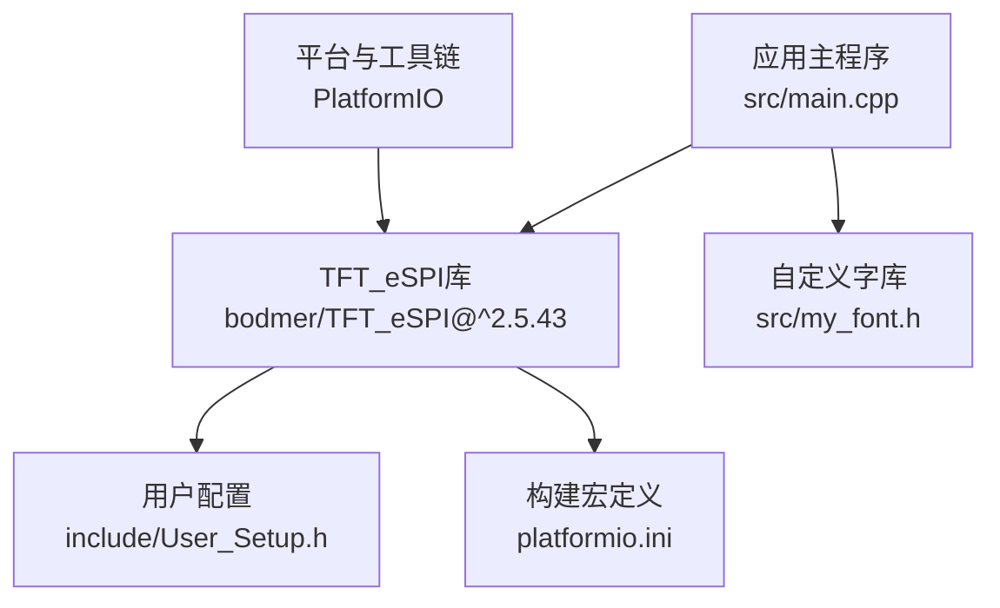
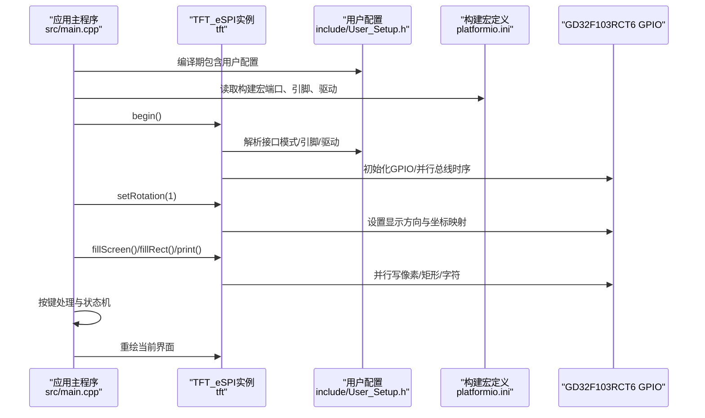
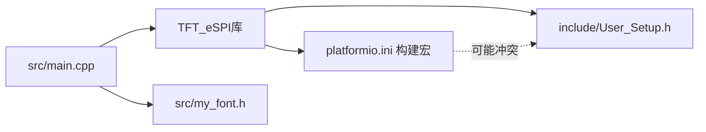

# TFT显示配置

<cite>
**本文引用的文件**   
- [include/User_Setup.h](file://include/User_Setup.h)
- [src/main.cpp](file://src/main.cpp)
- [platformio.ini](file://platformio.ini)
- [src/my_font.h](file://src/my_font.h)
</cite>

## 目录
1. [简介](#简介)
2. [项目结构](#项目结构)
3. [核心组件](#核心组件)
4. [架构总览](#架构总览)
5. [详细组件分析](#详细组件分析)
6. [依赖关系分析](#依赖关系分析)
7. [性能与刷新优化](#性能与刷新优化)
8. [故障排查指南](#故障排查指南)
9. [结论](#结论)
10. [附录：不同尺寸屏幕的配置要点](#附录不同尺寸屏幕的配置要点)

## 简介
本文件面向GD32F103RCT6正压防爆控制系统的TFT显示配置，聚焦于480x320横屏的硬件接口、驱动库初始化、旋转设置、颜色定义以及User_Setup.h中的关键参数。文档同时提供常见问题（屏幕不亮、颜色异常、触摸校准等）的排查思路，并给出适配不同尺寸屏幕的配置方法，帮助初学者理解嵌入式显示驱动原理，也为有经验的开发者提供完整的硬件配置参考。

## 项目结构
本项目采用Arduino + PlatformIO开发，使用TFT_eSPI库通过并行总线驱动ILI9486控制器，实现480x320横屏显示。主要文件职责如下：
- include/User_Setup.h：TFT_eSPI的用户级配置（引脚、接口模式、字体、频率等）
- platformio.ini：构建选项与宏定义（覆盖/补充User_Setup.h）
- src/main.cpp：应用主程序（初始化、界面绘制、交互逻辑）
- src/my_font.h：自定义中文字库（24x24点阵）

图表来源
- [platformio.ini:9-47](file://platformio.ini#L9-L47)
- [include/User_Setup.h:14-73](file://include/User_Setup.h#L14-L73)
- [src/main.cpp:10-13](file://src/main.cpp#L10-L13)

章节来源
- [platformio.ini:1-47](file://platformio.ini#L1-L47)
- [include/User_Setup.h:1-73](file://include/User_Setup.h#L1-L73)
- [src/main.cpp:1-20](file://src/main.cpp#L1-L20)

## 核心组件
- 硬件接口与引脚映射
  - 数据总线：PB0-PB7为D0-D7（低8位），在8位模式下高8位保持低电平
  - 控制信号：PA2=DC，PA4=CS，PA5=WR，PA3=RD，PA1=RST
- 驱动与接口模式
  - 使用STM32兼容的并行8位接口，启用Port B数据总线优化写入
  - 选择ILI9486作为LCD控制器驱动
- 初始化与旋转
  - 调用tft.begin()完成底层初始化
  - 调用tft.setRotation(1)设置为横屏480x320
- 字体与平滑字体
  - 启用GLCD、Font2/4/6/7/8、GFXFF自由字体，并开启SMOOTH_FONT
- 颜色与文本绘制
  - 使用TFT_eSPI内置颜色常量（如TFT_WHITE、TFT_RED等）进行填充和绘制
  - 支持setTextColor、setTextSize、setCursor、print等API

章节来源
- [include/User_Setup.h:23-35](file://include/User_Setup.h#L23-L35)
- [include/User_Setup.h:42-49](file://include/User_Setup.h#L42-L49)
- [include/User_Setup.h:55-64](file://include/User_Setup.h#L55-L64)
- [src/main.cpp:367-370](file://src/main.cpp#L367-L370)
- [src/main.cpp:170-188](file://src/main.cpp#L170-L188)

## 架构总览
下图展示了从应用层到硬件层的调用路径与数据流向，包括初始化、旋转设置、页面绘制与按键交互。

图表来源
- [src/main.cpp:367-370](file://src/main.cpp#L367-L370)
- [include/User_Setup.h:23-49](file://include/User_Setup.h#L23-L49)
- [platformio.ini:13-38](file://platformio.ini#L13-L38)

## 详细组件分析

### 硬件接口与引脚映射
- 数据总线
  - PB0-PB7对应TFT_D0-D7（低8位）
  - 在8位并行模式下，PB8-PB15保持低电平
- 控制引脚
  - PA2=DC（数据/命令选择）
  - PA4=CS（片选）
  - PA5=WR（写选通）
  - PA3=RD（读选通）
  - PA1=RST（复位）
- 并行接口优化
  - 启用STM_PORTB_DATA_BUS以使用BSRR单周期写入，提高写速度

章节来源
- [include/User_Setup.h:4-12](file://include/User_Setup.h#L4-L12)
- [include/User_Setup.h:23-28](file://include/User_Setup.h#L23-L28)
- [include/User_Setup.h:42-49](file://include/User_Setup.h#L42-L49)

### TFT_eSPI初始化与旋转
- 初始化流程
  - tft.begin()：根据User_Setup.h与构建宏配置底层驱动、引脚与时序
  - tft.setRotation(1)：设置为横屏，使W=480、H=320
- 颜色与文本
  - 使用TFT_eSPI内置颜色常量进行背景填充与文本绘制
  - 支持setTextColor、setTextSize、setCursor、print等API

章节来源
- [src/main.cpp:367-370](file://src/main.cpp#L367-L370)
- [src/main.cpp:170-188](file://src/main.cpp#L170-L188)

### User_Setup.h关键配置参数
- 处理器与接口
  - STM32：启用STM32/GD32兼容优化
  - TFT_PARALLEL_8_BIT：并行8位接口
  - STM_PORTB_DATA_BUS：Port B数据总线优化
- 驱动选择
  - ILI9486_DRIVER：选择ILI9486控制器
- 引脚定义
  - TFT_DC=PA2, TFT_CS=PA4, TFT_WR=PA5, TFT_RD=PA3, TFT_RST=PA1
- 字体与平滑字体
  - LOAD_GLCD、LOAD_FONT2/4/6/7/8、LOAD_GFXFF、SMOOTH_FONT
- SPI频率（并行模式下不生效，保留完整性）
  - SPI_FREQUENCY、SPI_READ_FREQUENCY、SPI_TOUCH_FREQUENCY

章节来源
- [include/User_Setup.h:14-35](file://include/User_Setup.h#L14-L35)
- [include/User_Setup.h:42-49](file://include/User_Setup.h#L42-L49)
- [include/User_Setup.h:55-73](file://include/User_Setup.h#L55-L73)

### 构建宏与平台配置（platformio.ini）
- 库依赖
  - bodmer/TFT_eSPI@^2.5.43
- 构建宏
  - USER_SETUP_LOADED、STM32、TFT_PARALLEL_8_BIT、STM_PORTB_DATA_BUS、ILI9486_DRIVER
  - 引脚宏：DTFT_DC、DTFT_CS、DTFT_WR、DTFT_RD、DTFT_RST、DTFT_D0~D15
  - 字体宏：LOAD_GLCD、LOAD_FONT2/4/6/7/8、LOAD_GFXFF、SMOOTH_FONT
  - 总线宽度宏：TFT_16BIT_BUS（注意与User_Setup.h的8位并行存在冲突，见“依赖关系分析”）

章节来源
- [platformio.ini:9-47](file://platformio.ini#L9-L47)

### 自定义中文字库（my_font.h）
- 数据结构
  - CHINESE_24：24x24汉字点阵，每个字占用72字节
  - ASCII_16：8x16英文字符点阵，每个字占用16字节
- 使用方式
  - 应用层通过索引匹配字符串并逐行绘制像素块，支持缩放与加粗

章节来源
- [src/my_font.h:6-16](file://src/my_font.h#L6-L16)
- [src/my_font.h:18-44](file://src/my_font.h#L18-L44)

## 依赖关系分析
- 直接依赖
  - main.cpp包含TFT_eSPI与自定义字库
  - User_Setup.h与platformio.ini共同决定编译期行为（接口、引脚、驱动、字体）
- 潜在冲突
  - platformio.ini定义了TFT_16BIT_BUS，而User_Setup.h启用TFT_PARALLEL_8_BIT与STM_PORTB_DATA_BUS，二者对总线宽度与端口映射存在不一致风险，可能导致编译或运行时异常
  - 建议统一为8位并行（移除TFT_16BIT_BUS），或在需要16位时同步修改User_Setup.h与引脚宏

图表来源
- [src/main.cpp:10-13](file://src/main.cpp#L10-L13)
- [include/User_Setup.h:23-28](file://include/User_Setup.h#L23-L28)
- [platformio.ini:15-16](file://platformio.ini#L15-L16)
- [platformio.ini:47](file://platformio.ini#L47)

章节来源
- [platformio.ini:15-16](file://platformio.ini#L15-L16)
- [platformio.ini:47](file://platformio.ini#L47)
- [include/User_Setup.h:23-28](file://include/User_Setup.h#L23-L28)

## 性能与刷新优化
- 并行总线优化
  - 使用STM_PORTB_DATA_BUS配合BSRR单周期写入，减少GPIO操作开销
- 刷新策略
  - 仅在必要时重绘区域（如警报闪烁区局部更新），避免全屏刷新
- 字体与平滑字体
  - SMOOTH_FONT提升可读性但增加Flash占用与渲染开销，需权衡
- 时钟与频率
  - 并行模式下SPI频率宏不生效；如需进一步优化，可调整MCU主频与GPIO输出速率（需在系统时钟配置中完成）

[本节为通用指导，无需具体文件引用]

## 故障排查指南
- 屏幕不亮
  - 检查RST、CS、DC、WR、RD引脚连接是否正确
  - 确认User_Setup.h与platformio.ini的驱动与接口宏一致（尤其是8位并行与16位总线宏冲突）
  - 验证tft.begin()是否执行成功，观察串口日志（如有）
- 颜色异常或画面错位
  - 检查setRotation(1)是否与屏幕物理方向匹配
  - 确认像素格式与RGB顺序（若使用其他控制器可能需要调整）
  - 核对数据总线PB0-PB7与D0-D7一一对应
- 触摸校准问题
  - 本项目未集成触摸驱动；若后续添加，需在User_Setup.h中启用触摸相关宏并校准坐标映射
- 中文显示乱码或位置偏移
  - 确认自定义字库索引与字符串编码一致（UTF-8）
  - 检查drawMixedString中的字符宽度计算与缩放比例

章节来源
- [include/User_Setup.h:23-35](file://include/User_Setup.h#L23-L35)
- [include/User_Setup.h:42-49](file://include/User_Setup.h#L42-L49)
- [src/main.cpp:367-370](file://src/main.cpp#L367-L370)
- [src/main.cpp:131-143](file://src/main.cpp#L131-L143)

## 结论
本项目基于TFT_eSPI库与GD32F103RCT6的并行8位接口，实现了480x320横屏显示。通过User_Setup.h与platformio.ini的协同配置，明确了引脚映射、驱动选择与字体选项。为确保稳定运行，需消除构建宏与用户配置之间的冲突，并在应用中合理管理刷新与资源占用。对于不同尺寸的屏幕，仅需调整驱动与分辨率宏即可快速适配。

[本节为总结，无需具体文件引用]

## 附录：不同尺寸屏幕的配置要点
- 更换控制器与分辨率
  - 在User_Setup.h中切换驱动宏（如ILI9488、ILI9341、ST7796等）
  - 在main.cpp中更新W与H宏以匹配新屏幕分辨率
- 并行接口与端口映射
  - 若更换数据总线端口，需同步修改User_Setup.h与platformio.ini中的引脚宏
- 旋转与坐标系
  - 根据屏幕安装方向调整setRotation(n)，确保UI布局正确
- 字体与内存
  - 按需启用/禁用字体宏，平衡Flash占用与显示效果
- 常见注意事项
  - 避免并行8位与16位总线宏同时启用
  - 校验DC/CS/WR/RD/RST与控制线连接
  - 若引入触摸，需额外配置触摸控制器与校准流程

[本节为通用指导，无需具体文件引用]