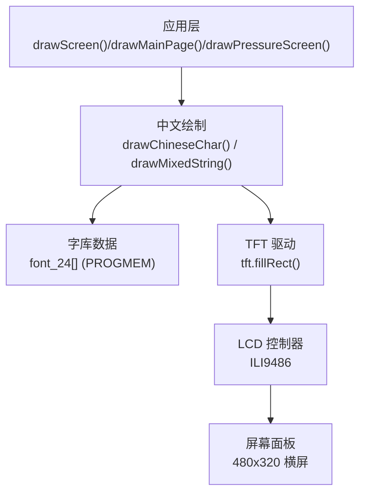
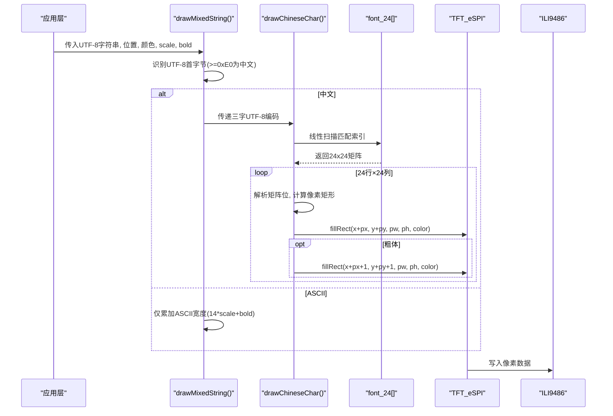
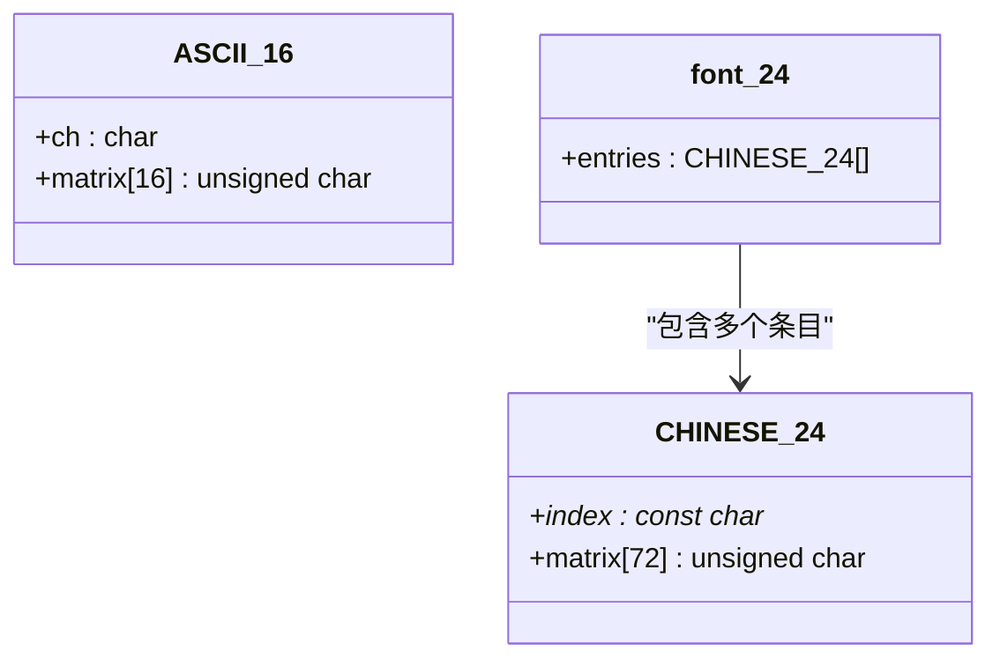
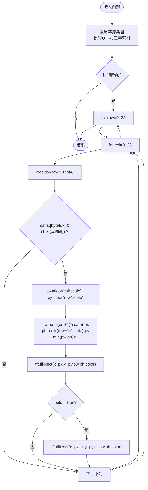
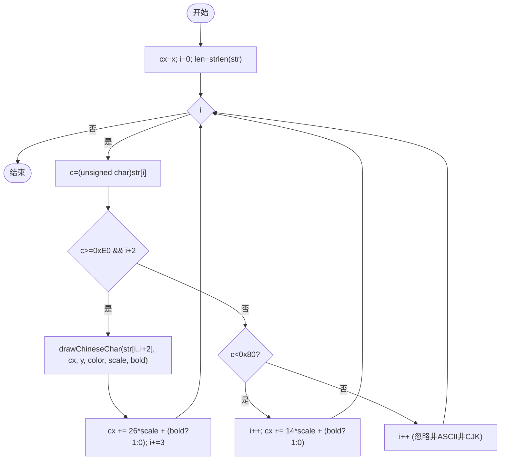
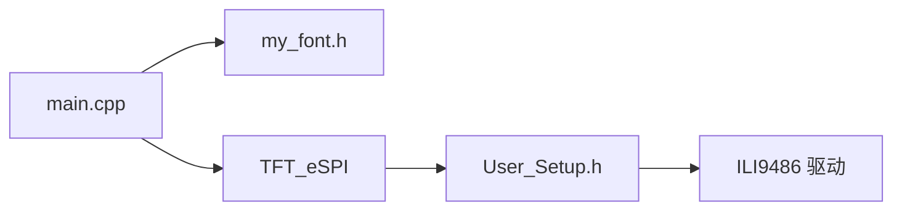

# 中文字体系统

<cite>
**本文引用的文件**   
- [main.cpp](file://src/main.cpp)
- [my_font.h](file://src/my_font.h)
- [User_Setup.h](file://include/User_Setup.h)
</cite>

## 目录
1. [简介](#简介)
2. [项目结构](#项目结构)
3. [核心组件](#核心组件)
4. [架构总览](#架构总览)
5. [详细组件分析](#详细组件分析)
6. [依赖关系分析](#依赖关系分析)
7. [性能与内存考量](#性能与内存考量)
8. [故障排查指南](#故障排查指南)
9. [结论](#结论)
10. [附录：字库扩展与工具](#附录字库扩展与工具)

## 简介
本文件系统面向 GD32F103RCT6 正压防爆控制系统的 3.5 寸横屏（480x320）显示，提供中文字体渲染能力。系统采用 24x24 点阵字库，配合 TFT_eSPI 驱动进行像素绘制，支持中英文混排、字体缩放与粗体显示。文档将深入解析数据结构、存储格式、渲染算法、混排逻辑、缩放与粗体实现，并提供添加新字符的步骤与常见问题解决方案。

## 项目结构
- src/main.cpp：应用主程序，包含界面绘制、按键处理、ADC 采样、状态机调度以及中文字体绘制函数 drawChineseChar() 与 drawMixedString()。
- src/my_font.h：中文字库定义，包含 24x24 汉字点阵数组 font_24[] 及 ASCII 点阵结构体 ASCII_16。
- include/User_Setup.h：TFT_eSPI 的硬件引脚与驱动配置，启用并行 8 位数据总线与 ILI9486 驱动。

图表来源
- [main.cpp:112-143](file://src/main.cpp#L112-L143)
- [my_font.h:18-200](file://src/my_font.h#L18-L200)
- [User_Setup.h:31-36](file://include/User_Setup.h#L31-L36)

章节来源
- [main.cpp:1-120](file://src/main.cpp#L1-L120)
- [my_font.h:1-200](file://src/my_font.h#L1-L200)
- [User_Setup.h:1-74](file://include/User_Setup.h#L1-L74)

## 核心组件
- 中文字库结构体 CHINESE_24：每个条目包含一个 UTF-8 三字节字符串索引与 24x24 点阵矩阵（每行 3 字节，共 72 字节）。
- 字库数组 font_24[]：以 PROGMEM 存储在 Flash，按顺序存放多个汉字条目，通过线性扫描匹配 UTF-8 三字节的“首字节”与后续两字节组合。
- 绘制函数 drawChineseChar()：根据传入的 UTF-8 三字串在字库中查找对应条目，逐行逐列解析点阵并调用 tft.fillRect() 绘制像素块；支持 scale 缩放与 bold 粗体叠加。
- 混排函数 drawMixedString()：遍历输入字符串，识别 UTF-8 多字节序列，对中文调用 drawChineseChar()，对 ASCII 字符仅计算宽度并移动光标；当前未实际绘制英文点阵，但预留了宽度步进逻辑。

章节来源
- [my_font.h:6-16](file://src/my_font.h#L6-L16)
- [my_font.h:18-200](file://src/my_font.h#L18-L200)
- [main.cpp:112-143](file://src/main.cpp#L112-L143)

## 架构总览
从应用层到屏幕的渲染路径如下：
- 应用层调用 drawMixedString() 或 drawChineseChar() 进行文本绘制。
- drawMixedString() 负责 UTF-8 解码与字符类型判断，决定调用中文绘制或仅更新 x 坐标。
- drawChineseChar() 在字库中查找目标字符，解析 24x24 点阵，按 scale 和 bold 参数计算像素矩形并写入 LCD。
- TFT_eSPI 底层通过并行 8 位总线向 ILI9486 控制器写入像素数据。

图表来源
- [main.cpp:131-143](file://src/main.cpp#L131-L143)
- [main.cpp:112-130](file://src/main.cpp#L112-L130)
- [my_font.h:18-200](file://src/my_font.h#L18-L200)
- [User_Setup.h:31-36](file://include/User_Setup.h#L31-L36)

## 详细组件分析

### 数据结构与存储格式
- CHINESE_24 结构体
  - index：指向 UTF-8 三字节字符串（例如“中”、“国”等），用于匹配。
  - matrix：24 行 × 3 字节/行的点阵数据，共 72 字节。每行 24 位，按从左到右顺序排列，低位在前（LSB=最右侧像素）。
- font_24[] 数组
  - 使用 PROGMEM 存储在 Flash，节省 SRAM。
  - 条目顺序即为扫描顺序，无独立索引表，查找复杂度 O(N)。
- ASCII_16 结构体
  - 定义了 8x16 英文点阵结构，但当前绘制流程未使用该结构进行绘制，仅在中文字符宽度估算时参考了固定步长。

图表来源
- [my_font.h:6-16](file://src/my_font.h#L6-L16)
- [my_font.h:18-200](file://src/my_font.h#L18-L200)

章节来源
- [my_font.h:6-16](file://src/my_font.h#L6-L16)
- [my_font.h:18-200](file://src/my_font.h#L18-L200)

### 渲染算法：drawChineseChar()
- 字符查找
  - 遍历 font_24[]，比较每个条目的 index 与传入的 UTF-8 三字串是否相等。
- 点阵解析
  - 外层循环 row 0..23，内层循环 col 0..23。
  - 计算字节索引 byteIdx = row * 3 + col / 8，位偏移 bit = col % 8。
  - 若 matrix[byteIdx] & (0x01 << bit) 为真，则该行该列为黑点。
- 像素绘制与缩放
  - 计算像素坐标 px = floor(col * scale)，py = floor(row * scale)。
  - 计算像素宽高 pw = ceil((col+1)*scale) - px，ph = ceil((row+1)*scale) - py，最小为 1。
  - 调用 tft.fillRect(x+px, y+py, pw, ph, color) 填充像素块。
- 粗体显示
  - 当 bold 为真时，额外在 (x+px+1, y+py+1) 处再绘制一次，形成视觉加粗效果。

图表来源
- [main.cpp:112-130](file://src/main.cpp#L112-L130)

章节来源
- [main.cpp:112-130](file://src/main.cpp#L112-L130)

### 混排逻辑：drawMixedString()
- UTF-8 识别
  - 读取当前字节 c，若 c >= 0xE0 且 i+2 < len，则认为是一个三字节 UTF-8 中文字符，取 str[i..i+2] 作为三字串传给 drawChineseChar()。
  - 若 c < 0x80，认为是 ASCII 字符，跳过绘制，仅增加 x 坐标。
  - 其他情况（如 0xC0..0xDF 的二字节 UTF-8）在当前实现中被忽略（i++），不会绘制也不会正确前进。
- 字符宽度计算
  - 中文宽度：26*scale + (bold?1:0)。
  - ASCII 宽度：14*scale + (bold?1:0)。
- 自动换行
  - 当前实现未检测行尾，不进行自动换行；如需换行需在上层逻辑中拆分字符串或维护行宽阈值。

图表来源
- [main.cpp:131-143](file://src/main.cpp#L131-L143)

章节来源
- [main.cpp:131-143](file://src/main.cpp#L131-L143)

### 字体缩放与粗体原理
- 缩放（scale）
  - 基于整数乘除与浮点乘法，将 1x1 点映射为 pw×ph 的矩形区域，pw/ph 由上下界差值计算得到，确保至少为 1 像素。
  - 优点：简单直观；缺点：存在重复填充与边界误差，可能产生轻微锯齿。
- 粗体（bold）
  - 通过在原始像素块基础上向右下偏移 1 像素再次填充，达到视觉加粗效果。
  - 注意：偏移量固定为 1，不随 scale 变化，可能导致不同缩放下的粗细不一致。

章节来源
- [main.cpp:112-130](file://src/main.cpp#L112-L130)

## 依赖关系分析
- main.cpp 依赖 my_font.h 中的字库结构与数组。
- main.cpp 依赖 TFT_eSPI 库进行屏幕绘制。
- User_Setup.h 配置了并行 8 位数据总线与 ILI9486 驱动，影响底层写入效率与兼容性。

图表来源
- [main.cpp:10-12](file://src/main.cpp#L10-L12)
- [User_Setup.h:31-36](file://include/User_Setup.h#L31-L36)

章节来源
- [main.cpp:10-12](file://src/main.cpp#L10-L12)
- [User_Setup.h:31-36](file://include/User_Setup.h#L31-L36)

## 性能与内存考量
- 字库查找
  - 线性扫描 O(N)，N 为字库条目数。对于频繁绘制的场景，建议引入二分查找或哈希索引以提升速度。
- 点阵解析
  - 每字符 24×24=576 次位检查与可能的 fillRect 调用，CPU 开销较大。可考虑预生成缩放后的像素缓存或使用查表法减少位运算。
- 缩放与粗体
  - 大量小矩形填充会导致多次 SPI/GPIO 写操作。可合并相邻同色像素以减少调用次数。
- 内存占用
  - font_24[] 使用 PROGMEM 存储在 Flash，SRAM 占用较小。若需要动态加载或缓存，需注意 Flash 读取延迟与对齐。

[本节为通用指导，无需具体文件引用]

## 故障排查指南
- 中文显示乱码
  - 原因：源文件编码不是 UTF-8，或编译器未正确处理 UTF-8 常量。
  - 解决：确保源码保存为 UTF-8 无 BOM；确认 Arduino IDE/PlatformIO 编译设置使用 UTF-8。
- 部分中文无法显示
  - 原因：字库中缺少对应字符。
  - 解决：按附录步骤添加新字符到 font_24[]。
- 英文字符未显示
  - 原因：当前 drawMixedString() 对 ASCII 仅更新 x 坐标，未调用任何绘制函数。
  - 解决：在 ASCII 分支中调用英文点阵绘制（参考 ASCII_16 结构），或改用 TFT_eSPI 的 print/cursor 方式输出数字与英文。
- 渲染卡顿
  - 原因：大量小矩形填充与线性查找。
  - 解决：优化查找（索引表）、合并填充、减少不必要的 bold 与高 scale。
- 内存不足
  - 原因：同时加载过多字库或开启平滑字体。
  - 解决：精简字库、关闭 SMOOTH_FONT、按需裁剪字库内容。

章节来源
- [main.cpp:131-143](file://src/main.cpp#L131-L143)
- [User_Setup.h:55-64](file://include/User_Setup.h#L55-L64)

## 结论
本系统中文字体系统以 24x24 点阵为核心，结合简单的缩放与粗体策略，实现了嵌入式环境下的高效中文显示。尽管当前实现具备基础功能，但在查找效率、英文绘制与自动换行方面仍有优化空间。通过引入索引表、完善 UTF-8 解码与英文绘制、合并像素填充等手段，可进一步提升性能与用户体验。

[本节为总结性内容，无需具体文件引用]

## 附录：字库扩展与工具
- 添加新字符步骤
  1. 准备 24x24 点阵数据
     - 使用点阵生成工具（如 PCtoLCD2002、FontStudio、HJLCG 等）导出 24x24 点阵，选择“逐行式、高位在前/低位在前”与“C 语言数组”格式。
     - 确保每行 3 字节（24 位），共 72 字节。
  2. 生成 UTF-8 三字串
     - 在编辑器中输入目标汉字，保存为 UTF-8 无 BOM，编译器会将其转换为三字节 UTF-8 常量。
  3. 插入到 font_24[]
     - 在 my_font.h 的 font_24[] 末尾追加一个新条目，格式为：
       - 索引字段：UTF-8 三字串（例如“新”）。
       - 矩阵字段：72 个十六进制字节，按行排列。
  4. 验证与测试
     - 在 main.cpp 中使用 drawMixedString("新", x, y, color, scale, bold) 进行测试。
     - 观察显示是否正确，必要时调整 scale 与 bold。
- 格式要求与注意事项
  - 每行 24 位，按从左到右顺序，低位在前（LSB 为最右侧像素）。
  - 字节序与位序必须与 drawChineseChar() 的解析逻辑一致（byteIdx=row*3+col/8，bit=col%8）。
  - 保持 font_24[] 的 PROGMEM 属性，避免占用 SRAM。
- 代码示例路径（不直接展示代码内容）
  - 字库结构定义与数组声明：[my_font.h:6-16](file://src/my_font.h#L6-L16)、[my_font.h:18-200](file://src/my_font.h#L18-L200)
  - 中文绘制函数：[main.cpp:112-130](file://src/main.cpp#L112-L130)
  - 混排函数：[main.cpp:131-143](file://src/main.cpp#L131-L143)
  - 使用示例（按钮与标题绘制）：[main.cpp:159-189](file://src/main.cpp#L159-L189)

章节来源
- [my_font.h:6-16](file://src/my_font.h#L6-L16)
- [my_font.h:18-200](file://src/my_font.h#L18-L200)
- [main.cpp:112-143](file://src/main.cpp#L112-L143)
- [main.cpp:159-189](file://src/main.cpp#L159-L189)