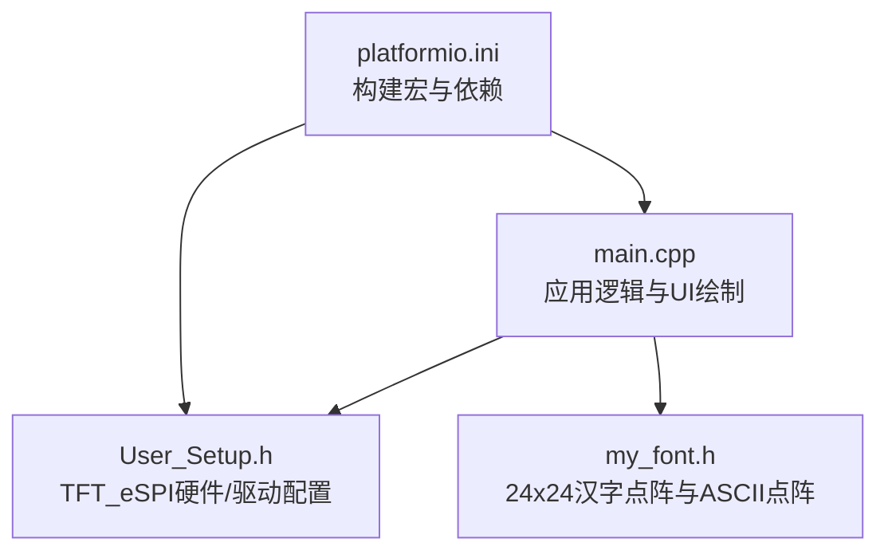
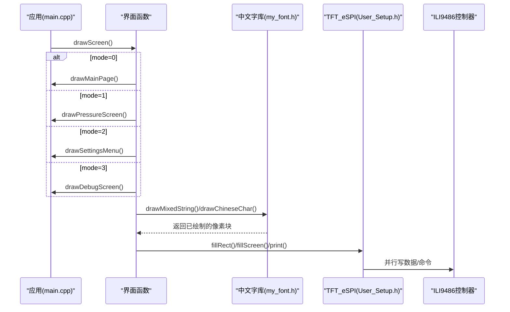
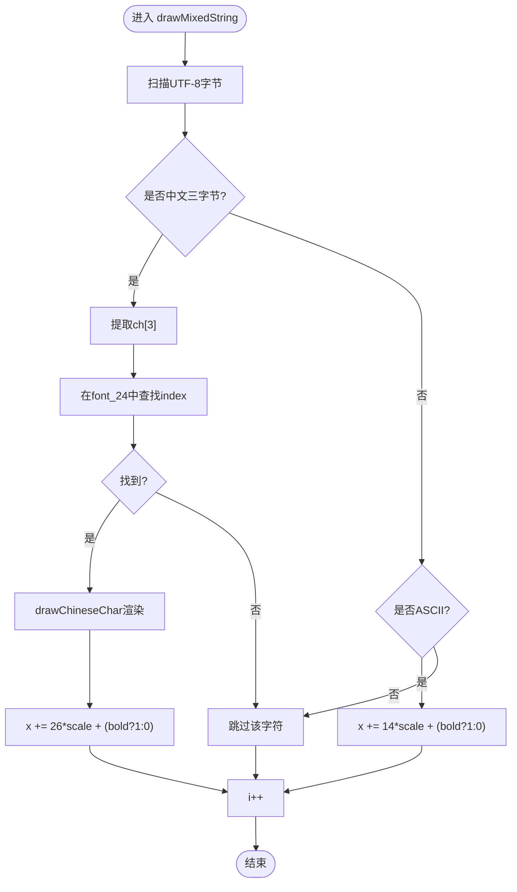
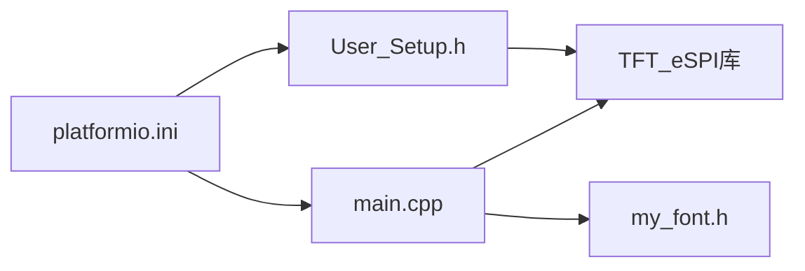

# 屏幕绘制系统

<cite>
**本文引用的文件**   
- [src/main.cpp](file://src/main.cpp)
- [include/User_Setup.h](file://include/User_Setup.h)
- [src/my_font.h](file://src/my_font.h)
- [platformio.ini](file://platformio.ini)
</cite>

## 目录
1. [简介](#简介)
2. [项目结构](#项目结构)
3. [核心组件](#核心组件)
4. [架构总览](#架构总览)
5. [详细组件分析](#详细组件分析)
6. [依赖关系分析](#依赖关系分析)
7. [性能与优化](#性能与优化)
8. [故障排查指南](#故障排查指南)
9. [结论](#结论)
10. [附录：常用API与示例路径](#附录常用api与示例路径)

## 简介
本文件系统性地梳理GD32F103RCT6正压防爆控制系统的屏幕绘制子系统，重点覆盖以下方面：
- TFT_eSPI库在GD32F103RCT6上的并行接口配置与横屏480x320显示设置
- 界面绘制函数：drawMainPage()主页、drawPressureScreen()正压启动、drawSettingsMenu()系统设置、drawDebugScreen()系统调试
- 中文字体绘制系统：drawChineseChar()与drawMixedString()的工作原理、16x16/24x24点阵字库存储格式与渲染算法
- 颜色配置、字体大小、文本对齐等显示特性
- 常见问题：屏幕刷新性能优化、中文显示乱码等

## 项目结构
本项目采用Arduino框架+PlatformIO构建，TFT_eSPI通过并行总线驱动ILI9486控制器，屏幕分辨率480x320横屏。核心源文件与配置文件如下：
- src/main.cpp：主程序、UI绘制函数、按键处理、ADC采样与显示调度
- include/User_Setup.h：TFT_eSPI用户配置（引脚、驱动、字体加载）
- src/my_font.h：自定义24x24汉字点阵字库与ASCII点阵定义
- platformio.ini：编译选项与宏定义（启用并行、字体、字符集等）

图表来源
- [src/main.cpp:1-20](file://src/main.cpp#L1-L20)
- [include/User_Setup.h:14-47](file://include/User_Setup.h#L14-L47)
- [src/my_font.h:1-16](file://src/my_font.h#L1-L16)
- [platformio.ini:9-47](file://platformio.ini#L9-L47)

章节来源
- [src/main.cpp:1-25](file://src/main.cpp#L1-L25)
- [include/User_Setup.h:14-74](file://include/User_Setup.h#L14-L74)
- [src/my_font.h:1-16](file://src/my_font.h#L1-L16)
- [platformio.ini:1-47](file://platformio.ini#L1-L47)

## 核心组件
- 显示初始化与旋转：tft.begin()后调用tft.setRotation(1)设置为横屏480x320
- 页面调度：drawScreen()根据mode切换不同界面绘制函数
- 界面绘制：
  - drawMainPage()：主页布局、标题、菜单按钮、警报提示
  - drawPressureScreen()：正压启动界面，倒计时、压力值、状态条、底部按钮
  - drawSettingsMenu()：系统设置菜单项高亮与导航按钮
  - drawDebugScreen()：调试信息展示与安全警告
- 中文混合字符串绘制：
  - drawChineseChar()：按24x24点阵逐像素填充矩形
  - drawMixedString()：UTF-8扫描，识别中文三字节序列与ASCII单字节，自动换行推进坐标
- 通用按钮绘制：drawBtn()计算位置并居中绘制中文标签
- 颜色与字体：使用TFT_eSPI内置颜色常量与setTextSize()/setCursor()/print()输出数字

章节来源
- [src/main.cpp:367-389](file://src/main.cpp#L367-L389)
- [src/main.cpp:305-310](file://src/main.cpp#L305-L310)
- [src/main.cpp:169-189](file://src/main.cpp#L169-L189)
- [src/main.cpp:192-253](file://src/main.cpp#L192-L253)
- [src/main.cpp:256-276](file://src/main.cpp#L256-L276)
- [src/main.cpp:279-302](file://src/main.cpp#L279-L302)
- [src/main.cpp:112-143](file://src/main.cpp#L112-L143)
- [src/main.cpp:159-166](file://src/main.cpp#L159-L166)

## 架构总览
下图展示了从应用层到TFT_eSPI驱动的调用链与数据流。

图表来源
- [src/main.cpp:305-310](file://src/main.cpp#L305-L310)
- [src/main.cpp:112-143](file://src/main.cpp#L112-L143)
- [include/User_Setup.h:30-47](file://include/User_Setup.h#L30-L47)

## 详细组件分析

### TFT_eSPI配置与横屏设置
- 并行接口与引脚映射：
  - 数据总线D0-D7接PB0-PB7，D8-D15在8位模式下保持低电平
  - 控制线：DC=PA2, CS=PA4, WR=PA5, RD=PA3, RST=PA1
- 驱动选择：ILI9486_DRIVER
- 字体加载：LOAD_GLCD/LOAD_FONT2/LOAD_FONT4/LOAD_FONT6/LOAD_FONT7/LOAD_FONT8/LOAD_GFXFF/SMOOTH_FONT
- 横屏设置：tft.setRotation(1)将屏幕方向设为横屏480x320

章节来源
- [include/User_Setup.h:23-47](file://include/User_Setup.h#L23-L47)
- [include/User_Setup.h:55-64](file://include/User_Setup.h#L55-L64)
- [src/main.cpp:369-370](file://src/main.cpp#L369-L370)
- [platformio.ini:15-47](file://platformio.ini#L15-L47)

### 界面绘制函数实现

#### drawMainPage() 主页布局
- 背景与边框：白色背景，顶部和底部蓝色细条装饰
- 标题与副标题：多行中文标题与服务电话、公司名
- 菜单按钮：三个按钮“正压启动”“系统设置”“系统调试”，使用drawBtn()居中绘制
- 全局警报：当globalAlarm为真时，左上角红色区域显示“警报”

章节来源
- [src/main.cpp:169-189](file://src/main.cpp#L169-L189)

#### drawPressureScreen() 正压启动界面
- 顶部状态行：运行中显示“进气”“排气”绿色标识
- 换气倒计时：动态数值显示，黄色大字号
- 柜内压力：实时压力值，白色大字号
- 压力状态条：根据sysParams阈值判断正常/预警/报警，对应不同颜色与文案
- 右上角警报/消音指示：闪烁效果
- 底部按钮：“取消警报”“返回主页”

章节来源
- [src/main.cpp:192-253](file://src/main.cpp#L192-L253)

#### drawSettingsMenu() 系统设置菜单
- 标题“系统设置”
- 四个菜单项：修改密码、校准传感器、设置参数、恢复出厂
- 选中项高亮：蓝色背景白字，未选中黑底白字
- 底部按钮：返回主页、下一选项、确认

章节来源
- [src/main.cpp:256-276](file://src/main.cpp#L256-L276)

#### drawDebugScreen() 系统调试界面
- 标题“系统调试”
- 送电状态指示：绿色小方块+“送电”
- 安全警告：红色大字警示
- 实时数据：压力与温度数值
- 底部按钮：返回主页、空占位、调试结束

章节来源
- [src/main.cpp:279-302](file://src/main.cpp#L279-L302)

### 中文字体绘制系统
- 数据结构：
  - CHINESE_24：包含索引字符串与72字节矩阵（24行×3字节/行）
  - ASCII_16：包含字符与16字节矩阵（8列×16行）
  - font_24[]： PROGMEM存储的汉字点阵数组
  - FONT_COUNT：字库数量
- 渲染算法：
  - drawChineseChar(ch, x, y, color, scale, bold)：
    - 遍历font_24查找匹配索引
    - 对每个像素位进行位运算检测是否点亮
    - 根据scale计算目标像素宽高，调用tft.fillRect填充
    - 可选bold模式偏移绘制以加粗
  - drawMixedString(str, x, y, color, scale, bold)：
    - UTF-8扫描：若首字节>=0xE0且后续两字节存在，则取三字节作为中文
    - 中文宽度步进约26*scale，ASCII步进约14*scale
    - 支持bold间距微调
- 存储格式说明：
  - 每行3字节，共24行；每字节8位，从左到右表示列像素
  - 位为1表示前景色，0表示背景色

图表来源
- [src/main.cpp:112-143](file://src/main.cpp#L112-L143)
- [src/my_font.h:7-16](file://src/my_font.h#L7-L16)
- [src/my_font.h:3556-3567](file://src/my_font.h#L3556-L3567)

章节来源
- [src/main.cpp:112-143](file://src/main.cpp#L112-L143)
- [src/my_font.h:1-16](file://src/my_font.h#L1-L16)
- [src/my_font.h:3556-3567](file://src/my_font.h#L3556-L3567)

### 颜色配置、字体大小与文本对齐
- 颜色：使用TFT_eSPI预定义颜色常量（如TFT_WHITE、TFT_BLUE、TFT_RED、TFT_CYAN、TFT_YELLOW、TFT_DARKGREY）
- 字体大小：通过tft.setTextSize(n)设置数字文本字号；中文通过scale参数缩放
- 文本对齐：
  - 数字文本：tft.setCursor(x,y)+print()实现左对齐
  - 中文文本：drawMixedString()内部按字符宽度累进，结合按钮居中计算实现近似居中

章节来源
- [src/main.cpp:204-215](file://src/main.cpp#L204-L215)
- [src/main.cpp:296-297](file://src/main.cpp#L296-L297)
- [src/main.cpp:159-166](file://src/main.cpp#L159-L166)

### 图形绘制操作示例路径
- 全屏填充：参考主页与调试页的fillScreen(TFT_BLACK/TFT_WHITE)
- 矩形绘制：按钮背景、状态条、边框装饰
- 文本输出：数字用tft.print()，中文用drawMixedString()
- 颜色切换：tft.setTextColor(fg,bg)

章节来源
- [src/main.cpp:169-189](file://src/main.cpp#L169-L189)
- [src/main.cpp:256-276](file://src/main.cpp#L256-L276)
- [src/main.cpp:279-302](file://src/main.cpp#L279-L302)

## 依赖关系分析
- main.cpp依赖：
  - TFT_eSPI库（并行接口、绘图API）
  - my_font.h（中文字库与ASCII点阵）
- User_Setup.h提供：
  - 并行接口宏、引脚映射、驱动选择、字体加载开关
- platformio.ini提供：
  - 构建宏（-DUSER_SETUP_LOADED、-DTFT_PARALLEL_8_BIT、-DSTM_PORTB_DATA_BUS、-DILI9486_DRIVER等）
  - 字符集编码（UTF-8输入与执行）

图表来源
- [src/main.cpp:10-13](file://src/main.cpp#L10-L13)
- [include/User_Setup.h:23-47](file://include/User_Setup.h#L23-L47)
- [platformio.ini:10-47](file://platformio.ini#L10-L47)

章节来源
- [src/main.cpp:10-13](file://src/main.cpp#L10-L13)
- [include/User_Setup.h:23-47](file://include/User_Setup.h#L23-L47)
- [platformio.ini:10-47](file://platformio.ini#L10-L47)

## 性能与优化
- 减少不必要的整屏刷新：仅在状态变化或定时更新时调用drawScreen()，避免每帧全量重绘
- 局部刷新：对于固定区域（如倒计时、压力值），可仅重绘对应矩形区域
- 批量绘制：合并相邻矩形绘制，减少函数调用开销
- 字库访问：font_24存储在PROGMEM，避免RAM占用；确保编译器优化开启
- 并行总线优化：STM_PORTB_DATA_BUS启用BSRR单次写入，提升写速度
- 定时器驱动：使用millis()非阻塞计时，保证UI响应与数据采集解耦

章节来源
- [src/main.cpp:392-433](file://src/main.cpp#L392-L433)
- [include/User_Setup.h:27-28](file://include/User_Setup.h#L27-L28)
- [src/my_font.h:18](file://src/my_font.h#L18)

## 故障排查指南
- 中文显示乱码
  - 检查源文件与编译器字符集：platformio.ini需启用UTF-8输入与执行字符集
  - 确认UTF-8编码保存源文件，避免GBK/ANSI导致三字节序列错误
  - 验证drawMixedString()的UTF-8扫描条件与步长是否正确
- 屏幕无显示或花屏
  - 核对User_Setup.h中的驱动选择（ILI9486_DRIVER）与引脚映射
  - 确认platformio.ini宏定义与User_Setup一致（并行、端口、驱动）
  - 检查硬件连线：PB0-PB15数据总线、PA1/PA2/PA3/PA4/PA5控制线
- 刷新卡顿
  - 减少drawScreen()调用频率，仅在必要时刷新
  - 使用局部刷新替代整屏填充
  - 降低中文scale或禁用bold以减少fillRect调用次数
- 警报闪烁异常
  - 检查blinkTimer与blinkOn逻辑，确保500ms周期翻转
  - 避免在高频循环中重复绘制相同内容

章节来源
- [platformio.ini:11-12](file://platformio.ini#L11-L12)
- [include/User_Setup.h:30-47](file://include/User_Setup.h#L30-L47)
- [src/main.cpp:392-433](file://src/main.cpp#L392-L433)

## 结论
本屏幕绘制系统基于TFT_eSPI并行接口与ILI9486控制器，实现了480x320横屏的多界面UI。通过自定义24x24点阵字库与UTF-8混合字符串解析，系统在嵌入式资源受限环境下提供了稳定的中文显示能力。配合合理的刷新策略与局部更新，可在保证交互响应的同时获得较好的视觉体验。建议后续扩展更多界面元素与动画效果，并引入更完善的参数编辑与持久化机制。

## 附录：常用API与示例路径
- 屏幕初始化与横屏设置
  - tft.begin(); tft.setRotation(1);
  - 参考路径：[src/main.cpp:367-370](file://src/main.cpp#L367-L370)
- 页面调度
  - drawScreen()
  - 参考路径：[src/main.cpp:305-310](file://src/main.cpp#L305-L310)
- 主页绘制
  - drawMainPage()
  - 参考路径：[src/main.cpp:169-189](file://src/main.cpp#L169-L189)
- 正压启动绘制
  - drawPressureScreen()
  - 参考路径：[src/main.cpp:192-253](file://src/main.cpp#L192-L253)
- 系统设置绘制
  - drawSettingsMenu()
  - 参考路径：[src/main.cpp:256-276](file://src/main.cpp#L256-L276)
- 系统调试绘制
  - drawDebugScreen()
  - 参考路径：[src/main.cpp:279-302](file://src/main.cpp#L279-L302)
- 中文绘制
  - drawChineseChar(), drawMixedString()
  - 参考路径：[src/main.cpp:112-143](file://src/main.cpp#L112-L143)
- 按钮绘制
  - drawBtn()
  - 参考路径：[src/main.cpp:159-166](file://src/main.cpp#L159-L166)
- 颜色与字体
  - tft.setTextColor(), tft.setTextSize(), tft.setCursor(), tft.print()
  - 参考路径：[src/main.cpp:204-215](file://src/main.cpp#L204-L215), [src/main.cpp:296-297](file://src/main.cpp#L296-L297)
- 字库结构
  - CHINESE_24, ASCII_16, font_24[], FONT_COUNT
  - 参考路径：[src/my_font.h:7-16](file://src/my_font.h#L7-L16), [src/my_font.h:3556-3567](file://src/my_font.h#L3556-L3567)
- 并行接口配置
  - ILI9486_DRIVER, STM_PORTB_DATA_BUS, 引脚映射
  - 参考路径：[include/User_Setup.h:23-47](file://include/User_Setup.h#L23-L47)
- 构建宏
  - -DUSER_SETUP_LOADED, -DTFT_PARALLEL_8_BIT, -DSTM_PORTB_DATA_BUS, -DILI9486_DRIVER, UTF-8字符集
  - 参考路径：[platformio.ini:10-47](file://platformio.ini#L10-L47)