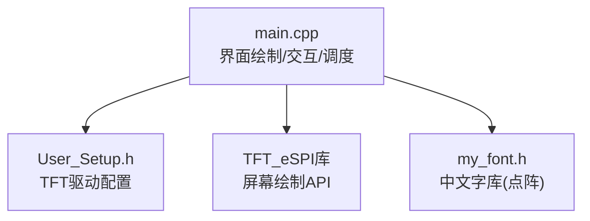
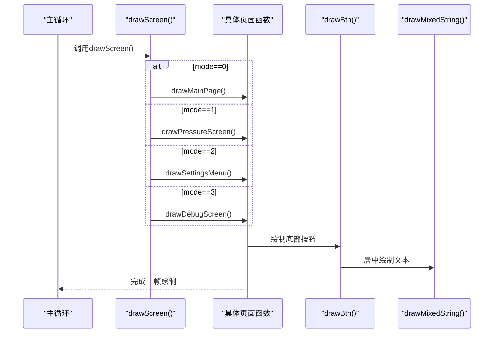
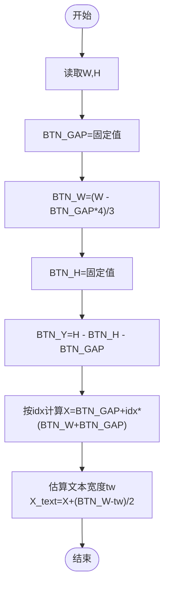
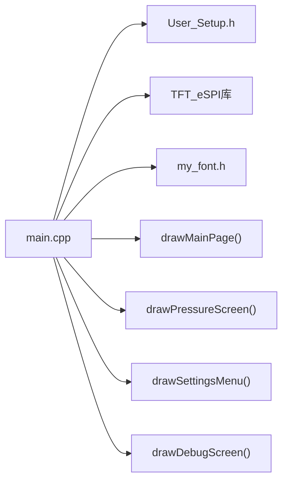

# 界面布局设计

<cite>
**本文引用的文件**   
- [src/main.cpp](file://src/main.cpp)
- [include/User_Setup.h](file://include/User_Setup.h)
</cite>

## 目录
1. [简介](#简介)
2. [项目结构](#项目结构)
3. [核心组件](#核心组件)
4. [架构总览](#架构总览)
5. [详细组件分析](#详细组件分析)
6. [依赖关系分析](#依赖关系分析)
7. [性能与渲染特性](#性能与渲染特性)
8. [常见问题与排障](#常见问题与排障)
9. [结论](#结论)
10. [附录：新增界面布局规范](#附录新增界面布局规范)

## 简介
本文件面向GD32F103RCT6正压防爆控制系统的嵌入式UI，聚焦于480x320横屏的界面布局设计与实现。文档围绕四个主要界面展开：drawMainPage()主页、drawPressureScreen()正压启动界面、drawSettingsMenu()系统设置菜单、drawDebugScreen()系统调试界面。重点说明通用布局常量（BTN_GAP、BTN_W、BTN_H、BTN_Y）的设计与计算公式，响应式适配480x320的实现方法，元素对齐算法、间距计算与视觉层次原则，并提供创建新界面的可操作规范与示例路径，帮助初学者快速上手，同时为有经验的开发者提供完整的界面开发规范。

## 项目结构
本项目采用单文件主程序+驱动配置头文件的组织方式：
- src/main.cpp：包含所有UI绘制函数、按键处理、状态机调度、ADC采集与显示刷新逻辑。
- include/User_Setup.h：TFT_eSPI驱动的硬件引脚与接口模式配置，定义并行总线、控制器型号等。



图表来源
- [src/main.cpp:1-20](file://src/main.cpp#L1-L20)
- [include/User_Setup.h:14-47](file://include/User_Setup.h#L14-L47)

章节来源
- [src/main.cpp:1-20](file://src/main.cpp#L1-L20)
- [include/User_Setup.h:14-47](file://include/User_Setup.h#L14-L47)

## 核心组件
- 屏幕参数与分辨率
  - W=480, H=320，横屏旋转后使用。
- 通用布局常量
  - BTN_GAP：按钮水平间距
  - BTN_W：单个按钮宽度，按三列均分并扣除两侧边距与间隙
  - BTN_H：按钮高度
  - BTN_Y：按钮Y坐标，位于屏幕底部留白区域上方
- 通用按钮绘制
  - drawBtn(idx, label, color)：根据idx计算X坐标，填充矩形背景，并在按钮内居中绘制混合字符串（中文+数字）。
- 页面调度器
  - drawScreen()：根据mode分发到具体页面绘制函数。

章节来源
- [src/main.cpp:22-24](file://src/main.cpp#L22-L24)
- [src/main.cpp:68-72](file://src/main.cpp#L68-L72)
- [src/main.cpp:158-166](file://src/main.cpp#L158-L166)
- [src/main.cpp:304-310](file://src/main.cpp#L304-L310)

## 架构总览
整体UI架构遵循“状态机+页面绘制”的模式：
- 状态变量mode决定当前页面
- 每帧或事件触发时调用drawScreen()进行重绘
- 各页面函数负责自身区域的绘制与状态指示
- 通用按钮与字体绘制工具被多页面复用



图表来源
- [src/main.cpp:304-310](file://src/main.cpp#L304-L310)
- [src/main.cpp:158-166](file://src/main.cpp#L158-L166)

## 详细组件分析

### 通用布局常量与响应式适配
- 分辨率基准
  - W=480, H=320，横屏方向。
- 常量定义与公式
  - BTN_GAP：固定像素间距，用于按钮之间的间隔以及左右边距预留。
  - BTN_W：((W - BTN_GAP * 4) / 3)。含义：在屏幕宽度W上，预留左右各一个BTN_GAP，再在三个按钮之间插入两个BTN_GAP，共4个间隙；剩余宽度三等分得到每个按钮宽度。
  - BTN_H：固定按钮高度，保证触控区域足够大且视觉统一。
  - BTN_Y：(H - BTN_H - BTN_GAP)。将按钮行固定在屏幕底部，距离底边一个BTN_GAP的留白。
- 响应式适配要点
  - 通过宏与表达式基于W/H动态计算BTN_W与BTN_Y，当分辨率变化时只需修改W/H即可自动适配。
  - 按钮X坐标由BTN_GAP + idx*(BTN_W + BTN_GAP)线性分布，确保三列均匀排列。
  - 文本居中策略：估算字符宽度tw，使用(x + (BTN_W - tw)/2)实现近似水平居中。



图表来源
- [src/main.cpp:22-24](file://src/main.cpp#L22-L24)
- [src/main.cpp:68-72](file://src/main.cpp#L68-L72)
- [src/main.cpp:158-166](file://src/main.cpp#L158-L166)

章节来源
- [src/main.cpp:22-24](file://src/main.cpp#L22-L24)
- [src/main.cpp:68-72](file://src/main.cpp#L68-L72)
- [src/main.cpp:158-166](file://src/main.cpp#L158-L166)

### 主页 drawMainPage()
- 布局架构
  - 顶部蓝色细条装饰线
  - 欢迎标题与联系方式信息区
  - 三按钮横向排列：正压启动、系统设置、系统调试
  - 全局警报提示（左上角红色标签）
- 对齐与层次
  - 标题字号较大，形成视觉焦点
  - 按钮行位于底部，符合用户操作习惯
  - 警报标签独立于按钮行，避免遮挡
- 关键实现位置
  - 页面绘制与按钮调用

章节来源
- [src/main.cpp:168-189](file://src/main.cpp#L168-L189)
- [src/main.cpp:158-166](file://src/main.cpp#L158-L166)

### 正压启动界面 drawPressureScreen()
- 布局架构
  - 顶部状态指示：进气/排气状态
  - 数据展示：换气倒计时、柜内压力
  - 压力状态条：根据阈值判断颜色与文案
  - 右上角警报/消音状态闪烁提示
  - 底部双按钮：取消警报、返回主页
- 数据处理与状态
  - 压力值来自ADC采样与校准计算
  - 倒计时递减更新，每秒刷新一次
  - 全局警报标志影响按钮颜色与右上角提示
- 关键实现位置
  - 数据展示与状态条绘制
  - 底部双按钮布局（非通用三列，单独计算宽度）

章节来源
- [src/main.cpp:191-253](file://src/main.cpp#L191-L253)
- [src/main.cpp:145-156](file://src/main.cpp#L145-L156)

### 系统设置菜单 drawSettingsMenu()
- 布局架构
  - 标题“系统设置”
  - 列表项：修改密码、校准传感器、设置参数、恢复出厂
  - 选中项高亮（蓝色背景），未选中项黑色背景
  - 底部三按钮：返回主页、下一选项、确认
- 交互逻辑
  - KEY2切换选中项，循环滚动
  - 底部按钮用于导航与确认
- 关键实现位置
  - 列表项绘制与高亮
  - 通用按钮复用

章节来源
- [src/main.cpp:255-276](file://src/main.cpp#L255-L276)
- [src/main.cpp:158-166](file://src/main.cpp#L158-L166)

### 系统调试界面 drawDebugScreen()
- 布局架构
  - 标题“系统调试”
  - 送电状态指示（右上角绿色标签）
  - 警告提示：危险区域严禁在现场使用
  - 实时数据：压力与温度
  - 底部三按钮：返回主页、空占位、调试结束
- 关键实现位置
  - 警告与实时数据展示
  - 通用按钮复用

章节来源
- [src/main.cpp:278-302](file://src/main.cpp#L278-L302)
- [src/main.cpp:158-166](file://src/main.cpp#L158-L166)

### 页面调度与交互流程
- 调度器drawScreen()根据mode分发到对应页面
- processKeys()处理按键去抖与短按逻辑，更新mode或状态并触发重绘
- 正压模式下每秒更新倒计时与压力，并刷新显示

```mermaid
sequenceDiagram
participant Loop as "loop()"
participant Keys as "processKeys()"
participant Draw as "drawScreen()"
participant Mode as "mode"
participant Press as "drawPressureScreen()"
Loop->>Keys : 读取按键并去抖
Keys->>Mode : 更新mode或状态
Keys->>Draw : 请求重绘
Draw->>Press : 若mode==1则进入正压界面
Press-->>Loop : 完成绘制
```

图表来源
- [src/main.cpp:304-310](file://src/main.cpp#L304-L310)
- [src/main.cpp:312-364](file://src/main.cpp#L312-L364)
- [src/main.cpp:392-433](file://src/main.cpp#L392-L433)

章节来源
- [src/main.cpp:304-310](file://src/main.cpp#L304-L310)
- [src/main.cpp:312-364](file://src/main.cpp#L312-L364)
- [src/main.cpp:392-433](file://src/main.cpp#L392-L433)

## 依赖关系分析
- main.cpp依赖TFT_eSPI库进行屏幕绘制，依赖User_Setup.h中的硬件配置（并行总线、引脚映射、控制器型号）。
- 中文字体绘制依赖my_font.h的点阵字库。
- 页面绘制函数相互独立，通过drawScreen()集中调度，耦合度低，便于扩展。



图表来源
- [src/main.cpp:1-20](file://src/main.cpp#L1-L20)
- [include/User_Setup.h:14-47](file://include/User_Setup.h#L14-L47)

章节来源
- [src/main.cpp:1-20](file://src/main.cpp#L1-L20)
- [include/User_Setup.h:14-47](file://include/User_Setup.h#L14-L47)

## 性能与渲染特性
- 刷新频率
  - 正压模式下每秒更新一次倒计时与压力，并调用drawScreen()全量刷新。
- 闪烁优化
  - 警报状态使用blinkOn标志与定时器，仅局部重绘警报标签，减少全屏刷新开销。
- 文本绘制
  - 混合字符串绘制对中英文分别估算宽度，避免复杂字体度量带来的性能损耗。
- 建议
  - 对于高频更新的数据区域，可采用局部擦除与增量绘制，降低全屏fillScreen开销。
  - 合理设置delay与任务优先级，避免阻塞ADC采样与按键扫描。

章节来源
- [src/main.cpp:392-433](file://src/main.cpp#L392-L433)
- [src/main.cpp:131-143](file://src/main.cpp#L131-L143)

## 常见问题与排障
- 界面适配问题
  - 现象：按钮重叠或超出屏幕
  - 排查：检查W/H是否正确设置为480x320；确认BTN_GAP与BTN_W公式未被覆盖；验证tft.setRotation(1)已生效。
- 元素重叠
  - 现象：警报标签与按钮行重叠
  - 排查：确认警报标签Y坐标与BTN_Y的关系；调整警报标签尺寸或位置。
- 触控区域不足
  - 现象：按钮难以点击
  - 排查：增大BTN_H；确保BTN_GAP不过小；必要时增加按钮内部空白区域。
- 文本居中偏差
  - 现象：中文文本未完全居中
  - 排查：估算宽度tw的系数需与实际字库匹配；可引入更精确的字宽表或测量函数。
- 刷新闪烁严重
  - 现象：频繁全屏刷新导致闪烁
  - 排查：仅在必要区域重绘；利用blinkOn局部刷新；减少不必要的fillScreen。

章节来源
- [src/main.cpp:22-24](file://src/main.cpp#L22-L24)
- [src/main.cpp:68-72](file://src/main.cpp#L68-L72)
- [src/main.cpp:158-166](file://src/main.cpp#L158-L166)
- [src/main.cpp:366-389](file://src/main.cpp#L366-L389)

## 结论
本UI采用简洁的状态机与页面绘制模式，配合通用布局常量与统一的按钮绘制工具，实现了四页布局的一致性与可扩展性。通过基于W/H的动态计算，系统在480x320分辨率下具备良好的响应式适配能力。建议在后续迭代中引入更精确的字宽测量与局部刷新策略，以进一步提升性能与用户体验。

## 附录：新增界面布局规范
- 新建页面步骤
  - 在main.cpp中新增页面绘制函数，如drawNewPage()，遵循以下约定：
    - 使用tft.fillScreen()清屏
    - 使用drawMixedString()绘制标题与内容
    - 使用drawBtn()绘制底部通用按钮（如需两列或特殊布局，参考drawPressureScreen()的双按钮实现）
    - 在drawScreen()中添加mode分支，跳转到新页面
  - 在processKeys()中为新页面添加按键跳转逻辑
- 布局常量使用
  - 优先复用BTN_GAP、BTN_W、BTN_H、BTN_Y，保持视觉一致性
  - 如需自定义按钮宽度，参考双按钮布局的计算方式
- 对齐与间距
  - 文本居中：估算文本宽度tw，使用(x + (BTN_W - tw)/2)定位
  - 垂直层次：标题在上、数据在中、按钮在下，避免重叠
- 示例路径
  - 通用按钮绘制：[src/main.cpp:158-166](file://src/main.cpp#L158-L166)
  - 三列按钮主页：[src/main.cpp:168-189](file://src/main.cpp#L168-L189)
  - 双按钮正压界面：[src/main.cpp:247-253](file://src/main.cpp#L247-L253)
  - 列表选择设置菜单：[src/main.cpp:255-276](file://src/main.cpp#L255-L276)
  - 调试界面数据展示：[src/main.cpp:278-302](file://src/main.cpp#L278-L302)
  - 页面调度器：[src/main.cpp:304-310](file://src/main.cpp#L304-L310)
  - 按键处理与模式切换：[src/main.cpp:312-364](file://src/main.cpp#L312-L364)

章节来源
- [src/main.cpp:158-166](file://src/main.cpp#L158-L166)
- [src/main.cpp:168-189](file://src/main.cpp#L168-L189)
- [src/main.cpp:247-253](file://src/main.cpp#L247-L253)
- [src/main.cpp:255-276](file://src/main.cpp#L255-L276)
- [src/main.cpp:278-302](file://src/main.cpp#L278-L302)
- [src/main.cpp:304-310](file://src/main.cpp#L304-L310)
- [src/main.cpp:312-364](file://src/main.cpp#L312-L364)