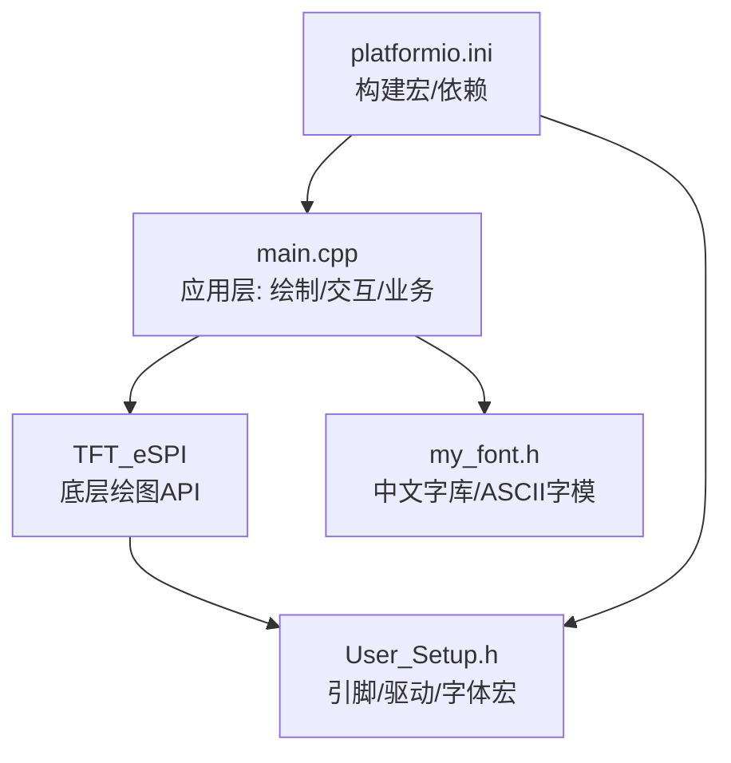
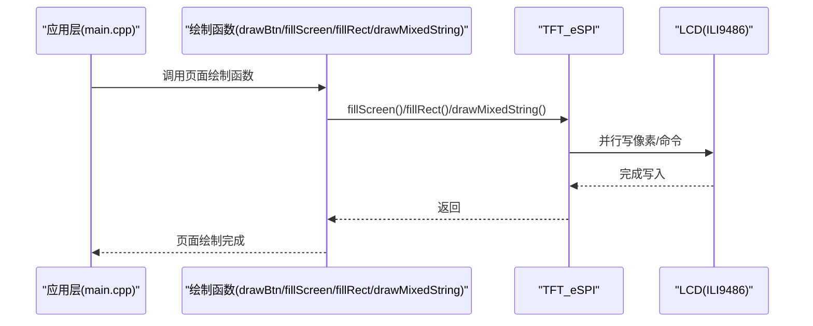
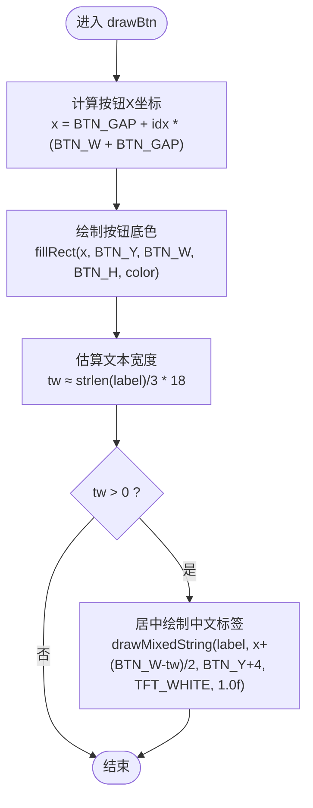
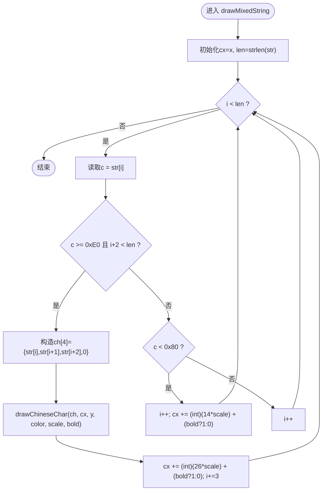
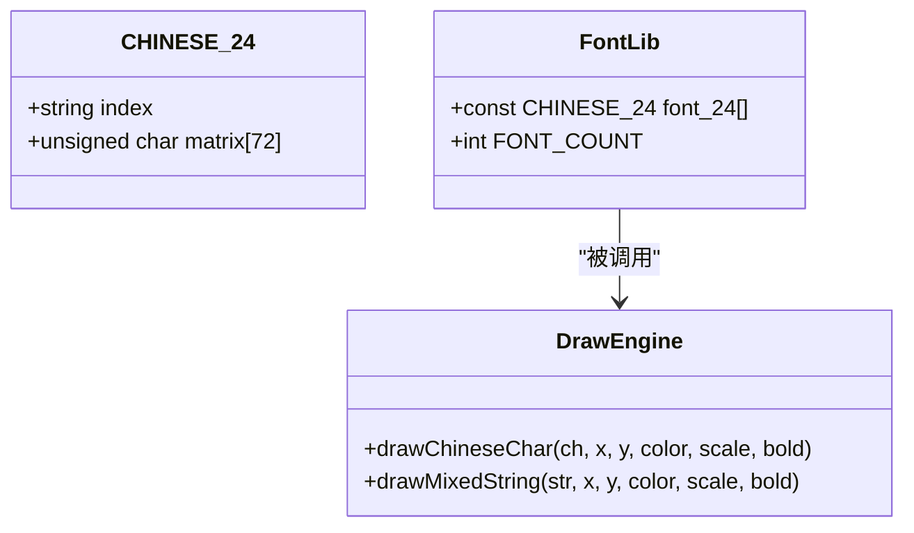
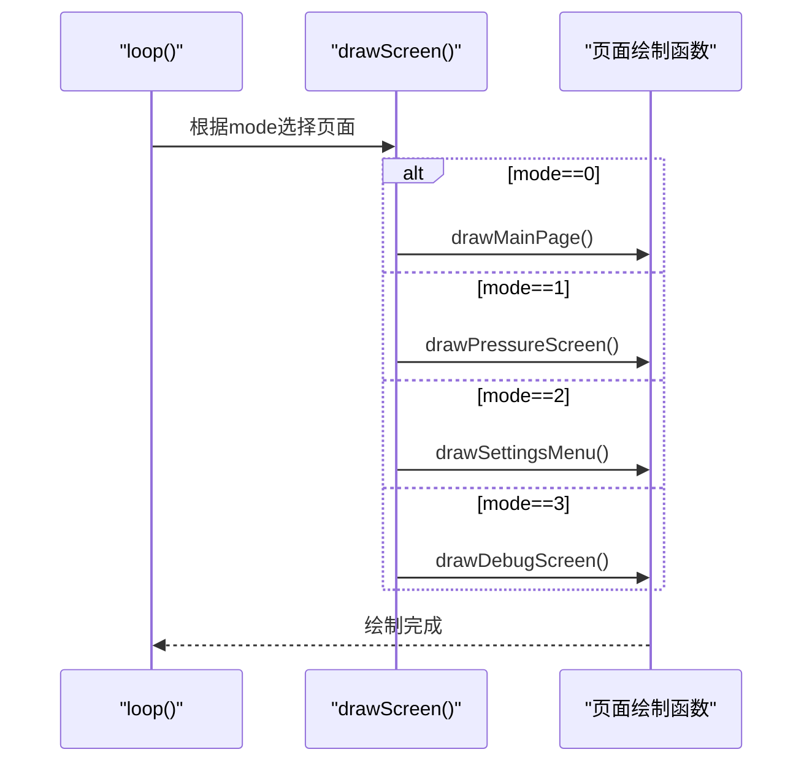
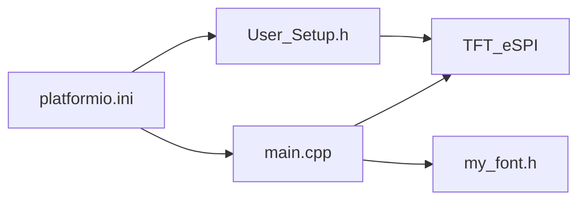

# 绘制函数库

<cite>
**本文引用的文件**   
- [src/main.cpp](file://src/main.cpp)
- [src/my_font.h](file://src/my_font.h)
- [include/User_Setup.h](file://include/User_Setup.h)
- [platformio.ini](file://platformio.ini)
</cite>

## 目录
1. [简介](#简介)
2. [项目结构](#项目结构)
3. [核心组件](#核心组件)
4. [架构总览](#架构总览)
5. [详细组件分析](#详细组件分析)
6. [依赖关系分析](#依赖关系分析)
7. [性能与内存优化](#性能与内存优化)
8. [故障排查指南](#故障排查指南)
9. [结论](#结论)
10. [附录：示例用法路径](#附录示例用法路径)

## 简介
本文件面向GD32F103RCT6正压防爆控制系统的图形绘制库，聚焦以下目标：
- 深入解释所有图形绘制函数的实现原理与使用方式，包括按钮绘制、全屏填充、矩形绘制、混合字符串绘制等。
- 说明颜色系统的使用（预定义颜色常量与自定义颜色值）。
- 记录文本对齐算法、字体大小缩放和粗体显示的实现原理。
- 提供具体代码示例的“路径引用”，便于快速定位到实际实现位置。
- 给出绘制性能优化与内存使用的建议，帮助初学者入门嵌入式图形绘制，同时为有经验的开发者提供UI组件开发指南。

## 项目结构
本项目基于Arduino框架与TFT_eSPI库，采用并行8位总线驱动ILI9486控制器，屏幕分辨率为480x320横屏。主要源文件与配置如下：
- src/main.cpp：主程序，包含绘制函数、界面调度、按键处理、ADC采集与状态逻辑。
- src/my_font.h：中文字库与ASCII字模数据结构，以及汉字数量宏定义。
- include/User_Setup.h：TFT_eSPI用户配置，定义引脚映射、接口模式、字体加载选项等。
- platformio.ini：构建配置，启用并行总线、字体加载宏及字符集设置。

图表来源
- [src/main.cpp:1-20](file://src/main.cpp#L1-L20)
- [include/User_Setup.h:14-47](file://include/User_Setup.h#L14-L47)
- [platformio.ini:1-47](file://platformio.ini#L1-L47)

章节来源
- [src/main.cpp:1-25](file://src/main.cpp#L1-L25)
- [include/User_Setup.h:14-73](file://include/User_Setup.h#L14-L73)
- [platformio.ini:1-47](file://platformio.ini#L1-L47)

## 核心组件
- 绘制函数库
  - drawBtn()：动态布局的菜单按钮绘制，支持颜色配置与中文标签居中。
  - fillScreen()：全屏填充，用于界面切换时的背景清空。
  - fillRect()：矩形绘制，用于状态指示条、背景色块、按钮底色等。
  - drawMixedString()：中英文混排绘制，支持缩放与粗体。
- 字体与文本
  - drawChineseChar()：24x24点阵汉字绘制，支持缩放与粗体叠加。
  - my_font.h：CHINESE_24与ASCII_16字模结构，以及FONT_COUNT计数宏。
- 颜色系统
  - 使用TFT_eSPI提供的预定义颜色常量（如TFT_WHITE、TFT_BLUE、TFT_RED等），也支持自定义16位颜色值。
- 界面调度
  - drawScreen()：根据当前mode调用对应页面绘制函数。

章节来源
- [src/main.cpp:111-166](file://src/main.cpp#L111-L166)
- [src/main.cpp:168-310](file://src/main.cpp#L168-L310)
- [src/my_font.h:7-16](file://src/my_font.h#L7-L16)
- [src/my_font.h:3556-3566](file://src/my_font.h#L3556-L3566)

## 架构总览
整体架构由应用层（main.cpp）通过TFT_eSPI驱动硬件屏幕，结合自定义字库完成UI绘制；User_Setup.h与platformio.ini负责硬件与编译期配置。

图表来源
- [src/main.cpp:168-310](file://src/main.cpp#L168-L310)
- [include/User_Setup.h:30-47](file://include/User_Setup.h#L30-L47)

## 详细组件分析

### 颜色系统
- 预定义颜色常量
  - 项目中广泛使用TFT_eSPI的颜色常量，例如：TFT_WHITE、TFT_BLUE、TFT_RED、TFT_GREEN、TFT_YELLOW、TFT_CYAN、TFT_BLACK、TFT_DARKGREY等。这些常量在TFT_eSPI库中定义，适用于16位RGB565格式。
- 自定义颜色值
  - 可通过16位颜色值直接传入fillRect或fillScreen，以实现更丰富的配色方案。
- 使用场景
  - 背景填充：fillScreen(TFT_WHITE/TFT_BLACK)
  - 状态条：fillRect(..., statusColor)
  - 按钮底色：drawBtn(..., color)
  - 文本前景/背景：tft.setTextColor(TFT_YELLOW, TFT_BLACK)

章节来源
- [src/main.cpp:169-188](file://src/main.cpp#L169-L188)
- [src/main.cpp:192-253](file://src/main.cpp#L192-L253)
- [src/main.cpp:256-302](file://src/main.cpp#L256-L302)

### 全屏填充 fillScreen()
- 功能：用指定颜色填充整个屏幕，常用于界面切换时快速清屏。
- 典型用法：
  - 主页：白色背景
  - 其他页面：黑色背景
- 性能提示：
  - 全屏填充会触发大量像素写入，建议在必要时才调用，避免频繁刷新导致闪烁。

章节来源
- [src/main.cpp:169-172](file://src/main.cpp#L169-L172)
- [src/main.cpp:192-193](file://src/main.cpp#L192-L193)
- [src/main.cpp:256-257](file://src/main.cpp#L256-L257)
- [src/main.cpp:279-280](file://src/main.cpp#L279-L280)

### 矩形绘制 fillRect()
- 功能：绘制实心矩形，用于背景色块、状态指示条、按钮底色等。
- 典型用法：
  - 顶部/底部装饰条
  - 压力状态条（绿/黄/红）
  - 警报/消音状态指示灯
- 参数要点：
  - x,y,width,height,color
  - 注意边界检查，避免越界写入。

章节来源
- [src/main.cpp:170-172](file://src/main.cpp#L170-L172)
- [src/main.cpp:228-229](file://src/main.cpp#L228-L229)
- [src/main.cpp:237-245](file://src/main.cpp#L237-L245)
- [src/main.cpp:248-252](file://src/main.cpp#L248-L252)

### 按钮绘制 drawBtn()
- 功能：根据索引idx计算水平位置，绘制统一尺寸的按钮，并在内部居中显示中文标签。
- 动态布局：
  - BTN_GAP、BTN_W、BTN_H、BTN_Y等宏定义控制间距与尺寸，适配480宽度的三列布局。
- 文本居中：
  - 通过估算中文宽度（按字节数近似）计算文本区域宽度，再计算起始坐标实现视觉居中。
- 颜色配置：
  - 支持传入不同颜色以区分激活态与非激活态。

图表来源
- [src/main.cpp:158-166](file://src/main.cpp#L158-L166)

章节来源
- [src/main.cpp:68-72](file://src/main.cpp#L68-L72)
- [src/main.cpp:158-166](file://src/main.cpp#L158-L166)
- [src/main.cpp:179-182](file://src/main.cpp#L179-L182)
- [src/main.cpp:273-276](file://src/main.cpp#L273-L276)

### 混合字符串绘制 drawMixedString()
- 功能：支持中英文混排，自动识别UTF-8编码的汉字并调用汉字绘制函数，英文字符则按ASCII宽度推进。
- 文本对齐算法：
  - 逐字符扫描，遇到UTF-8首字节≥0xE0且后续存在两字节时，视为一个汉字，调用drawChineseChar绘制，并按汉字宽度步进。
  - ASCII字符按固定宽度步进，考虑bold加粗时的额外偏移。
- 字体大小缩放：
  - scale参数控制每个像素点的缩放比例，最终通过fillRect绘制缩放后的像素块。
- 粗体显示：
  - bold=true时，对每个像素块再次绘制一次偏移1像素的同色块，形成加粗效果。

图表来源
- [src/main.cpp:131-143](file://src/main.cpp#L131-L143)

章节来源
- [src/main.cpp:131-143](file://src/main.cpp#L131-L143)
- [src/main.cpp:174-177](file://src/main.cpp#L174-L177)
- [src/main.cpp:195-198](file://src/main.cpp#L195-L198)
- [src/main.cpp:201-207](file://src/main.cpp#L201-L207)
- [src/main.cpp:209-215](file://src/main.cpp#L209-L215)
- [src/main.cpp:228-229](file://src/main.cpp#L228-L229)
- [src/main.cpp:237-245](file://src/main.cpp#L237-L245)
- [src/main.cpp:257-271](file://src/main.cpp#L257-L271)
- [src/main.cpp:280-297](file://src/main.cpp#L280-L297)

### 汉字绘制 drawChineseChar()
- 功能：从字库查找匹配汉字，逐行逐列解析点阵数据，按scale绘制像素块；若bold开启，进行二次偏移绘制实现加粗。
- 数据结构：
  - CHINESE_24：包含index与matrix（24行×3字节），每行3字节表示24个像素位。
- 复杂度：
  - 时间复杂度：O(N×M)，N=24行，M=24列；每次绘制最多遍历24×24像素。
  - 空间复杂度：常数级，仅使用局部变量。
- 缩放与加粗：
  - px/py/pw/ph按scale计算，确保最小宽高为1；bold时在偏移1像素处再次绘制同色块。

图表来源
- [src/my_font.h:7-16](file://src/my_font.h#L7-L16)
- [src/my_font.h:3556-3566](file://src/my_font.h#L3556-L3566)
- [src/main.cpp:112-130](file://src/main.cpp#L112-L130)

章节来源
- [src/main.cpp:112-130](file://src/main.cpp#L112-L130)
- [src/my_font.h:7-16](file://src/my_font.h#L7-L16)
- [src/my_font.h:3556-3566](file://src/my_font.h#L3556-L3566)

### 界面调度与页面绘制
- drawScreen()：根据mode分发到主页、正压启动、系统设置、系统调试四个页面绘制函数。
- 各页面绘制函数：
  - drawMainPage()：标题、服务电话、公司名、菜单按钮、全局警报提示。
  - drawPressureScreen()：倒计时、压力值、状态条、按钮区。
  - drawSettingsMenu()：菜单项列表、选中高亮、底部操作按钮。
  - drawDebugScreen()：实时压力温度、警告信息、送电状态。

图表来源
- [src/main.cpp:304-310](file://src/main.cpp#L304-L310)
- [src/main.cpp:168-310](file://src/main.cpp#L168-L310)

章节来源
- [src/main.cpp:304-310](file://src/main.cpp#L304-L310)
- [src/main.cpp:168-310](file://src/main.cpp#L168-L310)

## 依赖关系分析
- 外部依赖
  - TFT_eSPI：提供fillScreen、fillRect、setTextColor、setCursor、print等基础绘图API。
  - Arduino框架：提供digitalRead、pinMode、delay、millis等基础IO与时序API。
- 内部依赖
  - main.cpp依赖my_font.h中的字库结构与FONT_COUNT宏。
  - User_Setup.h与platformio.ini共同决定并行总线、驱动芯片、字体加载宏。

图表来源
- [src/main.cpp:10-13](file://src/main.cpp#L10-L13)
- [include/User_Setup.h:14-47](file://include/User_Setup.h#L14-L47)
- [platformio.ini:1-47](file://platformio.ini#L1-L47)

章节来源
- [src/main.cpp:10-13](file://src/main.cpp#L10-L13)
- [include/User_Setup.h:14-73](file://include/User_Setup.h#L14-L73)
- [platformio.ini:1-47](file://platformio.ini#L1-L47)

## 性能与内存优化
- 减少全屏刷新
  - 仅在必要场景调用fillScreen，优先使用局部fillRect更新变化区域，降低带宽占用与闪烁。
- 批量绘制优化
  - 将相邻同色像素合并为更大矩形，减少fillRect调用次数。
- 文本绘制优化
  - 避免频繁改变字体大小与颜色，尽量复用已设置的text属性。
  - 对于静态文本，可缓存其像素缓冲区（需权衡RAM占用）。
- 缩放与粗体开销
  - scale越大，像素块越多；bold会重复绘制，增加填充次数。建议合理设置scale与仅在需要时启用bold。
- 字库访问
  - 字库位于FLASH，查找汉字使用线性搜索，可在高频字符上建立索引表加速。
- 并行总线优势
  - 使用STM_PORTB_DATA_BUS与BSRR单周期写，提升像素写入效率。

[本节为通用指导，不直接分析具体文件，故无章节来源]

## 故障排查指南
- 屏幕无显示或花屏
  - 检查User_Setup.h与platformio.ini中的引脚定义是否与实际硬件一致。
  - 确认驱动芯片宏（ILI9486_DRIVER）与硬件匹配。
- 中文乱码或无法显示
  - 确认源文件字符集设置为UTF-8（platformio.ini中-finput-charset=UTF-8）。
  - 检查drawMixedString的UTF-8判断条件与汉字长度步进是否正确。
- 文本错位或重叠
  - 调整drawMixedString中的宽度步进（汉字与ASCII宽度），考虑bold偏移。
- 按钮布局异常
  - 检查BTN_GAP、BTN_W、BTN_H、BTN_Y宏是否与屏幕分辨率适配。
- 性能卡顿
  - 减少fillScreen调用频率，改用局部刷新；降低scale与禁用不必要的bold。

章节来源
- [include/User_Setup.h:14-47](file://include/User_Setup.h#L14-L47)
- [platformio.ini:10-17](file://platformio.ini#L10-L17)
- [src/main.cpp:131-143](file://src/main.cpp#L131-L143)
- [src/main.cpp:68-72](file://src/main.cpp#L68-L72)

## 结论
本绘制函数库围绕TFT_eSPI与自定义字库，提供了完整的UI绘制能力：按钮绘制、全屏填充、矩形绘制、中英文混排、缩放与粗体等。通过合理的布局宏与颜色常量，实现了简洁而实用的工业HMI界面。在性能方面，建议采用局部刷新、批量绘制与适度缩放策略，以获得流畅的用户体验。

[本节为总结性内容，不直接分析具体文件，故无章节来源]

## 附录：示例用法路径
- 进度条绘制
  - 参考路径：[src/main.cpp:228-229](file://src/main.cpp#L228-L229)
- 状态指示灯
  - 参考路径：[src/main.cpp:237-245](file://src/main.cpp#L237-L245)
- 数据图表（折线/柱状图）
  - 可使用fillRect循环绘制柱状图，或使用多次fillRect绘制折线关键点；参考路径：[src/main.cpp:228-229](file://src/main.cpp#L228-L229)
- 按钮绘制
  - 参考路径：[src/main.cpp:158-166](file://src/main.cpp#L158-L166)
- 全屏填充
  - 参考路径：[src/main.cpp:169-172](file://src/main.cpp#L169-L172)
- 混合字符串绘制
  - 参考路径：[src/main.cpp:131-143](file://src/main.cpp#L131-L143)

[本节为路径汇总，不直接分析具体文件，故无章节来源]