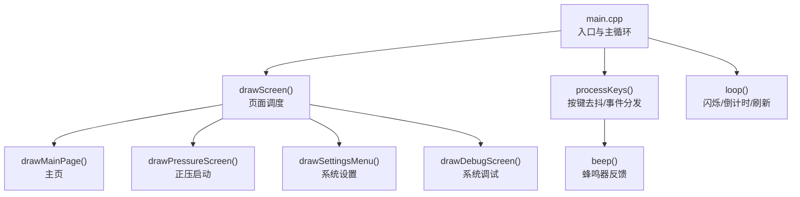
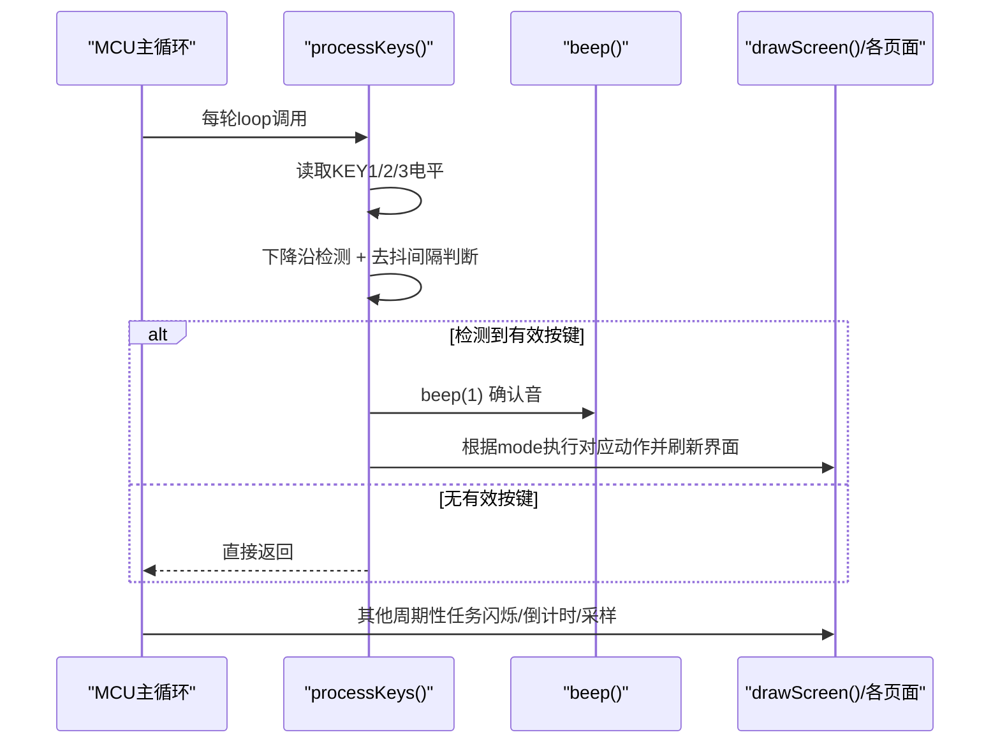
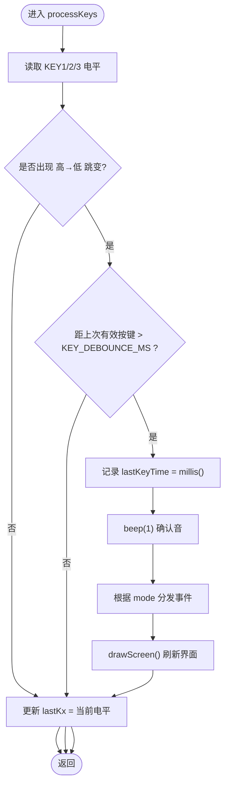
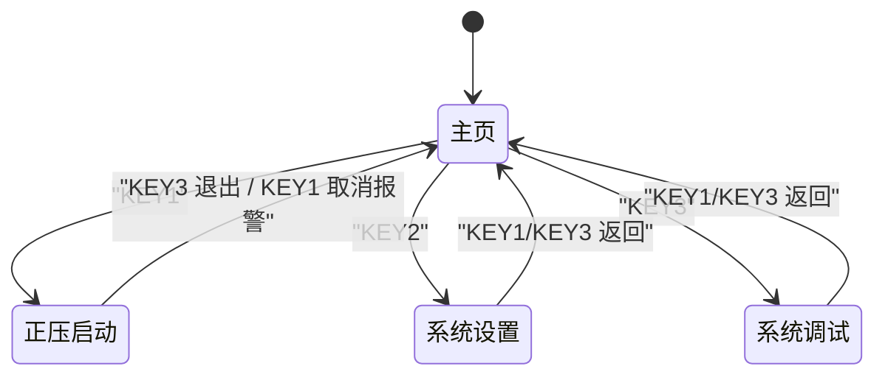
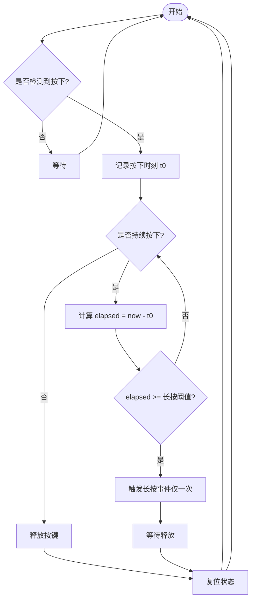
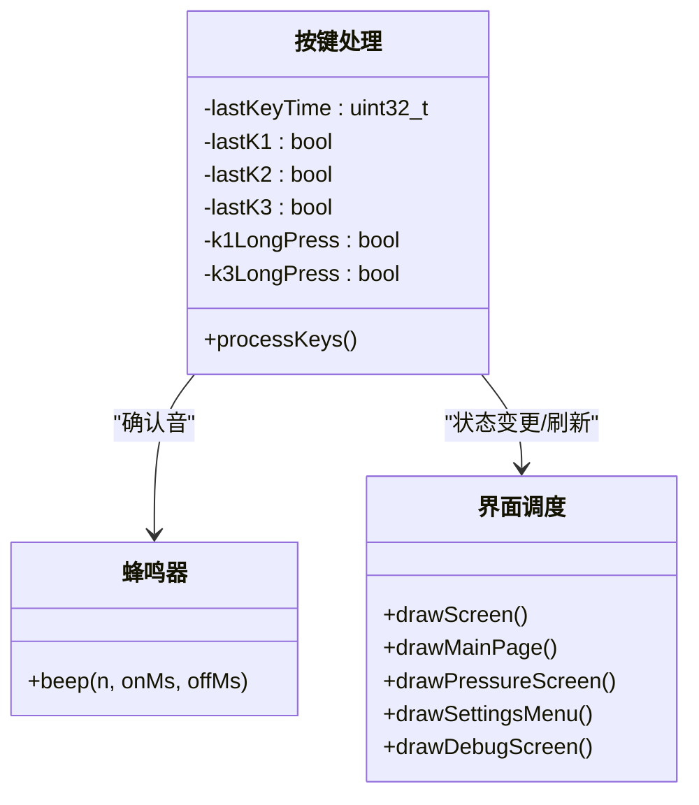
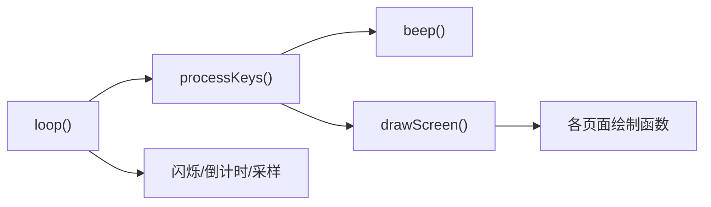

# 按键交互处理

<cite>
**本文引用的文件**   
- [src/main.cpp](file://src/main.cpp)
</cite>

## 目录
1. [简介](#简介)
2. [项目结构](#项目结构)
3. [核心组件](#核心组件)
4. [架构总览](#架构总览)
5. [详细组件分析](#详细组件分析)
6. [依赖关系分析](#依赖关系分析)
7. [性能与实时性考虑](#性能与实时性考虑)
8. [故障排查指南](#故障排查指南)
9. [结论](#结论)
10. [附录：代码片段路径索引](#附录代码片段路径索引)

## 简介
本文件面向GD32F103RCT6正压防爆控制系统的按键交互处理，聚焦以下目标：
- 深入解析 processKeys() 的去抖算法（KEY_DEBOUNCE_MS延时消抖）与下降沿检测逻辑
- 说明三个物理按键 KEY1、KEY2、KEY3 在不同界面模式下的功能映射与行为差异
- 记录蜂鸣器反馈机制 beep() 的集成方式（确认音与警报提示音）
- 解释长按检测的实现原理与扩展方法
- 提供按键状态机与事件分发的具体实现思路与示例路径
- 解决误触发、响应延迟、多键冲突等常见问题

## 项目结构
本项目为单文件主程序工程，所有交互逻辑集中在 main.cpp 中，包含：
- 硬件引脚定义与外设初始化
- 显示绘制函数（主页、正压启动、系统设置、调试）
- 按键处理与蜂鸣器反馈
- 主循环调度（闪烁、倒计时、压力更新）

图表来源
- [src/main.cpp:305-310](file://src/main.cpp#L305-L310)
- [src/main.cpp:318-364](file://src/main.cpp#L318-L364)
- [src/main.cpp:392-433](file://src/main.cpp#L392-L433)

章节来源
- [src/main.cpp:1-434](file://src/main.cpp#L1-L434)

## 核心组件
- 按键与蜂鸣器引脚定义：KEY1/KEY2/KEY3 使用上拉输入，按下为低电平；蜂鸣器输出引脚用于短促发声。
- 去抖与下降沿检测：在每次读取按键后，比较当前电平与上次电平，仅在“高→低”跳变且满足最小间隔时视为一次有效按键。
- 事件分发：根据当前 mode 将同一按键事件路由到不同业务逻辑（如进入正压启动、返回主页、切换菜单项等）。
- 蜂鸣器反馈：每次有效按键均调用 beep(1) 发出确认音；全局报警状态下通过界面闪烁与可能的提示音进行提醒。

章节来源
- [src/main.cpp:15-20](file://src/main.cpp#L15-L20)
- [src/main.cpp:312-364](file://src/main.cpp#L312-L364)
- [src/main.cpp:104-109](file://src/main.cpp#L104-L109)

## 架构总览
下图展示按键从物理读到事件分发的完整流程，以及与显示和蜂鸣器的交互。

图表来源
- [src/main.cpp:318-364](file://src/main.cpp#L318-L364)
- [src/main.cpp:104-109](file://src/main.cpp#L104-L109)
- [src/main.cpp:305-310](file://src/main.cpp#L305-L310)
- [src/main.cpp:392-433](file://src/main.cpp#L392-L433)

## 详细组件分析

### 去抖算法与下降沿检测
- 去抖策略：使用全局时间戳 lastKeyTime 与常量 KEY_DEBOUNCE_MS 限制两次有效按键的最小间隔，避免抖动或快速连按导致重复触发。
- 下降沿检测：对每个按键维护上一次电平 lastKx，当本次读到低电平且上次为高电平时判定为“按下”事件。
- 关键变量：
  - KEY_DEBOUNCE_MS：去抖时间阈值（毫秒）
  - lastKeyTime：最近一次有效按键的时间戳
  - lastK1/lastK2/lastK3：按键上次电平状态
- 注意：该实现以轮询方式在主循环中调用 processKeys()，并非中断驱动。

图表来源
- [src/main.cpp:312-364](file://src/main.cpp#L312-L364)

章节来源
- [src/main.cpp:312-364](file://src/main.cpp#L312-L364)

### 三键在不同界面的功能映射
- KEY1（PC7）
  - 主页 → 进入“正压启动”
  - 正压启动 → 若存在全局报警则取消报警并静音
  - 系统设置/调试 → 返回主页
- KEY2（PC8）
  - 主页 → 进入“系统设置”
  - 系统设置 → 下一选项（循环选择）
- KEY3（PC9）
  - 主页 → 进入“系统调试”
  - 正压启动 → 退出正压启动并关闭进气/排气继电器，返回主页
  - 系统设置/调试 → 返回主页

图表来源
- [src/main.cpp:318-364](file://src/main.cpp#L318-L364)

章节来源
- [src/main.cpp:318-364](file://src/main.cpp#L318-L364)

### 蜂鸣器反馈机制（beep）
- 作用：每次有效按键产生一次短促“滴”声作为确认反馈。
- 参数：默认单次响铃，onMs/offMs 可配置开/关时长。
- 集成点：在 processKeys() 内检测到有效按键后立即调用 beep(1)。
- 警报提示：全局报警时界面会闪烁“警报”，同时可在需要时结合提示音（当前代码未自动播放持续提示音，但可通过扩展实现）。

章节来源
- [src/main.cpp:104-109](file://src/main.cpp#L104-L109)
- [src/main.cpp:318-364](file://src/main.cpp#L318-L364)

### 长按检测：现状与扩展方案
- 现状：代码中存在 k1LongPress/k3LongPress 标志位声明，但未在当前版本中启用实际长按逻辑。
- 推荐实现思路（不改变现有行为的前提下扩展）：
  - 在检测到“按下”后，开启一个计时器记录按下起始时间
  - 在主循环或定时任务中检查按键是否仍保持按下，超过阈值（例如 1000ms）即判定为长按
  - 长按事件与短按事件解耦，分别分发到不同的业务分支
  - 为避免阻塞，建议使用非阻塞计时（millis 差值），并在释放按键后复位状态

[此图为概念流程图，无需源码映射]

章节来源
- [src/main.cpp:315-316](file://src/main.cpp#L315-L316)

### 按键状态机与事件分发（示例路径）
- 状态机要点：
  - 状态：当前界面模式 mode（0=主页，1=正压启动，2=系统设置，3=系统调试）
  - 事件：KEY1/KEY2/KEY3 的短按事件
  - 转移：根据 mode 与按键组合决定下一个 mode 或执行特定操作（如取消报警、切换菜单项）
- 事件分发：
  - 在 processKeys() 内部按按键分支，再按 mode 分支执行相应逻辑
  - 每次状态变更后调用 drawScreen() 刷新界面

图表来源
- [src/main.cpp:318-364](file://src/main.cpp#L318-L364)
- [src/main.cpp:305-310](file://src/main.cpp#L305-L310)
- [src/main.cpp:104-109](file://src/main.cpp#L104-L109)

章节来源
- [src/main.cpp:305-310](file://src/main.cpp#L305-L310)
- [src/main.cpp:318-364](file://src/main.cpp#L318-L364)
- [src/main.cpp:104-109](file://src/main.cpp#L104-L109)

## 依赖关系分析
- 模块耦合：
  - processKeys() 依赖蜂鸣器 beep() 与界面 drawScreen()
  - loop() 负责周期性任务（闪烁、倒计时、压力采样）并调用 processKeys()
- 外部依赖：
  - TFT_eSPI 屏幕库用于绘制界面
  - GD32 HAL/寄存器访问用于 ADC 与 GPIO 控制

图表来源
- [src/main.cpp:392-433](file://src/main.cpp#L392-L433)
- [src/main.cpp:305-310](file://src/main.cpp#L305-L310)
- [src/main.cpp:318-364](file://src/main.cpp#L318-L364)
- [src/main.cpp:104-109](file://src/main.cpp#L104-L109)

章节来源
- [src/main.cpp:392-433](file://src/main.cpp#L392-L433)
- [src/main.cpp:305-310](file://src/main.cpp#L305-L310)
- [src/main.cpp:318-364](file://src/main.cpp#L318-L364)
- [src/main.cpp:104-109](file://src/main.cpp#L104-L109)

## 性能与实时性考虑
- 去抖间隔：KEY_DEBOUNCE_MS 设置为较小值以提升响应速度，但需权衡机械按键抖动特性，建议实测调整。
- 主循环周期：loop() 末尾 delay(10) 保证约 10ms 级轮询频率，足以捕捉按键变化。
- 阻塞风险：beep() 内部使用 delay() 阻塞，若频繁触发可能影响界面刷新与传感器采样。建议在高频场景下改为非阻塞驱动（定时器+PWM/IO翻转）。
- 界面刷新：每次按键后调用 drawScreen() 全量刷新，简单可靠但在复杂界面下可优化为局部刷新。

[本节为通用指导，不直接分析具体文件]

## 故障排查指南
- 按键误触发
  - 现象：轻触或抖动导致多次触发
  - 排查：增大 KEY_DEBOUNCE_MS；检查硬件上拉是否稳定；确保 digitalRead 前无长时间阻塞
- 响应延迟
  - 现象：按键后界面更新慢
  - 排查：减少 drawScreen() 的绘制开销；避免在按键路径中进行耗时操作；必要时采用局部刷新
- 多键冲突
  - 现象：同时按下多个键只响应一个
  - 排查：当前实现为顺序检测，若需支持多键并发，应引入按键队列与优先级策略
- 蜂鸣器干扰
  - 现象：beep() 期间界面卡顿
  - 排查：缩短 onMs/offMs；改用非阻塞方式；降低 beep 频率或在后台任务中处理

章节来源
- [src/main.cpp:312-364](file://src/main.cpp#L312-L364)
- [src/main.cpp:104-109](file://src/main.cpp#L104-L109)
- [src/main.cpp:392-433](file://src/main.cpp#L392-L433)

## 结论
本系统在单文件中实现了简洁可靠的按键交互：基于延时消抖与下降沿检测的短按识别、按界面模式的事件分发、以及蜂鸣器确认反馈。针对长按需求，提供了可扩展的非阻塞实现思路。整体设计易于理解与维护，适合初学者入门嵌入式按键处理，并为有经验的开发者提供了进一步优化的方向（非阻塞蜂鸣、局部刷新、多键并发等）。

[本节为总结，不直接分析具体文件]

## 附录：代码片段路径索引
- 去抖与下降沿检测
  - [src/main.cpp:312-364](file://src/main.cpp#L312-L364)
- 蜂鸣器实现
  - [src/main.cpp:104-109](file://src/main.cpp#L104-L109)
- 界面调度与各页面绘制
  - [src/main.cpp:305-310](file://src/main.cpp#L305-L310)
  - [src/main.cpp:168-189](file://src/main.cpp#L168-L189)
  - [src/main.cpp:191-253](file://src/main.cpp#L191-L253)
  - [src/main.cpp:255-276](file://src/main.cpp#L255-L276)
  - [src/main.cpp:278-302](file://src/main.cpp#L278-L302)
- 主循环与周期性任务
  - [src/main.cpp:392-433](file://src/main.cpp#L392-L433)
- 长按标志位声明（待扩展）
  - [src/main.cpp:315-316](file://src/main.cpp#L315-L316)