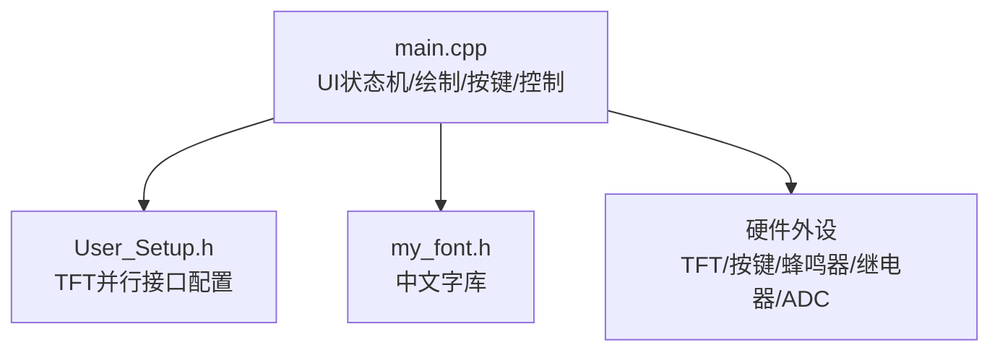
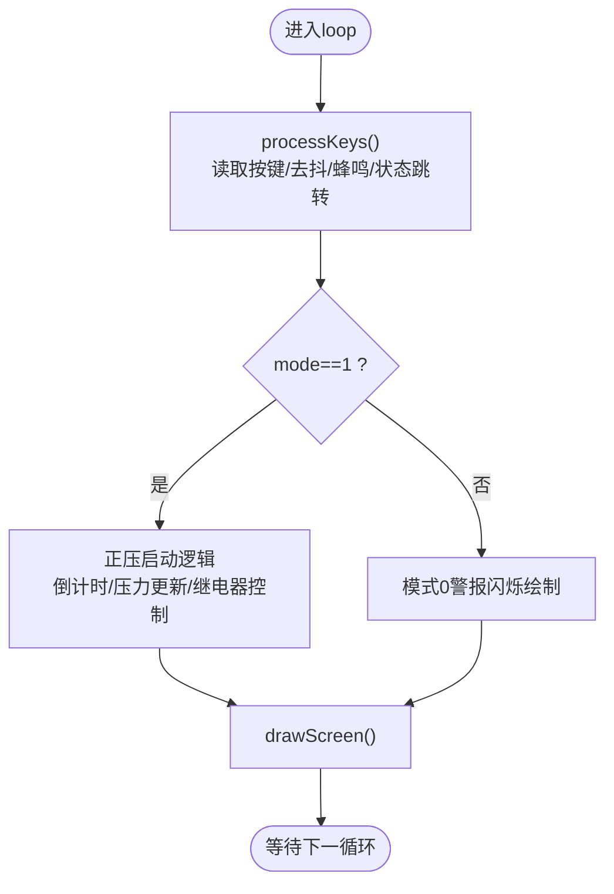
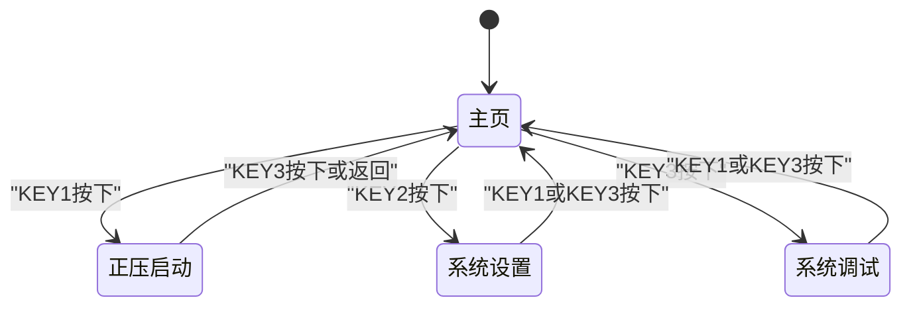
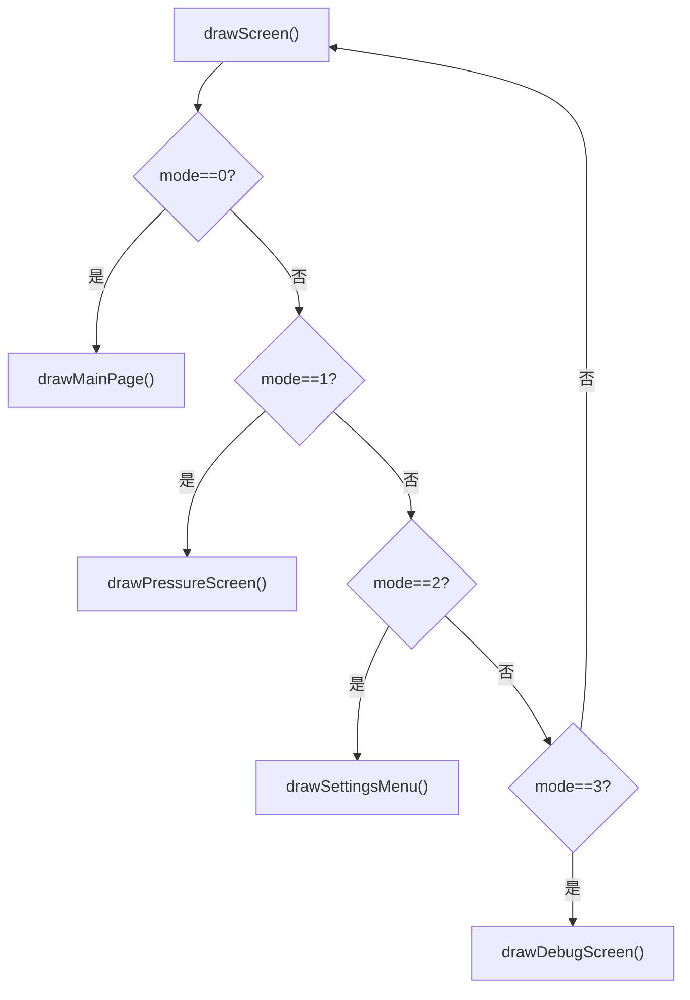
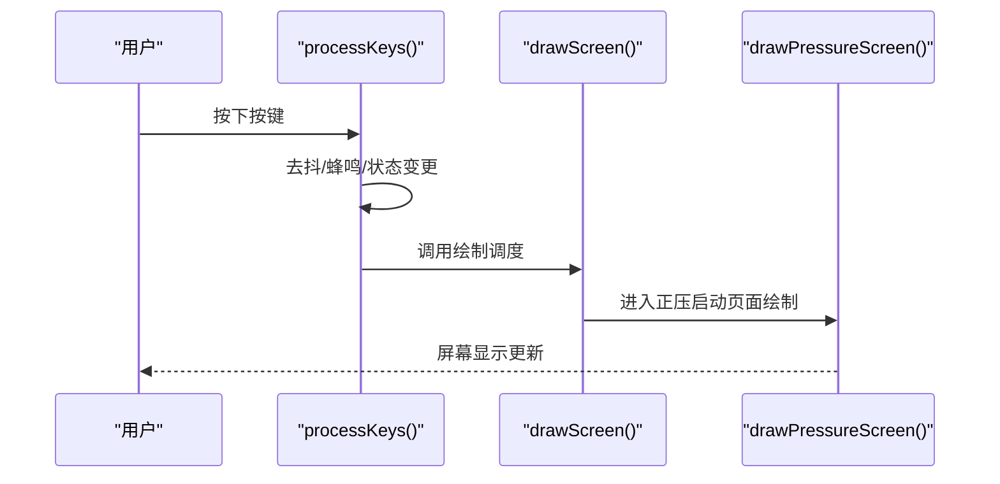
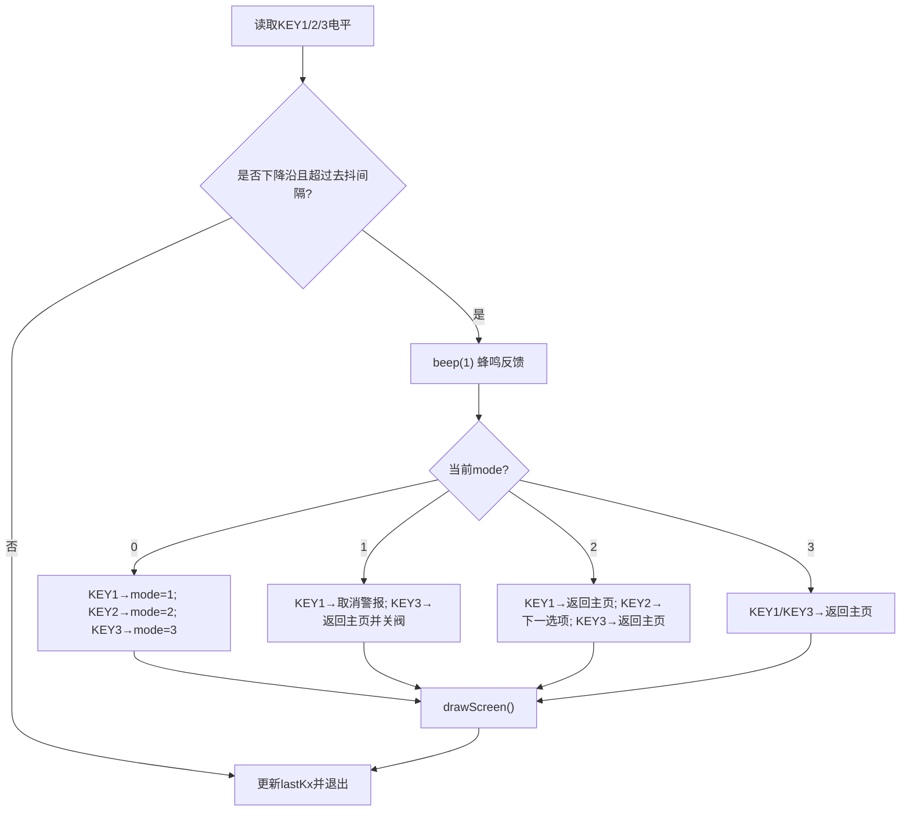
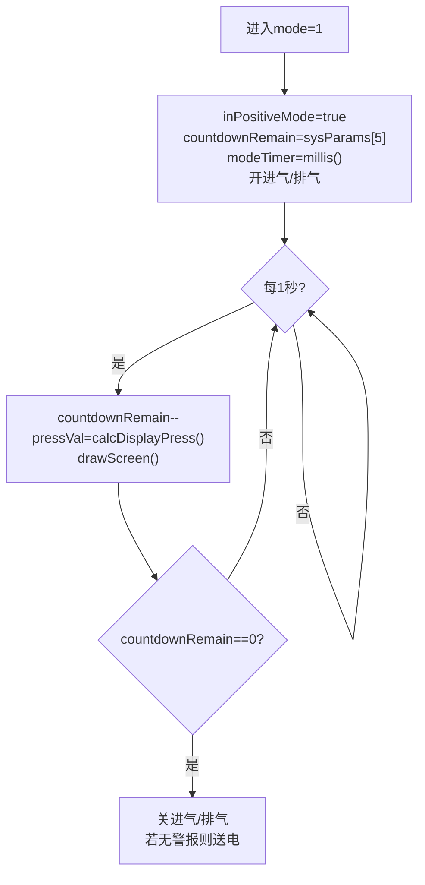
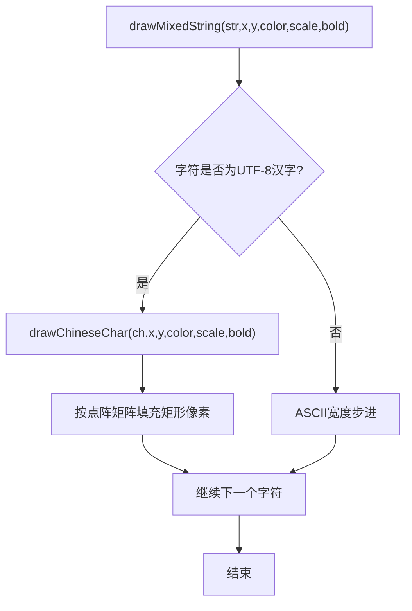
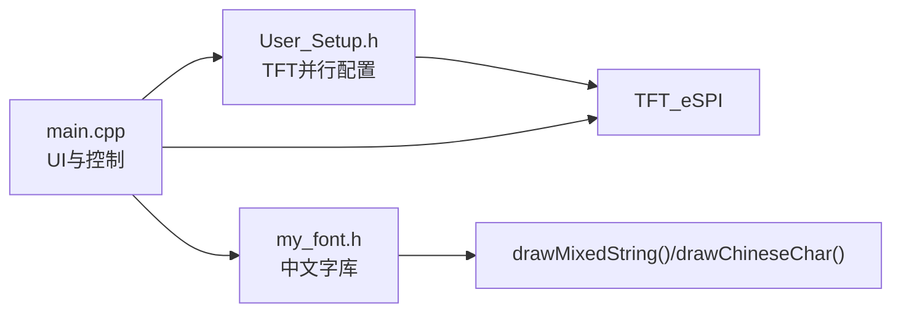

# 用户界面系统

<cite>
**本文引用的文件**
- [src/main.cpp](file://src/main.cpp)
- [include/User_Setup.h](file://include/User_Setup.h)
- [src/my_font.h](file://src/my_font.h)
</cite>

## 目录
1. [简介](#简介)
2. [项目结构](#项目结构)
3. [核心组件](#核心组件)
4. [架构总览](#架构总览)
5. [详细组件分析](#详细组件分析)
6. [依赖关系分析](#依赖关系分析)
7. [性能与优化建议](#性能与优化建议)
8. [故障排查指南](#故障排查指南)
9. [结论](#结论)

## 简介
本文件面向 GD32F103RCT6 正压防爆控制系统的用户界面子系统，聚焦以下目标：
- 解释基于 mode 变量的四态界面状态机（主页、正压启动、系统设置、系统调试）
- 梳理 drawScreen() 调度与各页面绘制函数职责
- 详解按键处理 processKeys() 的去抖逻辑、蜂鸣反馈与当前长按检测现状
- 提供界面切换流程与交互处理的代码级路径示例
- 给出卡顿与响应延迟的常见原因与优化策略

## 项目结构
本项目采用单文件主程序 + 字体库 + 显示驱动配置的组织方式：
- src/main.cpp：包含 UI 状态机、页面绘制、按键处理、ADC 采集、继电器控制等全部业务逻辑
- include/User_Setup.h：TFT_eSPI 并行接口引脚与驱动选择配置
- src/my_font.h：自定义 16x16 中文字库，用于中文混合字符串绘制

图表来源
- [src/main.cpp:1-433](file://src/main.cpp#L1-L433)
- [include/User_Setup.h:1-74](file://include/User_Setup.h#L1-L74)
- [src/my_font.h:1-845](file://src/my_font.h#L1-L845)

章节来源
- [src/main.cpp:1-433](file://src/main.cpp#L1-L433)
- [include/User_Setup.h:1-74](file://include/User_Setup.h#L1-L74)
- [src/my_font.h:1-845](file://src/my_font.h#L1-L845)

## 核心组件
- 界面模式变量与状态
  - mode：0=主页，1=正压启动，2=系统设置，3=系统调试
  - 辅助状态：globalAlarm、muteOn、inPositiveMode、countdownRemain、pressVal、tempVal、blinkOn 等
- 页面绘制函数
  - drawMainPage()：欢迎页与菜单按钮
  - drawPressureScreen()：正压启动倒计时、压力值、状态条、警报/消音指示、底部操作按钮
  - drawSettingsMenu()：设置项列表与选中高亮、底部操作按钮
  - drawDebugScreen()：调试信息、危险提示、实时数据、返回与结束按钮
- 调度函数
  - drawScreen()：根据 mode 分发到具体绘制函数
- 输入处理
  - processKeys()：三键扫描、下降沿检测、去抖、蜂鸣反馈、按模式分支处理
- 硬件抽象
  - TFT_eSPI 初始化与旋转
  - ADC 校准与采样
  - 蜂鸣器 beep()
  - 继电器控制（进气、排气、送电、报警）

章节来源
- [src/main.cpp:30-43](file://src/main.cpp#L30-L43)
- [src/main.cpp:167-309](file://src/main.cpp#L167-L309)
- [src/main.cpp:311-363](file://src/main.cpp#L311-L363)
- [src/main.cpp:365-432](file://src/main.cpp#L365-L432)

## 架构总览
下图展示 UI 状态机与关键函数的调用关系。

图表来源
- [src/main.cpp:390-432](file://src/main.cpp#L390-L432)
- [src/main.cpp:303-309](file://src/main.cpp#L303-L309)
- [src/main.cpp:311-363](file://src/main.cpp#L311-L363)

## 详细组件分析

### 界面状态机与页面切换
- 状态定义
  - mode 为全局状态机核心，决定 drawScreen() 的分发目标
- 切换入口
  - 通过 processKeys() 在检测到有效按键后修改 mode，并立即调用 drawScreen() 刷新
- 各模式行为要点
  - 主页（mode=0）：显示欢迎信息与三个功能入口；若 globalAlarm 为真则左上角闪烁“警报”
  - 正压启动（mode=1）：启动时打开进气与排气阀，开始换气倒计时；每秒更新压力与倒计时；到达零关闭阀门并按条件送电
  - 系统设置（mode=2）：显示设置项列表，支持“下一选项”循环选择
  - 系统调试（mode=3）：显示警告语与实时压力温度，支持返回与结束

图表来源
- [src/main.cpp:311-363](file://src/main.cpp#L311-L363)
- [src/main.cpp:390-432](file://src/main.cpp#L390-L432)

章节来源
- [src/main.cpp:30-43](file://src/main.cpp#L30-L43)
- [src/main.cpp:311-363](file://src/main.cpp#L311-L363)
- [src/main.cpp:390-432](file://src/main.cpp#L390-L432)

### drawScreen() 调度函数
- 作用：依据 mode 调用对应页面绘制函数
- 实现要点：简单 if-else 分支，无动画过渡，直接全量重绘

图表来源
- [src/main.cpp:303-309](file://src/main.cpp#L303-L309)

章节来源
- [src/main.cpp:303-309](file://src/main.cpp#L303-L309)

### 页面绘制函数实现细节
- drawMainPage()
  - 清屏、顶部/底部分隔线、标题与服务信息、三个菜单按钮、警报角标
- drawPressureScreen()
  - 顶部运行状态（进气/排气）、倒计时与压力数值、压力状态条（颜色与文本随阈值变化）、右上角警报/消音闪烁、底部两个按钮
- drawSettingsMenu()
  - 标题、四个设置项列表、选中项高亮、底部三个按钮
- drawDebugScreen()
  - 标题、送电状态指示、危险警告、实时压力温度、底部按钮

图表来源
- [src/main.cpp:311-363](file://src/main.cpp#L311-L363)
- [src/main.cpp:303-309](file://src/main.cpp#L303-L309)
- [src/main.cpp:190-252](file://src/main.cpp#L190-L252)

章节来源
- [src/main.cpp:167-188](file://src/main.cpp#L167-L188)
- [src/main.cpp:190-252](file://src/main.cpp#L190-L252)
- [src/main.cpp:254-275](file://src/main.cpp#L254-L275)
- [src/main.cpp:277-301](file://src/main.cpp#L277-L301)

### 按键处理机制 processKeys()
- 去抖算法
  - 使用 lastKeyTime 记录上次处理时间，仅当 millis()-lastKeyTime > KEY_DEBOUNCE_MS 时才视为有效按键
  - 通过 lastKx 保存上一次电平，检测下降沿（从 HIGH 变为 LOW）触发一次动作
- 蜂鸣反馈
  - 每次有效按键均调用 beep(1) 产生短促提示音
- 长按检测现状
  - 存在 k1LongPress/k3LongPress 静态变量声明，但当前未实现长按计时与判定逻辑
- 模式内行为
  - 主页：KEY1→正压启动；KEY2→系统设置；KEY3→系统调试
  - 正压启动：KEY1→取消警报（置 muteOn）；KEY3→返回主页并关闭阀门
  - 系统设置：KEY1→返回主页；KEY2→下一选项（settingsSel 循环）；KEY3→返回主页
  - 系统调试：KEY1/KEY3→返回主页

图表来源
- [src/main.cpp:311-363](file://src/main.cpp#L311-L363)

章节来源
- [src/main.cpp:311-363](file://src/main.cpp#L311-L363)

### 正压启动流程与定时器
- 进入正压启动
  - 设置 inPositiveMode=true，初始化 countdownRemain 与 modeTimer，打开进气与排气继电器
- 每秒更新
  - 递减倒计时，重新采样压力，调用 drawScreen() 刷新
- 完成换气
  - 关闭进气与排气，若无警报则开启送电继电器

图表来源
- [src/main.cpp:390-432](file://src/main.cpp#L390-L432)

章节来源
- [src/main.cpp:390-432](file://src/main.cpp#L390-L432)

### 中文混合字符串绘制与字库
- 绘制流程
  - drawMixedString() 遍历 UTF-8 字节流，识别多字节汉字并调用 drawChineseChar() 逐像素填充
- 字库结构
  - my_font.h 中 CHINESE_16 数组存储常用汉字的 16x16 点阵，供界面快速查找与绘制

图表来源
- [src/main.cpp:112-142](file://src/main.cpp#L112-L142)
- [src/my_font.h:1-845](file://src/my_font.h#L1-L845)

章节来源
- [src/main.cpp:112-142](file://src/main.cpp#L112-L142)
- [src/my_font.h:1-845](file://src/my_font.h#L1-L845)

## 依赖关系分析
- 外部库与配置
  - TFT_eSPI：通过 User_Setup.h 配置并行接口、驱动芯片与引脚映射
  - Arduino 框架：digitalRead/digitalWrite/millis/delay 等基础 API
- 内部模块耦合
  - main.cpp 强耦合于 User_Setup.h 的引脚定义与 my_font.h 的字库内容
  - 页面绘制函数依赖全局状态变量（mode、globalAlarm、muteOn、pressVal 等）

图表来源
- [include/User_Setup.h:1-74](file://include/User_Setup.h#L1-L74)
- [src/my_font.h:1-845](file://src/my_font.h#L1-L845)
- [src/main.cpp:1-433](file://src/main.cpp#L1-L433)

章节来源
- [include/User_Setup.h:1-74](file://include/User_Setup.h#L1-L74)
- [src/my_font.h:1-845](file://src/my_font.h#L1-L845)
- [src/main.cpp:1-433](file://src/main.cpp#L1-L433)

## 性能与优化建议
- 减少全量重绘
  - 当前每个页面绘制函数均以 tft.fillScreen() 清屏，频繁刷新会导致卡顿。建议引入脏矩形或局部刷新，仅更新变化区域（如倒计时数字、压力值、状态条）。
- 降低绘制开销
  - 中文绘制为逐像素填充，成本较高。可缓存已绘制文本块或使用更高效的字体渲染方案。
- 合理刷新频率
  - 正压启动模式下每秒刷新一次即可，避免在 loop 中额外高频调用 drawScreen()。
- 按键响应优化
  - 将 delay(10) 替换为非阻塞延时，或在按键处理中使用更小的轮询周期，提高响应速度。
- 蜂鸣器耗时
  - beep() 内部使用 delay，会阻塞主循环。可将蜂鸣改为非阻塞状态机，避免影响 UI 刷新。

[本节为通用指导，不直接分析具体文件]

## 故障排查指南
- 界面卡顿
  - 现象：切换页面或正压启动时画面明显延迟
  - 可能原因：频繁全量清屏与中文绘制；蜂鸣器阻塞
  - 定位参考
    - 页面绘制函数中的 fillScreen 与中文绘制调用
    - 正压启动每秒刷新 drawScreen() 的频率
    - beep() 的实现
  - 相关路径
    - [src/main.cpp:167-301](file://src/main.cpp#L167-L301)
    - [src/main.cpp:390-432](file://src/main.cpp#L390-L432)
    - [src/main.cpp:104-109](file://src/main.cpp#L104-L109)
- 按键响应延迟
  - 现象：按键需要较长时间才生效
  - 可能原因：去抖间隔过大；loop 末尾 delay(10) 累积；蜂鸣阻塞
  - 定位参考
    - KEY_DEBOUNCE_MS 常量与 lastKeyTime 判断
    - loop 末尾 delay(10)
    - beep() 阻塞
  - 相关路径
    - [src/main.cpp:311-363](file://src/main.cpp#L311-L363)
    - [src/main.cpp:431-432](file://src/main.cpp#L431-L432)
    - [src/main.cpp:104-109](file://src/main.cpp#L104-L109)
- 长按无效
  - 现象：期望长按执行的操作无响应
  - 可能原因：k1LongPress/k3LongPress 未参与逻辑
  - 相关路径
    - [src/main.cpp:311-363](file://src/main.cpp#L311-L363)

章节来源
- [src/main.cpp:104-109](file://src/main.cpp#L104-L109)
- [src/main.cpp:311-363](file://src/main.cpp#L311-L363)
- [src/main.cpp:390-432](file://src/main.cpp#L390-L432)
- [src/main.cpp:431-432](file://src/main.cpp#L431-L432)

## 结论
该用户界面系统以简单的 mode 状态机为核心，配合 drawScreen() 调度与若干页面绘制函数，实现了主页、正压启动、系统设置与系统调试四种模式的完整交互。按键处理具备基本去抖与蜂鸣反馈，但尚未实现长按检测。针对界面卡顿与响应延迟问题，可通过局部刷新、非阻塞蜂鸣与优化延时等手段进行改进。整体结构清晰，易于扩展与维护。