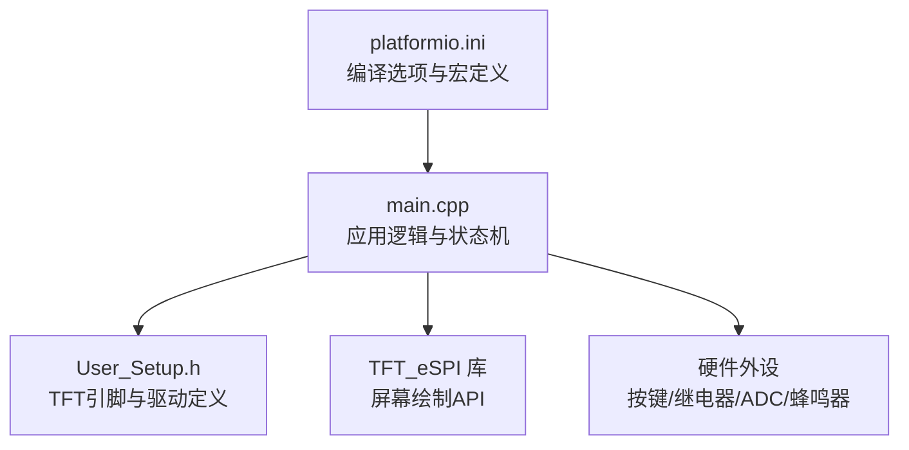
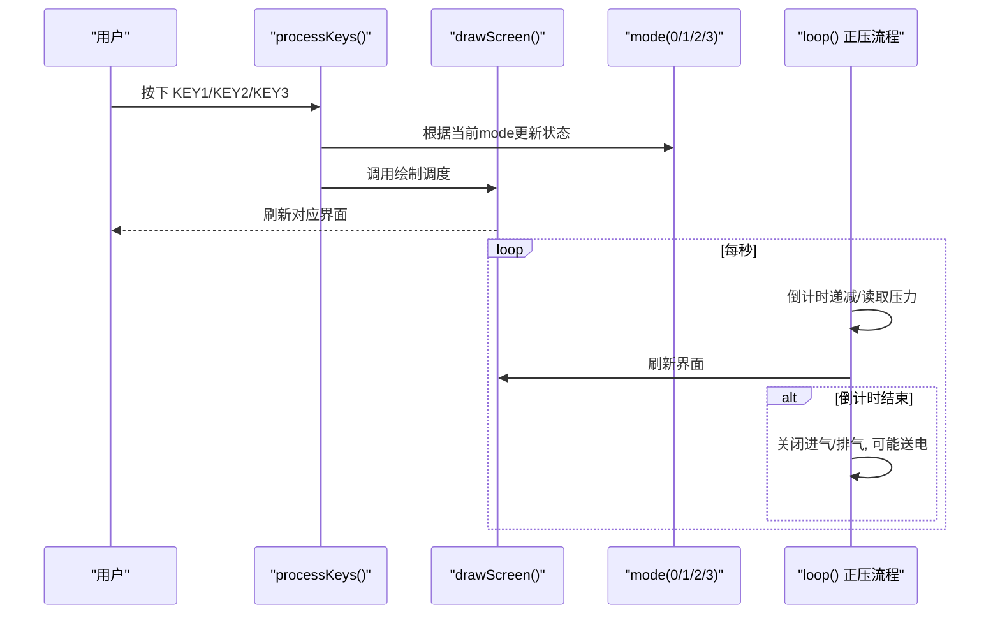
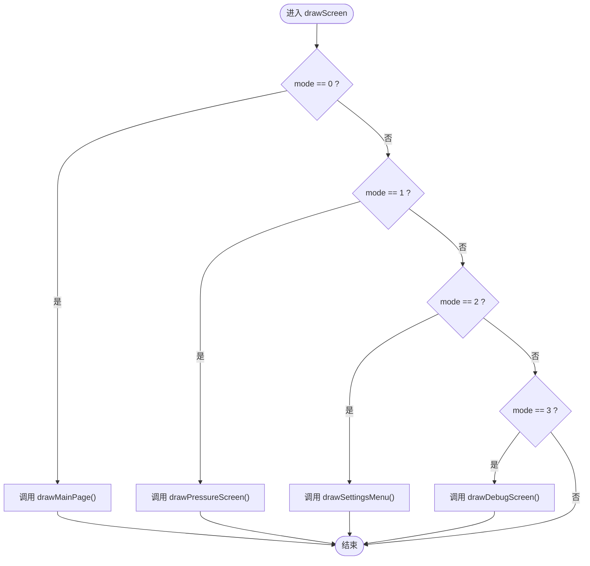
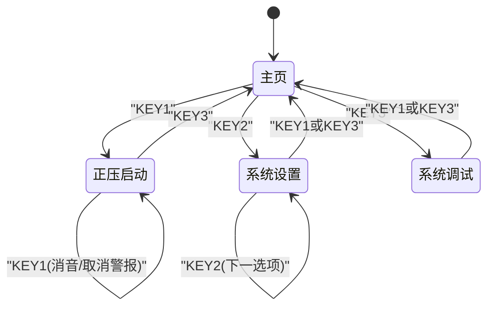
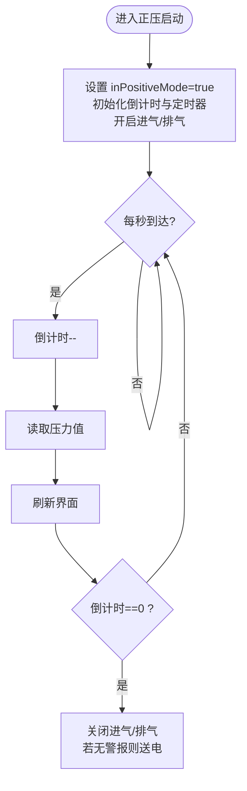
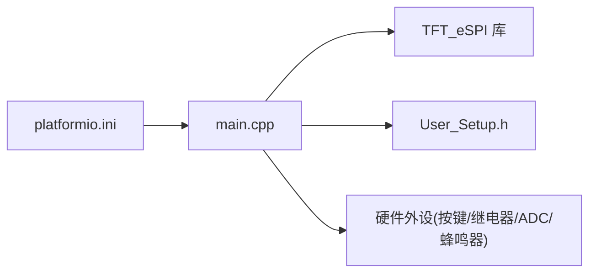

# 界面状态机设计

<cite>
**本文引用的文件**
- [src/main.cpp](file://src/main.cpp)
- [include/User_Setup.h](file://include/User_Setup.h)
- [platformio.ini](file://platformio.ini)
</cite>

## 目录
1. [简介](#简介)
2. [项目结构](#项目结构)
3. [核心组件](#核心组件)
4. [架构总览](#架构总览)
5. [详细组件分析](#详细组件分析)
6. [依赖关系分析](#依赖关系分析)
7. [性能与实时性考虑](#性能与实时性考虑)
8. [故障排查指南](#故障排查指南)
9. [结论](#结论)

## 简介
本文件面向GD32F103RCT6正压防爆控制系统的界面状态机，聚焦于由mode变量驱动的四种界面模式：
- 0=主页
- 1=正压启动
- 2=系统设置
- 3=系统调试

文档将深入解释drawScreen()调度函数的工作机制、各模式间的切换条件与触发事件（KEY1/KEY2/KEY3在不同模式下的行为差异）、状态变量的初始化与默认值、以及常见问题（如状态死锁、非法转换）的解决方案。内容兼顾初学者对状态机概念的理解，也为有经验的开发者提供完整的状态管理方案。

## 项目结构
本项目采用Arduino框架，使用TFT_eSPI库驱动3.5寸横屏（480x320），通过8位并行总线连接LCD控制器ILI9486。主程序位于src/main.cpp，屏幕引脚配置在include/User_Setup.h，构建参数在platformio.ini中声明。

图表来源
- [src/main.cpp:1-12](file://src/main.cpp#L1-L12)
- [include/User_Setup.h:14-47](file://include/User_Setup.h#L14-L47)
- [platformio.ini:10-22](file://platformio.ini#L10-L22)

章节来源
- [src/main.cpp:1-20](file://src/main.cpp#L1-L20)
- [include/User_Setup.h:14-47](file://include/User_Setup.h#L14-L47)
- [platformio.ini:10-22](file://platformio.ini#L10-L22)

## 核心组件
- 显示调度器 drawScreen()：根据mode选择并调用对应绘制函数，实现“单一入口”的界面刷新。
- 四个绘制函数：
  - drawMainPage()：主页，包含三个功能按钮（正压启动、系统设置、系统调试）。
  - drawPressureScreen()：正压启动，显示倒计时、压力、状态条与警报指示。
  - drawSettingsMenu()：系统设置菜单，支持选项高亮与导航。
  - drawDebugScreen()：系统调试，显示实时压力温度与安全警告。
- 输入处理 processKeys()：去抖按键检测，按当前mode执行不同动作，更新状态并刷新界面。
- 运行循环 loop()：维护闪烁计时、按键扫描、正压启动流程与定时刷新。

章节来源
- [src/main.cpp:305-310](file://src/main.cpp#L305-L310)
- [src/main.cpp:168-189](file://src/main.cpp#L168-L189)
- [src/main.cpp:191-253](file://src/main.cpp#L191-L253)
- [src/main.cpp:255-276](file://src/main.cpp#L255-L276)
- [src/main.cpp:278-302](file://src/main.cpp#L278-L302)
- [src/main.cpp:318-364](file://src/main.cpp#L318-L364)
- [src/main.cpp:392-433](file://src/main.cpp#L392-L433)

## 架构总览
下图展示了状态机与绘制调度、按键处理、正压启动流程之间的交互关系。

图表来源
- [src/main.cpp:318-364](file://src/main.cpp#L318-L364)
- [src/main.cpp:305-310](file://src/main.cpp#L305-L310)
- [src/main.cpp:392-433](file://src/main.cpp#L392-L433)

## 详细组件分析

### 状态机与模式定义
- mode变量用于表示当前界面模式，初始值为0（主页）。
- 四种模式分别对应不同的绘制函数与业务逻辑。
- 关键状态变量包括：
  - inPositiveMode：是否处于正压启动流程中
  - countdownRemain：换气倒计时剩余秒数
  - globalAlarm/muteOn：全局警报与消音标志
  - blinkOn/blinkTimer：警报闪烁控制
  - pressVal/tempVal：传感器读数缓存

章节来源
- [src/main.cpp:31](file://src/main.cpp#L31)
- [src/main.cpp:33-43](file://src/main.cpp#L33-L43)

### 绘制调度函数 drawScreen()
- 作用：依据mode的值分发到对应的绘制函数，确保每次状态变化后只调用一次统一刷新入口。
- 优点：避免多处重复绘制代码，便于扩展新页面。

图表来源
- [src/main.cpp:305-310](file://src/main.cpp#L305-L310)

章节来源
- [src/main.cpp:305-310](file://src/main.cpp#L305-L310)

### 按键处理与状态转换
按键处理采用下降沿检测与软件去抖，并在每种模式下执行不同动作。以下为各模式下的按键行为总结：

- 主页 (mode=0)
  - KEY1：进入正压启动（mode=1），初始化倒计时与流程标志，立即刷新界面。
  - KEY2：进入系统设置（mode=2），刷新界面。
  - KEY3：进入系统调试（mode=3），刷新界面。

- 正压启动 (mode=1)
  - KEY1：若存在全局警报则取消警报并置消音标志，刷新界面。
  - KEY2：无操作（未定义）。
  - KEY3：返回主页（mode=0），停止进气/排气，刷新界面。

- 系统设置 (mode=2)
  - KEY1：返回主页（mode=0），刷新界面。
  - KEY2：下一选项（settingsSel循环递增），刷新界面。
  - KEY3：返回主页（mode=0），刷新界面。

- 系统调试 (mode=3)
  - KEY1：返回主页（mode=0），刷新界面。
  - KEY2：无操作（未定义）。
  - KEY3：返回主页（mode=0），刷新界面。

图表来源
- [src/main.cpp:318-364](file://src/main.cpp#L318-L364)

章节来源
- [src/main.cpp:318-364](file://src/main.cpp#L318-L364)

### 正压启动流程与定时刷新
- 进入正压启动时，设置inPositiveMode为true，初始化countdownRemain为系统参数中的换气时间，记录modeTimer，并开启进气/排气继电器。
- 每秒钟：
  - 倒计时递减；
  - 读取压力值并刷新界面；
  - 当倒计时归零时，关闭进气/排气，若无警报则送电。
- 警报判断基于压力阈值，超过上下限区间会置globalAlarm，并在界面右上角闪烁提示。

图表来源
- [src/main.cpp:392-433](file://src/main.cpp#L392-L433)

章节来源
- [src/main.cpp:392-433](file://src/main.cpp#L392-L433)

### 界面绘制函数要点
- drawMainPage()：标题、服务信息、公司标识，底部三个功能按钮；若有全局警报则在左上角显示红色警报标签。
- drawPressureScreen()：顶部状态行显示“进气/排气”，中部显示倒计时与柜内压力，下方状态条根据压力阈值变色并给出文字说明；右上角显示警报/消音状态；底部两个按钮（取消警报、返回主页）。
- drawSettingsMenu()：列出四个选项，选中项高亮；底部三个按钮（返回主页、下一选项、确认）。
- drawDebugScreen()：显示“危险区域”警告，实时压力与温度；底部按钮（返回主页、空占位、调试结束）。

章节来源
- [src/main.cpp:168-189](file://src/main.cpp#L168-L189)
- [src/main.cpp:191-253](file://src/main.cpp#L191-L253)
- [src/main.cpp:255-276](file://src/main.cpp#L255-L276)
- [src/main.cpp:278-302](file://src/main.cpp#L278-L302)

### 状态变量初始化与默认设置
- setup()中完成串口、TFT、引脚、ADC等初始化，并进行压力/温度零点校准采样。
- 首次绘制主页，确保开机即显示默认界面。
- mode默认值为0（主页），其他状态变量均为false或0，保证系统上电处于安全且可预期的初始状态。

章节来源
- [src/main.cpp:367-389](file://src/main.cpp#L367-L389)
- [src/main.cpp:31](file://src/main.cpp#L31)

## 依赖关系分析
- main.cpp依赖TFT_eSPI库进行屏幕绘制，依赖User_Setup.h中的引脚与驱动宏定义，依赖platformio.ini中的编译宏以启用并行总线与字体。
- 硬件层包括按键、继电器、ADC、蜂鸣器，均由main.cpp直接控制。

图表来源
- [src/main.cpp:10-11](file://src/main.cpp#L10-L11)
- [include/User_Setup.h:14-47](file://include/User_Setup.h#L14-L47)
- [platformio.ini:10-22](file://platformio.ini#L10-L22)

章节来源
- [src/main.cpp:10-11](file://src/main.cpp#L10-L11)
- [include/User_Setup.h:14-47](file://include/User_Setup.h#L14-L47)
- [platformio.ini:10-22](file://platformio.ini#L10-L22)

## 性能与实时性考虑
- 去抖策略：processKeys()使用30ms去抖窗口，避免误触导致的状态抖动。
- 刷新频率：正压启动模式下每秒读取压力并刷新界面，其余模式仅在状态变化时刷新，降低不必要的绘制开销。
- 闪烁控制：警报闪烁使用500ms周期，避免频繁重绘造成卡顿。
- 建议优化：
  - 引入局部刷新或脏矩形技术，仅重绘变化区域，减少全屏填充带来的CPU占用。
  - 将按键处理迁移至中断或定时器任务，提高响应实时性。
  - 增加状态转换前的合法性校验，防止非法状态跳转。

[本节为通用指导，不直接分析具体文件]

## 故障排查指南
- 状态死锁
  - 现象：界面无法退出某模式或按键无效。
  - 排查：检查processKeys()的去抖时间与按键电平逻辑是否正确；确认mode赋值路径是否被意外覆盖。
  - 参考位置：[src/main.cpp:318-364](file://src/main.cpp#L318-L364)

- 非法状态转换
  - 现象：某些组合键导致界面异常或逻辑不一致。
  - 排查：在processKeys()中增加状态转换白名单与前置条件检查（例如在正压启动中禁止直接进入系统设置）。
  - 参考位置：[src/main.cpp:318-364](file://src/main.cpp#L318-L364)

- 警报闪烁异常
  - 现象：警报标签不闪烁或常亮。
  - 排查：检查blinkTimer与blinkOn的更新逻辑；确认loop()中是否周期性执行。
  - 参考位置：[src/main.cpp:392-433](file://src/main.cpp#L392-L433)

- 正压流程卡住
  - 现象：倒计时不递减或继电器状态异常。
  - 排查：确认modeTimer与countdownRemain的更新逻辑；检查inPositiveMode标志与继电器控制顺序。
  - 参考位置：[src/main.cpp:392-433](file://src/main.cpp#L392-L433)

章节来源
- [src/main.cpp:318-364](file://src/main.cpp#L318-L364)
- [src/main.cpp:392-433](file://src/main.cpp#L392-L433)

## 结论
本状态机以mode为核心，结合drawScreen()调度与processKeys()按键处理，实现了清晰、可扩展的界面管理方案。通过合理的去抖、定时刷新与状态标志，系统在正压启动流程中具备可靠的实时性与安全性。建议在后续迭代中引入更严格的转换校验与局部刷新优化，进一步提升用户体验与系统稳定性。

[本节为总结性内容，不直接分析具体文件]