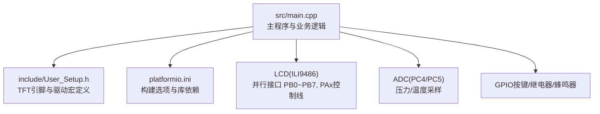
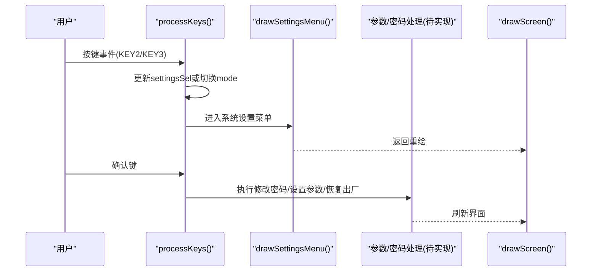
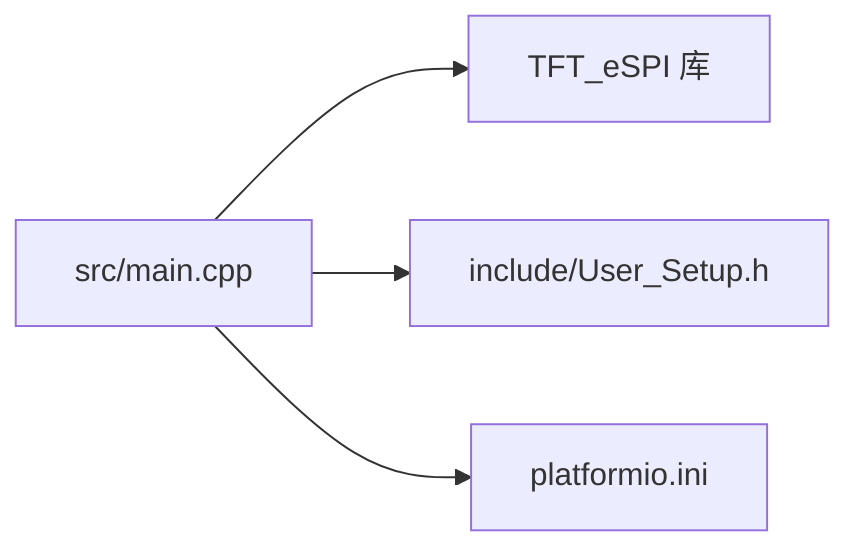

# 系统配置管理

<cite>
**本文引用的文件**   
- [src/main.cpp](file://src/main.cpp)
- [include/User_Setup.h](file://include/User_Setup.h)
- [platformio.ini](file://platformio.ini)
</cite>

## 目录
1. [简介](#简介)
2. [项目结构](#项目结构)
3. [核心组件](#核心组件)
4. [架构总览](#架构总览)
5. [详细组件分析](#详细组件分析)
6. [依赖关系分析](#依赖关系分析)
7. [性能与资源考量](#性能与资源考量)
8. [故障排查指南](#故障排查指南)
9. [结论](#结论)
10. [附录：关键流程示例路径](#附录关键流程示例路径)

## 简介
本文件面向GD32F103RCT6正压防爆控制系统的“系统配置管理”模块，聚焦以下目标：
- 系统参数管理机制：sysParams[6]数组结构、DEFAULT_SYSPARAMS默认值、targetPassword目标密码的管理。
- 密码验证机制：pwdMode密码模式、inputPwd输入密码、pwdDpos光标位置的处理逻辑。
- settingsSel设置选择器：修改密码、校准传感器、设置参数、恢复出厂四个选项的导航逻辑。
- 参数编辑功能：paramEditVal[6]编辑值数组、paramSel参数选择、paramDpos小数位处理。
- 恢复出厂设置：DEFAULT_PASSWORD默认密码与DEFAULT_SYSPARAMS默认参数的重置过程。
- 常见问题：参数保存失败、密码验证错误、配置丢失等问题的定位与解决建议。

说明：当前仓库中未实现持久化存储（如EEPROM/Flash）与完整的密码界面交互逻辑，相关能力以变量与框架形式存在。本文在严格依据源码的前提下进行解读，并在需要处给出扩展建议。

## 项目结构
本项目为基于Arduino框架的嵌入式应用，核心业务与UI绘制集中在单一源文件中，硬件引脚与显示驱动通过User_Setup与平台构建脚本配置。

图示来源
- [src/main.cpp:1-20](file://src/main.cpp#L1-L20)
- [include/User_Setup.h:14-47](file://include/User_Setup.h#L14-L47)
- [platformio.ini:10-45](file://platformio.ini#L10-L45)

章节来源
- [src/main.cpp:1-20](file://src/main.cpp#L1-L20)
- [include/User_Setup.h:14-47](file://include/User_Setup.h#L14-L47)
- [platformio.ini:10-45](file://platformio.ini#L10-L45)

## 核心组件
本节梳理与“系统配置管理”直接相关的核心数据与状态变量，并解释其职责与相互关系。

- 系统参数数组与默认值
  - sysParams[6]：运行时系统参数，包含下限、下下限、上限、上上限、温度上限、换气时间等阈值与时序。
  - DEFAULT_SYSPARAMS[6]：出厂默认参数常量，用于恢复出厂设置时重置sysParams。
  - 参考路径：[src/main.cpp:27-28](file://src/main.cpp#L27-L28)

- 密码相关
  - targetPassword：当前有效的目标密码，初始化为DEFAULT_PASSWORD。
  - DEFAULT_PASSWORD：默认密码常量。
  - pwdMode：密码界面模式（例如首次输入、二次确认等）。
  - inputPwd：用户输入的密码数值。
  - pwdDpos：密码输入光标位置（数字位索引）。
  - 参考路径：[src/main.cpp:28-30](file://src/main.cpp#L28-L30)、[src/main.cpp:63-66](file://src/main.cpp#L63-L66)

- 设置选择器
  - settingsSel：系统设置菜单的选中项索引，范围0..3，对应“修改密码、校准传感器、设置参数、恢复出厂”。
  - 参考路径：[src/main.cpp:60-61](file://src/main.cpp#L60-L61)、[src/main.cpp:256-276](file://src/main.cpp#L256-L276)

- 参数编辑
  - paramEditVal[6]：编辑缓冲数组，暂存待写入的参数值。
  - paramSel：当前正在编辑的参数索引。
  - paramDpos：编辑值的小数位指针（或位权指示），用于调整精度。
  - 参考路径：[src/main.cpp:56-58](file://src/main.cpp#L56-L58)

- 运行模式与调度
  - mode：主界面模式（主页、正压启动、系统设置、系统调试）。
  - drawScreen()：根据mode分发到具体绘制函数。
  - 参考路径：[src/main.cpp:31](file://src/main.cpp#L31)、[src/main.cpp:305-310](file://src/main.cpp#L305-L310)

章节来源
- [src/main.cpp:27-31](file://src/main.cpp#L27-L31)
- [src/main.cpp:56-66](file://src/main.cpp#L56-L66)
- [src/main.cpp:256-276](file://src/main.cpp#L256-L276)
- [src/main.cpp:305-310](file://src/main.cpp#L305-L310)

## 架构总览
下图展示了“系统配置管理”在主循环中的参与点：按键事件进入processKeys后，根据当前mode更新settingsSel、触发密码/参数编辑流程；drawSettingsMenu负责渲染设置菜单；后续可扩展实现密码校验与参数保存。

图示来源
- [src/main.cpp:318-364](file://src/main.cpp#L318-L364)
- [src/main.cpp:256-276](file://src/main.cpp#L256-L276)
- [src/main.cpp:305-310](file://src/main.cpp#L305-L310)

## 详细组件分析

### 系统参数管理（sysParams与默认值）
- 数据结构
  - sysParams[6]：运行时参数数组，包含压力上下限、温度上限、换气时间等。
  - DEFAULT_SYSPARAMS[6]：默认参数常量，用于恢复出厂。
- 使用方式
  - 正压启动界面读取sysParams进行报警判定与显示。
  - 恢复出厂时将DEFAULT_SYSPARAMS复制到sysParams。
- 复杂度
  - 访问与复制均为O(1)/O(n=6)，开销极低。
- 优化建议
  - 将默认值集中管理，便于维护。
  - 增加边界检查与一致性校验（如下限<上限等）。

章节来源
- [src/main.cpp:27-28](file://src/main.cpp#L27-L28)
- [src/main.cpp:222-234](file://src/main.cpp#L222-L234)

### 目标密码管理（targetPassword与默认密码）
- 数据结构
  - DEFAULT_PASSWORD：默认密码常量。
  - targetPassword：当前生效的目标密码，初始化自默认值。
- 行为
  - 修改密码成功后更新targetPassword。
  - 恢复出厂时将targetPassword重置为DEFAULT_PASSWORD。
- 安全性提示
  - 当前为明文比较，适合演示；生产环境可考虑加盐哈希或安全存储。

章节来源
- [src/main.cpp:28-30](file://src/main.cpp#L28-L30)

### 密码验证机制（pwdMode/inputPwd/pwdDpos）
- 设计要点
  - pwdMode：区分不同阶段（如首次输入、二次确认、校验完成）。
  - inputPwd：累积用户输入的数字，形成完整密码。
  - pwdDpos：光标位置，决定下一位输入权重或显示位置。
- 典型流程
  - 进入“修改密码”→设置pwdMode为“首次输入”，清空inputPwd与pwdDpos。
  - 用户逐位输入，按pwdDpos累加至inputPwd。
  - 再次输入确认，比较两次inputPwd是否一致，通过后写入targetPassword。
- 注意
  - 当前代码未提供完整密码界面与输入处理，需补充键盘映射、输入框绘制与校验逻辑。

章节来源
- [src/main.cpp:63-66](file://src/main.cpp#L63-L66)

### 设置选择器（settingsSel）导航逻辑
- 菜单项
  - 0: 修改密码
  - 1: 校准传感器
  - 2: 设置参数
  - 3: 恢复出厂
- 导航
  - KEY2按下：settingsSel循环递增（%4）。
  - 界面高亮当前选中项，底部按钮支持返回主页、下一选项、确认。
- 交互
  - 确认键根据settingsSel分支进入相应子流程。

章节来源
- [src/main.cpp:256-276](file://src/main.cpp#L256-L276)
- [src/main.cpp:343-345](file://src/main.cpp#L343-L345)

### 参数编辑功能（paramEditVal/paramSel/paramDpos）
- 数据结构
  - paramEditVal[6]：编辑缓冲，避免误改影响运行参数。
  - paramSel：当前编辑的参数索引。
  - paramDpos：编辑值的小数位指针（或位权），用于调整精度。
- 典型流程
  - 进入“设置参数”→复制sysParams到paramEditVal。
  - 通过paramSel选择要编辑的字段，用paramDpos调整精度。
  - 确认后，将paramEditVal写回sysParams。
- 注意事项
  - 应加入范围校验与越界保护。
  - 若涉及小数，需明确单位与显示格式。

章节来源
- [src/main.cpp:56-58](file://src/main.cpp#L56-L58)

### 恢复出厂设置（DEFAULT_PASSWORD与DEFAULT_SYSPARAMS）
- 行为
  - 将sysParams整体替换为DEFAULT_SYSPARAMS。
  - 将targetPassword重置为DEFAULT_PASSWORD。
- 建议
  - 增加二次确认与操作日志。
  - 如需持久化，应在成功重置后保存到非易失存储。

章节来源
- [src/main.cpp:27-30](file://src/main.cpp#L27-L30)

### 界面与绘制（drawSettingsMenu与drawScreen）
- drawSettingsMenu：渲染设置菜单，高亮settingsSel指向的选项。
- drawScreen：根据mode分发到各页面绘制函数。
- 与配置管理的关联：所有配置入口均从设置菜单进入。

章节来源
- [src/main.cpp:256-276](file://src/main.cpp#L256-L276)
- [src/main.cpp:305-310](file://src/main.cpp#L305-L310)

## 依赖关系分析
- 外部库与驱动
  - TFT_eSPI：屏幕绘制与字体渲染。
  - User_Setup.h：并行接口引脚与驱动宏定义。
  - platformio.ini：构建期宏与依赖版本。
- 内部耦合
  - processKeys与drawScreen强耦合于mode与settingsSel。
  - 参数与密码变量被多处引用，需保证读写一致性。

图示来源
- [src/main.cpp:10-11](file://src/main.cpp#L10-L11)
- [include/User_Setup.h:14-47](file://include/User_Setup.h#L14-L47)
- [platformio.ini:9-45](file://platformio.ini#L9-L45)

章节来源
- [src/main.cpp:10-11](file://src/main.cpp#L10-L11)
- [include/User_Setup.h:14-47](file://include/User_Setup.h#L14-L47)
- [platformio.ini:9-45](file://platformio.ini#L9-L45)

## 性能与资源考量
- 内存占用
  - 参数与密码变量极小，RAM占用可忽略。
- CPU占用
  - 设置菜单与参数编辑为事件驱动，CPU占用低。
- I/O与显示
  - 频繁重绘可能带来刷新压力，建议在参数变更时局部刷新而非整屏刷新。
- ADC采样
  - 压力/温度采样在正压启动界面周期性调用，应避免阻塞主循环。

## 故障排查指南
- 参数保存失败
  - 现象：修改参数后重启失效。
  - 原因：当前无持久化存储实现。
  - 处理：引入EEPROM/Flash写入，并在成功后标记“已保存”；失败时回滚。
- 密码验证错误
  - 现象：无法进入受保护功能。
  - 原因：inputPwd未正确累积或比较逻辑缺失。
  - 处理：完善pwdMode状态机，确保二次输入一致后再更新targetPassword。
- 配置丢失
  - 现象：断电后参数回到默认值。
  - 原因：未实现掉电保存。
  - 处理：在参数确认保存时写入非易失存储；上电时校验并加载。
- 菜单不响应
  - 现象：按键无效或界面不刷新。
  - 原因：去抖或drawScreen未调用。
  - 处理：检查processKeys的去抖逻辑与drawScreen调用时机。

章节来源
- [src/main.cpp:318-364](file://src/main.cpp#L318-L364)
- [src/main.cpp:305-310](file://src/main.cpp#L305-L310)

## 结论
本模块提供了系统配置管理的基础骨架：参数数组与默认值、密码变量与模式、设置选择器与参数编辑缓冲均已就绪。当前尚未实现持久化与完整密码界面交互，但已具备扩展基础。建议优先补齐：
- 密码界面与校验流程（含二次确认与反馈）。
- 参数编辑的范围校验与确认保存。
- 非易失存储的读写与掉电恢复。
- 操作日志与异常提示，提升可维护性与用户体验。

## 附录：关键流程示例路径
- 参数修改流程（概念性）
  - 进入“设置参数”→复制sysParams到paramEditVal→选择paramSel→调整paramDpos→确认写回sysParams。
  - 参考路径：[src/main.cpp:56-58](file://src/main.cpp#L56-L58)、[src/main.cpp:256-276](file://src/main.cpp#L256-L276)
- 密码验证流程（概念性）
  - 进入“修改密码”→设置pwdMode为首次输入→输入inputPwd→二次确认→比对一致则更新targetPassword。
  - 参考路径：[src/main.cpp:63-66](file://src/main.cpp#L63-L66)、[src/main.cpp:28-30](file://src/main.cpp#L28-L30)
- 恢复出厂设置流程（概念性）
  - 选择“恢复出厂”→将DEFAULT_SYSPARAMS复制到sysParams→将DEFAULT_PASSWORD赋值给targetPassword→提示成功。
  - 参考路径：[src/main.cpp:27-30](file://src/main.cpp#L27-L30)