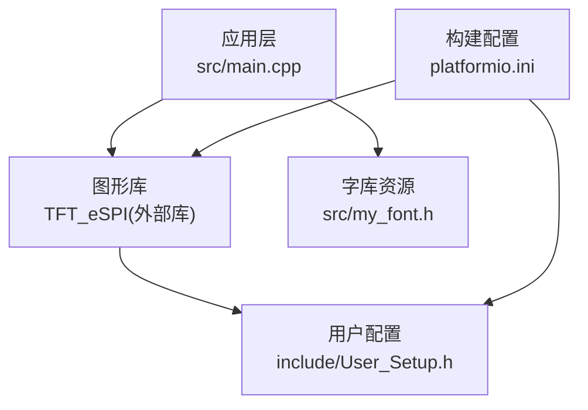
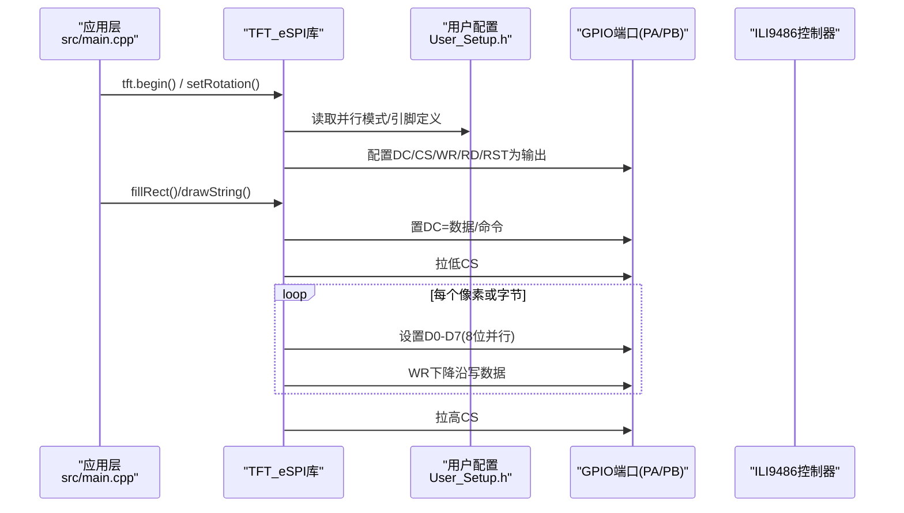
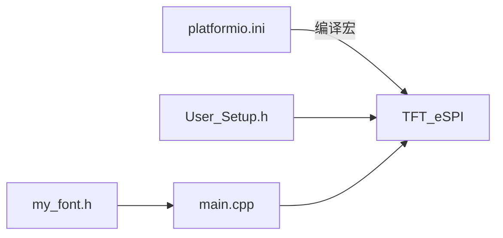

# TFT显示接口

<cite>
**本文引用的文件**
- [src/main.cpp](file://src/main.cpp)
- [include/User_Setup.h](file://include/User_Setup.h)
- [platformio.ini](file://platformio.ini)
- [src/my_font.h](file://src/my_font.h)
</cite>

## 目录
1. [简介](#简介)
2. [项目结构](#项目结构)
3. [核心组件](#核心组件)
4. [架构总览](#架构总览)
5. [详细组件分析](#详细组件分析)
6. [依赖关系分析](#依赖关系分析)
7. [性能与优化](#性能与优化)
8. [故障排查指南](#故障排查指南)
9. [结论](#结论)
10. [附录](#附录)

## 简介
本技术文档面向基于GD32F103RCT6的3.5寸TFT并行接口实现，覆盖以下要点：
- 硬件连接：8位并行数据总线（PB0-PB7）与控制信号（PA1-PA5）的引脚映射与时序要求
- 驱动芯片：ILI9486的配置与初始化流程说明
- 传输优化：BSRR寄存器直接操作、批量写策略与刷新率相关考量
- 屏幕参数：分辨率、色彩深度与典型刷新率
- 电气特性与信号完整性建议
- 常见问题：闪烁、颜色异常、触摸校准等问题的定位与解决思路

本项目采用Arduino框架与TFT_eSPI库，通过8位并行模式驱动ILI9486控制器，运行于Cortex-M3内核的GD32F103RCT6。

## 项目结构
仓库包含应用主程序、用户配置头文件、构建脚本与自定义字库：
- src/main.cpp：应用逻辑、界面绘制、按键处理、ADC采集与系统控制
- include/User_Setup.h：TFT_eSPI的用户配置，定义并行接口、引脚映射、字体选项
- platformio.ini：平台IO工程配置，声明依赖库与编译宏
- src/my_font.h：内置中文字模与ASCII点阵数据结构

图表来源
- [src/main.cpp:1-20](file://src/main.cpp#L1-L20)
- [include/User_Setup.h:14-49](file://include/User_Setup.h#L14-L49)
- [platformio.ini:9-20](file://platformio.ini#L9-L20)

章节来源
- [src/main.cpp:1-20](file://src/main.cpp#L1-L20)
- [include/User_Setup.h:14-49](file://include/User_Setup.h#L14-L49)
- [platformio.ini:9-20](file://platformio.ini#L9-L20)

## 核心组件
- 图形显示抽象：TFT_eSPI实例用于封装底层并行时序与ILI9486命令/数据写入
- 用户配置：User_Setup.h集中定义并行模式、引脚映射、字体加载项
- 构建宏：platformio.ini将关键宏注入编译期，确保选择正确的驱动与端口
- 应用界面：main.cpp负责页面切换、按钮绘制、状态显示与外设联动

章节来源
- [src/main.cpp:10-14](file://src/main.cpp#L10-L14)
- [include/User_Setup.h:22-49](file://include/User_Setup.h#L22-L49)
- [platformio.ini:10-20](file://platformio.ini#L10-L20)

## 架构总览
下图展示从应用到硬件的关键路径：应用调用TFT_eSPI接口，库根据配置生成并行时序，经由GPIO端口与ILI9486通信。

图表来源
- [src/main.cpp:367-370](file://src/main.cpp#L367-L370)
- [include/User_Setup.h:22-49](file://include/User_Setup.h#L22-L49)

## 详细组件分析

### 硬件引脚与并行接口
- 数据总线：PB0-PB7作为D0-D7（8位并行），在8位模式下PB8-PB15保持低电平
- 控制信号：
  - PA2 = DC（数据/命令选择）
  - PA4 = CS（片选）
  - PA5 = WR（写选通）
  - PA3 = RD（读选通）
  - PA1 = RST（复位）
- 这些映射在用户配置与构建宏中一致定义，确保库能正确生成并行时序

章节来源
- [include/User_Setup.h:4-12](file://include/User_Setup.h#L4-L12)
- [include/User_Setup.h:42-49](file://include/User_Setup.h#L42-L49)
- [platformio.ini:15-28](file://platformio.ini#L15-L28)

### ILI9486驱动与初始化流程
- 驱动选择：启用ILI9486驱动宏
- 初始化入口：tft.begin()由库内部完成，包括复位、基本寄存器配置、内存访问模式、像素格式等
- 旋转与尺寸：setRotation(1)设置为横屏480x320
- 注意：具体寄存器序列由库内ILI9486驱动代码提供，应用层无需手动下发

章节来源
- [include/User_Setup.h:30-36](file://include/User_Setup.h#L30-L36)
- [src/main.cpp:367-370](file://src/main.cpp#L367-L370)

### 并行时序与数据传输优化
- 8位并行模式：每次写一个字节（8位），配合WR脉冲完成一次传输
- BSRR优化：启用STM_PORTB_DATA_BUS后，库使用GPIOB->BSRR进行单周期写，减少指令开销
- 批量写：fillRect等函数会尽量以行块形式发送，降低控制开销
- 读写分离：DC用于区分命令与数据；CS在每次事务前后拉低/拉高；RD在需要读像素时使用

章节来源
- [include/User_Setup.h:24-28](file://include/User_Setup.h#L24-L28)
- [include/User_Setup.h:42-49](file://include/User_Setup.h#L42-L49)

### 屏幕参数
- 分辨率：480x320（横屏）
- 色彩深度：ILI9486支持16/18/24位色，库默认常用16位RGB565
- 刷新率：取决于MCU时钟、并行带宽与填充量；典型全屏刷新在几十毫秒级，局部更新更快

章节来源
- [src/main.cpp:22-24](file://src/main.cpp#L22-L24)
- [include/User_Setup.h:30-36](file://include/User_Setup.h#L30-L36)

### 应用界面与交互
- 主页、正压启动、系统设置、调试四个界面
- 按钮绘制与中文混合字符串渲染
- 按键消抖与蜂鸣反馈
- 实时压力/温度显示与报警状态指示

章节来源
- [src/main.cpp:168-310](file://src/main.cpp#L168-L310)
- [src/main.cpp:312-364](file://src/main.cpp#L312-L364)

### 字库与字符渲染
- 内置24x24汉字点阵与ASCII点阵
- drawChineseChar/drawMixedString按点阵逐像素填充矩形区域

章节来源
- [src/my_font.h:6-10](file://src/my_font.h#L6-L10)
- [src/main.cpp:112-142](file://src/main.cpp#L112-L142)

## 依赖关系分析
- 外部库：bodmer/TFT_eSPI@^2.5.43
- 构建宏：并行模式、端口选择、驱动类型、引脚映射、字体加载项
- 运行时依赖：Arduino核心、CMSIS、HAL/LL（由平台包提供）

图表来源
- [platformio.ini:9-20](file://platformio.ini#L9-L20)
- [include/User_Setup.h:22-49](file://include/User_Setup.h#L22-L49)
- [src/main.cpp:10-14](file://src/main.cpp#L10-L14)

章节来源
- [platformio.ini:9-20](file://platformio.ini#L9-L20)
- [include/User_Setup.h:22-49](file://include/User_Setup.h#L22-L49)
- [src/main.cpp:10-14](file://src/main.cpp#L10-L14)

## 性能与优化
- 使用BSRR单周期写：显著降低每字节写入开销，提升整体吞吐
- 批量绘制：优先使用fillRect、drawFastHLine/VLine等高效API
- 减少不必要的整屏刷新：仅重绘变化区域
- 合理设置延时与采样：ADC采样与显示刷新解耦，避免阻塞
- 字体裁剪：按需加载字体，减小Flash占用与初始化时间

章节来源
- [include/User_Setup.h:24-28](file://include/User_Setup.h#L24-L28)
- [src/main.cpp:391-432](file://src/main.cpp#L391-L432)

## 故障排查指南
- 无显示或花屏
  - 检查RST/CS/WR/DC时序与极性是否正确
  - 确认PB0-PB7与PA1-PA5连线无误，PB8-PB15在8位模式下保持低电平
  - 核对User_Setup.h与platformio.ini中的宏一致
- 颜色异常
  - 确认像素格式（RGB565/BGR565）与ILI9486配置匹配
  - 检查数据线是否短路或接触不良
- 闪烁或撕裂
  - 避免在循环中频繁整屏刷新，改为局部更新
  - 适当增加WR脉宽或降低刷新频率
- 触摸校准问题
  - 若使用电阻式触摸屏，需在进入校准前稳定ADC并执行多点采样
  - 校准系数需保存至非易失存储，重启后恢复
- 噪声与干扰
  - 控制线与数据线走线尽量短且平行，远离大电流回路
  - 必要时在WR/CS线上加小电容滤波，保证边沿清晰

[本节为通用指导，不直接分析具体文件]

## 结论
本项目通过TFT_eSPI与8位并行接口在GD32F103RCT6上稳定驱动ILI9486控制器，实现了480x320横屏显示与基础人机交互。借助BSRR优化与批量绘制策略，可在有限资源下获得良好的刷新性能。建议在PCB布局与布线时重视信号完整性，并在软件层面采用增量刷新以降低功耗与延迟。

[本节为总结性内容，不直接分析具体文件]

## 附录

### 引脚映射表
- 数据总线：PB0-PB7 → D0-D7（8位并行）
- 控制信号：
  - PA2 → DC
  - PA4 → CS
  - PA5 → WR
  - PA3 → RD
  - PA1 → RST
- PB8-PB15：在8位模式下保持低电平

章节来源
- [include/User_Setup.h:4-12](file://include/User_Setup.h#L4-L12)
- [include/User_Setup.h:42-49](file://include/User_Setup.h#L42-L49)
- [platformio.ini:21-36](file://platformio.ini#L21-L36)

### 电气特性与信号完整性建议
- I/O电平：3.3V CMOS兼容
- 上升/下降时间：建议控制在几纳秒以内，避免过冲与振铃
- 走线长度：尽量短且等长，减少串扰
- 电源去耦：靠近LCD模块放置0.1uF与10uF电容
- 屏蔽与隔离：控制线与数据线分开走线，避免与继电器/电机等高噪声线路交叉

[本节为通用指导，不直接分析具体文件]

### 时序要求（概念性说明）
- DC：在写命令前置低，写数据前置高
- CS：事务开始前拉低，结束后拉高
- WR：数据稳定后产生下降沿，维持最小脉宽
- RD：读操作时拉低，读取完成后拉高
- RST：复位期间拉低，释放后拉高并保持足够延时

[本节为通用指导，不直接分析具体文件]