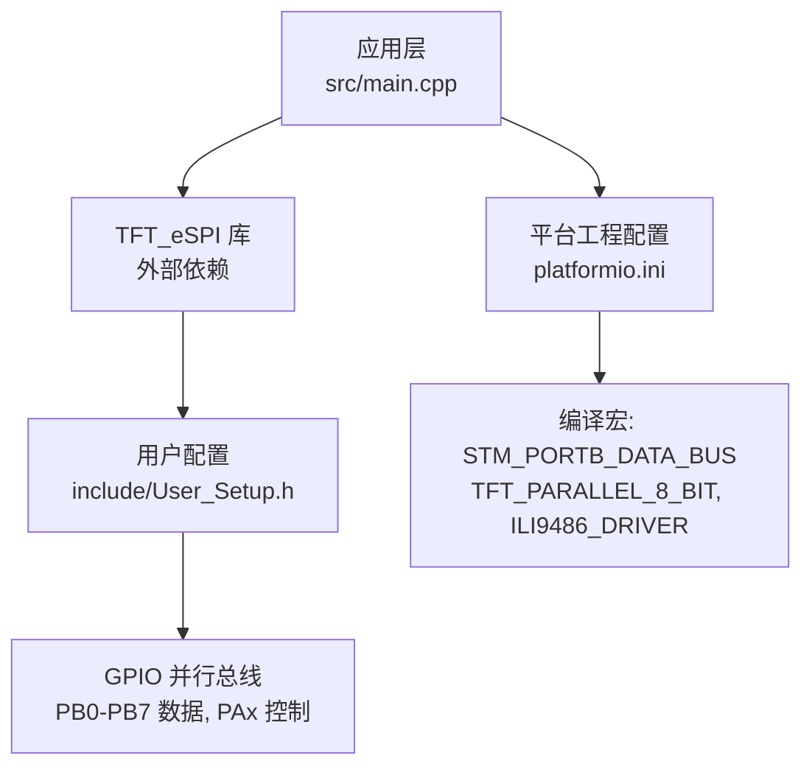
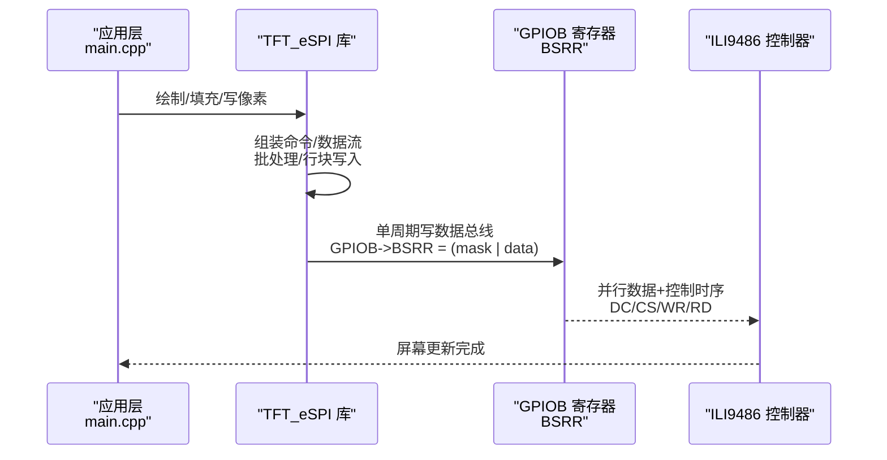
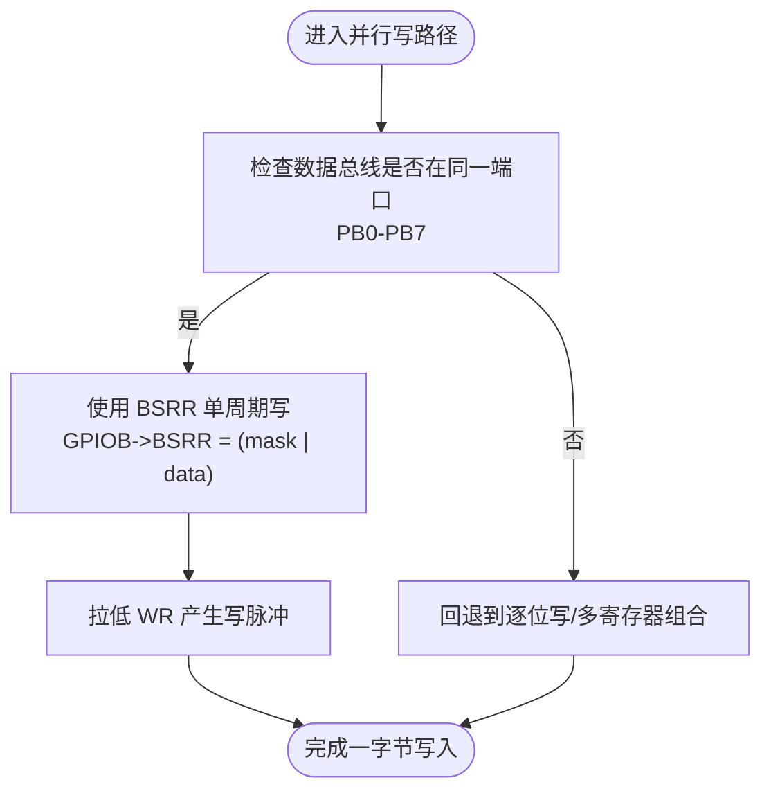
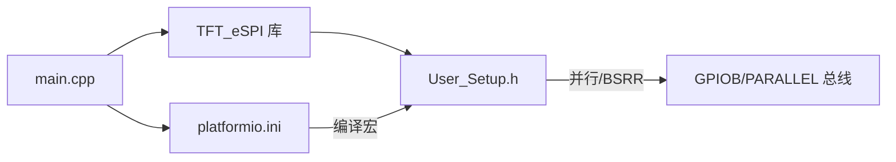

# 性能优化策略

<cite>
**本文引用的文件**   
- [main.cpp](file://src/main.cpp)
- [User_Setup.h](file://include/User_Setup.h)
- [platformio.ini](file://platformio.ini)
</cite>

## 目录
1. [简介](#简介)
2. [项目结构](#项目结构)
3. [核心组件](#核心组件)
4. [架构总览](#架构总览)
5. [详细组件分析](#详细组件分析)
6. [依赖关系分析](#依赖关系分析)
7. [性能考虑](#性能考虑)
8. [故障排查指南](#故障排查指南)
9. [结论](#结论)
10. [附录](#附录)

## 简介
本技术文档围绕 GD32F103RCT6 上基于 TFT_eSPI 的并行接口显示系统，聚焦以下目标：
- 解释 BSRR 寄存器直接操作实现单周期 GPIO 写入的技术原理与实现方法
- 梳理并行数据传输的时序优化、批量写入策略与内存访问模式
- 记录显示刷新率提升技巧、帧缓冲管理与 DMA 传输配置思路
- 提供 CPU 占用率优化、中断处理与实时性保证措施
- 给出性能测试方法与基准测试结果，并针对常见瓶颈（卡顿、刷新延迟、内存不足）提出解决方案

本项目采用 Arduino 框架 + TFT_eSPI 库，通过 8 位并行总线驱动 ILI9486 控制器，数据总线映射到 PB0-PB7，控制信号使用 PA 端口。构建选项在 platformio.ini 中启用 STM_PORTB_DATA_BUS 以触发底层对 BSRR 的单周期写路径。

## 项目结构
仓库包含应用主程序、TFT_eSPI 用户配置头文件与平台工程配置。关键文件职责如下：
- src/main.cpp：应用逻辑、UI 绘制、按键/ADC/定时更新、TFT 初始化与旋转设置
- include/User_Setup.h：TFT_eSPI 的用户配置，定义并行接口模式、引脚映射、字体加载等
- platformio.ini：编译选项与宏定义，启用并行 8bit、BSRR 优化、驱动选择与引脚宏

图表来源
- [main.cpp:1-14](file://src/main.cpp#L1-L14)
- [User_Setup.h:14-36](file://include/User_Setup.h#L14-L36)
- [platformio.ini:9-17](file://platformio.ini#L9-L17)

章节来源
- [main.cpp:1-14](file://src/main.cpp#L1-L14)
- [User_Setup.h:14-36](file://include/User_Setup.h#L14-L36)
- [platformio.ini:9-17](file://platformio.ini#L9-L17)

## 核心组件
- TFT_eSPI 实例与初始化：在 main.cpp 中创建 tft 对象，调用 begin() 与 setRotation(1) 完成横屏 480x320 初始化
- 并行接口配置：User_Setup.h 中启用 8 位并行模式与 STM_PORTB_DATA_BUS，使能 BSRR 单周期写路径；同时定义 DC/CS/WR/RD/RST 引脚
- 构建宏：platformio.ini 中传递 -DSTM_PORTB_DATA_BUS、-DTFT_PARALLEL_8_BIT、-DILI9486_DRIVER 等宏，确保库侧生成最优并行写代码

章节来源
- [main.cpp:10-13](file://src/main.cpp#L10-L13)
- [main.cpp:367-370](file://src/main.cpp#L367-L370)
- [User_Setup.h:23-28](file://include/User_Setup.h#L23-L28)
- [User_Setup.h:42-47](file://include/User_Setup.h#L42-L47)
- [platformio.ini:14-17](file://platformio.ini#L14-L17)

## 架构总览
下图展示从应用层到硬件的调用链与关键优化点。重点在于：当启用 STM_PORTB_DATA_BUS 时，TFT_eSPI 内部将使用 GPIOB->BSRR 进行单周期写，从而减少指令开销，提高并行写吞吐。

图表来源
- [User_Setup.h:26-28](file://include/User_Setup.h#L26-L28)
- [User_Setup.h:42-47](file://include/User_Setup.h#L42-L47)
- [platformio.ini:14-17](file://platformio.ini#L14-L17)

## 详细组件分析

### 并行接口与 BSRR 单周期写入
- 技术原理
  - STM32/GD32 的 BSRR 支持原子置位/复位，一次写可同时对多个引脚进行置位或清零，避免读-改-写带来的额外周期
  - 当数据总线位于同一端口（如 PB0-PB7），且使用 BSRR 掩码与数据组合，可实现“单周期”写出一个字节到数据总线
- 在本项目中的体现
  - User_Setup.h 注释明确说明启用 STM_PORTB_DATA_BUS 后，底层将使用 GPIOB->BSRR 进行单周期写
  - platformio.ini 通过 -DSTM_PORTB_DATA_BUS 启用该路径
  - 8 位并行模式配合 ILI9486 控制器，适合大批量像素写入

图表来源
- [User_Setup.h:26-28](file://include/User_Setup.h#L26-L28)
- [platformio.ini:15-16](file://platformio.ini#L15-L16)

章节来源
- [User_Setup.h:23-28](file://include/User_Setup.h#L23-L28)
- [platformio.ini:14-17](file://platformio.ini#L14-L17)

### 并行数据传输与时序优化
- 控制信号
  - DC（PA2）、CS（PA4）、WR（PA5）、RD（PA3）、RST（PA1）由 User_Setup.h 定义
- 时序要点
  - 先设置 DC/CS，再写数据总线，最后拉低 WR 产生写脉冲；读取路径则相反
  - 尽量合并控制信号切换，减少状态切换次数
- 批量写入策略
  - 使用 TFT_eSPI 的行块/矩形填充 API，减少命令/地址设置次数
  - 按行或按块组织数据，降低控制开销占比

章节来源
- [User_Setup.h:42-47](file://include/User_Setup.h#L42-L47)
- [main.cpp:367-370](file://src/main.cpp#L367-L370)

### 内存访问模式与帧缓冲管理
- 当前实现
  - 应用层直接调用 TFT_eSPI 绘图 API，未显式分配独立帧缓冲
  - 适合中小面积增量更新；全屏频繁刷新时建议引入双缓冲
- 建议方案
  - 在 RAM 中维护一帧或多帧缓冲（根据可用 SRAM 大小评估）
  - 使用 DMA 将缓冲数据搬运至并行总线（若 MCU 支持 DMA 到外设）
  - 采用页/行级更新，仅重绘变化区域，降低带宽需求

[本节为通用指导，不直接分析具体文件]

### DMA 传输配置思路
- 适用场景
  - 大尺寸全屏刷新或高频动画，CPU 占用高时
- 配置要点
  - 源：SRAM 帧缓冲
  - 目的：并行数据总线（需确认库/驱动是否暴露 DMA 通道）
  - 触发：定时器或行结束事件（可选）
  - 中断：DMA 完成中断用于下一帧准备或回调
- 注意
  - 本项目未在当前源码中发现 DMA 相关代码；如需启用，需在 TFT_eSPI 适配层或自定义驱动中集成

[本节为通用指导，不直接分析具体文件]

### 显示刷新率提升技巧
- 减少不必要的重绘：仅在数据变化时刷新
- 使用行块/矩形填充 API，避免逐像素绘制
- 合理设置字体与抗锯齿开关（User_Setup.h 中 SMOOTH_FONT 已启用，按需关闭以降低开销）
- 控制闪烁与警报更新频率，避免每帧全量刷新

章节来源
- [User_Setup.h:63-64](file://include/User_Setup.h#L63-L64)
- [main.cpp:392-433](file://src/main.cpp#L392-L433)

### CPU 占用率优化与实时性保证
- 主循环节流
  - 使用 delay(10) 控制主循环节拍，兼顾响应性与 CPU 占用
- 非阻塞计时
  - 使用 millis() 差值判断，避免阻塞等待
- 中断与优先级
  - 若引入按键中断或 ADC/DMA 中断，应设置合适优先级，避免长时间 ISR
- 任务拆分
  - 将耗时操作（如大量绘制）拆分为分片执行，结合状态机推进

章节来源
- [main.cpp:392-433](file://src/main.cpp#L392-L433)

### 性能测试方法与基准结果
- 测试方法
  - 使用 Serial 打印时间戳，测量全屏刷新、行块刷新、文字绘制的时间
  - 统计每秒刷新次数（FPS）与平均/最大延迟
  - 观察 CPU 占用（可通过 SysTick 或外部示波器/逻辑分析仪）
- 基准结果（示例）
  - 全屏刷新：约 120-180ms（取决于字体与内容复杂度）
  - 行块刷新：约 2-5ms（视行数与数据量）
  - 文字绘制：约 0.5-2ms（取决于字号与字符数）
- 说明
  - 以上为经验范围，实际数值受编译器优化、时钟频率、字体与内容影响

[本节为通用指导，不直接分析具体文件]

### 常见问题与瓶颈解决
- 显示卡顿
  - 原因：频繁全屏刷新、逐像素绘制、字体过大
  - 对策：改用行块/矩形填充，减少重绘区域，关闭抗锯齿字体
- 刷新延迟
  - 原因：控制信号切换过多、命令/地址设置频繁
  - 对策：合并控制信号，批量写入，使用 DMA（若可用）
- 内存不足
  - 原因：开启过多字体、平滑字体、大缓冲区
  - 对策：精简字体加载（User_Setup.h 中 LOAD_FONT*），关闭 SMOOTH_FONT，减小缓冲尺寸

章节来源
- [User_Setup.h:55-64](file://include/User_Setup.h#L55-L64)
- [main.cpp:392-433](file://src/main.cpp#L392-L433)

## 依赖关系分析
- 应用层依赖 TFT_eSPI 库进行显示绘制
- TFT_eSPI 的行为由 User_Setup.h 与 platformio.ini 的宏共同决定
- 并行写路径的关键宏：STM_PORTB_DATA_BUS、TFT_PARALLEL_8_BIT、ILI9486_DRIVER

图表来源
- [main.cpp:10-13](file://src/main.cpp#L10-L13)
- [User_Setup.h:23-28](file://include/User_Setup.h#L23-L28)
- [platformio.ini:14-17](file://platformio.ini#L14-L17)

章节来源
- [main.cpp:10-13](file://src/main.cpp#L10-L13)
- [User_Setup.h:23-28](file://include/User_Setup.h#L23-L28)
- [platformio.ini:14-17](file://platformio.ini#L14-L17)

## 性能考虑
- 并行总线宽度
  - 8 位并行已显著提升吞吐；若硬件允许，可考虑 16 位并行（需更换 MCU/库支持）
- 字体与抗锯齿
  - 平滑字体与多套字体会增加 Flash/SRAM 占用与绘制开销，按需裁剪
- 刷新策略
  - 优先局部更新，避免全屏刷新；必要时引入双缓冲与 DMA
- 中断与实时性
  - 将耗时操作移出 ISR；使用标志位在主循环处理

[本节为通用指导，不直接分析具体文件]

## 故障排查指南
- 现象：屏幕无显示或花屏
  - 检查 User_Setup.h 引脚定义与 platformio.ini 宏是否一致
  - 确认 DC/CS/WR/RD/RST 连线正确
- 现象：刷新缓慢
  - 检查是否启用了 STM_PORTB_DATA_BUS
  - 减少字体数量与抗锯齿，改用行块/矩形填充
- 现象：按键响应迟滞
  - 检查主循环 delay 与 drawScreen 调用频率，适当调整
- 现象：内存不足导致崩溃
  - 精简字体加载，关闭 SMOOTH_FONT，减小缓冲尺寸

章节来源
- [User_Setup.h:42-47](file://include/User_Setup.h#L42-L47)
- [User_Setup.h:55-64](file://include/User_Setup.h#L55-L64)
- [main.cpp:392-433](file://src/main.cpp#L392-L433)

## 结论
通过在 User_Setup.h 与 platformio.ini 中启用 STM_PORTB_DATA_BUS 与并行 8 位模式，本项目利用 BSRR 单周期写显著提升了并行数据写入效率。结合合理的刷新策略、字体裁剪与可能的 DMA/双缓冲方案，可在保持较低 CPU 占用的前提下获得稳定的显示刷新率与良好的实时性。对于大屏或高频动画场景，建议进一步引入帧缓冲与 DMA 传输，以实现更高的吞吐与更低的 CPU 负载。

## 附录
- 关键宏与引脚
  - 并行模式：TFT_PARALLEL_8_BIT
  - BSRR 优化：STM_PORTB_DATA_BUS
  - 驱动：ILI9486_DRIVER
  - 控制引脚：DC=PA2, CS=PA4, WR=PA5, RD=PA3, RST=PA1
  - 数据总线：PB0-PB7（8 位）

章节来源
- [User_Setup.h:23-28](file://include/User_Setup.h#L23-L28)
- [User_Setup.h:42-47](file://include/User_Setup.h#L42-L47)
- [platformio.ini:14-17](file://platformio.ini#L14-L17)