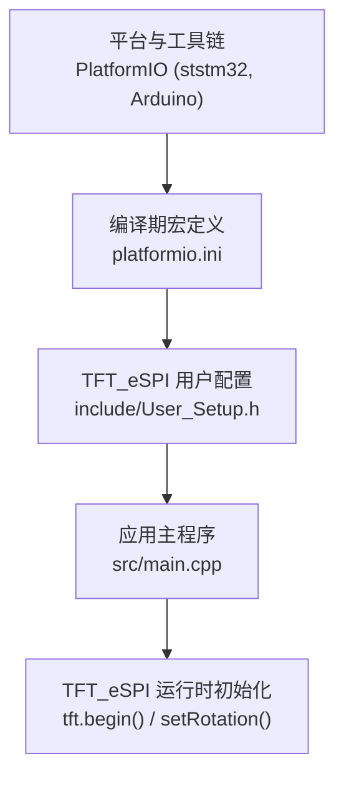
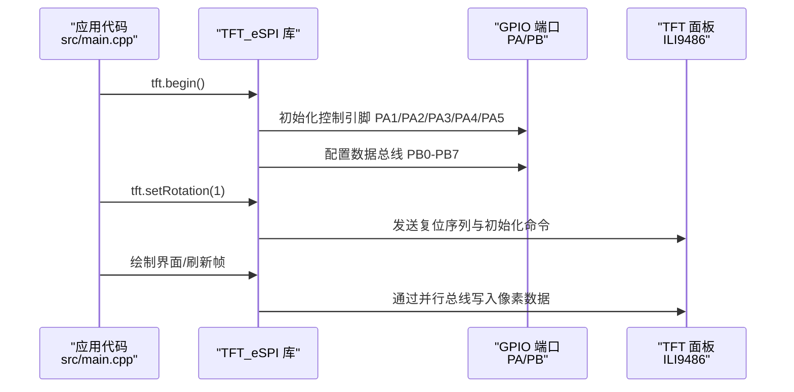
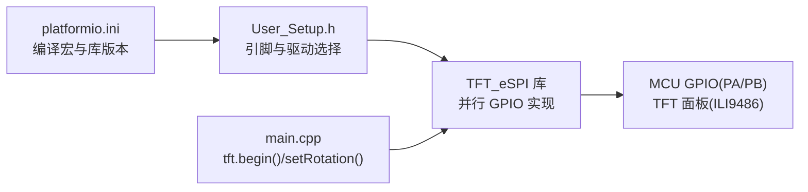
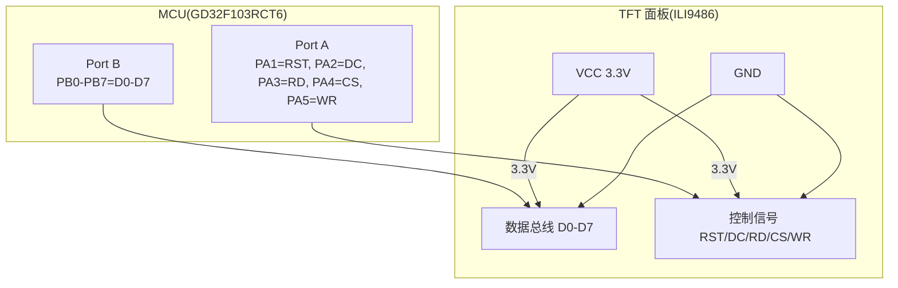

# 硬件连接配置

<cite>
**本文引用的文件**   
- [include/User_Setup.h](file://include/User_Setup.h)
- [src/main.cpp](file://src/main.cpp)
- [platformio.ini](file://platformio.ini)
</cite>

## 目录
1. [简介](#简介)
2. [项目结构](#项目结构)
3. [核心组件](#核心组件)
4. [架构总览](#架构总览)
5. [详细组件分析](#详细组件分析)
6. [依赖关系分析](#依赖关系分析)
7. [性能与信号完整性](#性能与信号完整性)
8. [故障排查指南](#故障排查指南)
9. [结论](#结论)
10. [附录：引脚分配表与接线图](#附录引脚分配表与接线图)

## 简介
本文件面向使用 GD32F103RCT6 驱动 3.5 寸 TFT（ILI9486 驱动）的硬件设计与调试人员，聚焦于以下目标：
- 明确 8 位并行数据总线与控制信号的引脚映射
- 说明 ILI9486 驱动芯片的连接方式与电气特性要点
- 记录电源、背光控制、触摸接口等辅助连接的配置方法
- 提供 PCB 布线建议、信号完整性与电磁兼容设计要点
- 给出完整引脚分配表与接线图，并总结常见问题与解决方案

## 项目结构
本项目采用 Arduino + TFT_eSPI 库在 PlatformIO 环境下构建。关键配置文件位于 include/User_Setup.h 与 platformio.ini，主程序入口为 src/main.cpp。

图表来源
- [platformio.ini:1-47](file://platformio.ini#L1-L47)
- [include/User_Setup.h:1-74](file://include/User_Setup.h#L1-L74)
- [src/main.cpp:367-371](file://src/main.cpp#L367-L371)

章节来源
- [platformio.ini:1-47](file://platformio.ini#L1-L47)
- [include/User_Setup.h:1-74](file://include/User_Setup.h#L1-L74)
- [src/main.cpp:367-371](file://src/main.cpp#L367-L371)

## 核心组件
- 微控制器：GD32F103RCT6（与 STM32F103RC 兼容）
- 显示模块：3.5 寸 TFT，分辨率 480x320，横屏，驱动 IC 为 ILI9486
- 接口模式：8 位并行（D0-D7），控制信号 DC/CS/WR/RD/RST
- 字体与渲染：TFT_eSPI 库，启用多种内置字体与平滑字体支持

章节来源
- [include/User_Setup.h:23-36](file://include/User_Setup.h#L23-L36)
- [include/User_SetSetup.h:55-64](file://include/User_Setup.h#L55-L64)
- [src/main.cpp:22-24](file://src/main.cpp#L22-L24)

## 架构总览
下图展示了从应用层到硬件接口的调用路径与关键配置点。

图表来源
- [src/main.cpp:367-371](file://src/main.cpp#L367-L371)
- [include/User_Setup.h:42-49](file://include/User_Setup.h#L42-L49)
- [platformio.ini:17-38](file://platformio.ini#L17-L38)

## 详细组件分析

### 8 位并行数据总线与控制信号映射
- 数据总线（8 位）：PB0~PB7 对应 TFT_D0~D7
- 控制信号：
  - TFT_DC = PA2
  - TFT_CS = PA4
  - TFT_WR = PA5
  - TFT_RD = PA3
  - TFT_RST = PA1
- 16 位扩展位（D8~D15）：PB8~PB15 在 8 位模式下保持低电平

上述映射同时由编译期宏与用户配置头文件共同生效，确保 TFT_eSPI 以 8 位并行模式访问 ILI9486。

章节来源
- [include/User_SetSetup.h:4-12](file://include/User_Setup.h#L4-L12)
- [include/User_SetSetup.h:23-28](file://include/User_Setup.h#L23-L28)
- [include/User_SetSetup.h:42-49](file://include/User_Setup.h#L42-L49)
- [platformio.ini:15-38](file://platformio.ini#L15-L38)

### ILI9486 驱动芯片连接与电气特性要点
- 接口时序：8 位并行写时序，由 WR 控制；DC 用于区分命令与数据；CS 片选使能；RD 读时序（通常写为主）
- 复位：RST 低有效或上升沿触发复位序列（具体时序遵循 ILI9486 数据手册）
- 电压域：典型 3.3V I/O 电平，需确保 MCU 输出高电平满足 ILI9486 输入高阈值
- 时钟与建立/保持时间：并行总线频率受限于 MCU GPIO 翻转速度与走线长度，建议短走线与就近布局

章节来源
- [include/User_SetSetup.h:23-36](file://include/User_Setup.h#L23-L36)
- [platformio.ini:15-17](file://platformio.ini#L15-L17)

### 电源与去耦
- VCC/VDD：3.3V 供电，建议在靠近屏幕模块处放置足够容量的去耦电容（如 1μF + 0.1μF 并联）
- GND：单点接地或星型接地，避免数字地与模拟地混叠造成噪声耦合
- 上电顺序：先稳定 3.3V，再释放 RST，确保 ILI9486 可靠复位

章节来源
- [include/User_SetSetup.h:23-36](file://include/User_Setup.h#L23-L36)

### 背光控制
- 当前工程未启用独立背光引脚（TFT_BL_PIN 设为无效值），可通过 PWM 或普通 IO 控制 LED 背光
- 如需调光，可在 main.cpp 中定义背光引脚并使用 PWM 或数字开关控制

章节来源
- [src/main.cpp:19](file://src/main.cpp#L19)

### 触摸接口
- 当前工程未集成触摸屏驱动；若需要，可复用 SPI 或 I2C 资源，并在 User_Setup.h 中启用相应触摸选项
- 注意与并行总线隔离，避免共用同一组 GPIO 导致冲突

章节来源
- [include/User_SetSetup.h:70-73](file://include/User_SetSetup.h#L70-L73)

### 其他外设（与本任务相关度较低）
- 按键、蜂鸣器、继电器、ADC 等在本工程中用于系统功能，但与 TFT 并行总线无直接耦合

章节来源
- [src/main.cpp:15-20](file://src/main.cpp#L15-L20)

## 依赖关系分析
- 构建期依赖：PlatformIO 指定 TFT_eSPI 库版本与编译宏
- 运行期依赖：TFT_eSPI 根据宏与用户配置生成针对 STM32/GD32 的并行 GPIO 操作代码

图表来源
- [platformio.ini:9-17](file://platformio.ini#L9-L17)
- [include/User_SetSetup.h:14-36](file://include/User_SetSetup.h#L14-L36)
- [src/main.cpp:367-371](file://src/main.cpp#L367-L371)

章节来源
- [platformio.ini:9-17](file://platformio.ini#L9-L17)
- [include/User_SetSetup.h:14-36](file://include/User_SetSetup.h#L14-L36)
- [src/main.cpp:367-371](file://src/main.cpp#L367-L371)

## 性能与信号完整性
- 并行总线优化：启用 STM_PORTB_DATA_BUS 后，TFT_eSPI 使用 BSRR 单次写入 8 位数据，降低 CPU 开销
- 时钟与延迟：并行写速度取决于 GPIO 翻转速率与 PCB 走线质量，建议尽量缩短数据总线长度并保持等长
- 阻抗与串扰：8 条数据线应成组布线，相邻走线间保留适当间距，必要时加地线屏蔽
- 电源噪声：并行切换电流较大，需在屏幕侧就近放置去耦电容，避免电源跌落影响显示稳定性

章节来源
- [include/User_SetSetup.h:26-28](file://include/User_SetSetup.h#L26-L28)
- [platformio.ini:15-17](file://platformio.ini#L15-L17)

## 故障排查指南
- 屏幕不亮或花屏
  - 检查 RST/CS/WR/DC/RD 是否按配置连接到正确引脚
  - 确认 3.3V 供电稳定且去耦电容到位
  - 核对 User_SetSetup.h 与 platformio.ini 中的宏定义一致
- 显示错位或颜色异常
  - 确认 8 位并行模式已启用，且 PB0-PB7 与 D0-D7 一一对应
  - 检查 D8-D15（PB8-PB15）在 8 位模式下是否被拉低
- 触摸不可用
  - 若启用触摸，确认触摸接口与并行总线无引脚冲突，并正确配置触摸协议
- 背光不亮
  - 当前工程未启用背光控制，需在 main.cpp 中定义背光引脚并进行控制

章节来源
- [include/User_SetSetup.h:4-12](file://include/User_SetSetup.h#L4-L12)
- [include/User_SetSetup.h:23-36](file://include/User_SetSetup.h#L23-L36)
- [src/main.cpp:19](file://src/main.cpp#L19)

## 结论
本项目基于 GD32F103RCT6 与 TFT_eSPI 库，采用 8 位并行接口驱动 ILI9486 驱动的 3.5 寸 TFT。通过合理的引脚映射、稳定的电源与去耦、以及良好的 PCB 布线策略，可实现稳定可靠的显示效果。后续可根据需求扩展背光与触摸功能，并注意与并行总线的资源隔离与时序匹配。

## 附录：引脚分配表与接线图

### 引脚分配表
- 数据总线（8 位）：
  - D0 → PB0
  - D1 → PB1
  - D2 → PB2
  - D3 → PB3
  - D4 → PB4
  - D5 → PB5
  - D6 → PB6
  - D7 → PB7
- 控制信号：
  - TFT_DC → PA2
  - TFT_CS → PA4
  - TFT_WR → PA5
  - TFT_RD → PA3
  - TFT_RST → PA1
- 扩展位（8 位模式保持低）：
  - D8~D15 → PB8~PB15（保持低电平）

章节来源
- [include/User_SetSetup.h:4-12](file://include/User_SetSetup.h#L4-L12)
- [include/User_SetSetup.h:42-49](file://include/User_SetSetup.h#L42-L49)
- [platformio.ini:17-38](file://platformio.ini#L17-L38)

### 接线图（示意）

图表来源
- [include/User_SetSetup.h:4-12](file://include/User_SetSetup.h#L4-L12)
- [include/User_SetSetup.h:42-49](file://include/User_SetSetup.h#L42-L49)
- [platformio.ini:17-38](file://platformio.ini#L17-L38)