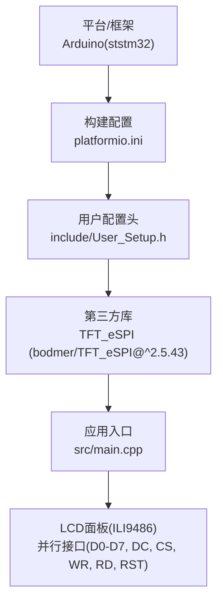
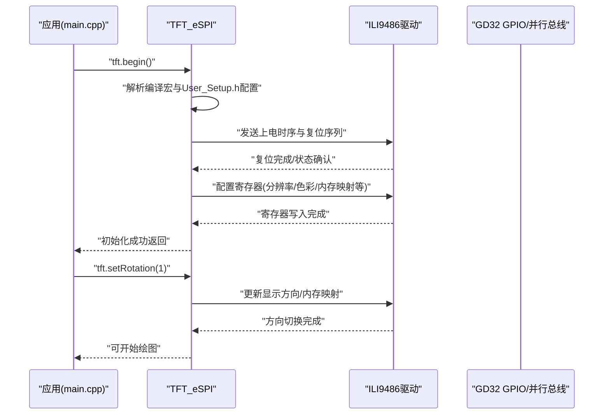
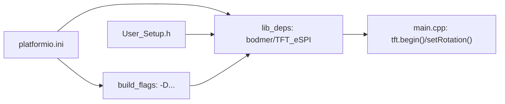

# 驱动初始化流程

<cite>
**本文引用的文件**   
- [include/User_Setup.h](file://include/User_Setup.h)
- [src/main.cpp](file://src/main.cpp)
- [platformio.ini](file://platformio.ini)
</cite>

## 目录
1. [简介](#简介)
2. [项目结构](#项目结构)
3. [核心组件](#核心组件)
4. [架构总览](#架构总览)
5. [详细组件分析](#详细组件分析)
6. [依赖关系分析](#依赖关系分析)
7. [性能与并行接口特性](#性能与并行接口特性)
8. [故障排查指南](#故障排查指南)
9. [结论](#结论)
10. [附录：初始化代码示例与调试方法](#附录初始化代码示例与调试方法)

## 简介
本技术文档围绕 ILI9486 TFT 驱动芯片的初始化流程，结合本项目对 GD32F103RCT6 的并行接口配置与应用层调用，系统阐述以下要点：
- 上电时序、复位序列与寄存器配置步骤（由 TFT_eSPI 库在运行时完成）
- 并行接口模式设置、时钟频率配置和数据总线宽度选择（通过构建宏与用户配置实现）
- 显示参数初始化（分辨率、色彩格式、内存映射等，由库根据配置自动下发）
- 驱动库加载顺序、依赖项检查与错误处理机制（基于编译期宏与运行期 API）
- 初始化代码示例与调试方法，覆盖通信超时、寄存器写入错误与显示异常等常见问题

## 项目结构
本项目采用 Arduino + PlatformIO 工程组织方式，关键文件职责如下：
- include/User_Setup.h：TFT_eSPI 的用户级配置头文件，定义引脚、接口模式、字体选项等
- src/main.cpp：应用主程序，负责硬件初始化、屏幕初始化与业务逻辑
- platformio.ini：构建环境配置，声明依赖库、编译宏与引脚映射

图表来源
- [platformio.ini:1-47](file://platformio.ini#L1-L47)
- [include/User_Setup.h:1-74](file://include/User_Setup.h#L1-L74)
- [src/main.cpp:10-14](file://src/main.cpp#L10-L14)

章节来源
- [platformio.ini:1-47](file://platformio.ini#L1-L47)
- [include/User_Setup.h:1-74](file://include/User_Setup.h#L1-L74)
- [src/main.cpp:10-14](file://src/main.cpp#L10-L14)

## 核心组件
- 用户配置头 User_Setup.h
  - 启用 STM32/GD32 优化路径
  - 选择 8-bit 并行数据总线，并指定 Port B 为数据口
  - 选择 ILI9486 驱动
  - 定义控制引脚：DC、CS、WR、RD、RST
- 应用入口 main.cpp
  - 包含 TFT_eSPI 头文件
  - 在 setup() 中调用 tft.begin() 与 tft.setRotation()
- 构建配置 platformio.ini
  - 声明 lib_deps 引入 bodmer/TFT_eSPI
  - 通过 -D 宏开启并行模式、端口优化、驱动型号与引脚映射
  - 同时保留字体加载宏以支持中文绘制

章节来源
- [include/User_Setup.h:14-48](file://include/User_Setup.h#L14-L48)
- [src/main.cpp:10-14](file://src/main.cpp#L10-L14)
- [src/main.cpp:367-371](file://src/main.cpp#L367-L371)
- [platformio.ini:9-47](file://platformio.ini#L9-L47)

## 架构总览
从应用到硬件的调用链如下：
- 应用层在 setup() 中调用 tft.begin()，触发 TFT_eSPI 内部初始化
- TFT_eSPI 依据编译期宏与用户配置，选择 ILI9486 驱动与并行接口实现
- 库内部执行上电时序、复位序列与寄存器配置，完成显示参数初始化
- 应用层随后进行旋转设置与绘图操作

图表来源
- [src/main.cpp:367-371](file://src/main.cpp#L367-L371)
- [include/User_Setup.h:23-48](file://include/User_Setup.h#L23-L48)
- [platformio.ini:13-22](file://platformio.ini#L13-L22)

## 详细组件分析

### 并行接口与引脚映射
- 数据总线宽度：8位并行（D0-D7），PB0-PB7作为数据口；PB8-PB15在8位模式下保持低电平
- 控制信号：DC(PA2)、CS(PA4)、WR(PA5)、RD(PA3)、RST(PA1)
- 端口优化：启用 STM_PORTB_DATA_BUS，使用 BSRR 单周期写提升吞吐
- 构建宏与用户配置双重生效：platformio.ini 中的 -D 宏与 User_Setup.h 中的 #define 共同决定最终行为

章节来源
- [include/User_Setup.h:23-48](file://include/User_Setup.h#L23-L48)
- [platformio.ini:15-22](file://platformio.ini#L15-L22)

### 驱动选择与库加载顺序
- 驱动选择：通过宏 ILI9486_DRIVER 指定 ILI9486 驱动分支
- 库加载：PlatformIO 在构建时拉取 bodmer/TFT_eSPI@^2.5.43
- 加载顺序：
  1) 构建阶段解析宏与依赖
  2) 链接阶段将 TFT_eSPI 与用户配置合并
  3) 运行阶段 tft.begin() 触发具体驱动初始化

章节来源
- [platformio.ini:9-17](file://platformio.ini#L9-L17)
- [include/User_Setup.h:30-36](file://include/User_Setup.h#L30-L36)
- [src/main.cpp:10-14](file://src/main.cpp#L10-L14)

### 显示参数初始化（分辨率/色彩/内存映射）
- 分辨率：应用侧定义 W=480、H=320，并在旋转后按横屏布局绘制
- 色彩格式：由 TFT_eSPI 根据驱动与接口模式自动配置（16位 RGB565 常见）
- 内存映射：tft.setRotation(1) 会更新 ILI9486 的GRAM读写方向与坐标映射
- 注意：具体的寄存器值与命令序列由库内部实现，应用层无需直接写入

章节来源
- [src/main.cpp:22-24](file://src/main.cpp#L22-L24)
- [src/main.cpp:369-370](file://src/main.cpp#L369-L370)

### 上电时序与复位序列（库内实现）
- 上电时序：包括 VCI/VDD 稳定等待、RST 低电平保持、延时等待内部电源稳定
- 复位序列：RST 拉高后进入软复位或硬复位流程，随后发送一系列初始化命令
- 寄存器配置：设置像素格式、扫描方向、睡眠/唤醒、伽马曲线、窗口地址等
- 说明：上述步骤由 TFT_eSPI 针对 ILI9486 的实现完成，应用层仅通过 begin()/setRotation() 触发

章节来源
- [src/main.cpp:367-371](file://src/main.cpp#L367-L371)
- [include/User_Setup.h:23-48](file://include/User_Setup.h#L23-L48)

### 时钟频率与并行总线速度
- 并行模式不使用 SPI 频率宏，但工程中保留了 SPI_FREQUENCY 等宏用于完整性
- 实际并行总线速度取决于 MCU 时钟与 GPIO 翻转能力；STM_PORTB_DATA_BUS 优化可降低每次写操作的开销
- 若需进一步调优，可在 MCU 层面调整系统时钟与 GPIO 输出速率（不在本仓库源码中体现）

章节来源
- [include/User_Setup.h:70-73](file://include/User_Setup.h#L70-L73)
- [include/User_Setup.h:26-28](file://include/User_Setup.h#L26-L28)

## 依赖关系分析
- 外部依赖：bodmer/TFT_eSPI@^2.5.43
- 构建宏依赖：
  - USER_SETUP_LOADED：启用用户配置头
  - STM32：启用 STM32/GD32 优化路径
  - TFT_PARALLEL_8_BIT：启用 8位并行接口
  - STM_PORTB_DATA_BUS：启用 PB 端口优化
  - ILI9486_DRIVER：选择 ILI9486 驱动
  - 引脚宏：DTFT_DC/CS/WR/RD/RST/D0-D15
  - 字体宏：LOAD_GLCD/LOAD_FONTx/LOAD_GFXFF/SMOOTH_FONT
- 运行时依赖：
  - Arduino 基础 API（pinMode/digitalWrite/millis/delay 等）
  - 硬件资源：GPIO 端口、中断/定时器（应用侧按键与计时）

图表来源
- [platformio.ini:9-47](file://platformio.ini#L9-L47)
- [include/User_Setup.h:14-48](file://include/User_Setup.h#L14-L48)
- [src/main.cpp:367-371](file://src/main.cpp#L367-L371)

章节来源
- [platformio.ini:9-47](file://platformio.ini#L9-L47)
- [include/User_Setup.h:14-48](file://include/User_Setup.h#L14-L48)
- [src/main.cpp:367-371](file://src/main.cpp#L367-L371)

## 性能与并行接口特性
- 8位并行 + PB 端口优化：利用 BSRR 单周期写，降低每次写数据的指令开销
- 无 DMA 情况下，建议减少不必要的全屏刷新，局部刷新更高效
- 合理设置旋转与窗口地址，避免跨页写入带来的额外开销
- 字体渲染与中文字库占用较多 Flash/RAM，按需裁剪字体宏可减少资源消耗

[本节为通用性能建议，不直接分析具体文件]

## 故障排查指南
- 通信超时
  - 现象：tft.begin() 长时间无响应或卡死
  - 排查：
    - 确认 RST、CS、WR、RD、DC 引脚连接正确且电平有效
    - 检查 User_Setup.h 与 platformio.ini 的宏是否一致（尤其是并行模式与端口优化）
    - 缩短首次刷新区域，观察是否能部分显示
- 寄存器写入错误
  - 现象：屏幕有背光但无图像或颜色异常
  - 排查：
    - 确认 ILI9486_DRIVER 已启用
    - 确认数据总线宽度与端口映射一致（8位 vs 16位）
    - 尝试更换旋转角度，验证内存映射是否正确
- 显示异常（花屏/倒置/错位）
  - 现象：画面倒置、左右颠倒或坐标错位
  - 排查：
    - 检查 tft.setRotation() 是否与物理安装方向匹配
    - 核对 W/H 定义与屏幕实际分辨率一致
    - 确认未混用不同驱动的初始化序列（确保只启用一个驱动宏）
- 构建问题
  - 现象：编译报错找不到 TFT_eSPI 或宏未生效
  - 排查：
    - 确认 lib_deps 版本范围允许拉取
    - 确认 -DUSER_SETUP_LOADED 与 -DSTM32 等宏存在
    - 清理构建缓存后重新编译

章节来源
- [include/User_Setup.h:23-48](file://include/User_Setup.h#L23-L48)
- [platformio.ini:13-22](file://platformio.ini#L13-L22)
- [src/main.cpp:367-371](file://src/main.cpp#L367-L371)

## 结论
本项目通过 TFT_eSPI 库与用户配置头，将 ILI9486 驱动与 GD32F103RCT6 的 8位并行接口无缝集成。应用层仅需调用 tft.begin() 与 tft.setRotation()，即可在上电后完成复位、寄存器配置与显示参数初始化。并行接口的端口优化提升了写入效率，配合合理的刷新策略可获得良好的交互体验。遇到初始化失败时，应优先校验宏配置、引脚连接与驱动选择的一致性。

[本节为总结性内容，不直接分析具体文件]

## 附录：初始化代码示例与调试方法

### 初始化代码示例（路径引用）
- 应用入口初始化
  - 参考路径：[src/main.cpp:367-371](file://src/main.cpp#L367-L371)
  - 关键点：Serial 初始化、tft.begin()、tft.setRotation(1)
- 用户配置头（并行模式与引脚）
  - 参考路径：[include/User_Setup.h:23-48](file://include/User_Setup.h#L23-L48)
  - 关键点：TFT_PARALLEL_8_BIT、STM_PORTB_DATA_BUS、ILI9486_DRIVER、控制引脚宏
- 构建宏与依赖
  - 参考路径：[platformio.ini:9-22](file://platformio.ini#L9-L22)
  - 关键点：lib_deps、-DUSER_SETUP_LOADED、-DSTM32、-DTFT_PARALLEL_8_BIT、-DSTM_PORTB_DATA_BUS、-DILI9486_DRIVER、引脚宏

### 调试方法
- 串口日志
  - 在 tft.begin() 前后打印状态码或标志位，定位卡点位置
- 最小化测试
  - 仅调用 tft.begin() 与 tft.fillScreen(TFT_WHITE)，排除复杂绘制干扰
- 交叉验证
  - 临时切换到其他驱动宏（如 ILI9488）对比行为，判断是否为驱动/时序差异
- 示波器/逻辑分析仪
  - 抓取 RST、CS、WR、RD、DC 波形，验证时序是否符合 ILI9486 要求
- 资源裁剪
  - 关闭不必要的字体宏，减少 Flash/RAM 占用，提高稳定性

[本节提供实践指导，不直接分析具体文件]