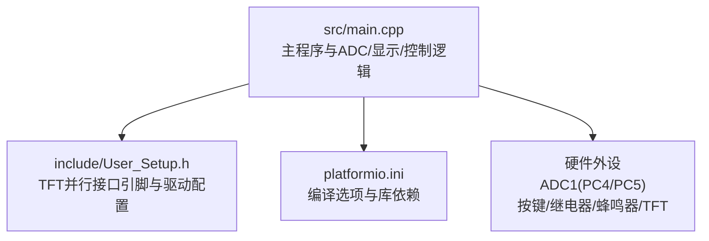
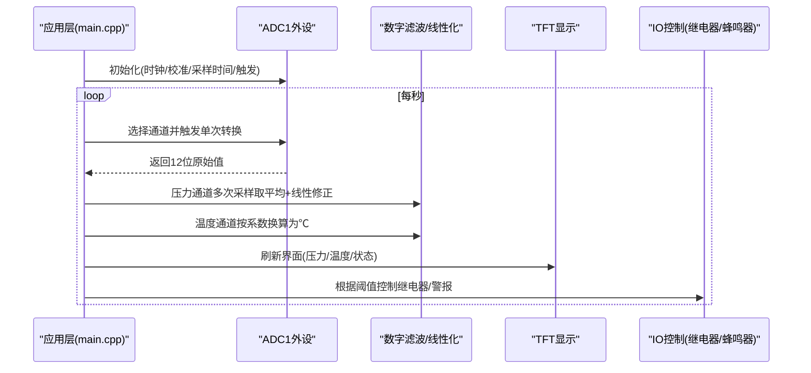
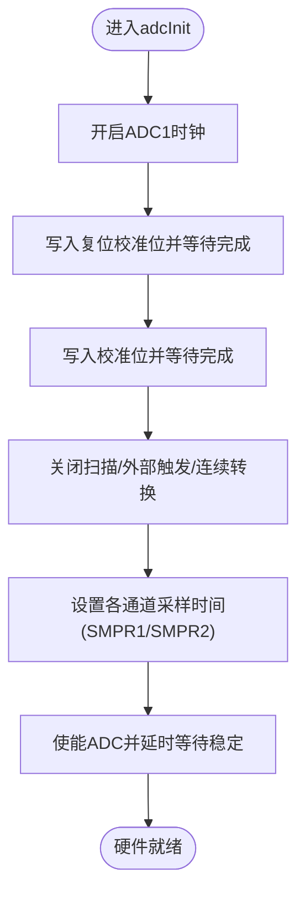
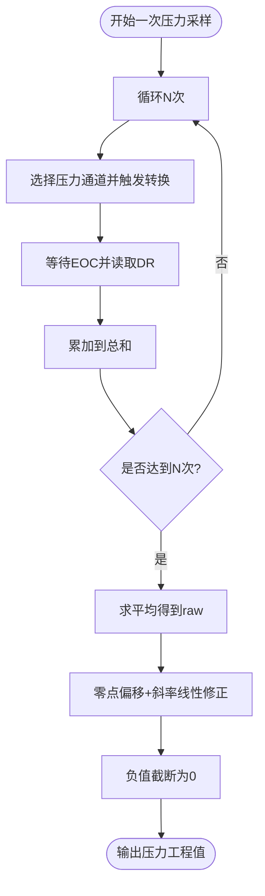
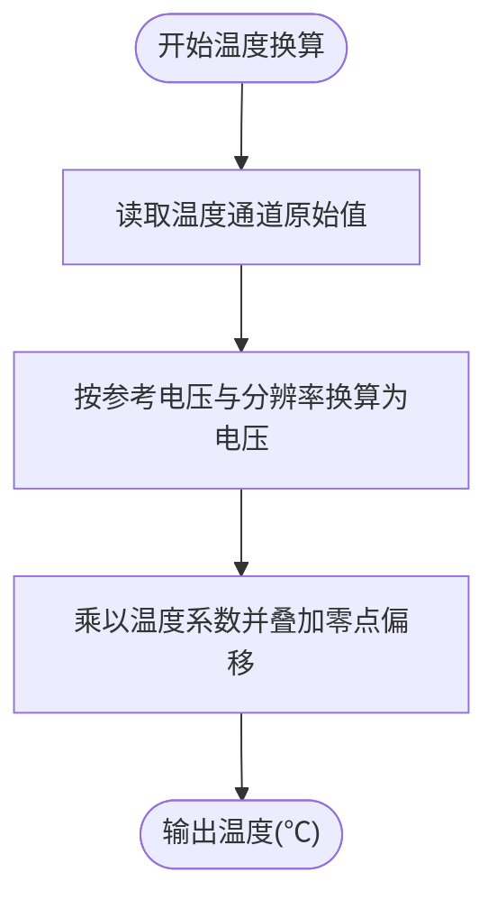
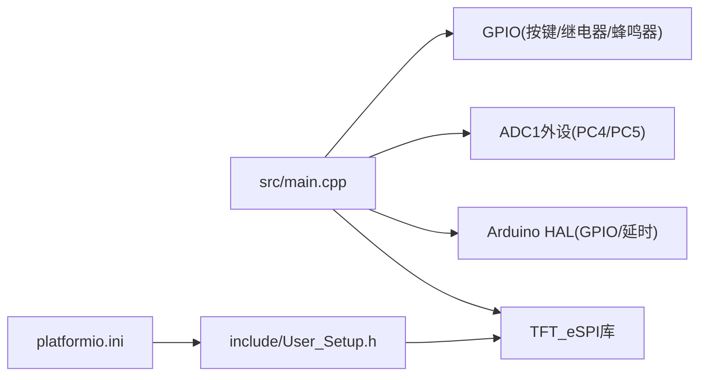

# 传感器ADC采集系统

<cite>
**本文引用的文件**
- [src/main.cpp](file://src/main.cpp)
- [include/User_Setup.h](file://include/User_Setup.h)
- [platformio.ini](file://platformio.ini)
</cite>

## 目录
1. [简介](#简介)
2. [项目结构](#项目结构)
3. [核心组件](#核心组件)
4. [架构总览](#架构总览)
5. [详细组件分析](#详细组件分析)
6. [依赖关系分析](#依赖关系分析)
7. [性能与精度特性](#性能与精度特性)
8. [故障诊断与排错](#故障诊断与排错)
9. [结论](#结论)
10. [附录](#附录)

## 简介
本技术文档围绕压力与温度传感器的ADC采集子系统，基于GD32F103RCT6平台进行说明。代码采用直接寄存器操作方式对ADC1进行初始化、校准与单次采样，并通过软件滤波与线性化修正将原始值转换为工程单位（Pa与℃）。文档涵盖：
- ADC模块配置要点（时钟、采样时间、触发模式）
- 多通道轮询机制与数据一致性策略
- 数字滤波算法与单位换算流程
- 传感器校准方法、线性度修正与温度补偿思路
- 参考电压、输入阻抗匹配与噪声抑制建议
- 常见误差来源、漂移处理与传感器故障检测

## 项目结构
本项目为Arduino框架下的嵌入式应用，主程序位于src/main.cpp，屏幕驱动配置在include/User_Setup.h，构建参数在platformio.ini中定义。ADC相关逻辑集中在main.cpp的初始化与计算函数中。

图表来源
- [src/main.cpp:1-120](file://src/main.cpp#L1-L120)
- [include/User_Setup.h:1-74](file://include/User_Setup.h#L1-L74)
- [platformio.ini:1-45](file://platformio.ini#L1-L45)

章节来源
- [src/main.cpp:1-120](file://src/main.cpp#L1-L120)
- [include/User_Setup.h:1-74](file://include/User_Setup.h#L1-L74)
- [platformio.ini:1-45](file://platformio.ini#L1-L45)

## 核心组件
- ADC初始化与单次采样
  - 启用ADC1时钟，执行内部校准，关闭扫描与连续转换，设置各通道采样时间，使能ADC后等待稳定。
  - 通过SQRx选择通道并触发SWSTART，等待EOC标志位读取DR寄存器得到12位结果。
- 多通道轮询与滤波
  - 压力通道多次采样求平均，降低随机噪声；温度通道单次采样配合系数换算。
- 线性化与单位换算
  - 压力：以零点偏移与斜率进行线性修正，负值截断为零。
  - 温度：基于参考电压与分辨率进行电压到温度的换算，叠加零点偏移与系数。
- 显示与控制
  - 根据压力阈值判断状态与报警，更新倒计时与继电器输出。

章节来源
- [src/main.cpp:74-101](file://src/main.cpp#L74-L101)
- [src/main.cpp:145-156](file://src/main.cpp#L145-L156)
- [src/main.cpp:366-433](file://src/main.cpp#L366-L433)

## 架构总览
下图展示从ADC硬件到应用层的整体数据流与控制流。

图表来源
- [src/main.cpp:74-101](file://src/main.cpp#L74-L101)
- [src/main.cpp:145-156](file://src/main.cpp#L145-L156)
- [src/main.cpp:391-433](file://src/main.cpp#L391-L433)

## 详细组件分析

### ADC初始化与单次采样流程
- 关键步骤
  - 开启ADC1时钟
  - 复位并启动内部校准，等待完成
  - 关闭扫描模式与外部触发，禁用连续转换
  - 设置各通道采样时间（SMPR1/SMPR2）
  - 使能ADC并延时等待稳定
  - 每次采样前设置SQR3为当前通道，清零SR，写CR2启动转换，等待EOC后读DR
- 设计要点
  - 非扫描、单次触发，适合两通道分时轮询
  - 采样时间设置为最大档位，有利于提高抗噪能力
  - 使用软件延时等待稳定，避免刚上电或切换通道时的瞬态影响

图表来源
- [src/main.cpp:76-90](file://src/main.cpp#L76-L90)

章节来源
- [src/main.cpp:74-101](file://src/main.cpp#L74-L101)

### 多通道轮询与数据一致性
- 轮询策略
  - 压力通道：循环N次采样并累加，最后除以N得到平均值，提升稳定性
  - 温度通道：单次采样，结合系数与参考电压换算为工程单位
- 一致性保证
  - 每次采样前重置序列寄存器与状态位，确保仅转换目标通道
  - 使用固定采样时间与稳定的参考源，减少通道间差异
  - 在主循环中以固定周期（约1秒）更新压力与显示，避免频繁采样造成抖动

图表来源
- [src/main.cpp:146-152](file://src/main.cpp#L146-L152)

章节来源
- [src/main.cpp:145-156](file://src/main.cpp#L145-L156)

### 数字滤波算法与单位换算
- 数字滤波
  - 算术平均滤波：对压力通道进行N次采样求均值，有效抑制高频噪声
- 单位换算
  - 压力：基于校准零点与斜率的线性模型，将原始码值映射为Pa，并对负值做截断
  - 温度：依据参考电压与12位分辨率将原始码值转换为电压，再乘以温度系数得到℃，叠加零点偏移

图表来源
- [src/main.cpp:153-156](file://src/main.cpp#L153-L156)

章节来源
- [src/main.cpp:145-156](file://src/main.cpp#L145-L156)

### 传感器校准方法与线性度修正
- 压力校准
  - 零点校准：在零压条件下记录原始值作为基准
  - 斜率校准：通过已知压力点确定线性斜率，实现线性修正
- 温度校准
  - 零点偏移：在已知温度下记录原始值，用于后续偏移修正
  - 系数标定：依据传感器特性曲线或实验拟合得到温度系数
- 线性度修正
  - 若传感器非线性显著，可在多点标定基础上引入分段线性或多项式拟合（需扩展存储与计算）

章节来源
- [src/main.cpp:45-50](file://src/main.cpp#L45-L50)
- [src/main.cpp:145-156](file://src/main.cpp#L145-L156)

### 参考电压、输入阻抗匹配与噪声抑制
- 参考电压
  - 代码中温度换算使用固定参考电压常量，实际应确保VREF稳定且与传感器供电一致
- 输入阻抗匹配
  - 适当增加RC低通滤波网络，减小传感器输出阻抗引起的采样误差
- 噪声抑制
  - 增大采样时间（已设为最大档），结合算术平均滤波
  - 合理布局模拟地与数字地，屏蔽干扰源

章节来源
- [src/main.cpp:153-156](file://src/main.cpp#L153-L156)
- [src/main.cpp:74-101](file://src/main.cpp#L74-L101)

### 采样同步与数据一致性保证
- 同步策略
  - 主循环以固定周期（约1秒）触发压力采样与显示刷新，保证时序稳定
- 一致性措施
  - 每次采样前清空状态位与序列寄存器，避免残留影响
  - 固定采样时间与顺序，减少通道切换带来的瞬态误差

章节来源
- [src/main.cpp:391-433](file://src/main.cpp#L391-L433)
- [src/main.cpp:91-101](file://src/main.cpp#L91-L101)

## 依赖关系分析
- 应用层依赖
  - TFT_eSPI库用于屏幕显示（由User_Setup.h与platformio.ini共同配置）
  - Arduino框架提供GPIO、延时等基础API
- 硬件外设依赖
  - ADC1用于压力与温度通道采集
  - GPIO用于按键、继电器、蜂鸣器控制
- 构建与配置依赖
  - platformio.ini定义编译宏与引脚映射，User_Setup.h细化TFT并行接口配置

图表来源
- [src/main.cpp:1-20](file://src/main.cpp#L1-L20)
- [include/User_Setup.h:1-74](file://include/User_Setup.h#L1-L74)
- [platformio.ini:1-45](file://platformio.ini#L1-L45)

章节来源
- [src/main.cpp:1-20](file://src/main.cpp#L1-L20)
- [include/User_Setup.h:1-74](file://include/User_Setup.h#L1-L74)
- [platformio.ini:1-45](file://platformio.ini#L1-L45)

## 性能与精度特性
- 采样频率
  - 应用层以约1秒周期更新压力与显示，属于低频监控场景
  - ADC单次转换耗时受采样时间与内核时钟影响，代码未显式配置分频，默认使用系统时钟
- 精度特性
  - 12位分辨率对应4096级量化，最小分辨步长约为参考电压/4096
  - 通过最大采样时间与算术平均滤波提升信噪比
- 功耗与实时性
  - 非DMA、非中断方式，CPU占用较低但实时性一般，适用于人机交互与慢变信号

[本节为通用性能讨论，不直接分析具体文件]

## 故障诊断与排错
- 常见问题
  - 读数漂移：检查参考电压稳定性与传感器供电，确认零点校准是否正确
  - 噪声过大：增大采样时间、增加外部RC滤波、优化布线与接地
  - 通道串扰：确保每次采样前正确设置SQRx并清零状态位
  - 传感器故障：对比历史基线，出现持续异常或超出量程时触发告警
- 诊断建议
  - 在调试界面打印原始值与换算后的工程值，便于定位问题阶段
  - 使用多点标定验证线性度，必要时引入分段修正

章节来源
- [src/main.cpp:278-302](file://src/main.cpp#L278-L302)
- [src/main.cpp:145-156](file://src/main.cpp#L145-L156)

## 结论
该ADC采集系统采用简洁可靠的单通道单次转换与软件轮询方案，结合算术平均滤波与线性化修正，满足压力与温度监控的基本需求。通过合理的采样时间设置与噪声抑制手段，可在工业现场获得较为稳定的测量结果。未来可考虑引入DMA与定时器触发以提升吞吐与时序一致性，并完善非线性补偿与自诊断功能。

[本节为总结性内容，不直接分析具体文件]

## 附录
- 关键实现路径
  - ADC初始化与单次采样：[src/main.cpp:74-101](file://src/main.cpp#L74-L101)
  - 压力/温度换算：[src/main.cpp:145-156](file://src/main.cpp#L145-L156)
  - 主循环与显示刷新：[src/main.cpp:391-433](file://src/main.cpp#L391-L433)
  - 屏幕驱动配置：[include/User_Setup.h:1-74](file://include/User_Setup.h#L1-L74)
  - 构建参数与引脚映射：[platformio.ini:1-45](file://platformio.ini#L1-L45)