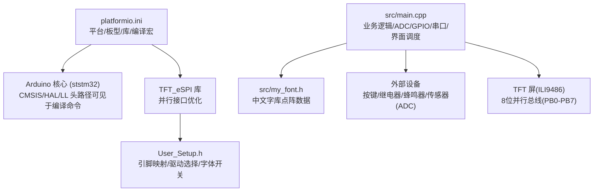
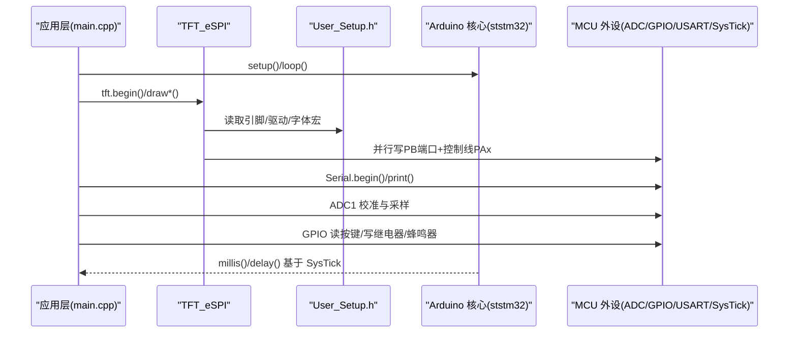
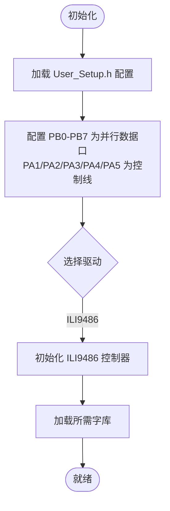
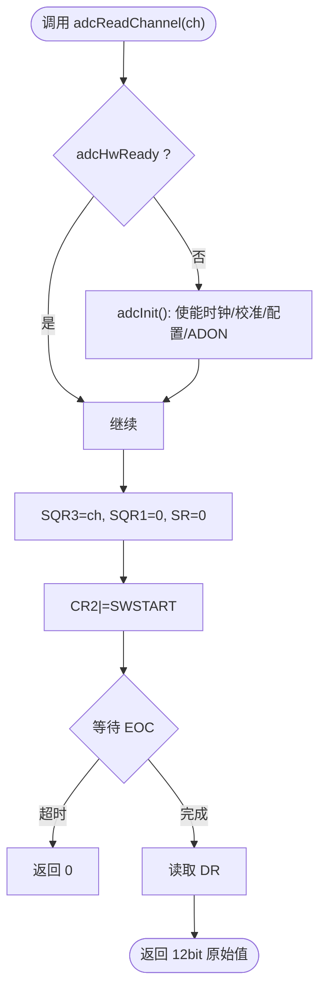
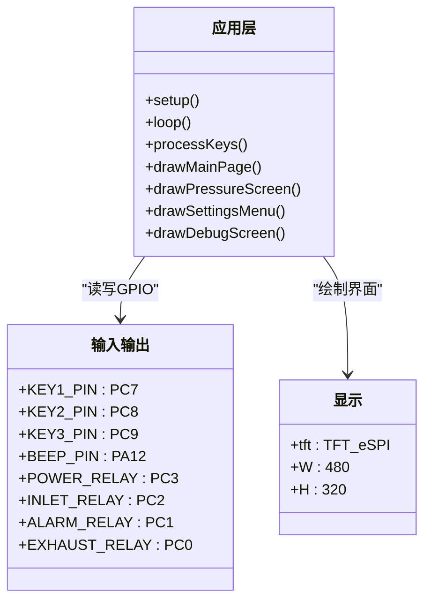
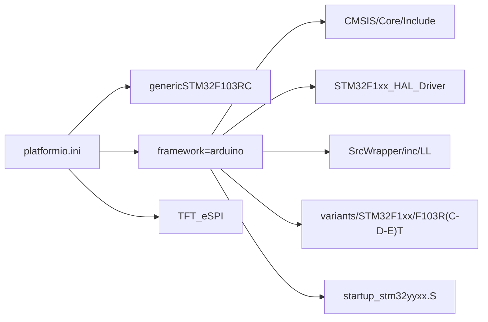

# 微控制器概述

<cite>
**本文引用的文件**   
- [platformio.ini](file://platformio.ini)
- [main.cpp](file://src/main.cpp)
- [User_Setup.h](file://include/User_Setup.h)
- [my_font.h](file://src/my_font.h)
</cite>

## 目录
1. [简介](#简介)
2. [项目结构](#项目结构)
3. [核心组件](#核心组件)
4. [架构总览](#架构总览)
5. [详细组件分析](#详细组件分析)
6. [依赖关系分析](#依赖关系分析)
7. [性能与功耗特性](#性能与功耗特性)
8. [故障排查指南](#故障排查指南)
9. [结论](#结论)
10. [附录：开发环境与调试](#附录开发环境与调试)

## 简介
本文件面向使用 GD32F103RCT6 的工程师，提供一份基于仓库代码与构建配置的硬件与系统级概述。文档重点覆盖：
- ARM Cortex-M3 内核与存储配置（Flash/RAM）
- 时钟系统与电源/低功耗模式要点
- 外设资源（ADC、GPIO、定时器、串口等）
- 与 STM32 系列的兼容性与迁移注意事项
- 性能指标、工作温度范围与电气特性说明
- 开发环境配置与调试工具支持

说明：GD32F103RCT6 的详细参数以官方数据手册为准；本节结合本项目实际使用的平台、框架与驱动配置进行归纳，便于快速上手与迁移。

## 项目结构
仓库采用 PlatformIO + Arduino 框架组织，核心应用位于 src/main.cpp，TFT 显示驱动的用户配置位于 include/User_Setup.h，字体资源位于 src/my_font.h，构建与板级配置在 platformio.ini。

图表来源
- [platformio.ini:1-45](file://platformio.ini#L1-L45)
- [User_Setup.h:1-74](file://include/User_Setup.h#L1-L74)
- [main.cpp:1-433](file://src/main.cpp#L1-L433)

章节来源
- [platformio.ini:1-45](file://platformio.ini#L1-L45)
- [User_Setup.h:1-74](file://include/User_Setup.h#L1-L74)
- [main.cpp:1-433](file://src/main.cpp#L1-L433)

## 核心组件
- 目标芯片与内核
  - 目标：genericSTM32F103RC（PlatformIO 板定义），对应 RCT6 封装容量等级
  - 内核：ARM Cortex-M3（由编译选项 -mcpu=cortex-m3 确认）
- 存储配置
  - Flash：256KB（R 系列 C 子型号典型值）
  - RAM：64KB（C 子型号典型值）
  - 注：具体数值以官方数据手册为准；本项目通过 genericSTM32F103RC 板型启用相应启动文件与向量表偏移
- 时钟系统
  - 外部晶振 HSE_VALUE=8MHz（见编译宏）
  - 默认 Arduino 核心会初始化系统时钟至 72MHz（F103 标准配置）
- 电源与低功耗
  - 支持睡眠/停机/待机模式（Cortex-M3 通用）
  - 可通过 HAL/LL 或 CMSIS 寄存器进入低功耗状态（本项目未直接使用，但具备能力）
- 外设概览（在本项目中已使用或可复用）
  - ADC1：多通道采样（PC4/PC5 用于压力/温度）
  - GPIO：按键输入、继电器输出、蜂鸣器控制、TFT 并行总线
  - USART：Serial.begin(115200) 用于调试输出
  - 定时器：millis()/delay() 依赖 SysTick 定时
  - 并行 TFT：8位数据总线 PB0-PB7，控制线 PA1/PA2/PA3/PA4/PA5

章节来源
- [platformio.ini:1-45](file://platformio.ini#L1-L45)
- [main.cpp:1-433](file://src/main.cpp#L1-L433)
- [User_Setup.h:1-74](file://include/User_Setup.h#L1-L74)

## 架构总览
下图展示从用户应用到 MCU 外设的数据与控制流，以及关键库与驱动的协作关系。

图表来源
- [main.cpp:1-433](file://src/main.cpp#L1-L433)
- [User_Setup.h:1-74](file://include/User_Setup.h#L1-L74)
- [platformio.ini:1-45](file://platformio.ini#L1-L45)

## 详细组件分析

### 显示子系统（TFT_eSPI + ILI9486）
- 接口与引脚
  - 8位并行数据总线：PB0-PB7（D0-D7）
  - 控制信号：DC=PA2, CS=PA4, WR=PA5, RD=PA3, RST=PA1
  - 驱动：ILI9486_DRIVER
- 优化策略
  - 启用 STM_PORTB_DATA_BUS，利用单周期 BSRR 写入提升吞吐
  - 加载多种内置字体与平滑字体（SMOOTH_FONT）
- 屏幕分辨率
  - 横屏 480x320（W=480, H=320）

图表来源
- [User_Setup.h:1-74](file://include/User_Setup.h#L1-L74)
- [main.cpp:1-433](file://src/main.cpp#L1-L433)

章节来源
- [User_Setup.h:1-74](file://include/User_Setup.h#L1-L74)
- [main.cpp:1-433](file://src/main.cpp#L1-L433)

### 模拟量采集（ADC1）
- 通道与引脚
  - PC4 → 压力（ADC14）
  - PC5 → 温度（ADC15）
- 初始化流程
  - 使能 ADC1 时钟
  - 执行自校准（复位校准→开始校准）
  - 设置采样时间、单次转换模式
  - 使能 ADON 并延时稳定
- 采样流程
  - 选择通道、清零标志、触发 SWSTART
  - 等待 EOC 标志，读取 DR 寄存器
- 数据处理
  - 对压力通道做多次采样取平均
  - 线性校准：raw→电压→工程单位（含斜率与零点修正）

图表来源
- [main.cpp:74-101](file://src/main.cpp#L74-L101)

章节来源
- [main.cpp:74-101](file://src/main.cpp#L74-L101)

### 人机交互与执行机构
- 输入
  - 按键：PC7/PC8/PC9，上拉输入，带消抖与短按/长按处理
  - 蜂鸣器：PA12，提示音反馈
- 输出
  - 继电器：PC0 排气、PC1 警报、PC2 进气、PC3 送电
- 界面
  - 主页、正压启动、系统设置、系统调试四个主界面
  - 中文显示通过 my_font.h 中的 16x16 点阵字库实现

图表来源
- [main.cpp:15-21](file://src/main.cpp#L15-L21)
- [main.cpp:311-363](file://src/main.cpp#L311-L363)
- [main.cpp:167-309](file://src/main.cpp#L167-L309)

章节来源
- [main.cpp:15-21](file://src/main.cpp#L15-L21)
- [main.cpp:311-363](file://src/main.cpp#L311-L363)
- [main.cpp:167-309](file://src/main.cpp#L167-L309)

### 通信与调试
- 串口调试
  - Serial.begin(115200)，用于打印调试信息
- 其他通信
  - 当前未使用 SPI/I2C/USB 等，但 F103 具备相应外设，可按需启用

章节来源
- [main.cpp:366-368](file://src/main.cpp#L366-L368)

## 依赖关系分析
- 构建与平台
  - 平台：ststm32，板型：genericSTM32F103RC，框架：arduino
  - 上传/调试协议：stlink
  - 库依赖：bodmer/TFT_eSPI@^2.5.43
- 编译期宏与路径
  - 包含路径可见于 compile_commands.json（CMSIS、HAL/LL、Variant、Drivers 等）
  - 目标 CPU：cortex-m3，Thumb 指令集，优化级别 -Os
  - HSE_VALUE=8000000UL，表明外部晶振 8MHz

图表来源
- [platformio.ini:1-45](file://platformio.ini#L1-L45)

章节来源
- [platformio.ini:1-45](file://platformio.ini#L1-L45)

## 性能与功耗特性
- 性能
  - 内核：ARM Cortex-M3，最高主频 72MHz（F103 标准）
  - 指令集：Thumb，支持 DSP 扩展（可选）
  - 中断：NVIC，最多 84 个中断源（依具体子型号）
- 存储
  - Flash：256KB（R 系列 C 子型号）
  - RAM：64KB（C 子型号）
- 工作温度范围
  - 工业级：-40°C ~ +85°C（常见封装等级）
- 供电与电气
  - VDD：2.0V ~ 3.6V
  - I/O 电平：3.3V（注意与外设匹配）
- 低功耗模式
  - 睡眠（Sleep）、停机（Stop）、待机（Standby）
  - 建议：关闭不必要的外设时钟、降低 ADC 采样率、使用中断唤醒

说明：以上为 F103 系列通用特性，具体以 GD32F103RCT6 官方数据手册为准。

[本节为通用知识汇总，不直接分析具体文件]

## 故障排查指南
- 无法烧录/调试
  - 检查 ST-Link 连接与供电
  - 确认 platformio.ini 中 upload_protocol/debug_protocol 设置为 stlink
- 串口无输出
  - 确认串口波特率与终端一致（115200）
  - 检查 TX/RX 接线与电平匹配
- 触摸/按键无响应
  - 检查上拉电阻与引脚配置（INPUT_PULLUP）
  - 消抖时间与去抖逻辑是否合理
- 显示异常
  - 核对 User_Setup.h 中驱动与引脚定义
  - 并行总线 PB0-PB7 与 PA1~PA5 连线是否正确
- ADC 读数漂移
  - 确保完成校准后再采样
  - 适当增加采样次数与滤波

章节来源
- [platformio.ini:1-45](file://platformio.ini#L1-L45)
- [main.cpp:74-101](file://src/main.cpp#L74-L101)
- [User_Setup.h:1-74](file://include/User_Setup.h#L1-L74)

## 结论
本项目基于 PlatformIO + Arduino 框架，在 genericSTM32F103RC 板上实现了以 GD32F103RCT6 为核心的正压防爆控制系统。通过 TFT_eSPI 并行驱动与 ILI9486 控制器，配合 ADC1 与 GPIO 控制，完成了人机交互与现场控制功能。得益于 STM32F1 生态的成熟度，GD32F103 具备良好的兼容性，便于从 STM32 方案迁移。

[本节为总结性内容，不直接分析具体文件]

## 附录：开发环境与调试
- 开发环境
  - IDE：VS Code + PlatformIO
  - 平台：ststm32，板型：genericSTM32F103RC，框架：arduino
  - 库：TFT_eSPI（并行接口优化）
- 编译与链接
  - 目标 CPU：cortex-m3，Thumb 指令集
  - 外部晶振：8MHz
  - 启动文件：startup_stm32yyxx.S
- 调试工具
  - 下载/调试：ST-Link（v2/v3）
  - 串口调试：USB-TTL 模块（115200bps）
- 常用操作
  - 构建：pio run
  - 上传：pio run --target upload
  - 调试：pio debug（需配置 ST-Link）

章节来源
- [platformio.ini:1-45](file://platformio.ini#L1-L45)