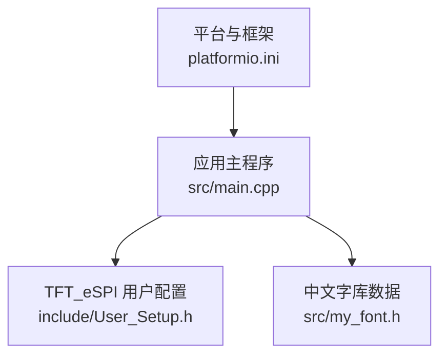
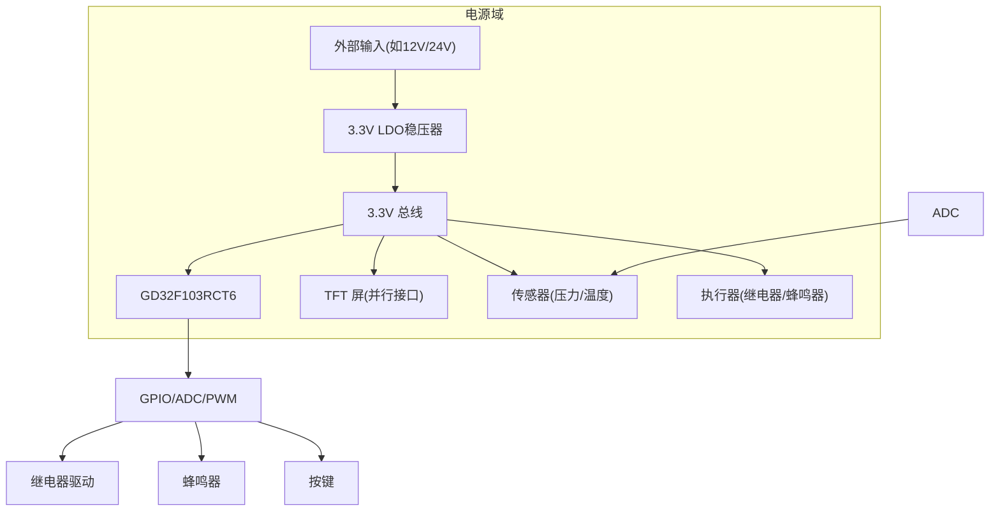
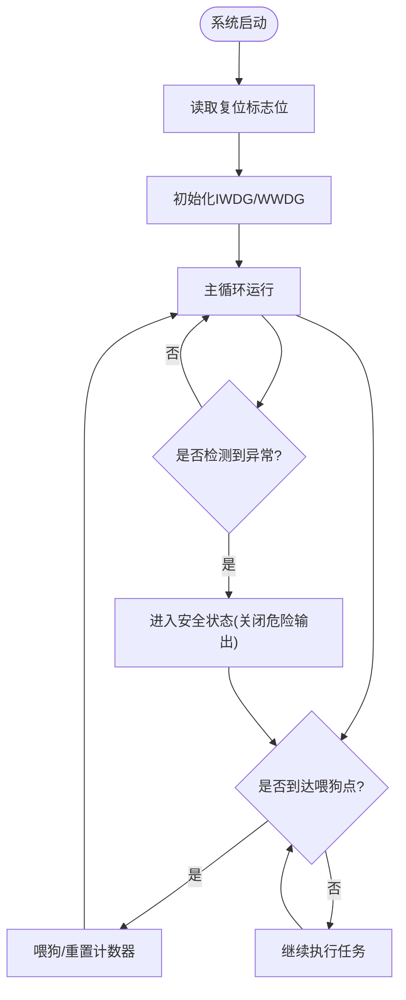
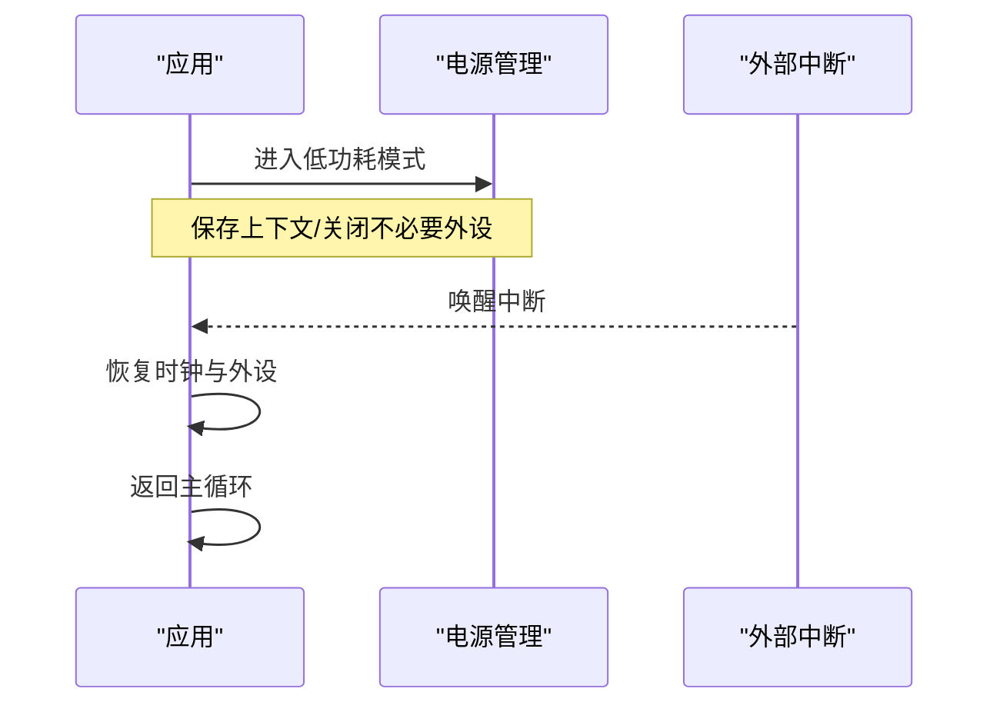
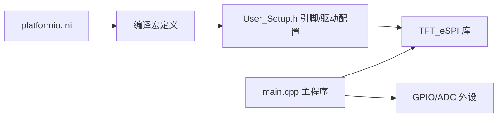

# 电源管理系统

<cite>
**本文引用的文件**   
- [src/main.cpp](file://src/main.cpp)
- [include/User_Setup.h](file://include/User_Setup.h)
- [platformio.ini](file://platformio.ini)
</cite>

## 目录
1. [引言](#引言)
2. [项目结构](#项目结构)
3. [核心组件](#核心组件)
4. [架构总览](#架构总览)
5. [详细组件分析](#详细组件分析)
6. [依赖关系分析](#依赖关系分析)
7. [性能与功耗考量](#性能与功耗考量)
8. [故障排查指南](#故障排查指南)
9. [结论](#结论)
10. [附录](#附录)

## 引言
本技术文档面向GD32F103RCT6系统的电源管理，围绕以下目标展开：
- 3.3V主电源供电与稳压电路设计要点
- 看门狗定时器配置、程序死机检测与自动恢复机制
- 低功耗模式启用条件、唤醒源配置与功耗测量方法
- 电源监控、欠压检测与过流保护电路
- 电源完整性分析、去耦电容选择与PCB布局建议
- 电源波动、重启问题与EMC电磁兼容性问题的解决思路

说明：当前工程源码主要实现人机交互与外设控制（TFT显示、按键、继电器、ADC采样等），并未直接包含电源管理相关代码。因此，本文在“软件现状”部分基于现有代码进行客观描述；在“硬件设计与优化”“功耗与可靠性建议”等章节提供通用工程实践与可操作建议，便于在现有系统上扩展电源管理能力。

## 项目结构
仓库采用简单的分层组织：应用逻辑位于src，显示驱动配置位于include，构建配置位于platformio.ini。

图示来源
- [platformio.ini:1-47](file://platformio.ini#L1-L47)
- [src/main.cpp:1-434](file://src/main.cpp#L1-L434)
- [include/User_Setup.h:1-74](file://include/User_Setup.h#L1-L74)

章节来源
- [platformio.ini:1-47](file://platformio.ini#L1-L47)
- [src/main.cpp:1-434](file://src/main.cpp#L1-L434)
- [include/User_SetSetup.h:1-74](file://include/User_Setup.h#L1-L74)

## 核心组件
- 应用主循环与状态机：负责页面切换、倒计时、压力阈值判断、警报与消音、继电器控制等。
- ADC采集与校准：对温度与压力通道进行采样、滤波与线性化计算。
- TFT显示与中文绘制：并行接口驱动屏幕，绘制界面与按钮。
- 输入与输出：按键消抖、蜂鸣器提示、继电器控制。

章节来源
- [src/main.cpp:1-434](file://src/main.cpp#L1-L434)
- [include/User_Setup.h:1-74](file://include/User_Setup.h#L1-L74)

## 架构总览
从电源视角看，系统由MCU、TFT屏、传感器、执行器（继电器/蜂鸣器）组成。MCU通过GPIO与ADC与外部设备交互，电源路径需保证各模块稳定工作并满足瞬态电流需求。

[此图为概念性架构图，不直接映射具体源码文件]

## 详细组件分析

### 软件侧电源相关现状
- 未实现看门狗（IWDG/WWDG）初始化与喂狗逻辑，也未见低功耗模式（Sleep/Stop/Standby）的调用。
- 未见电源监控（如PVD）、欠压复位或过流保护的软件策略。
- 存在延时与阻塞式刷新（loop内delay与频繁drawScreen），不利于低功耗与实时性。

章节来源
- [src/main.cpp:366-434](file://src/main.cpp#L366-L434)

### 硬件侧电源拓扑与关键节点
- 3.3V主电源：建议采用低噪声LDO为MCU与模拟前端供电，数字负载（TFT、继电器驱动）可通过独立DC-DC或开关型LDO隔离以降低噪声耦合。
- 去耦与储能：在每个IC电源引脚就近放置0.1μF陶瓷电容，必要时并联1~10μF以抑制低频纹波；在LDO输入/输出端增加适当容值以应对阶跃负载。
- 参考地与信号地：单点汇聚，避免大电流回流穿过模拟地。

[本节为通用设计建议，不直接引用具体源码文件]

### 看门狗定时器配置与自动恢复机制（建议方案）
- 独立看门狗（IWDG）：用于检测程序跑飞或长时间阻塞，超时触发复位。
- 窗口看门狗（WWDG）：用于确保关键任务在时间窗口内被周期性处理。
- 喂狗策略：在主循环的关键路径定期喂狗；若检测到异常（如ADC失败、通信超时），进入安全状态并继续喂狗以避免误复位。
- 启动自检：复位后检查复位标志位，记录异常信息并通过串口或LED上报。

[此流程图展示通用实现思路，不直接映射具体源码文件]

### 低功耗模式启用条件与唤醒源（建议方案）
- 适用场景：待机巡检、间歇采样、无交互等待。
- 模式选择：
  - Sleep：CPU停止，外设仍运行，适合轻量任务。
  - Stop：时钟停振，RAM保持，适合较深休眠。
  - Standby：最低功耗，唤醒后冷启动。
- 唤醒源：外部中断（按键）、RTC闹钟、IWDG/WWDG复位、内部事件（如ADC完成）。
- 退出流程：唤醒后恢复时钟、外设状态，重新初始化必要资源，再回到主循环。

[此序列图为概念流程，不直接映射具体源码文件]

### 电源监控、欠压检测与过流保护（建议方案）
- 电源监控：使用带比较器的PMIC或专用监控芯片，监测3.3V轨电压，低于阈值时产生复位或告警。
- 欠压检测：利用MCU内置PVD（若可用）或外部比较器，结合ADC采样辅助判断。
- 过流保护：在关键支路串联小阻值采样电阻+运放放大，经ADC检测；超过阈值则关闭相应负载或降低占空比。
- 软关断：通过GPIO控制MOSFET或负载开关，实现分级断电与热插拔保护。

[本节为通用设计建议，不直接引用具体源码文件]

### 电源完整性分析与去耦电容选择（建议方案）
- 电源平面分割：数字地与模拟地单点连接，减少回流路径干扰。
- 去耦策略：每个IC电源引脚就近放置0.1μF，必要时加1~10μF；高频器件（如TFT控制器）需更靠近且短走线。
- 布线要点：电源与地回路面积最小化，避免跨分割走线；关键信号远离大电流路径。
- 仿真与验证：使用SPICE或电源完整性工具评估阻抗与谐振，调整容值与布局。

[本节为通用设计建议，不直接引用具体源码文件]

### PCB布局建议（针对本系统）
- 将MCU、LDO、去耦电容集中布置，缩短电源路径。
- TFT并行数据线尽量等长、短距，远离继电器驱动与大电流回路。
- 继电器与蜂鸣器驱动回路与MCU模拟地分离，单点汇合。
- 传感器模拟信号走差分或屏蔽，远离开关噪声源。

[本节为通用设计建议，不直接引用具体源码文件]

### 电源波动、重启问题与EMC问题解决（建议方案）
- 电源波动：增大输入/输出电容，优化LDO环路稳定性；必要时增加π型滤波。
- 重启问题：检查复位引脚噪声、电源跌落；加入RC延时复位与TVS保护；完善看门狗与异常上报。
- EMC：合理接地与屏蔽，关键信号加磁珠或小电感；继电器线圈加续流二极管；对外接口加ESD保护。

[本节为通用设计建议，不直接引用具体源码文件]

## 依赖关系分析
- 构建配置定义了TFT并行接口、引脚映射与字体选项，直接影响MCU引脚占用与IO翻转频率，间接影响电源瞬态需求。
- 主程序依赖TFT_eSPI库进行显示，频繁刷新会提高动态功耗。

图示来源
- [platformio.ini:10-47](file://platformio.ini#L10-L47)
- [include/User_Setup.h:23-47](file://include/User_Setup.h#L23-L47)
- [src/main.cpp:366-434](file://src/main.cpp#L366-L434)

章节来源
- [platformio.ini:1-47](file://platformio.ini#L1-L47)
- [include/User_Setup.h:1-74](file://include/User_Setup.h#L1-L74)
- [src/main.cpp:1-434](file://src/main.cpp#L1-L434)

## 性能与功耗考量
- 显示刷新频率：当前loop内每秒多次drawScreen，建议按需刷新或使用局部更新以减少功耗。
- 延时与阻塞：delay(10ms)导致CPU无法进入低功耗；可改用非阻塞计时并在空闲时进入Sleep。
- ADC采样：批量平均与适度采样率可降低噪声，同时避免过高采样率带来的额外功耗。
- 外设电源门控：在不使用时关闭TFT背光、关闭不必要的GPIO输出，降低静态功耗。

章节来源
- [src/main.cpp:392-434](file://src/main.cpp#L392-L434)

## 故障排查指南
- 现象：系统偶发重启
  - 排查：检查3.3V纹波与跌落；确认复位引脚噪声；查看是否有长时间阻塞导致看门狗未喂狗。
- 现象：报警误触发或漏报
  - 排查：校验ADC零点漂移与系数；增加滤波与迟滞；确认阈值与刷新周期匹配。
- 现象：触摸/按键抖动
  - 排查：确认消抖时间与去耦电容；检查按键上拉与走线长度。
- 现象：EMC测试失败
  - 排查：加强屏蔽与接地；在继电器线圈与IO端口增加吸收与TVS；优化电源去耦。

[本节为通用排障建议，不直接引用具体源码文件]

## 结论
当前工程聚焦于人机交互与过程控制，尚未集成电源管理与低功耗策略。建议在现有基础上引入看门狗、电源监控与低功耗模式，配合合理的电源拓扑、去耦与PCB布局，提升系统可靠性与能效。上述建议均为通用工程实践，可在不改变现有功能的前提下逐步落地。

## 附录
- 术语
  - IWDG：独立看门狗
  - WWDG：窗口看门狗
  - PVD：可编程电压探测器
  - LDO：低压差线性稳压器
  - DC-DC：直流变换器
- 参考实现位置（仅列出与电源相关的潜在切入点）
  - 主循环与延时：[src/main.cpp:392-434](file://src/main.cpp#L392-L434)
  - 外设初始化与IO设置：[src/main.cpp:366-389](file://src/main.cpp#L366-L389)
  - 显示驱动配置与引脚映射：[include/User_Setup.h:23-47](file://include/User_Setup.h#L23-L47)
  - 构建宏与依赖：[platformio.ini:10-47](file://platformio.ini#L10-L47)