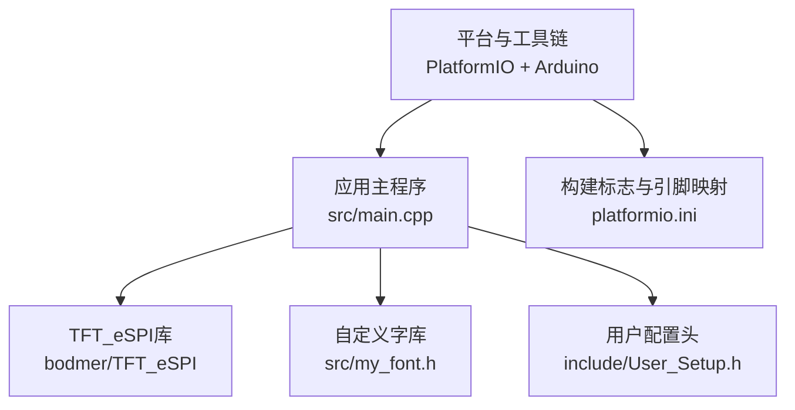
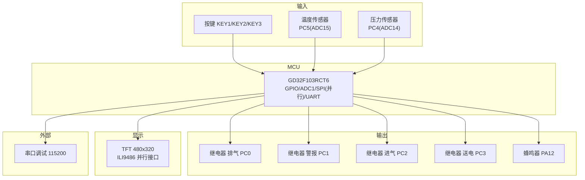
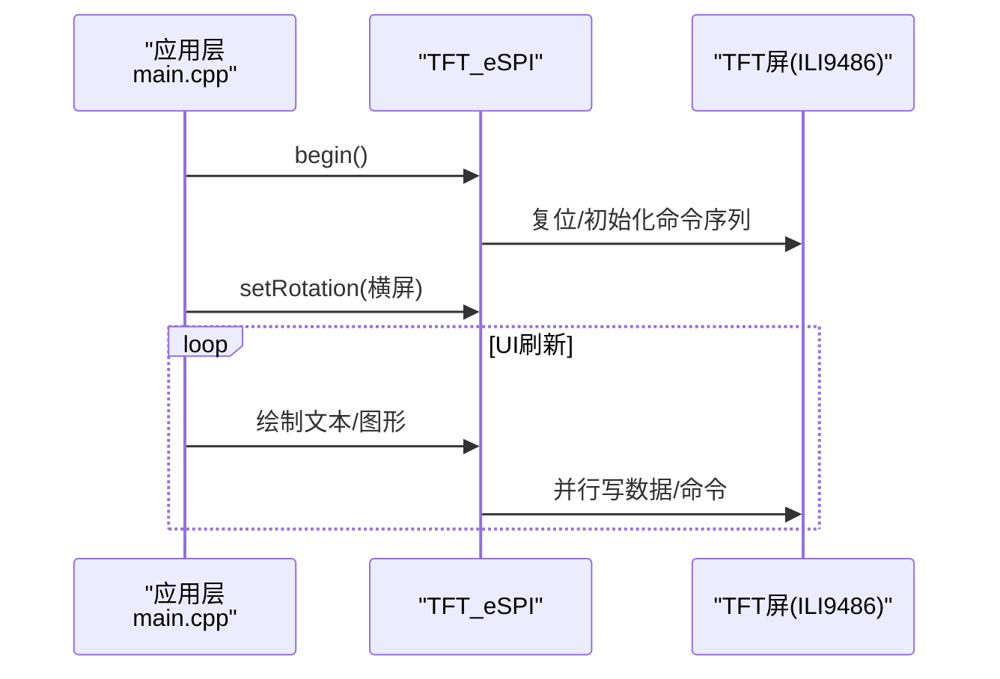
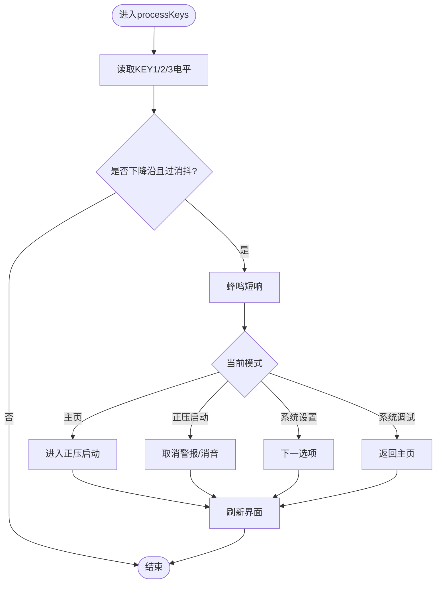
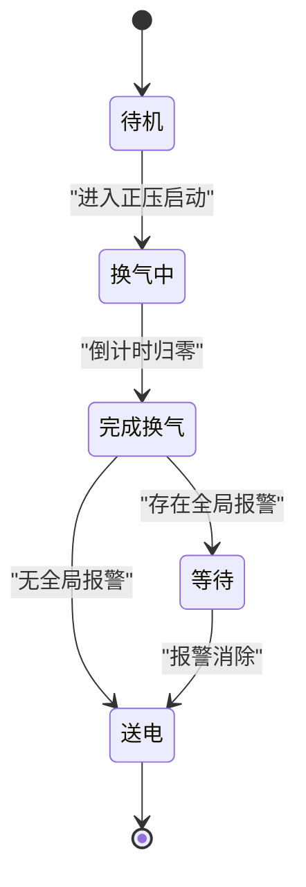
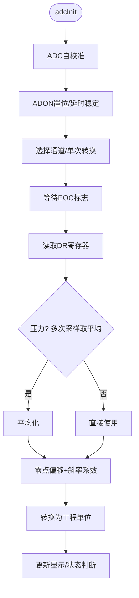
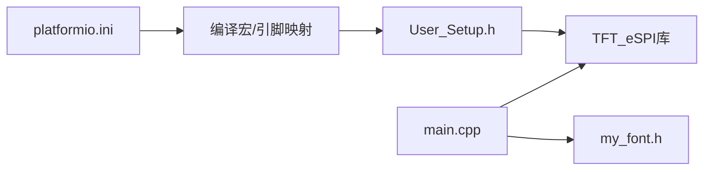

# 硬件架构设计

<cite>
**本文引用的文件**   
- [src/main.cpp](file://src/main.cpp)
- [include/User_Setup.h](file://include/User_Setup.h)
- [platformio.ini](file://platformio.ini)
- [src/my_font.h](file://src/my_font.h)
</cite>

## 目录
1. [引言](#引言)
2. [项目结构](#项目结构)
3. [核心组件](#核心组件)
4. [架构总览](#架构总览)
5. [详细组件分析](#详细组件分析)
6. [依赖关系分析](#依赖关系分析)
7. [性能与功耗考量](#性能与功耗考量)
8. [故障排查指南](#故障排查指南)
9. [结论](#结论)
10. [附录：引脚分配与电气特性](#附录引脚分配与电气特性)

## 引言
本文件面向GD32F103RCT6微控制器的正压防爆控制系统，聚焦硬件架构、引脚分配与电气特性，覆盖TFT屏幕并行接口连接、按键输入、继电器输出与ADC传感器采集的硬件实现。文档同时解释技术决策、权衡与约束条件，给出基础设施要求、可扩展性考虑与部署拓扑，并补充安全性、监控与灾难恢复等横切关注点。

## 项目结构
仓库采用Arduino框架与PlatformIO构建，核心代码位于src目录，显示驱动配置位于include目录，构建参数集中于platformio.ini。字体资源以点阵形式内嵌于源码中，便于在MCU上直接渲染中文界面。

图表来源
- [platformio.ini:1-45](file://platformio.ini#L1-L45)
- [include/User_Setup.h:1-74](file://include/User_Setup.h#L1-L74)
- [src/main.cpp:1-433](file://src/main.cpp#L1-L433)
- [src/my_font.h:1-845](file://src/my_font.h#L1-L845)

章节来源
- [platformio.ini:1-45](file://platformio.ini#L1-L45)
- [include/User_Setup.h:1-74](file://include/User_Setup.h#L1-L74)
- [src/main.cpp:1-433](file://src/main.cpp#L1-L433)
- [src/my_font.h:1-845](file://src/my_font.h#L1-L845)

## 核心组件
- MCU与外设：GD32F103RCT6（STM32兼容），使用GPIO、ADC1、串口用于调试与日志。
- 人机交互：3.5寸480x320 TFT屏（ILI9486控制器）通过8位并行总线连接；三键输入与蜂鸣器提示。
- 执行机构：四个继电器分别控制排气、警报、进气、送电。
- 传感器采集：压力与温度经ADC1通道采样，软件滤波与校准后显示。
- 显示与UI：TFT_eSPI驱动+自定义中文字库，提供主页、正压启动、系统设置与调试界面。

章节来源
- [src/main.cpp:1-433](file://src/main.cpp#L1-L433)
- [include/User_Setup.h:1-74](file://include/User_Setup.h#L1-L74)
- [platformio.ini:1-45](file://platformio.ini#L1-L45)
- [src/my_font.h:1-845](file://src/my_font.h#L1-L845)

## 架构总览
下图展示系统级数据与控制流：MCU作为中枢，负责读取传感器、处理逻辑、驱动TFT显示、控制继电器与蜂鸣器，并通过串口输出调试信息。

图表来源
- [src/main.cpp:1-433](file://src/main.cpp#L1-L433)
- [include/User_Setup.h:1-74](file://include/User_Setup.h#L1-L74)
- [platformio.ini:1-45](file://platformio.ini#L1-L45)

## 详细组件分析

### 1) 并行TFT接口与显示子系统
- 接口模式：8位并行数据总线，PB0-PB7为D0-D7，PB8-PB15在8位模式下保持低电平；控制信号DC/CS/WR/RD/RST分别映射到PA2/PA4/PA5/PA3/PA1。
- 驱动选择：ILI9486控制器，启用平滑字体与多套内置字体。
- 初始化流程：调用TFT_eSPI.begin()与旋转设置，随后进入UI绘制循环。
- 性能优化：通过端口直写与BSRR单周期写入降低刷新开销。

图表来源
- [include/User_Setup.h:1-74](file://include/User_Setup.h#L1-L74)
- [src/main.cpp:366-388](file://src/main.cpp#L366-L388)

章节来源
- [include/User_Setup.h:1-74](file://include/User_Setup.h#L1-L74)
- [src/main.cpp:366-388](file://src/main.cpp#L366-L388)

### 2) 按键输入与消抖
- 引脚定义：KEY1=PC7, KEY2=PC8, KEY3=PC9，内部上拉，按下为低电平。
- 消抖策略：基于时间戳与上次状态检测下降沿，最小去抖间隔约30ms。
- 行为映射：不同界面下按键触发菜单切换、确认、返回等操作，伴随蜂鸣反馈。

图表来源
- [src/main.cpp:311-363](file://src/main.cpp#L311-L363)

章节来源
- [src/main.cpp:311-363](file://src/main.cpp#L311-L363)

### 3) 继电器输出与安全联锁
- 引脚定义：排气=PC0, 警报=PC1, 进气=PC2, 送电=PC3。
- 正压启动流程：进入模式后开启进气与排气阀，倒计时结束后关闭阀门并在无全局报警时闭合送电继电器。
- 安全约束：调试界面明确警告危险区域严禁操作；全局报警状态下禁止自动送电。

图表来源
- [src/main.cpp:390-432](file://src/main.cpp#L390-L432)

章节来源
- [src/main.cpp:390-432](file://src/main.cpp#L390-L432)

### 4) ADC传感器采集与校准
- 通道映射：温度=PC5(ADC15), 压力=PC4(ADC14)。
- 初始化：使能ADC1时钟，执行自校准，配置采样时间与单次转换模式。
- 采样与滤波：压力值进行多次采样取平均，结合零点偏移与斜率系数转换为工程单位；温度按线性系数换算。
- 校准机制：启动时采集若干压力样本计算基准，支持后续手动校准。

图表来源
- [src/main.cpp:74-101](file://src/main.cpp#L74-L101)
- [src/main.cpp:144-155](file://src/main.cpp#L144-L155)

章节来源
- [src/main.cpp:74-101](file://src/main.cpp#L74-L101)
- [src/main.cpp:144-155](file://src/main.cpp#L144-L155)

### 5) 中文字体与UI渲染
- 字库组织：16x16点阵数组，按字符索引存储矩阵数据，支持混合中英文字符串绘制。
- 渲染路径：根据字符编码匹配索引，逐行扫描矩阵像素，调用TFT矩形填充绘制。
- 性能注意：大量汉字点阵占用Flash空间，需权衡功能与体积。

章节来源
- [src/my_font.h:1-845](file://src/my_font.h#L1-L845)
- [src/main.cpp:111-142](file://src/main.cpp#L111-L142)

## 依赖关系分析
- 构建与编译：PlatformIO指定ststm32平台、genericSTM32F103RC板型、Arduino框架，依赖TFT_eSPI库版本范围。
- 宏定义：通过build_flags注入User_Setup中的关键配置，确保编译器侧与运行时一致。
- 运行时依赖：TFT_eSPI库与自定义字库，二者共同决定显示能力与内存占用。

图表来源
- [platformio.ini:1-45](file://platformio.ini#L1-L45)
- [include/User_Setup.h:1-74](file://include/User_Setup.h#L1-L74)
- [src/main.cpp:1-433](file://src/main.cpp#L1-L433)
- [src/my_font.h:1-845](file://src/my_font.h#L1-L845)

章节来源
- [platformio.ini:1-45](file://platformio.ini#L1-L45)
- [include/User_Setup.h:1-74](file://include/User_Setup.h#L1-L74)
- [src/main.cpp:1-433](file://src/main.cpp#L1-L433)
- [src/my_font.h:1-845](file://src/my_font.h#L1-L845)

## 性能与功耗考量
- 并行接口优势：相比SPI，并行总线显著降低高刷新率下的CPU负载，适合480x320分辨率。
- 采样与刷新平衡：压力采样采用多次平均，兼顾精度与实时性；UI刷新仅在数值或状态变化时进行，减少不必要的重绘。
- Flash与RAM：中文字库占用较大Flash，建议按需裁剪或使用更紧凑的字形方案；避免在高频路径中进行动态内存分配。
- 中断与时基：当前按键与计时基于轮询与millis，若需更高实时性可引入定时器中断与任务调度。

[本节为通用指导，不直接分析具体文件]

## 故障排查指南
- 屏幕无显示
  - 检查并行数据线PB0-PB7与控制线PA1/PA2/PA3/PA4/PA5是否正确映射与布线。
  - 确认User_Setup与platformio.ini宏定义一致，驱动型号与实际面板匹配。
- 触摸/按键无效
  - 验证PC7/PC8/PC9上拉配置与硬件接线；检查消抖阈值与逻辑电平。
- 继电器不动作
  - 核对PC0-PC3输出状态与外部驱动电路；确认正压启动流程与报警互锁逻辑。
- ADC读数异常
  - 检查PC4/PC5模拟输入走线与屏蔽；确认ADC校准步骤与采样时间设置；必要时增加外部滤波电容。
- 串口无输出
  - 确认波特率115200与USB转串口模块匹配；检查TX/RX连线。

章节来源
- [src/main.cpp:366-432](file://src/main.cpp#L366-L432)
- [include/User_Setup.h:1-74](file://include/User_Setup.h#L1-L74)
- [platformio.ini:1-45](file://platformio.ini#L1-L45)

## 结论
本系统以GD32F103RCT6为核心，采用8位并行TFT与ILI9486驱动实现高效人机交互，配合按键、蜂鸣器、四路继电器与双路ADC完成正压防爆控制的闭环逻辑。通过合理的引脚规划、宏配置与字库管理，系统在性能、可用性与可维护性之间取得良好平衡。未来可在中断驱动、掉电保存与远程监控方面进一步增强。

[本节为总结性内容，不直接分析具体文件]

## 附录：引脚分配与电气特性

### 引脚分配表
- 并行数据总线：PB0-PB7 → TFT_D0-D7（8位）
- 并行控制：PA2=DC, PA4=CS, PA5=WR, PA3=RD, PA1=RST
- 按键：PC7=KEY1, PC8=KEY2, PC9=KEY3（内部上拉，按下为低）
- 蜂鸣器：PA12（推挽输出）
- 继电器：PC0=排气, PC1=警报, PC2=进气, PC3=送电（推挽输出）
- ADC：PC5=温度(ADC15), PC4=压力(ADC14)

章节来源
- [src/main.cpp:1-21](file://src/main.cpp#L1-L21)
- [include/User_Setup.h:1-48](file://include/User_Setup.h#L1-L48)
- [platformio.ini:16-36](file://platformio.ini#L16-L36)

### 电气特性与约束
- I/O电平：3.3V CMOS，注意TFT与外部继电器的电平匹配与驱动能力。
- 并行总线时序：由TFT_eSPI与User_Setup宏控制，需保证PCB走线长度与阻抗匹配以减少反射。
- ADC参考电压：默认3.3V，建议前端加RC滤波与稳压，提高测量稳定性。
- 继电器驱动：建议使用光耦隔离与续流二极管，防止反向电动势损坏MCU。

章节来源
- [include/User_Setup.h:1-74](file://include/User_Setup.h#L1-L74)
- [src/main.cpp:74-101](file://src/main.cpp#L74-L101)