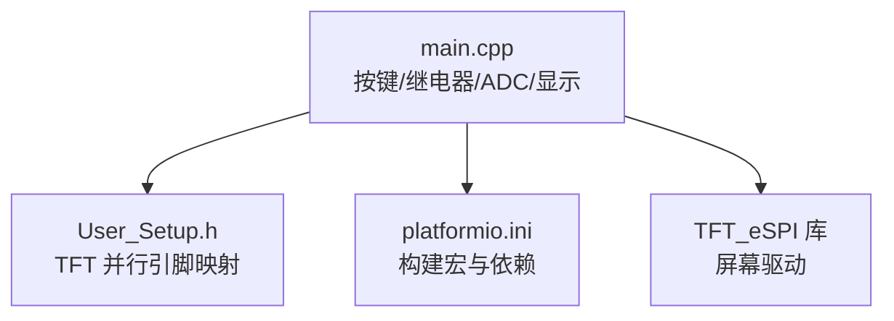
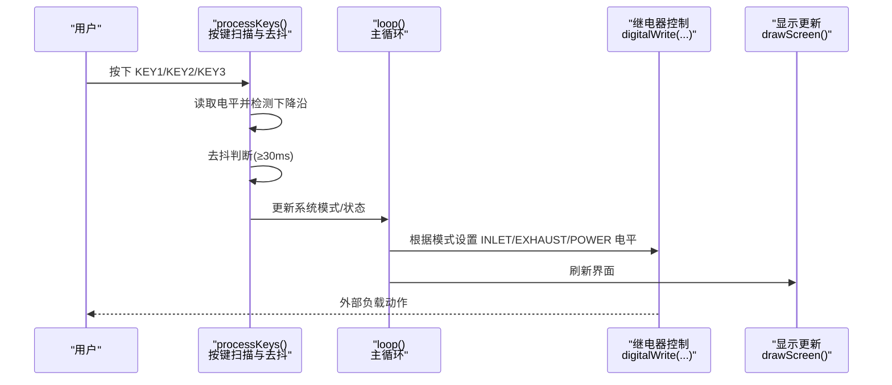
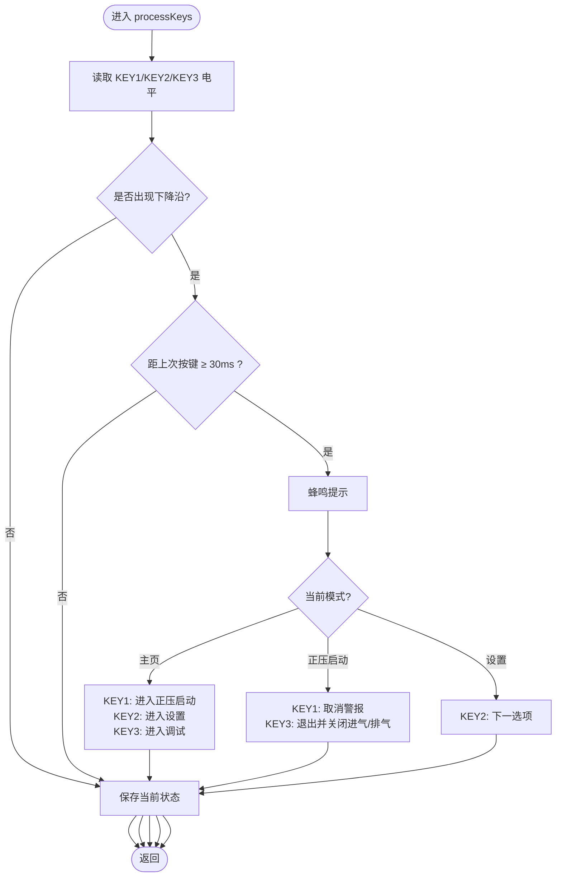
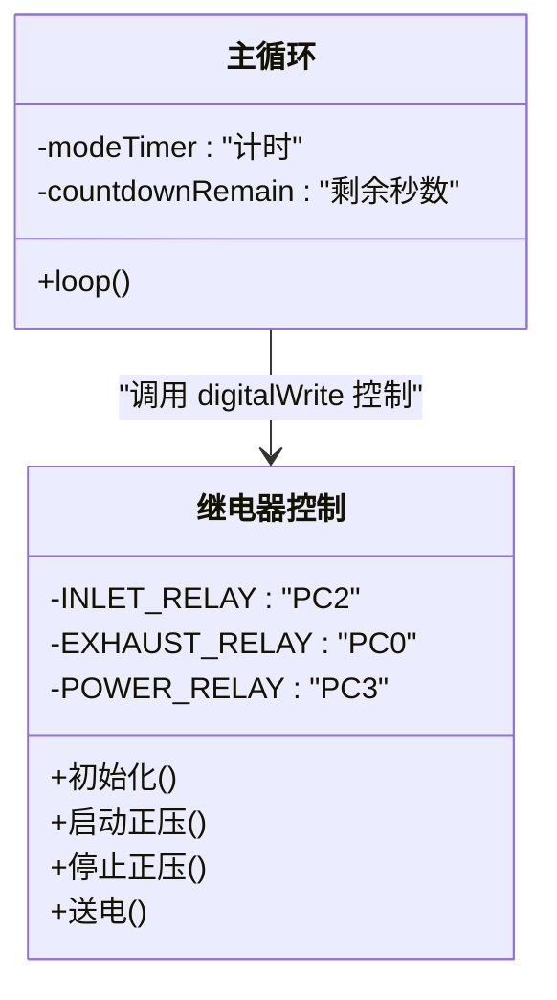
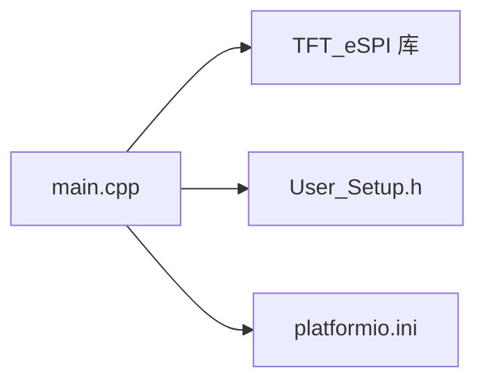
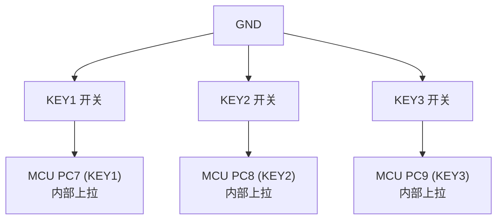
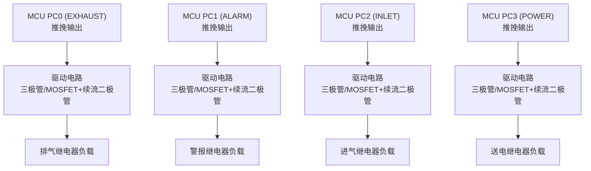

# 输入输出系统

<cite>
**本文引用的文件**   
- [src/main.cpp](file://src/main.cpp)
- [include/User_Setup.h](file://include/User_Setup.h)
- [platformio.ini](file://platformio.ini)
</cite>

## 目录
1. [简介](#简介)
2. [项目结构](#项目结构)
3. [核心组件](#核心组件)
4. [架构总览](#架构总览)
5. [详细组件分析](#详细组件分析)
6. [依赖关系分析](#依赖关系分析)
7. [性能与响应时间](#性能与响应时间)
8. [故障诊断与排错](#故障诊断与排错)
9. [结论](#结论)
10. [附录：硬件接线与电气特性](#附录硬件接线与电气特性)

## 简介
本文件面向系统的按键输入与继电器输出，提供从硬件连接到软件处理的完整接口说明。重点覆盖以下方面：
- 三个物理按键（KEY1、KEY2、KEY3）的连接方式、去抖处理与状态检测算法
- 继电器的低电平触发逻辑、外部电路保护与负载控制策略
- GPIO端口配置模式（输入上拉、推挽输出）与电气特性
- 按键防误触处理与响应时间优化建议
- 电路图、接线图与常见问题的诊断方法（按键粘连、继电器抖动、电磁干扰）

## 项目结构
本项目基于 Arduino 框架与 GD32F103RCT6 平台，使用 TFT_eSPI 驱动并行 TFT 屏；按键与继电器通过 GPIO 直接控制，ADC 用于传感器采样。关键文件职责如下：
- src/main.cpp：主程序，包含引脚定义、GPIO 初始化、按键扫描与去抖、继电器控制、显示刷新等
- include/User_Setup.h：TFT 并行接口与引脚映射配置
- platformio.ini：构建选项与编译宏，启用并行 TFT 与字体库

图表来源
- [src/main.cpp:1-20](file://src/main.cpp#L1-L20)
- [include/User_Setup.h:1-20](file://include/User_Setup.h#L1-L20)
- [platformio.ini:1-15](file://platformio.ini#L1-L15)

章节来源
- [src/main.cpp:1-20](file://src/main.cpp#L1-L20)
- [include/User_Setup.h:1-20](file://include/User_Setup.h#L1-L20)
- [platformio.ini:1-15](file://platformio.ini#L1-L15)

## 核心组件
- 按键输入
  - 引脚分配：KEY1=PC7，KEY2=PC8，KEY3=PC9
  - 配置模式：INPUT_PULLUP（内部上拉），按下为低电平
  - 去抖策略：时间窗去抖（约 30ms）+ 下降沿检测 + 全局最小间隔限制
  - 反馈：每次有效按键触发蜂鸣器短促提示
- 继电器输出
  - 引脚分配：POWER_RELAY=PC3，INLET_RELAY=PC2，ALARM_RELAY=PC1，EXHAUST_RELAY=PC0
  - 配置模式：OUTPUT（推挽输出），默认低电平
  - 控制逻辑：正压启动时置高以驱动外部低电平有效负载；倒计时结束或退出时置低
- ADC 传感器（压力/温度）
  - 引脚：PRESS_ADC_PIN=PC4（通道14），TEMP_ADC_PIN=PC5（通道15）
  - 采样与校准：单次转换、多次平均与零点校准

章节来源
- [src/main.cpp:15-21](file://src/main.cpp#L15-L21)
- [src/main.cpp:372-381](file://src/main.cpp#L372-L381)
- [src/main.cpp:318-364](file://src/main.cpp#L318-L364)
- [src/main.cpp:76-101](file://src/main.cpp#L76-L101)

## 架构总览
下图展示按键输入到业务逻辑再到继电器输出的数据流与控制流。

图表来源
- [src/main.cpp:318-364](file://src/main.cpp#L318-L364)
- [src/main.cpp:392-433](file://src/main.cpp#L392-L433)

## 详细组件分析

### 按键输入子系统
- 硬件连接
  - 三个按键一端接地，另一端分别接 PC7、PC8、PC9，并启用 MCU 内部上拉
  - 未按下时为高电平，按下为低电平
- 软件处理
  - 每轮 loop 调用 processKeys() 进行扫描
  - 采用“上次状态 + 当前状态”的边沿检测，仅在下降沿触发
  - 去抖：自上次按键后至少 30ms 才允许再次触发，避免弹跳重复计数
  - 反馈：触发一次即发出蜂鸣提示音
- 状态机行为
  - KEY1：主页→正压启动；正压启动中可取消警报；设置/调试页返回主页
  - KEY2：主页→系统设置；设置页下一选项
  - KEY3：主页→系统调试；正压启动中退出并关闭进气/排气；其他页面返回主页

图表来源
- [src/main.cpp:318-364](file://src/main.cpp#L318-L364)

章节来源
- [src/main.cpp:318-364](file://src/main.cpp#L318-L364)

### 继电器输出子系统
- 硬件连接
  - POWER_RELAY=PC3，INLET_RELAY=PC2，ALARM_RELAY=PC1，EXHAUST_RELAY=PC0
  - 配置为推挽输出，默认低电平
- 控制逻辑
  - 正压启动阶段：置高 INLET 与 EXHAUST，驱动外部低电平有效负载工作
  - 倒计时结束：置低 INLET 与 EXHAUST；若无全局报警则置高 POWER 以送电
  - 手动退出：置低 INLET 与 EXHAUST
- 安全与保护
  - 所有继电器在初始化时置低，避免上电误动作
  - 退出正压模式时显式关闭相关继电器，确保状态一致

图表来源
- [src/main.cpp:377-381](file://src/main.cpp#L377-L381)
- [src/main.cpp:400-424](file://src/main.cpp#L400-L424)

章节来源
- [src/main.cpp:377-381](file://src/main.cpp#L377-L381)
- [src/main.cpp:400-424](file://src/main.cpp#L400-L424)

### GPIO 配置与电气特性
- 输入上拉（按键）
  - 配置：INPUT_PULLUP
  - 逻辑：未按下为高，按下为低
  - 优点：无需外部上拉电阻，简化布线
- 推挽输出（继电器）
  - 配置：OUTPUT
  - 初始状态：全部置低，防止上电误触发
  - 驱动能力：由 MCU 引脚驱动能力决定，需配合外部驱动电路（如三极管/MOSFET/光耦+继电器模块）
- 电气注意
  - 继电器线圈为感性负载，必须加续流二极管吸收反电动势
  - 建议在信号线上串联限流电阻，必要时增加 RC 滤波抑制高频噪声
  - 地线单点汇聚，降低共模干扰

章节来源
- [src/main.cpp:372-381](file://src/main.cpp#L372-L381)

## 依赖关系分析
- main.cpp 依赖 TFT_eSPI 库进行屏幕绘制，并通过 User_Setup.h 与 platformio.ini 中的宏确定并行总线与引脚映射
- 按键与继电器完全由 main.cpp 的 GPIO 操作函数驱动，无额外中间层

图表来源
- [include/User_Setup.h:1-20](file://include/User_Setup.h#L1-L20)
- [platformio.ini:1-15](file://platformio.ini#L1-L15)
- [src/main.cpp:10-12](file://src/main.cpp#L10-L12)

章节来源
- [include/User_Setup.h:1-20](file://include/User_Setup.h#L1-L20)
- [platformio.ini:1-15](file://platformio.ini#L1-L15)
- [src/main.cpp:10-12](file://src/main.cpp#L10-L12)

## 性能与响应时间
- 按键响应
  - 去抖阈值 30ms，兼顾可靠性与响应速度
  - 主循环 delay(10ms)，整体按键扫描周期约 10ms，满足人机交互需求
- 优化建议
  - 将按键扫描改为中断触发（EXTI），进一步降低延迟与 CPU 占用
  - 对频繁刷新的显示区域进行局部更新，减少全屏重绘开销
  - 使用非阻塞延时替代 delay()，提升多任务并发能力

[本节为通用性能讨论，不直接分析具体代码行]

## 故障诊断与排错
- 按键粘连
  - 现象：长按后仍持续触发
  - 排查：确认去抖时间窗与边沿检测逻辑；检查外部是否有短路或上拉失效
  - 修复：适当增大去抖时间；增加软件消抖状态机（按住期间忽略重复触发）
- 继电器抖动
  - 现象：触点吸合/释放瞬间产生电弧与噪声
  - 排查：确认续流二极管安装正确；测量线圈两端电压波形
  - 修复：增加 RC 吸收网络；优化 PCB 布局，缩短回路面积
- 电磁干扰
  - 现象：按键误触发或显示异常
  - 排查：检查屏蔽与接地；观察电源纹波
  - 修复：在 IO 口增加小电容滤波；使用磁珠隔离敏感信号；合理分区布线

[本节为通用排错指导，不直接分析具体代码行]

## 结论
本系统通过简单的 GPIO 输入上拉与推挽输出实现按键与继电器的可靠控制。软件层面采用边沿检测与时间窗去抖，保证按键稳定；继电器在正压启动流程中按序控制，并在退出时复位至安全状态。结合外部电路保护与良好的布线设计，可有效应对按键粘连、继电器抖动与电磁干扰等问题。

[本节为总结性内容，不直接分析具体代码行]

## 附录：硬件接线与电气特性

### 按键接线图

图表来源
- [src/main.cpp:15-18](file://src/main.cpp#L15-L18)
- [src/main.cpp:372-375](file://src/main.cpp#L372-L375)

### 继电器接线图

图表来源
- [src/main.cpp:16-17](file://src/main.cpp#L16-L17)
- [src/main.cpp:377-381](file://src/main.cpp#L377-L381)

### 电气特性要点
- 输入上拉
  - 未按下：高电平；按下：低电平
  - 内部上拉电阻典型值几十千欧，适合机械按键
- 推挽输出
  - 高电平接近 VCC，低电平接近 GND
  - 驱动电流有限，务必通过外部驱动电路带动继电器线圈
- 保护元件
  - 续流二极管：并联在线圈两端，方向反向于供电极性
  - RC 吸收：跨接在触点两端，抑制火花与 EMI
  - 限流电阻：串在控制信号路径，减小瞬态冲击

[本节为通用电气特性说明，不直接分析具体代码行]