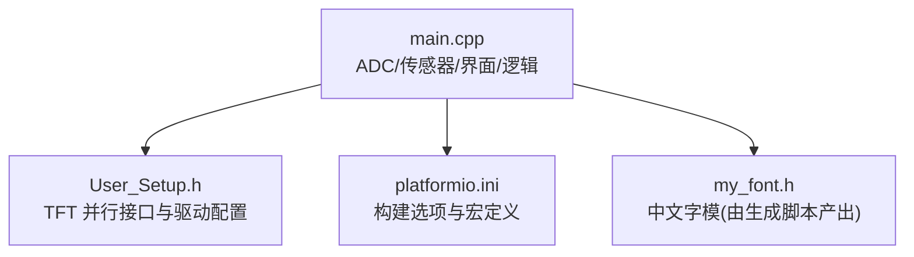
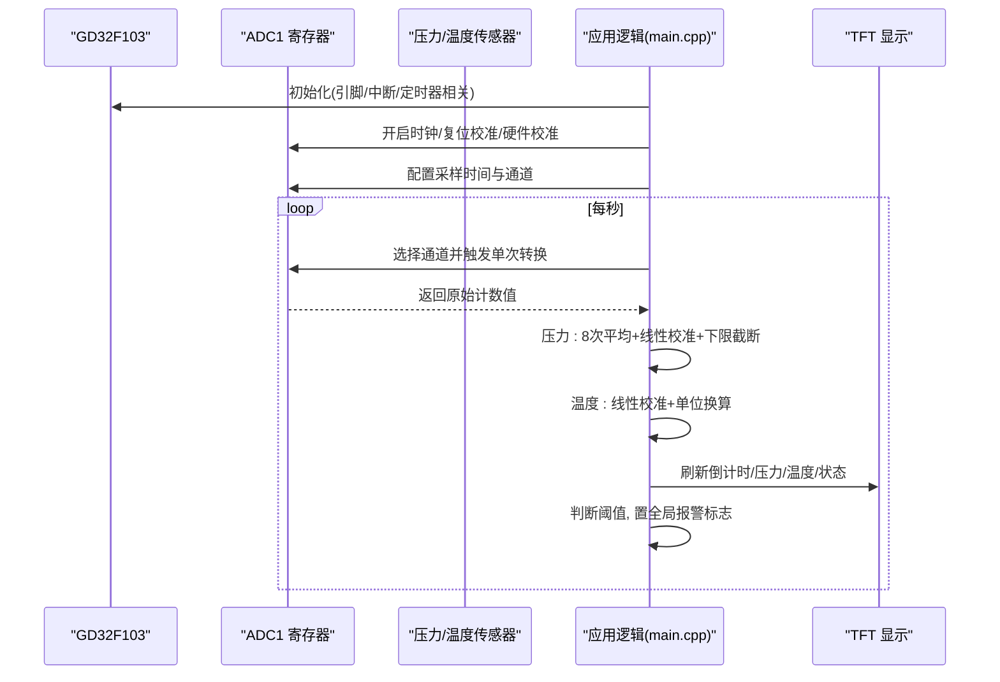
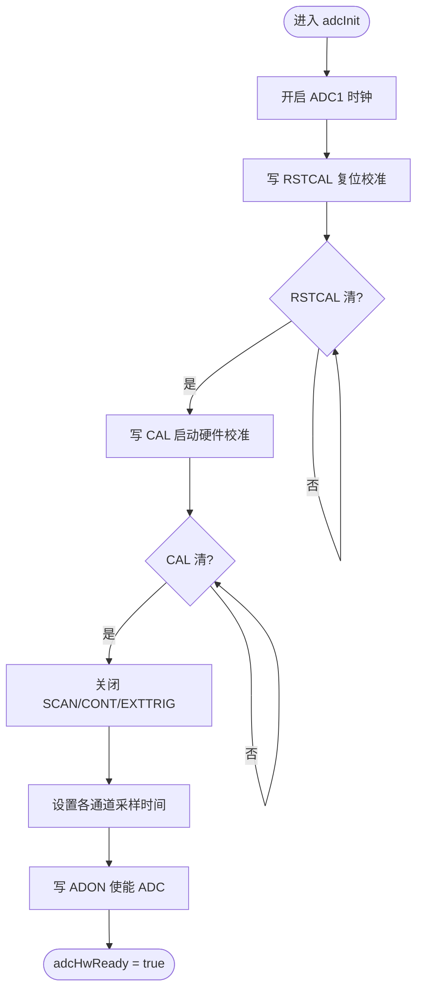
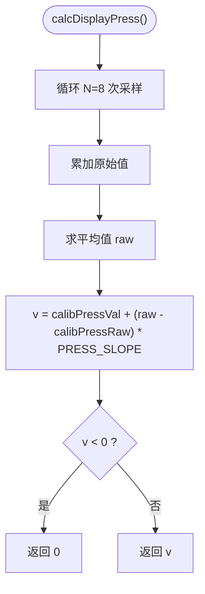
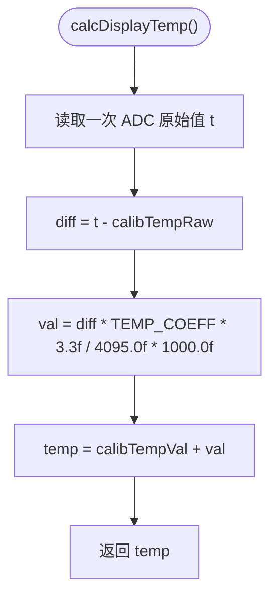
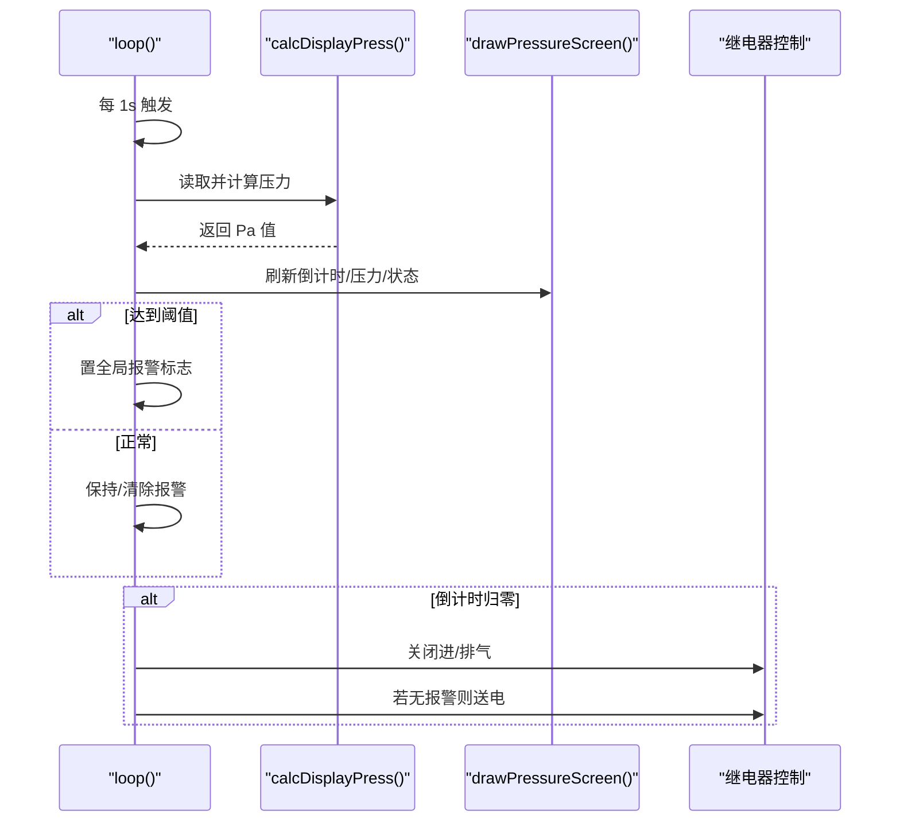
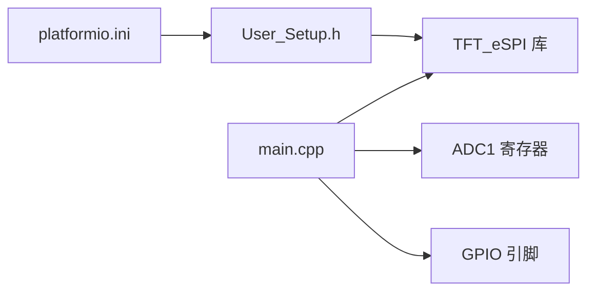

# 传感器数据采集

<cite>
**本文引用的文件**
- [src/main.cpp](file://src/main.cpp)
- [include/User_Setup.h](file://include/User_Setup.h)
- [platformio.ini](file://platformio.ini)
</cite>

## 目录
1. [简介](#简介)
2. [项目结构](#项目结构)
3. [核心组件](#核心组件)
4. [架构总览](#架构总览)
5. [详细组件分析](#详细组件分析)
6. [依赖关系分析](#依赖关系分析)
7. [性能考虑](#性能考虑)
8. [故障诊断与异常处理](#故障诊断与异常处理)
9. [结论](#结论)
10. [附录：传感器替换与重新校准指南](#附录传感器替换与重新校准指南)

## 简介
本系统基于 GD32F103RCT6 微控制器，面向正压防爆控制场景，采集柜内压力与温度数据，并在 3.5 寸横屏（480x320）上显示。系统通过 ADC 驱动直接操作寄存器完成时钟使能、复位/硬件校准、采样参数配置与单次转换；对压力与温度数据进行滤波、单位换算与线性校准，并实现阈值报警与状态指示。主循环中按秒级频率更新倒计时与压力值，同时提供按键交互与蜂鸣提示。

## 项目结构
- 应用主程序位于 src/main.cpp，包含 ADC 初始化与读取、压力/温度计算、UI 绘制、按键处理与主循环调度。
- 屏幕驱动配置位于 include/User_Setup.h，定义并行接口引脚、驱动型号与字体选项。
- 构建配置位于 platformio.ini，指定平台、板型、框架、库依赖及编译宏。

图表来源
- [src/main.cpp:1-434](file://src/main.cpp#L1-L434)
- [include/User_Setup.h:1-74](file://include/User_Setup.h#L1-L74)
- [platformio.ini:1-47](file://platformio.ini#L1-L47)

章节来源
- [src/main.cpp:1-434](file://src/main.cpp#L1-L434)
- [include/User_Setup.h:1-74](file://include/User_Setup.h#L1-L74)
- [platformio.ini:1-47](file://platformio.ini#L1-L47)

## 核心组件
- ADC 驱动层
  - 时钟使能与硬件校准流程
  - 扫描/连续模式关闭、采样时间设置
  - 单次转换触发与 EOC 等待
- 传感器数据处理
  - 压力：多采样平均 + 线性校准 + 下限截断
  - 温度：单点采样 + 线性校准 + 电压到毫伏再到温度系数换算
- UI 与交互
  - 主页、正压启动、系统设置、调试界面
  - 按键消抖与蜂鸣反馈
- 控制与状态
  - 继电器控制（进气/排气/送电/警报）
  - 全局报警标志与闪烁计时

章节来源
- [src/main.cpp:74-101](file://src/main.cpp#L74-L101)
- [src/main.cpp:145-156](file://src/main.cpp#L145-L156)
- [src/main.cpp:168-310](file://src/main.cpp#L168-L310)
- [src/main.cpp:312-364](file://src/main.cpp#L312-L364)
- [src/main.cpp:366-434](file://src/main.cpp#L366-L434)

## 架构总览
下图展示了从 ADC 寄存器操作到上层显示与控制的整体数据流。

图表来源
- [src/main.cpp:74-101](file://src/main.cpp#L74-L101)
- [src/main.cpp:145-156](file://src/main.cpp#L145-L156)
- [src/main.cpp:391-434](file://src/main.cpp#L391-L434)

## 详细组件分析

### ADC 驱动与底层寄存器操作
- 时钟与电源
  - 开启 ADC1 时钟后执行复位校准与硬件校准，确保内部偏移与增益误差最小化。
  - 启用 ADON 位，等待稳定后再进行转换。
- 工作模式
  - 关闭扫描与连续转换，使用单次触发模式，避免不必要的总线占用。
- 采样参数
  - 为压力与温度通道分别设置采样周期，以平衡精度与速度。
- 单次转换流程
  - 写入 SQR3 选择目标通道，清零 SQR1，清除 SR 标志，延时后写 SWSTART 启动转换。
  - 轮询 EOC 标志位，超时保护防止死等，完成后读取 DR 得到 12 位原始值。

图表来源
- [src/main.cpp:76-90](file://src/main.cpp#L76-L90)

章节来源
- [src/main.cpp:74-101](file://src/main.cpp#L74-L101)

### 压力传感器数据处理流程
- 滤波算法
  - 采用固定窗口均值滤波，对同一通道连续采样 N 次求和取平均，降低随机噪声。
- 线性校准
  - 使用两点法线性模型：输出 = 基准值 + (当前原始值 - 零点原始值) × 斜率。
  - 零点原始值在初始化时多次采样平均获得，基准值与斜率可配置。
- 单位与范围
  - 最终结果单位为 Pa，并对负值进行截断，保证显示非负。
- 有效性验证
  - 若 ADC 未就绪或转换失败，返回零值，避免异常传播。

图表来源
- [src/main.cpp:146-152](file://src/main.cpp#L146-L152)

章节来源
- [src/main.cpp:145-152](file://src/main.cpp#L145-L152)

### 温度传感器数据处理流程
- 采样策略
  - 每次调用进行一次 ADC 转换，获取原始计数值。
- 线性校准与单位换算
  - 将原始值转换为相对于零点的差值，乘以温度系数与参考电压比例因子，再换算为毫伏量纲，最后叠加基准温度值。
  - 公式形式：输出 = 基准温度 + (当前原始值 - 零点原始值) × 温度系数 × (Vref / 满量程) × 单位换算。
- 数值范围
  - 结果单位为摄氏度，保留小数部分用于显示。

图表来源
- [src/main.cpp:153-156](file://src/main.cpp#L153-L156)

章节来源
- [src/main.cpp:153-156](file://src/main.cpp#L153-L156)

### 线性校准公式与系数说明
- 通用线性模型
  - y = b + k × (x - x0)
  - 其中 x 为 ADC 原始计数，x0 为零点原始值，b 为基准物理量，k 为斜率/灵敏度系数。
- 压力
  - 基准值 calibPressVal、斜率 PRESS_SLOPE、零点原始值 calibPressRaw 共同决定输出 Pa。
- 温度
  - 基准值 calibTempVal、系数 TEMP_COEFF、零点原始值 calibTempRaw 与 Vref/满量程比例共同决定输出 ℃。

章节来源
- [src/main.cpp:45-50](file://src/main.cpp#L45-L50)
- [src/main.cpp:146-156](file://src/main.cpp#L146-L156)

### 主循环与显示调度
- 每秒更新
  - 在正压启动模式下，每秒递减换气倒计时，读取并更新压力值，刷新界面。
- 状态与报警
  - 根据压力阈值区间设置不同颜色与文本，超限时置全局报警标志。
- 继电器控制
  - 倒计时归零后关闭进/排气阀，若无报警则闭合送电继电器。

图表来源
- [src/main.cpp:391-434](file://src/main.cpp#L391-L434)
- [src/main.cpp:191-253](file://src/main.cpp#L191-L253)

章节来源
- [src/main.cpp:391-434](file://src/main.cpp#L391-L434)
- [src/main.cpp:191-253](file://src/main.cpp#L191-L253)

### 按键与蜂鸣器
- 按键消抖
  - 记录上次电平与按下时间，下降沿触发且间隔大于消抖阈值才响应。
- 功能映射
  - 主页进入正压启动/系统设置/调试；正压启动页取消警报或返回主页；设置页切换选项与确认。
- 蜂鸣反馈
  - 每次有效按键均短促蜂鸣提示。

章节来源
- [src/main.cpp:312-364](file://src/main.cpp#L312-L364)

## 依赖关系分析
- 外部库
  - TFT_eSPI：负责 8 位并行接口时序与像素绘制。
- 构建宏
  - 通过 platformio.ini 注入 TFT 引脚、驱动型号与字体宏，User_Setup.h 与之保持一致。
- 模块耦合
  - main.cpp 直接操作 ADC 寄存器与 GPIO，并通过 TFT_eSPI 进行 UI 渲染；无额外中间层。

图表来源
- [platformio.ini:1-47](file://platformio.ini#L1-L47)
- [include/User_Setup.h:1-74](file://include/User_Setup.h#L1-L74)
- [src/main.cpp:1-434](file://src/main.cpp#L1-L434)

章节来源
- [platformio.ini:1-47](file://platformio.ini#L1-L47)
- [include/User_Setup.h:1-74](file://include/User_Setup.h#L1-L74)
- [src/main.cpp:1-434](file://src/main.cpp#L1-L434)

## 性能考虑
- ADC 采样时间
  - 适当增加采样周期可提高抗噪能力，但会降低吞吐；当前为压力与温度通道分别设置了较高采样周期。
- 滤波开销
  - 压力采用 8 次平均，在主循环每秒调用一次，CPU 开销可控。
- 显示刷新
  - 每次压力更新即刷新整屏，建议后续优化为局部刷新以减少带宽占用。
- 忙等与延时
  - 校准与转换过程中存在忙等与 NOP 延时，需确保不会阻塞关键任务；可在未来引入中断或 DMA 提升实时性。

[本节为通用指导，不直接分析具体文件]

## 故障诊断与异常处理
- ADC 未就绪
  - 首次读取前会尝试初始化；若初始化失败，读取函数返回 0，上层逻辑应视为无效数据。
- 转换超时
  - 转换等待带超时计数，防止死等；超时情况下可能返回旧值或未更新，建议在更高层做一致性检查。
- 数据有效性
  - 压力结果被强制为非负；温度未做范围校验，建议增加合理上下限检测。
- 报警与消音
  - 超限时置全局报警标志，用户可通过“取消警报”按钮进入消音状态，界面以闪烁红块提示。

章节来源
- [src/main.cpp:91-101](file://src/main.cpp#L91-L101)
- [src/main.cpp:146-156](file://src/main.cpp#L146-L156)
- [src/main.cpp:218-246](file://src/main.cpp#L218-L246)

## 结论
本系统实现了基于 GD32F103 的 ADC 直驱方案，完成了压力与温度的采集、滤波、线性校准与显示控制。整体架构简洁清晰，适合嵌入式现场部署。后续可从以下方面增强：
- 引入滑动窗口或一阶低通滤波替代固定平均，提高动态响应与稳定性。
- 增加温度范围与漂移检测，完善传感器健康度评估。
- 将 ADC 转换改为中断或 DMA 方式，释放 CPU 资源。
- 优化 UI 刷新策略，减少全屏重绘带来的带宽消耗。

[本节为总结性内容，不直接分析具体文件]

## 附录：传感器替换与重新校准指南

### 更换传感器后的快速校准步骤
- 准备
  - 确保设备断电并安全隔离，更换压力与温度传感器至正确接线位置。
  - 上电后进入“系统设置”，选择“校准传感器”。
- 零点校准
  - 压力：在无压状态下执行零点采样，系统将记录 calibPressRaw。
  - 温度：在已知标准温度环境下记录 calibTempRaw。
- 斜率/系数标定
  - 压力：施加两个已知压力点，计算 PRESS_SLOPE 与 calibPressVal。
  - 温度：在两个已知温度点测量，计算 TEMP_COEFF 与 calibTempVal。
- 验证
  - 回到调试界面观察实时压力与温度，确认偏差在允许范围内。
  - 若偏差较大，重复上述步骤直至满足要求。

### 在线微调与注意事项
- 微调建议
  - 优先调整基准值（calibPressVal/calibTempVal），其次再调整斜率/系数，避免过度拟合。
- 环境因素
  - 温度漂移与供电波动会影响 ADC 基准，建议在稳定工况下完成标定。
- 数据保存
  - 建议将校准系数持久化存储，以便重启后自动加载。

章节来源
- [src/main.cpp:45-50](file://src/main.cpp#L45-L50)
- [src/main.cpp:366-389](file://src/main.cpp#L366-L389)
- [src/main.cpp:146-156](file://src/main.cpp#L146-L156)