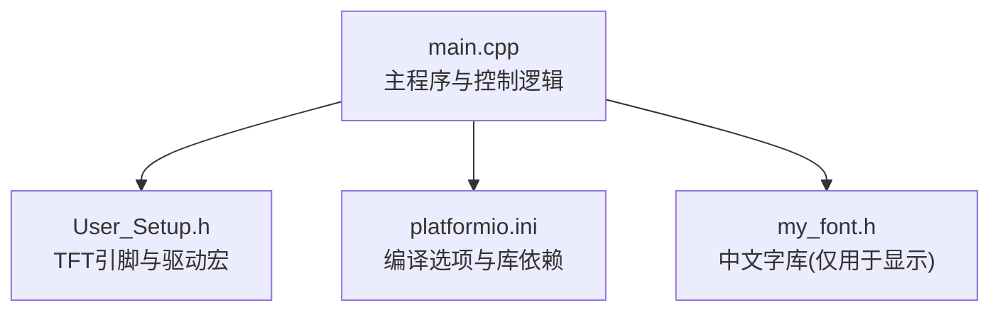
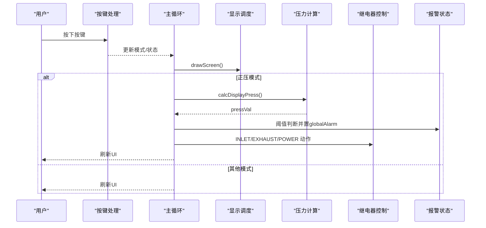
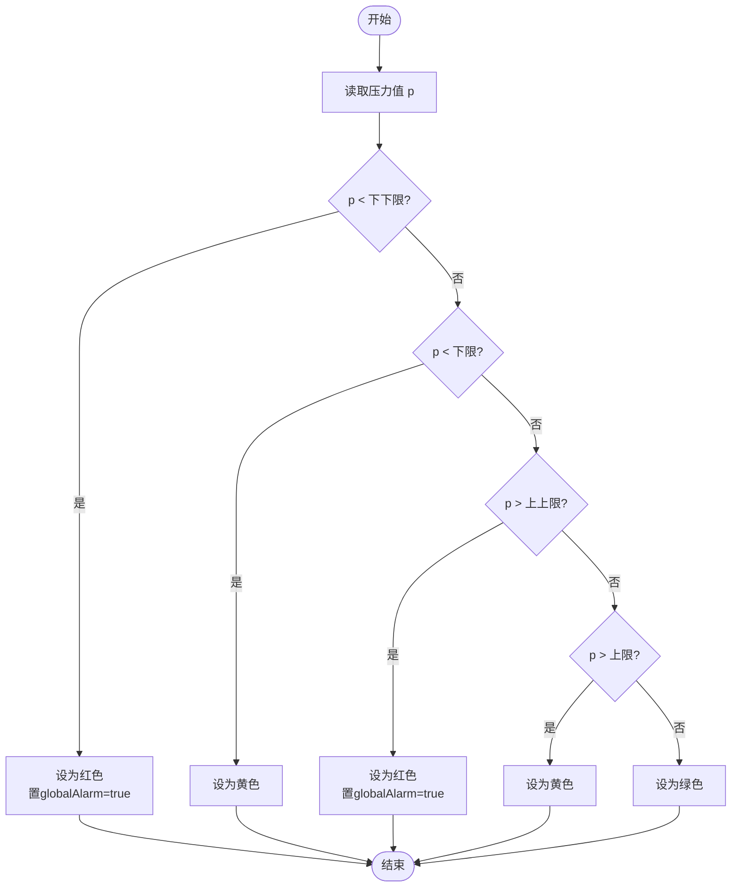
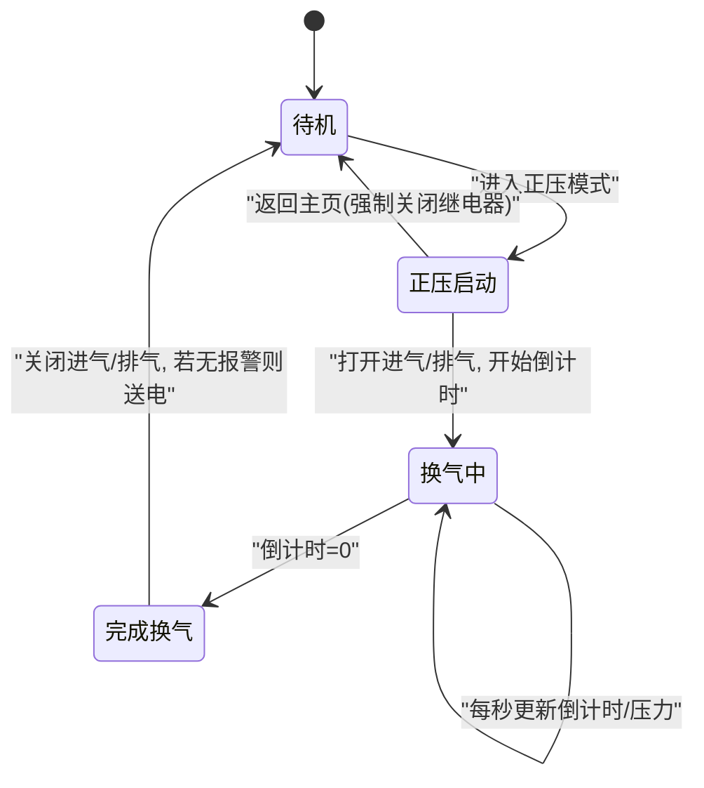
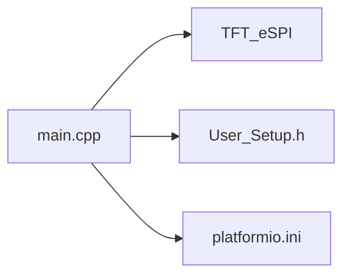

# 控制系统逻辑

<cite>
**本文引用的文件**
- [src/main.cpp](file://src/main.cpp)
- [include/User_Setup.h](file://include/User_Setup.h)
- [platformio.ini](file://platformio.ini)
</cite>

## 目录
1. [简介](#简介)
2. [项目结构](#项目结构)
3. [核心组件](#核心组件)
4. [架构总览](#架构总览)
5. [详细组件分析](#详细组件分析)
6. [依赖关系分析](#依赖关系分析)
7. [性能考虑](#性能考虑)
8. [故障排查指南](#故障排查指南)
9. [结论](#结论)
10. [附录](#附录)

## 简介
本文件面向正压防爆控制系统的控制逻辑，聚焦以下目标：
- 正压防爆控制的核心算法：进气/排气继电器的启停策略与压力阈值判断。
- 报警系统多级处理机制：压力上下限检测、声光报警触发与消音功能。
- 系统参数配置管理：sysParams数组的结构定义与默认值设置。
- 继电器控制安全机制：互锁保护与故障恢复。
- 提供状态图、时序图及具体实现代码路径，便于定位与二次开发。

## 项目结构
本项目为基于GD32F103RCT6的Arduino工程，使用TFT_eSPI驱动3.5寸横屏（480x320），通过并行总线通信。核心控制与UI逻辑集中在单一源文件中，硬件引脚与显示驱动在头文件与构建配置中声明。

图表来源
- [src/main.cpp:1-20](file://src/main.cpp#L1-L20)
- [include/User_Setup.h:14-47](file://include/User_Setup.h#L14-L47)
- [platformio.ini:1-22](file://platformio.ini#L1-L22)

章节来源
- [src/main.cpp:1-20](file://src/main.cpp#L1-L20)
- [include/User_Setup.h:14-47](file://include/User_Setup.h#L14-L47)
- [platformio.ini:1-22](file://platformio.ini#L1-L22)

## 核心组件
- 硬件抽象与引脚映射
  - 蜂鸣器、按键、继电器、ADC通道等引脚常量集中定义，便于维护与移植。
- 系统参数 sysParams
  - 采用固定长度数组存储关键阈值与时间，包含下限、下下限、上限、上上限、温度上限、换气时间。
- 传感器采集与校准
  - ADC采样压力与温度，内置零偏与斜率校准，输出工程值。
- 人机界面
  - 主页、正压启动页、系统设置、调试页四态切换；中文混合字符串绘制。
- 控制与报警
  - 正压模式倒计时、压力阈值判定、全局报警标志、消音状态、继电器动作。

章节来源
- [src/main.cpp:15-31](file://src/main.cpp#L15-L31)
- [src/main.cpp:26-30](file://src/main.cpp#L26-L30)
- [src/main.cpp:74-101](file://src/main.cpp#L74-L101)
- [src/main.cpp:146-156](file://src/main.cpp#L146-L156)
- [src/main.cpp:168-310](file://src/main.cpp#L168-L310)
- [src/main.cpp:391-433](file://src/main.cpp#L391-L433)

## 架构总览
整体流程由主循环驱动，按模式调度显示与业务逻辑；按键中断式去抖后更新状态；压力采样与阈值判断驱动报警与继电器动作。

图表来源
- [src/main.cpp:312-364](file://src/main.cpp#L312-L364)
- [src/main.cpp:391-433](file://src/main.cpp#L391-L433)
- [src/main.cpp:146-156](file://src/main.cpp#L146-L156)
- [src/main.cpp:192-253](file://src/main.cpp#L192-L253)

## 详细组件分析

### 系统参数 sysParams 结构与默认值
- 结构定义与默认值
  - 数组长度为6，顺序为：下限、下下限、上限、上上限、温度上限、换气时间。
  - 提供默认值常量，便于恢复出厂或初始化。
- 使用位置
  - 正压启动时读取“换气时间”作为倒计时初始值。
  - 压力页面根据“下限/下下限/上限/上上限”进行状态判定与提示。
  - 页面展示“换气开启压力”取自“下限”。

章节来源
- [src/main.cpp:26-30](file://src/main.cpp#L26-L30)
- [src/main.cpp:220-234](file://src/main.cpp#L220-L234)
- [src/main.cpp:400-408](file://src/main.cpp#L400-L408)

### 压力阈值判断与报警多级处理
- 阈值区间与状态文本
  - 低于下下限：红色，触发全局报警。
  - 介于下下限与下限之间：黄色警告。
  - 高于上上限：红色，触发全局报警。
  - 介于上限与上上限之间：黄色警告。
  - 其余：绿色正常。
- 报警与消音
  - globalAlarm 标记是否处于报警状态，影响UI闪烁与按钮颜色。
  - muteOn 表示已消音，右上角显示“消音”提示。
  - 取消警报按钮将清除全局报警并进入消音状态。
- 声光报警
  - 光：UI区域闪烁（红/黄）与状态条颜色变化。
  - 声：蜂鸣器函数可用于提示，当前主要体现于按键反馈。

图表来源
- [src/main.cpp:218-226](file://src/main.cpp#L218-L226)
- [src/main.cpp:236-245](file://src/main.cpp#L236-L245)
- [src/main.cpp:327-335](file://src/main.cpp#L327-L335)

章节来源
- [src/main.cpp:218-226](file://src/main.cpp#L218-L226)
- [src/main.cpp:236-245](file://src/main.cpp#L236-L245)
- [src/main.cpp:327-335](file://src/main.cpp#L327-L335)

### 正压控制算法与继电器策略
- 启动流程
  - 进入正压模式后，同时打开进气与排气继电器，开始换气倒计时。
  - 每秒更新倒计时与压力值，并刷新UI。
- 停止与送电
  - 倒计时归零后关闭进气与排气继电器。
  - 若未处于全局报警状态，则闭合送电继电器，允许设备运行。
- 退出与复位
  - 从正压模式返回主页时，强制关闭进气与排气继电器，确保无残留动作。

图表来源
- [src/main.cpp:400-424](file://src/main.cpp#L400-L424)
- [src/main.cpp:353-355](file://src/main.cpp#L353-L355)

章节来源
- [src/main.cpp:400-424](file://src/main.cpp#L400-L424)
- [src/main.cpp:353-355](file://src/main.cpp#L353-L355)

### 传感器采集与校准
- 压力采集
  - 多次采样取平均降低噪声，应用零点偏移与斜率换算得到工程值，负值截断为零。
- 温度采集
  - 单通道采样，结合系数与参考电压换算为摄氏度。
- 校准
  - 启动时采集若干次压力原始值作为零点基准，温度同理。

章节来源
- [src/main.cpp:74-101](file://src/main.cpp#L74-L101)
- [src/main.cpp:146-156](file://src/main.cpp#L146-L156)
- [src/main.cpp:383-386](file://src/main.cpp#L383-L386)

### 人机界面与交互
- 页面布局
  - 主页：欢迎信息与快捷入口。
  - 正压启动页：倒计时、实时压力、状态条、报警/消音指示、操作按钮。
  - 系统设置页：菜单项选择与确认。
  - 系统调试页：危险提示、实时数据。
- 按键处理
  - 三键防抖与短按响应，不同模式下执行对应跳转或操作。
  - 正压模式中，首键可取消警报并进入消音；第三键返回主页并复位继电器。

章节来源
- [src/main.cpp:168-310](file://src/main.cpp#L168-L310)
- [src/main.cpp:312-364](file://src/main.cpp#L312-L364)

### 安全机制与互锁保护
- 互锁保护
  - 正压模式期间，仅在倒计时结束后才可能送电；若存在全局报警，禁止自动送电。
  - 退出正压模式时强制关闭进气与排气继电器，避免残留动作。
- 故障恢复
  - 报警状态下可通过“取消警报”进入消音，但需人工确认后再恢复正常运行。
  - 建议后续增加：硬件看门狗、异常自检、继电器状态回读校验等增强可靠性。

章节来源
- [src/main.cpp:418-422](file://src/main.cpp#L418-L422)
- [src/main.cpp:353-355](file://src/main.cpp#L353-L355)
- [src/main.cpp:327-335](file://src/main.cpp#L327-L335)

## 依赖关系分析
- 外部库与驱动
  - TFT_eSPI：图形与字体渲染。
  - User_Setup.h：并行接口、引脚映射、驱动型号宏。
  - platformio.ini：编译选项、宏定义、库版本约束。
- 内部模块耦合
  - main.cpp 内聚了UI、控制、传感器、参数与硬件抽象，适合小型嵌入式项目，但需注意后期扩展时的模块化拆分。

图表来源
- [src/main.cpp:10-11](file://src/main.cpp#L10-L11)
- [include/User_Setup.h:14-47](file://include/User_Setup.h#L14-L47)
- [platformio.ini:9-22](file://platformio.ini#L9-L22)

章节来源
- [src/main.cpp:10-11](file://src/main.cpp#L10-L11)
- [include/User_Setup.h:14-47](file://include/User_Setup.h#L14-L47)
- [platformio.ini:9-22](file://platformio.ini#L9-L22)

## 性能考虑
- 显示刷新频率
  - 每秒更新一次压力与倒计时，并在每次更新后刷新屏幕，兼顾实时性与CPU占用。
- ADC采样
  - 压力采样采用8次平均，提升稳定性；单次转换等待超时保护，防止阻塞。
- 延时策略
  - 主循环末尾短延时，保证按键响应及时且不过度占用CPU。

[本节为通用指导，不直接分析具体文件]

## 故障排查指南
- 现象：压力始终为0或异常
  - 检查ADC初始化与通道配置是否正确。
  - 核对校准零点与斜率参数，必要时重新校准。
- 现象：报警无法消除
  - 确认“取消警报”按键逻辑是否被调用，检查全局报警标志与消音标志。
- 现象：继电器不动作
  - 检查引脚方向与初始电平；确认正压模式计时与条件分支是否到达。
- 现象：屏幕显示异常
  - 核对User_Setup.h中的驱动型号与引脚宏是否与平台io.ini一致。

章节来源
- [src/main.cpp:74-101](file://src/main.cpp#L74-L101)
- [src/main.cpp:218-226](file://src/main.cpp#L218-L226)
- [src/main.cpp:327-335](file://src/main.cpp#L327-L335)
- [src/main.cpp:400-424](file://src/main.cpp#L400-L424)
- [include/User_Setup.h:14-47](file://include/User_Setup.h#L14-L47)
- [platformio.ini:9-22](file://platformio.ini#L9-L22)

## 结论
该控制系统以简洁的单文件架构实现了正压防爆控制的核心逻辑，具备清晰的压力阈值判定、多级报警与消音机制，以及可靠的继电器互锁与故障恢复策略。参数化设计使阈值与时间易于调整，配合TFT界面提供了直观的人机交互。建议在后续迭代中引入模块化分层、更完善的自检与看门狗机制，以提升系统鲁棒性与可维护性。

[本节为总结性内容，不直接分析具体文件]

## 附录

### 关键实现代码路径索引
- 系统参数定义与默认值
  - [src/main.cpp:26-30](file://src/main.cpp#L26-L30)
- 压力阈值判断与报警状态
  - [src/main.cpp:218-226](file://src/main.cpp#L218-L226)
  - [src/main.cpp:236-245](file://src/main.cpp#L236-L245)
- 正压模式控制与继电器动作
  - [src/main.cpp:400-424](file://src/main.cpp#L400-L424)
  - [src/main.cpp:353-355](file://src/main.cpp#L353-L355)
- 传感器采集与校准
  - [src/main.cpp:74-101](file://src/main.cpp#L74-L101)
  - [src/main.cpp:146-156](file://src/main.cpp#L146-L156)
  - [src/main.cpp:383-386](file://src/main.cpp#L383-L386)
- 人机界面与按键处理
  - [src/main.cpp:168-310](file://src/main.cpp#L168-L310)
  - [src/main.cpp:312-364](file://src/main.cpp#L312-L364)
- 硬件与显示配置
  - [include/User_Setup.h:14-47](file://include/User_Setup.h#L14-L47)
  - [platformio.ini:9-22](file://platformio.ini#L9-L22)