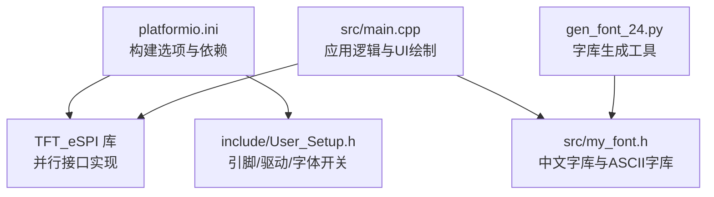
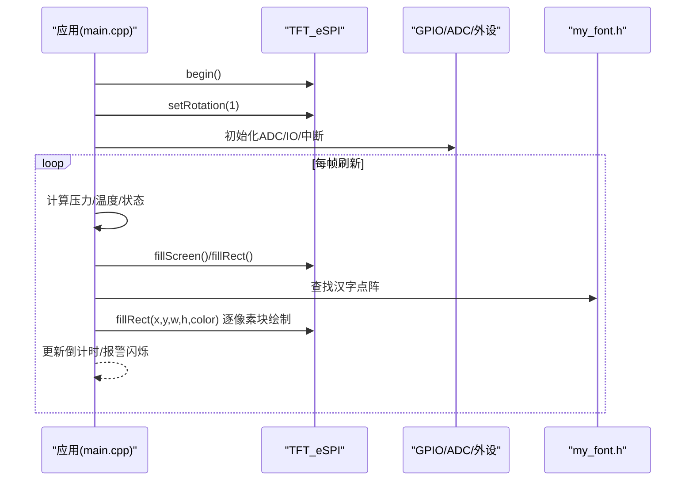
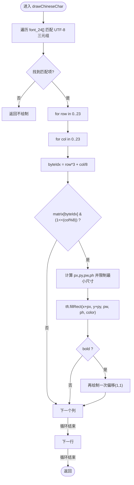
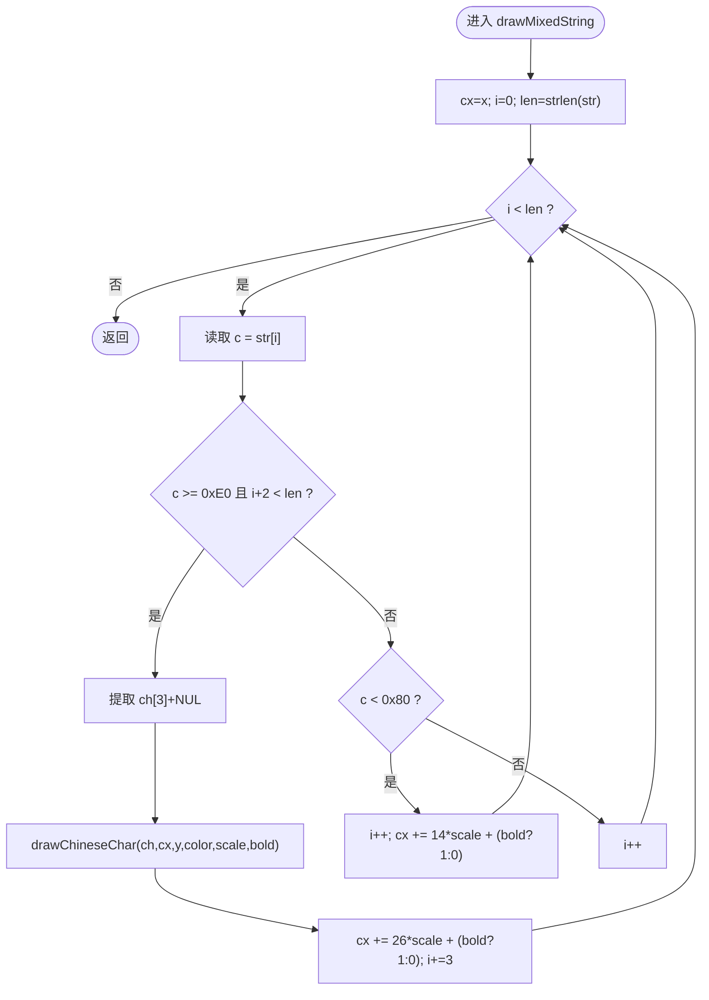
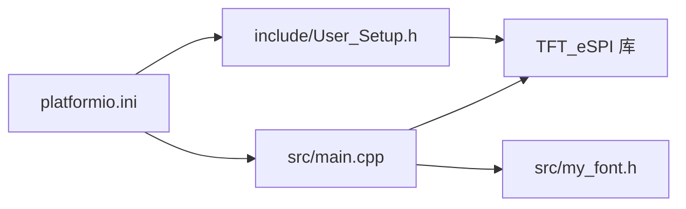

# 显示驱动系统

<cite>
**本文引用的文件**   
- [src/main.cpp](file://src/main.cpp)
- [include/User_Setup.h](file://include/User_Setup.h)
- [src/my_font.h](file://src/my_font.h)
- [platformio.ini](file://platformio.ini)
- [gen_font_24.py](file://gen_font_24.py)
</cite>

## 目录
1. [简介](#简介)
2. [项目结构](#项目结构)
3. [核心组件](#核心组件)
4. [架构总览](#架构总览)
5. [详细组件分析](#详细组件分析)
6. [依赖关系分析](#依赖关系分析)
7. [性能与内存优化](#性能与内存优化)
8. [故障排查指南](#故障排查指南)
9. [结论](#结论)
10. [附录：字体扩展与自定义字符添加](#附录字体扩展与自定义字符添加)

## 简介
本项目面向 GD32F103RCT6 平台，基于 Arduino 框架与 TFT_eSPI 库，使用并行接口驱动 3.5 寸 480x320 横屏（ILI9486 控制器）。系统实现了正压防爆控制系统的 HMI 界面，包括主页、正压启动、系统设置与调试页面。重点包含：
- 并行接口配置与屏幕参数设置
- 旋转模式与分辨率适配
- 中文字体渲染系统（字库数据结构、查找算法、点阵绘制）
- 自定义绘制函数 drawChineseChar() 与 drawMixedString() 的实现原理
- 图形绘制优化策略、内存使用分析与性能考虑
- 字体扩展方法与自定义字符添加指南

## 项目结构
仓库采用分层组织方式：
- include/：用户级 TFT_eSPI 配置头文件
- src/：应用主程序与自定义字体数据
- platformio.ini：构建环境与依赖声明
- gen_font_24.py：用于生成 24x24 中文点阵字库的脚本工具

图表来源
- [platformio.ini:1-45](file://platformio.ini#L1-L45)
- [include/User_Setup.h:1-74](file://include/User_Setup.h#L1-L74)
- [src/main.cpp:1-434](file://src/main.cpp#L1-L434)
- [src/my_font.h:1-3569](file://src/my_font.h#L1-L3569)
- [gen_font_24.py:1-154](file://gen_font_24.py#L1-L154)

章节来源
- [platformio.ini:1-45](file://platformio.ini#L1-L45)
- [include/User_Setup.h:1-74](file://include/User_Setup.h#L1-L74)
- [src/main.cpp:1-434](file://src/main.cpp#L1-L434)
- [src/my_font.h:1-3569](file://src/my_font.h#L1-L3569)
- [gen_font_24.py:1-154](file://gen_font_24.py#L1-L154)

## 核心组件
- 硬件抽象与初始化
  - 并行接口引脚映射与控制信号（DC/CS/WR/RD/RST）
  - ADC 校准与采样流程
  - 蜂鸣器与继电器控制
- 显示子系统
  - TFT_eSPI 实例化与旋转设置
  - 页面绘制函数（主页、正压启动、设置、调试）
  - 按钮布局与文本居中
- 中文字体渲染
  - 24x24 点阵字库结构体与数组
  - 字符查找与点阵遍历绘制
  - 混合字符串（中英文）排版与间距计算
- 交互与状态机
  - 按键消抖与短按/长按处理
  - 模式切换与全局警报闪烁

章节来源
- [src/main.cpp:1-434](file://src/main.cpp#L1-L434)
- [include/User_Setup.h:1-74](file://include/User_Setup.h#L1-L74)
- [src/my_font.h:1-3569](file://src/my_font.h#L1-L3569)

## 架构总览
系统由应用层（main.cpp）、配置层（User_Setup.h）、字库层（my_font.h）与构建环境（platformio.ini）组成。TFT_eSPI 库在编译期根据宏定义选择并行接口与驱动芯片，运行时通过 GPIO 端口直写提升像素填充效率。

图表来源
- [src/main.cpp:367-434](file://src/main.cpp#L367-L434)
- [include/User_Setup.h:22-47](file://include/User_Setup.h#L22-L47)
- [src/my_font.h:1-20](file://src/my_font.h#L1-L20)

## 详细组件分析

### 并行接口与屏幕配置
- 接口模式
  - 启用 8 位并行总线，数据口 PB0-PB7，控制线 PA2(PA5/PA3/PA1) 分别对应 DC/WR/RD/RST
  - 通过 STM_PORTB_DATA_BUS 启用单周期 BSRR 写入，提高写速度
- 驱动芯片
  - 选择 ILI9486_DRIVER，适用于 3.5 寸 480x320 面板
- 字体加载
  - 启用 GLCD、FONT2/4/6/7/8、GFXFF 与 SMOOTH_FONT，按需裁剪以节省 Flash
- 构建宏
  - platformio.ini 中统一注入 -DUSER_SETUP_LOADED、-DTFT_PARALLEL_8_BIT、-DSTM_PORTB_DATA_BUS、-DILI9486_DRIVER 等

章节来源
- [include/User_Setup.h:22-47](file://include/User_Setup.h#L22-L47)
- [include/User_Setup.h:55-64](file://include/User_Setup.h#L55-L64)
- [platformio.ini:10-45](file://platformio.ini#L10-L45)

### 屏幕参数与旋转模式
- 分辨率常量 W=480, H=320
- 横屏模式通过 tft.setRotation(1) 设置
- 页面布局依据 W/H 动态计算按钮宽度与位置

章节来源
- [src/main.cpp:22-24](file://src/main.cpp#L22-L24)
- [src/main.cpp:367-371](file://src/main.cpp#L367-L371)
- [src/main.cpp:68-73](file://src/main.cpp#L68-L73)

### 中文字体渲染系统
- 数据结构
  - CHINESE_24：每个条目包含 index（UTF-8 字符串键）与 matrix（24 行 x 3 字节 = 72 字节点阵）
  - ASCII_16：8x16 英文点阵，便于数字与符号显示
  - 字库数组 font_24[] 与 ascii_16[] 均存放于 PROGMEM（Flash），减少 RAM 占用
- 字符查找算法
  - 线性扫描 font_24[]，使用 strcmp 比较 UTF-8 三字节序列
  - 复杂度 O(N)，N 为字库大小；适合当前规模（约百级）
- 点阵绘制过程
  - 对每个字符矩阵逐行逐列解析位图
  - 将 1bit 映射到矩形区域，支持缩放 scale 与加粗 bold（偏移绘制一次）
  - 调用 tft.fillRect() 批量填充，避免逐像素 API 开销

图表来源
- [src/main.cpp:112-130](file://src/main.cpp#L112-L130)
- [src/my_font.h:7-10](file://src/my_font.h#L7-L10)
- [src/my_font.h:17-18](file://src/my_font.h#L17-L18)

章节来源
- [src/main.cpp:112-143](file://src/main.cpp#L112-L143)
- [src/my_font.h:7-16](file://src/my_font.h#L7-L16)
- [src/my_font.h:3556-3569](file://src/my_font.h#L3556-L3569)

### 混合字符串绘制 drawMixedString()
- 输入：UTF-8 字符串、起始坐标、颜色、缩放、加粗
- 处理流程
  - 检测首字节范围判断是否为 UTF-8 三字节中文字符
  - 若是中文，调用 drawChineseChar() 绘制并前进 3 字节
  - 若为 ASCII，跳过并累进英文宽度（近似 14*scale）
  - 中文宽度近似 26*scale，支持加粗额外 1 像素间距
- 注意
  - 该函数仅推进光标位置，未实际输出英文字符（可结合 TFT_eSPI 的 print/cursor 方法补齐）

图表来源
- [src/main.cpp:131-143](file://src/main.cpp#L131-L143)

章节来源
- [src/main.cpp:131-143](file://src/main.cpp#L131-L143)

### 页面绘制与交互
- 主页：标题、公司信息与菜单按钮布局
- 正压启动：倒计时、压力值、状态条与报警指示
- 系统设置：选项高亮与导航按钮
- 系统调试：实时压力/温度与警告提示
- 按键处理：消抖、短按切换模式、长按可选功能（预留）

章节来源
- [src/main.cpp:158-310](file://src/main.cpp#L158-L310)
- [src/main.cpp:312-364](file://src/main.cpp#L312-L364)

## 依赖关系分析
- 外部库
  - bodmer/TFT_eSPI@^2.5.43：提供并行接口底层实现与绘图 API
- 构建宏
  - -DUSER_SETUP_LOADED：强制使用 include/User_Setup.h
  - -DTFT_PARALLEL_8_BIT/-DSTM_PORTB_DATA_BUS：启用并行与端口优化
  - -DILI9486_DRIVER：选择驱动芯片
  - -DLOAD_*：启用内置字体集
  - -DSMOOTH_FONT：平滑字体支持
  - -DTFT_16BIT_BUS：兼容 16 位总线宏（与 8 位并行并存时需注意）
- 内部模块
  - main.cpp 依赖 my_font.h 的字库与绘制函数
  - User_Setup.h 决定 TFT_eSPI 的编译路径与引脚映射

图表来源
- [platformio.ini:9-45](file://platformio.ini#L9-L45)
- [include/User_Setup.h:14-36](file://include/User_Setup.h#L14-L36)
- [src/main.cpp:10-13](file://src/main.cpp#L10-L13)

章节来源
- [platformio.ini:9-45](file://platformio.ini#L9-L45)
- [include/User_Setup.h:14-36](file://include/User_Setup.h#L14-L36)
- [src/main.cpp:10-13](file://src/main.cpp#L10-L13)

## 性能与内存优化
- 并行接口优化
  - 使用 STM_PORTB_DATA_BUS 进行单周期 BSRR 写入，显著降低 fillRect 耗时
  - 建议保持 8 位并行模式，避免 SPI 瓶颈
- 字库存储
  - 字库数组置于 PROGMEM，减少 RAM 占用；绘制时从 Flash 读取
  - 当前字库规模适中，线性查找可接受；如需更大字库，可引入索引表或哈希加速
- 绘制策略
  - 使用 fillRect 批量填充代替逐像素 API
  - 缩放与加粗通过矩形偏移绘制，避免复杂插值
- 刷新频率
  - 每秒更新一次压力与倒计时，其余 UI 仅在状态变化时刷新，降低带宽压力
- 潜在风险
  - -DTFT_16BIT_BUS 与 -DTFT_PARALLEL_8_BIT 同时存在可能引起冲突，建议仅保留 8 位并行宏
  - 混合字符串未输出英文字符，需补充英文绘制逻辑

章节来源
- [include/User_Setup.h:22-28](file://include/User_Setup.h#L22-L28)
- [src/my_font.h:17-18](file://src/my_font.h#L17-L18)
- [src/main.cpp:112-130](file://src/main.cpp#L112-L130)
- [platformio.ini:13-15](file://platformio.ini#L13-L15)
- [platformio.ini:45](file://platformio.ini#L45)

## 故障排查指南
- 屏幕无显示或花屏
  - 检查 User_Setup.h 中的驱动芯片宏是否与硬件一致（ILI9486）
  - 确认并行引脚映射与 platformio.ini 宏一致
- 中文乱码或无法显示
  - 确保传入 UTF-8 三元组，且顺序正确
  - 检查 drawMixedString() 的 UTF-8 判定条件与步长
- 绘制缓慢
  - 确认已启用 STM_PORTB_DATA_BUS 与 8 位并行
  - 减少不必要的全屏刷新，优先局部刷新
- 构建错误
  - 清理重复或不兼容宏（如 16 位与 8 位并行宏共存）
  - 确认 lib_deps 版本与 USER_SETUP_LOADED 宏生效

章节来源
- [include/User_Setup.h:30-36](file://include/User_Setup.h#L30-L36)
- [include/User_Setup.h:42-47](file://include/User_Setup.h#L42-L47)
- [src/main.cpp:131-143](file://src/main.cpp#L131-L143)
- [platformio.ini:10-15](file://platformio.ini#L10-L15)

## 结论
本系统通过并行接口与优化的 GPIO 写入显著提升 TFT 刷新性能，配合内嵌 24x24 中文字库实现了稳定的中文 UI 展示。drawChineseChar() 与 drawMixedString() 提供了灵活的缩放与加粗能力，满足工业 HMI 需求。后续可通过引入索引表优化查找、完善英文绘制与增量刷新进一步提升体验。

## 附录：字体扩展与自定义字符添加
- 使用生成脚本
  - 运行 gen_font_24.py，指定目标字符列表与字体文件（宋体/黑体/雅黑）
  - 脚本会输出符合 my_font.h 结构的 C 数组片段，包含 index 与 matrix
- 手动添加步骤
  - 在 my_font.h 末尾追加新的 CHINESE_24 条目，保持 index 为 UTF-8 三元组
  - 确保 matrix 为 24 行 x 3 字节，位序与现有格式一致（LSB first）
  - 重新编译后，drawChineseChar() 即可自动识别新字符
- 注意事项
  - 新增字符应遵循现有排序与分组风格，便于维护
  - 若字库过大，建议增加查找索引（如按首字节或拼音索引）以降低线性扫描开销
  - 谨慎评估 Flash 占用与 RAM 缓存策略

章节来源
- [gen_font_24.py:1-154](file://gen_font_24.py#L1-L154)
- [src/my_font.h:7-10](file://src/my_font.h#L7-L10)
- [src/my_font.h:3556-3569](file://src/my_font.h#L3556-L3569)