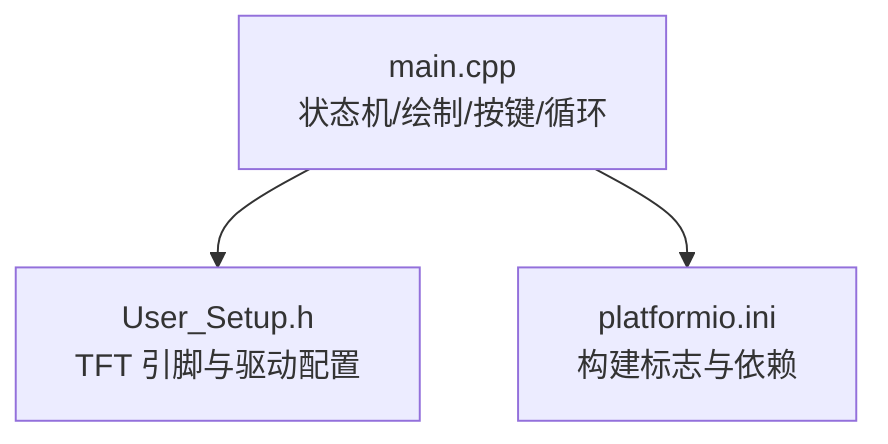
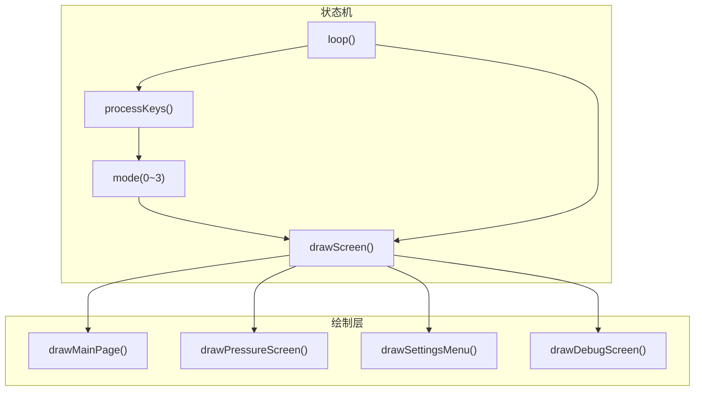
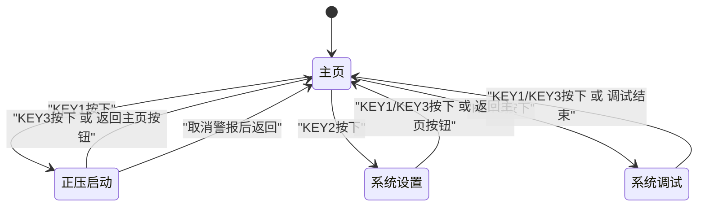
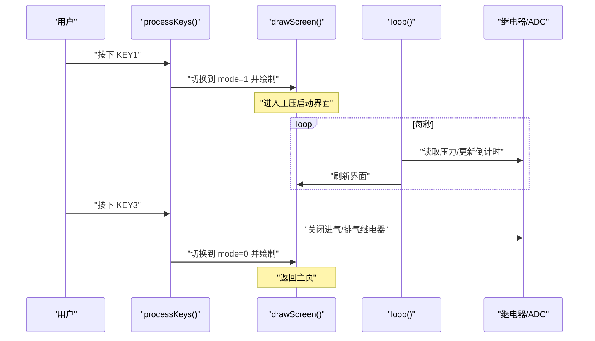
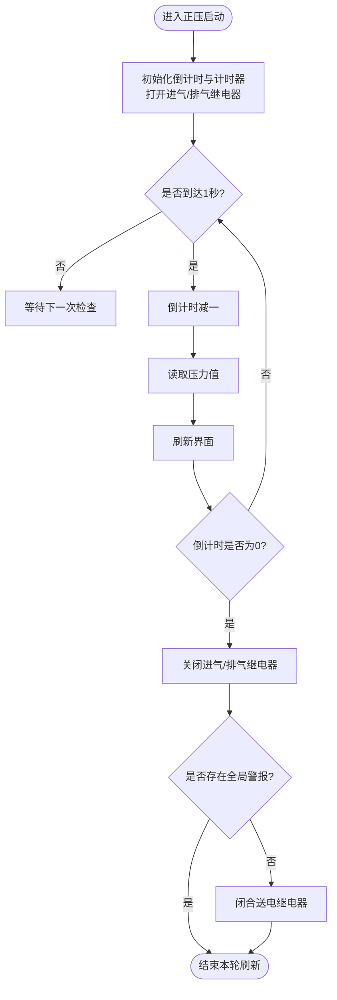
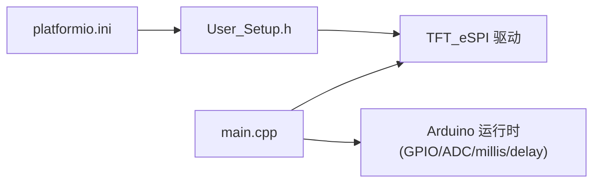

# 用户界面状态机

<cite>
**本文引用的文件**   
- [src/main.cpp](file://src/main.cpp)
- [include/User_Setup.h](file://include/User_Setup.h)
- [platformio.ini](file://platformio.ini)
</cite>

## 目录
1. [简介](#简介)
2. [项目结构](#项目结构)
3. [核心组件](#核心组件)
4. [架构总览](#架构总览)
5. [详细组件分析](#详细组件分析)
6. [依赖关系分析](#依赖关系分析)
7. [性能与刷新机制](#性能与刷新机制)
8. [故障排查指南](#故障排查指南)
9. [结论](#结论)

## 简介
本文件面向“正压防爆控制系统”的用户界面状态机，聚焦由 mode 变量驱动的四种界面状态：主页、正压启动、系统设置、系统调试。文档将解释各状态的进入/退出条件与内部行为，梳理 drawScreen() 的状态调度机制与 processKeys() 中的按键驱动状态转换逻辑，并给出状态转换图与关键流程时序图，同时说明界面刷新机制与状态保持策略。

## 项目结构
- 顶层入口与主循环位于 src/main.cpp，包含 UI 状态机、绘制函数、按键处理、硬件初始化与 ADC 采样等。
- include/User_Setup.h 配置 TFT_eSPI 的并行接口引脚与驱动型号。
- platformio.ini 定义构建选项与库依赖（TFT_eSPI）。

图表来源
- [src/main.cpp:367-389](file://src/main.cpp#L367-L389)
- [include/User_Setup.h:14-47](file://include/User_Setup.h#L14-L47)
- [platformio.ini:1-45](file://platformio.ini#L1-L45)

章节来源
- [src/main.cpp:10-31](file://src/main.cpp#L10-L31)
- [include/User_Setup.h:14-47](file://include/User_Setup.h#L14-L47)
- [platformio.ini:1-45](file://platformio.ini#L1-L45)

## 核心组件
- 全局模式变量 mode：控制当前界面状态（0=主页，1=正压启动，2=系统设置，3=系统调试）。
- 状态绘制函数：drawMainPage()、drawPressureScreen()、drawSettingsMenu()、drawDebugScreen()。
- 显示调度器：drawScreen()，根据 mode 分发到对应绘制函数。
- 按键处理：processKeys()，检测 KEY1/KEY2/KEY3 下降沿并执行状态转换或界面内操作。
- 主循环 loop()：周期性更新闪烁、调用 processKeys()、在正压模式下每秒刷新倒计时与压力值并触发重绘。

章节来源
- [src/main.cpp:31](file://src/main.cpp#L31)
- [src/main.cpp:168-310](file://src/main.cpp#L168-L310)
- [src/main.cpp:318-364](file://src/main.cpp#L318-L364)
- [src/main.cpp:392-433](file://src/main.cpp#L392-L433)

## 架构总览
下图展示了状态机与绘制、按键、主循环之间的交互关系。

图表来源
- [src/main.cpp:304-310](file://src/main.cpp#L304-L310)
- [src/main.cpp:318-364](file://src/main.cpp#L318-L364)
- [src/main.cpp:392-433](file://src/main.cpp#L392-L433)

## 详细组件分析

### 状态定义与调度
- mode 取值与含义：
  - 0：主页
  - 1：正压启动
  - 2：系统设置
  - 3：系统调试
- drawScreen() 依据 mode 分支调用具体绘制函数，实现“单一入口、多态绘制”。

章节来源
- [src/main.cpp:31](file://src/main.cpp#L31)
- [src/main.cpp:304-310](file://src/main.cpp#L304-L310)

### 状态转换图

图表来源
- [src/main.cpp:318-364](file://src/main.cpp#L318-L364)

### 各状态详解

#### 主页（mode=0）
- 进入条件：
  - 上电初始化完成后默认进入（setup 中直接绘制主页）。
  - 从其他状态通过按键返回。
- 退出条件：
  - KEY1 按下 → 进入“正压启动”。
  - KEY2 按下 → 进入“系统设置”。
  - KEY3 按下 → 进入“系统调试”。
- 内部行为：
  - 绘制欢迎信息、公司信息与三个菜单按钮。
  - 若存在全局警报，左上角显示红色“警报”提示。
- 相关代码路径
  - [主页绘制:168-189](file://src/main.cpp#L168-L189)
  - [按键进入正压启动:327-328](file://src/main.cpp#L327-L328)
  - [按键进入系统设置:341-342](file://src/main.cpp#L341-L342)
  - [按键进入系统调试:351-352](file://src/main.cpp#L351-L352)

章节来源
- [src/main.cpp:168-189](file://src/main.cpp#L168-L189)
- [src/main.cpp:327-352](file://src/main.cpp#L327-L352)

#### 正压启动（mode=1）
- 进入条件：
  - 主页下 KEY1 按下。
- 退出条件：
  - KEY3 按下 → 立即退出，关闭进气/排气继电器，回到主页。
  - 通过界面“返回主页”按钮（由 KEY1 在特定条件下触发）。
- 内部行为：
  - 首次进入时开启进气与排气继电器，初始化倒计时与计时器。
  - 每秒递减倒计时，读取压力值并刷新界面。
  - 根据压力阈值判断状态文本与颜色，必要时置位全局警报。
  - 右上角显示“警报/消音”闪烁状态；底部提供“取消警报”和“返回主页”按钮。
  - 倒计时归零后关闭进气/排气，若无警报则闭合送电继电器。
- 相关代码路径
  - [正压启动绘制:191-253](file://src/main.cpp#L191-L253)
  - [首次进入与继电器控制:400-408](file://src/main.cpp#L400-L408)
  - [每秒刷新与倒计时:410-423](file://src/main.cpp#L410-L423)
  - [按键退出与取消警报:329-335](file://src/main.cpp#L329-L335)

章节来源
- [src/main.cpp:191-253](file://src/main.cpp#L191-L253)
- [src/main.cpp:329-335](file://src/main.cpp#L329-L335)
- [src/main.cpp:400-423](file://src/main.cpp#L400-L423)

#### 系统设置（mode=2）
- 进入条件：
  - 主页下 KEY2 按下。
- 退出条件：
  - KEY1 或 KEY3 按下 → 返回主页。
- 内部行为：
  - 显示“修改密码/校准传感器/设置参数/恢复出厂”四个选项，支持 KEY2 循环选择高亮项。
  - 底部提供“返回主页/下一选项/确认”按钮布局。
- 相关代码路径
  - [设置菜单绘制:255-276](file://src/main.cpp#L255-L276)
  - [按键切换选项与返回主页:341-345](file://src/main.cpp#L341-L345)

章节来源
- [src/main.cpp:255-276](file://src/main.cpp#L255-L276)
- [src/main.cpp:341-345](file://src/main.cpp#L341-L345)

#### 系统调试（mode=3）
- 进入条件：
  - 主页下 KEY3 按下。
- 退出条件：
  - KEY1 或 KEY3 按下 → 返回主页。
- 内部行为：
  - 显示“系统调试”标题与安全警告。
  - 实时显示压力与温度读数。
  - 右上角可显示“送电”状态指示。
  - 底部提供“返回主页/调试结束”按钮布局。
- 相关代码路径
  - [调试界面绘制:278-302](file://src/main.cpp#L278-L302)
  - [按键返回主页:351-360](file://src/main.cpp#L351-L360)

章节来源
- [src/main.cpp:278-302](file://src/main.cpp#L278-L302)
- [src/main.cpp:351-360](file://src/main.cpp#L351-L360)

### 状态转换时序（以“主页→正压启动→返回主页”为例）

图表来源
- [src/main.cpp:318-364](file://src/main.cpp#L318-L364)
- [src/main.cpp:392-433](file://src/main.cpp#L392-L433)

### 复杂逻辑流程图（正压启动每秒刷新）

图表来源
- [src/main.cpp:400-423](file://src/main.cpp#L400-L423)

## 依赖关系分析
- 显示驱动与引脚配置：
  - User_Setup.h 定义了并行接口、数据总线端口与 TFT 控制引脚，平台构建标志与之匹配。
- 构建与依赖：
  - platformio.ini 引入 TFT_eSPI 库，并通过构建宏启用并行接口与字体加载。
- 运行时依赖：
  - main.cpp 使用 TFT_eSPI 进行绘制，使用 Arduino API 进行 GPIO/ADC/延时与时间管理。

图表来源
- [platformio.ini:1-45](file://platformio.ini#L1-L45)
- [include/User_Setup.h:14-47](file://include/User_Setup.h#L14-L47)
- [src/main.cpp:10-13](file://src/main.cpp#L10-L13)

章节来源
- [platformio.ini:1-45](file://platformio.ini#L1-L45)
- [include/User_Setup.h:14-47](file://include/User_Setup.h#L14-L47)
- [src/main.cpp:10-13](file://src/main.cpp#L10-L13)

## 性能与刷新机制
- 刷新频率与策略：
  - 正压启动模式下，每 1 秒进行一次压力采样与倒计时更新，并调用 drawScreen() 全量刷新。
  - 非正压模式仅在状态变化或需要局部更新时调用绘制函数。
- 闪烁与异步效果：
  - 使用 blinkTimer 与 millis() 实现 500ms 翻转的闪烁标志，用于警报/消音提示。
- 按键去抖：
  - 通过 lastKeyTime 与 KEY_DEBOUNCE_MS 限制最小响应间隔，避免重复触发。
- 建议优化：
  - 对频繁更新的区域采用局部刷新（仅重绘数字与状态条），减少全屏填充带来的开销。
  - 可将压力采样与计算合并为固定周期任务，避免每次绘制都触发 ADC 读取。

章节来源
- [src/main.cpp:392-433](file://src/main.cpp#L392-L433)
- [src/main.cpp:318-364](file://src/main.cpp#L318-L364)

## 故障排查指南
- 无法进入正压启动：
  - 检查 KEY1 引脚配置与电平（INPUT_PULLUP，按下为 LOW）。
  - 确认首次进入时进气/排气继电器是否被置高。
  - 参考路径：[按键处理与首次进入逻辑:327-335](file://src/main.cpp#L327-L335), [首次进入与继电器控制:400-408](file://src/main.cpp#L400-L408)
- 警报不闪烁或不消音：
  - 检查全局警报标志与闪烁计时器是否正确更新。
  - 参考路径：[闪烁计时与警报绘制:392-433](file://src/main.cpp#L392-L433), [警报状态绘制:236-245](file://src/main.cpp#L236-L245)
- 返回主页无效：
  - 检查 KEY3 按键处理分支是否覆盖当前 mode。
  - 参考路径：[KEY3 在各模式的退出逻辑:348-361](file://src/main.cpp#L348-L361)
- 屏幕无显示或乱码：
  - 核对 User_Setup.h 的并行引脚与驱动型号是否与硬件一致。
  - 参考路径：[TFT 引脚与驱动配置:14-47](file://include/User_Setup.h#L14-L47)

章节来源
- [src/main.cpp:327-335](file://src/main.cpp#L327-L335)
- [src/main.cpp:348-361](file://src/main.cpp#L348-L361)
- [src/main.cpp:392-433](file://src/main.cpp#L392-L433)
- [include/User_Setup.h:14-47](file://include/User_Setup.h#L14-L47)

## 结论
该界面状态机以 mode 为核心，配合 drawScreen() 的统一调度与 processKeys() 的按键驱动，实现了清晰的状态划分与转换。正压启动模式具备完整的运行生命周期（进入、运行、退出）与报警联动。建议在后续迭代中引入局部刷新与更细粒度的事件驱动，以提升 UI 流畅度与功耗表现。