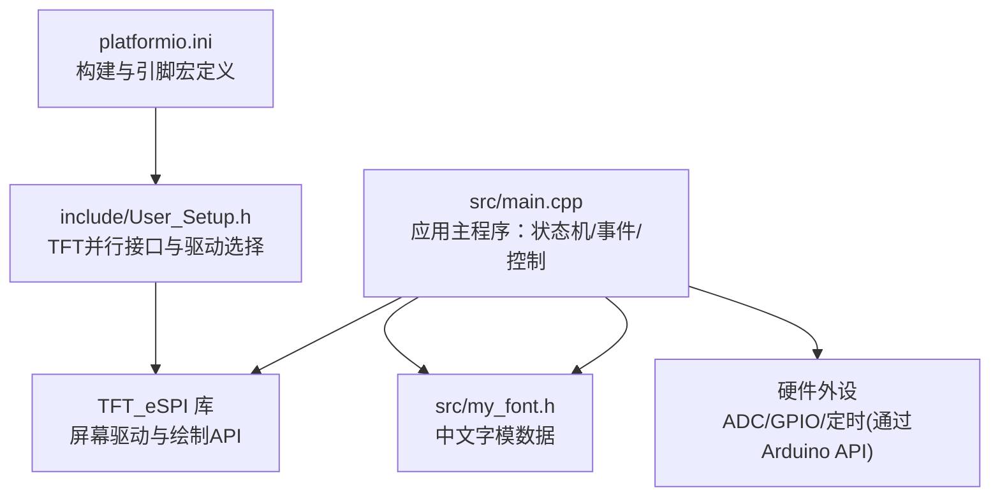
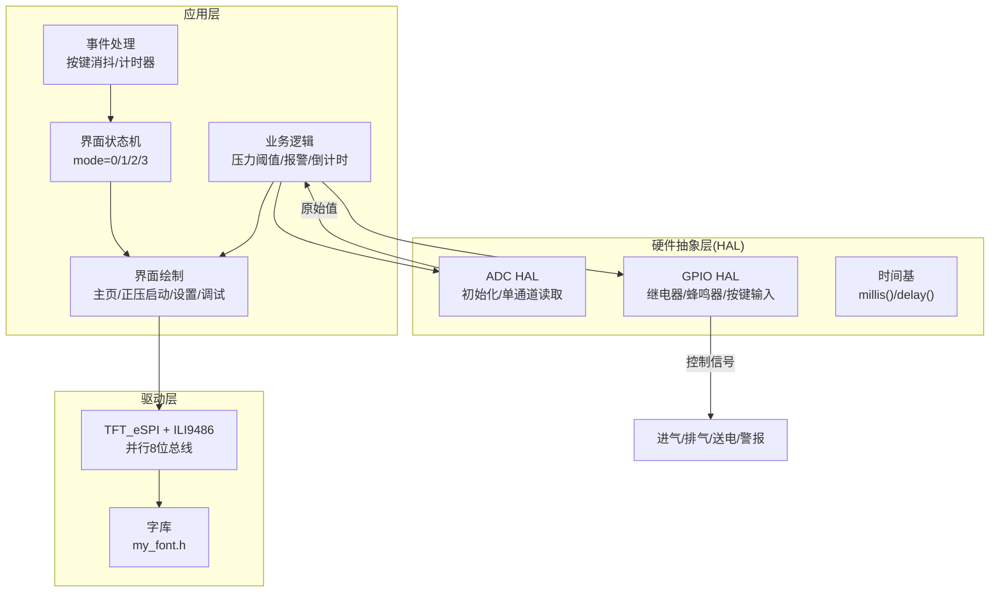
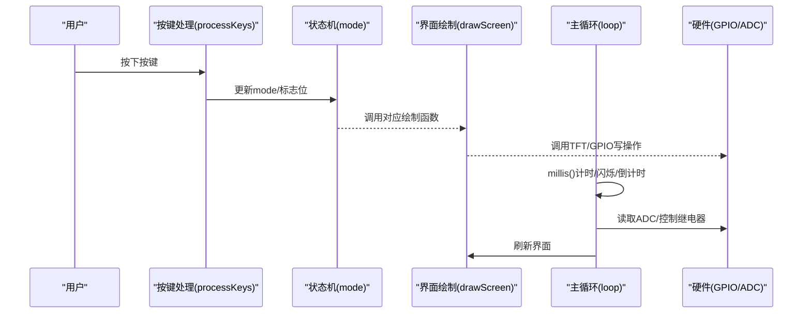
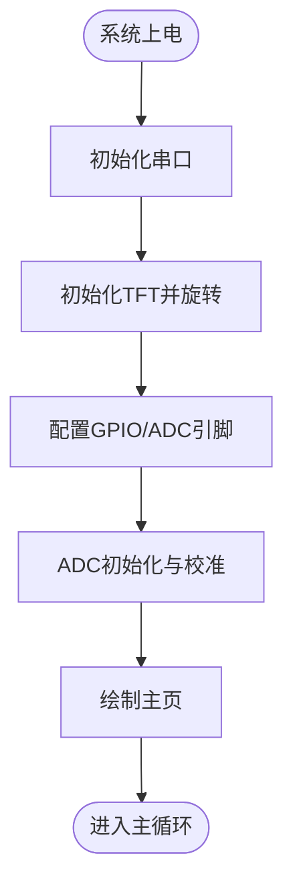
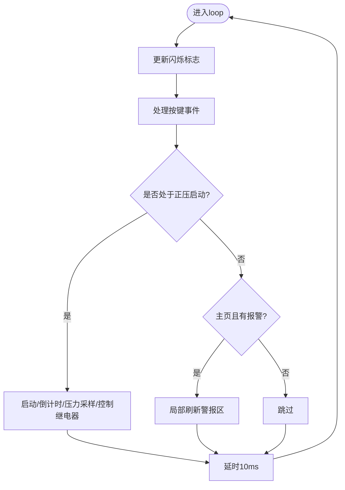
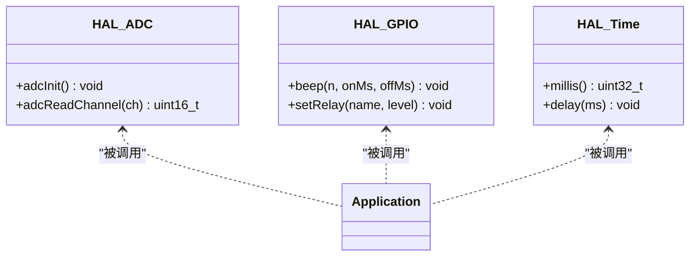
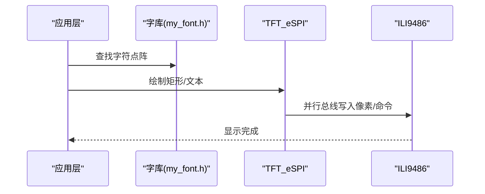
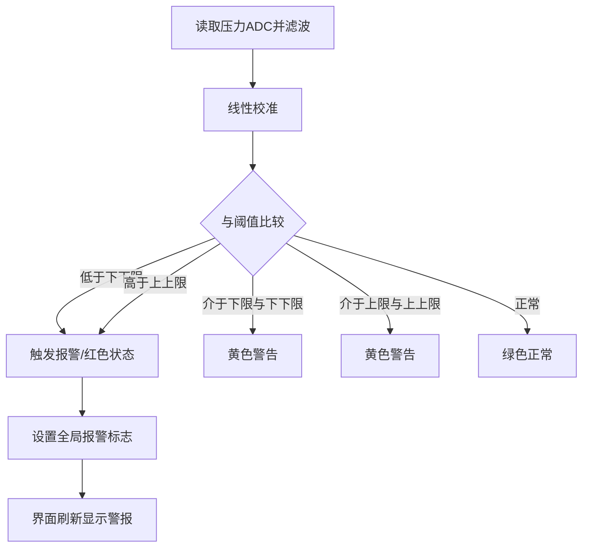
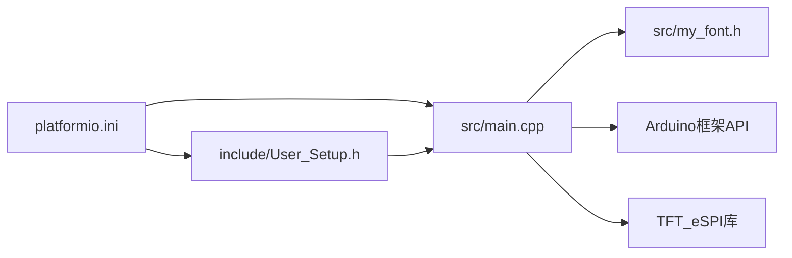

# 系统架构概述

<cite>
**本文引用的文件**   
- [src/main.cpp](file://src/main.cpp)
- [include/User_Setup.h](file://include/User_Setup.h)
- [platformio.ini](file://platformio.ini)
- [src/my_font.h](file://src/my_font.h)
</cite>

## 目录
1. [简介](#简介)
2. [项目结构](#项目结构)
3. [核心组件](#核心组件)
4. [架构总览](#架构总览)
5. [详细组件分析](#详细组件分析)
6. [依赖关系分析](#依赖关系分析)
7. [性能与实时性考虑](#性能与实时性考虑)
8. [故障排查指南](#故障排查指南)
9. [结论](#结论)
10. [附录：技术决策与约束](#附录技术决策与约束)

## 简介
本文件面向GD32F103RCT6嵌入式平台，基于Arduino框架与TFT_eSPI库，构建一套正压防爆控制系统的界面与控制逻辑。系统采用分层架构与状态机模式组织界面切换，使用事件驱动（按键、定时器）驱动主循环，实现人机交互、传感器采集、报警判断与继电器控制等能力。文档重点阐述整体系统结构、分层设计、模块间关系、状态机在界面切换中的应用、事件驱动机制的实现方式，以及初始化流程、主循环控制逻辑和硬件抽象层设计，并给出架构图和数据/控制流说明。

## 项目结构
仓库采用最小化工程结构，核心代码集中在src目录，配置与字体资源分别位于include与src下，构建配置由platformio.ini管理。

图表来源 
- [platformio.ini:1-45](file://platformio.ini#L1-L45)
- [include/User_Setup.h:1-74](file://include/User_Setup.h#L1-L74)
- [src/main.cpp:1-433](file://src/main.cpp#L1-L433)
- [src/my_font.h:1-800](file://src/my_font.h#L1-L800)

章节来源
- [platformio.ini:1-45](file://platformio.ini#L1-L45)
- [include/User_Setup.h:1-74](file://include/User_Setup.h#L1-L74)
- [src/main.cpp:1-433](file://src/main.cpp#L1-L433)
- [src/my_font.h:1-800](file://src/my_font.h#L1-L800)

## 核心组件
- 应用主程序（main.cpp）
  - 负责系统初始化、主循环调度、界面状态机、按键事件处理、传感器采样与显示刷新、继电器控制与报警逻辑。
- 硬件抽象层（HAL）
  - 通过Arduino API与寄存器访问组合，封装ADC初始化与读取、GPIO输出控制、蜂鸣器提示等。
- 显示子系统
  - 基于TFT_eSPI与User_Setup.h配置，使用8位并行总线与ILI9486驱动，提供绘图与中文混合字符串绘制能力。
- 字库与UI资源
  - my_font.h包含常用汉字点阵数据，配合drawChineseChar/drawMixedString完成中文显示。
- 构建与配置
  - platformio.ini集中定义目标板、框架、依赖库、编译宏与引脚映射，确保与User_Setup.h一致。

章节来源
- [src/main.cpp:1-433](file://src/main.cpp#L1-L433)
- [include/User_Setup.h:1-74](file://include/User_Setup.h#L1-L74)
- [src/my_font.h:1-800](file://src/my_font.h#L1-L800)
- [platformio.ini:1-45](file://platformio.ini#L1-L45)

## 架构总览
系统采用“应用层—硬件抽象层—驱动层”的分层架构，结合“状态机+事件驱动”的控制模型。

图表来源 
- [src/main.cpp:1-433](file://src/main.cpp#L1-L433)
- [include/User_Setup.h:1-74](file://include/User_Setup.h#L1-L74)
- [src/my_font.h:1-800](file://src/my_font.h#L1-L800)
- [platformio.ini:1-45](file://platformio.ini#L1-L45)

## 详细组件分析

### 界面状态机与事件驱动
- 状态机
  - 状态变量mode用于表示当前界面：0=主页，1=正压启动，2=系统设置，3=系统调试。
  - drawScreen根据mode分发到对应绘制函数，形成清晰的状态-视图映射。
- 事件驱动
  - 按键事件：processKeys对三键进行下降沿检测与消抖，触发状态跳转或功能动作（如进入正压启动、返回主页、取消警报）。
  - 定时器事件：loop内基于millis()维护闪烁与每秒更新逻辑，驱动倒计时与压力刷新。
- 控制流
  - setup完成硬件与初始界面；loop周期性执行事件处理、状态机更新与显示刷新。

图表来源 
- [src/main.cpp:304-363](file://src/main.cpp#L304-L363)
- [src/main.cpp:390-433](file://src/main.cpp#L390-L433)

章节来源
- [src/main.cpp:304-363](file://src/main.cpp#L304-L363)
- [src/main.cpp:390-433](file://src/main.cpp#L390-L433)

### 系统初始化流程
- 串口与屏幕初始化
  - 初始化串口用于调试输出；初始化TFT并设置为横屏。
- 引脚与外设配置
  - 配置蜂鸣器、按键上拉输入、温度/压力模拟输入、各继电器输出为低电平。
- ADC校准
  - 启用ADC时钟、复位与自校准；设置采样率；读取多组压力零点作为基准，读取温度零点。
- 首帧显示
  - 绘制主页界面，等待用户交互。

图表来源 
- [src/main.cpp:366-388](file://src/main.cpp#L366-L388)

章节来源
- [src/main.cpp:366-388](file://src/main.cpp#L366-L388)

### 主循环控制逻辑
- 全局闪烁计时：每500ms翻转一次，用于警报/消音指示的闪烁效果。
- 按键轮询：每次循环调用processKeys，保证响应及时。
- 正压启动模式：
  - 首次进入时开启进气与排气阀，记录开始时间与剩余换气时间。
  - 每秒递减倒计时，读取压力值并刷新界面；倒计时结束关闭阀门并在无报警时闭合送电继电器。
- 非正压模式：仅在主页且存在全局报警时局部刷新警报区域。
- 周期延时：10ms，兼顾按键响应与CPU占用。

图表来源 
- [src/main.cpp:390-433](file://src/main.cpp#L390-L433)

章节来源
- [src/main.cpp:390-433](file://src/main.cpp#L390-L433)

### 硬件抽象层设计（HAL）
- ADC HAL
  - adcInit：使能ADC1时钟、执行复位与自校准、配置采样率、打开ADON。
  - adcReadChannel：单次转换模式，选择通道、启动转换、等待EOC并返回结果。
- GPIO HAL
  - 蜂鸣器beep：通过高低电平与延时产生提示音。
  - 继电器控制：INLET_RELAY、EXHAUST_RELAY、POWER_RELAY、ALARM_RELAY在业务逻辑中被置高/置低以控制外部设备。
- 时间基
  - 使用millis()与delay()实现非阻塞计时与阻塞延时，满足简单任务节拍需求。

图表来源 
- [src/main.cpp:76-101](file://src/main.cpp#L76-L101)
- [src/main.cpp:104-109](file://src/main.cpp#L104-L109)
- [src/main.cpp:390-433](file://src/main.cpp#L390-L433)

章节来源
- [src/main.cpp:76-101](file://src/main.cpp#L76-L101)
- [src/main.cpp:104-109](file://src/main.cpp#L104-L109)
- [src/main.cpp:390-433](file://src/main.cpp#L390-L433)

### 显示子系统与中文绘制
- 显示配置
  - User_Setup.h定义8位并行总线、端口B数据总线优化、ILI9486驱动、控制引脚映射。
  - platformio.ini同步宏定义，确保编译期一致。
- 绘制能力
  - TFT_eSPI提供基础图形与文本绘制；自定义drawChineseChar与drawMixedString支持中文点阵与中英混排。
- 数据流向
  - 应用层生成UI元素→调用TFT_eSPI绘制→经并行总线写入LCD控制器→屏幕显示。

图表来源 
- [include/User_Setup.h:1-74](file://include/User_Setup.h#L1-L74)
- [platformio.ini:1-45](file://platformio.ini#L1-L45)
- [src/my_font.h:1-800](file://src/my_font.h#L1-L800)
- [src/main.cpp:112-142](file://src/main.cpp#L112-L142)

章节来源
- [include/User_Setup.h:1-74](file://include/User_Setup.h#L1-L74)
- [platformio.ini:1-45](file://platformio.ini#L1-L45)
- [src/my_font.h:1-800](file://src/my_font.h#L1-L800)
- [src/main.cpp:112-142](file://src/main.cpp#L112-L142)

### 传感器与报警逻辑
- 传感器采集
  - 压力：多次采样取平均，线性校准后得到显示值。
  - 温度：单通道采样，按系数换算为摄氏度。
- 报警判定
  - 依据系统参数（下限、下下限、上限、上上限）比较当前压力，设置全局报警标志与状态文本颜色。
- 控制联动
  - 正压启动阶段同时开启进气与排气；倒计时结束后关闭阀门，若无报警则闭合送电继电器。

图表来源 
- [src/main.cpp:145-155](file://src/main.cpp#L145-L155)
- [src/main.cpp:191-252](file://src/main.cpp#L191-L252)
- [src/main.cpp:390-433](file://src/main.cpp#L390-L433)

章节来源
- [src/main.cpp:145-155](file://src/main.cpp#L145-L155)
- [src/main.cpp:191-252](file://src/main.cpp#L191-L252)
- [src/main.cpp:390-433](file://src/main.cpp#L390-L433)

## 依赖关系分析
- 构建配置与头文件
  - platformio.ini声明依赖TFT_eSPI库，并通过大量-D宏定义引脚与驱动选项。
  - include/User_Setup.h与platformio.ini保持一致，避免运行时不一致。
- 源文件依赖
  - main.cpp依赖TFT_eSPI与my_font.h；my_font.h仅依赖Arduino核心类型。
- 外部依赖
  - Arduino框架提供GPIO/ADC/定时API；TFT_eSPI封装底层时序与驱动。

图表来源 
- [platformio.ini:1-45](file://platformio.ini#L1-L45)
- [include/User_Setup.h:1-74](file://include/User_Setup.h#L1-L74)
- [src/main.cpp:1-433](file://src/main.cpp#L1-L433)
- [src/my_font.h:1-800](file://src/my_font.h#L1-L800)

章节来源
- [platformio.ini:1-45](file://platformio.ini#L1-L45)
- [include/User_Setup.h:1-74](file://include/User_Setup.h#L1-L74)
- [src/main.cpp:1-433](file://src/main.cpp#L1-L433)
- [src/my_font.h:1-800](file://src/my_font.h#L1-L800)

## 性能与实时性考虑
- 显示刷新
  - 全量刷新开销较大，建议仅在状态变化或数据更新时刷新；主页报警区可局部刷新以减少抖动与功耗。
- 按键响应
  - 当前采用轮询+消抖，10ms周期可满足一般交互；若需更高响应，可将按键改为中断+状态机。
- ADC采样
  - 压力采样采用多次平均，降低噪声但增加CPU占用；可考虑DMA+定时器触发采样以降低负载。
- 定时器
  - 使用millis()实现非阻塞计时，避免长时间阻塞；如需高精度节拍，可使用硬件定时器中断。
- 内存与Flash
  - 中文字库占用较多Flash空间，可按需裁剪；必要时将字库移至外部存储或通过压缩减少体积。

[本节为通用指导，不直接分析具体文件]

## 故障排查指南
- 屏幕无显示
  - 检查User_Setup.h与platformio.ini中的并行总线与驱动宏是否一致；确认PA/PB引脚映射正确。
- 中文显示乱码
  - 确认my_font.h中包含所需字符；检查drawMixedString编码路径是否正确识别UTF-8字节序列。
- 按键无响应
  - 检查INPUT_PULLUP配置与按键电路；确认消抖时间与去抖逻辑未被覆盖。
- 压力/温度异常
  - 校验ADC校准流程与零点采集；检查传感器供电与接线；确认采样次数与系数合理。
- 报警不触发或误报
  - 核对sysParams阈值与单位；观察pressVal计算与显示是否一致；检查全局报警标志的清除逻辑。

章节来源
- [include/User_Setup.h:1-74](file://include/User_Setup.h#L1-L74)
- [platformio.ini:1-45](file://platformio.ini#L1-L45)
- [src/main.cpp:76-101](file://src/main.cpp#L76-L101)
- [src/main.cpp:112-142](file://src/main.cpp#L112-L142)
- [src/main.cpp:145-155](file://src/main.cpp#L145-L155)
- [src/main.cpp:366-388](file://src/main.cpp#L366-L388)

## 结论
本系统以状态机为核心组织界面与业务流程，结合事件驱动与轻量HAL，实现了正压防爆控制的可视化与自动化控制。通过合理的分层设计与明确的依赖关系，系统在保持简洁的同时具备良好的可扩展性。后续可在中断与DMA方面进一步优化实时性与性能，并根据产品需求扩展更多界面与功能模块。

[本节为总结性内容，不直接分析具体文件]

## 附录：技术决策与约束
- 架构风格
  - 分层架构：应用层（状态机/业务）、HAL（ADC/GPIO/时间基）、驱动层（TFT_eSPI/字库）。
  - 状态机模式：mode变量驱动界面切换，简化控制流与UI渲染。
  - 事件驱动：按键与定时器事件驱动主循环，提升交互与实时性。
- 硬件抽象
  - 使用Arduino API屏蔽底层差异，关键路径（ADC）保留寄存器访问以获得最佳性能。
- 显示与UI
  - 并行8位总线+ILI9486驱动，兼顾速度与成本；自定义中文绘制适配本地化需求。
- 构建与配置
  - 通过platformio.ini集中管理宏与引脚映射，确保跨环境一致性。
- 约束条件
  - 资源受限：Flash与RAM有限，需控制字库与缓冲区大小。
  - 实时性要求：按键与报警需在毫秒级响应，避免长阻塞。
  - 安全相关：报警与继电器控制需具备明确状态与互锁逻辑，防止误动作。

章节来源
- [src/main.cpp:1-433](file://src/main.cpp#L1-L433)
- [include/User_Setup.h:1-74](file://include/User_Setup.h#L1-L74)
- [platformio.ini:1-45](file://platformio.ini#L1-L45)
- [src/my_font.h:1-800](file://src/my_font.h#L1-L800)