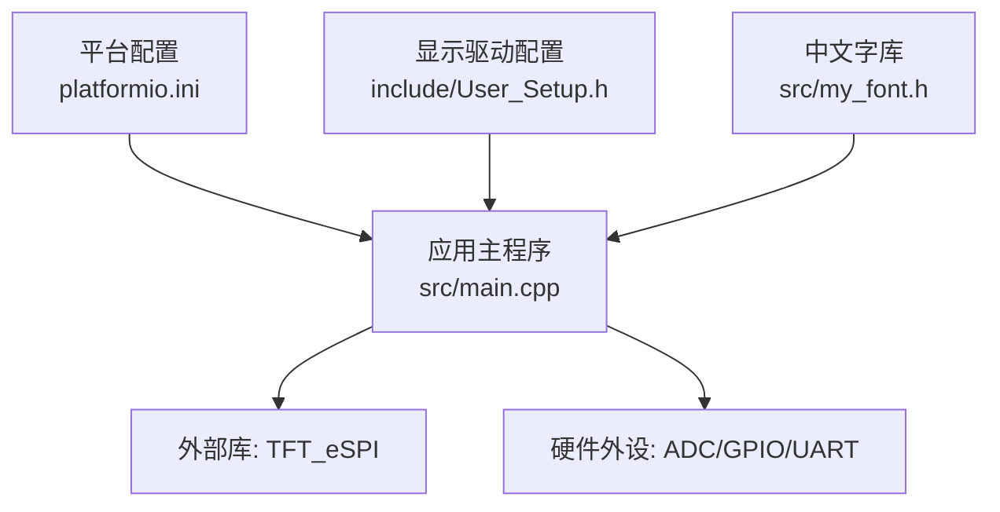
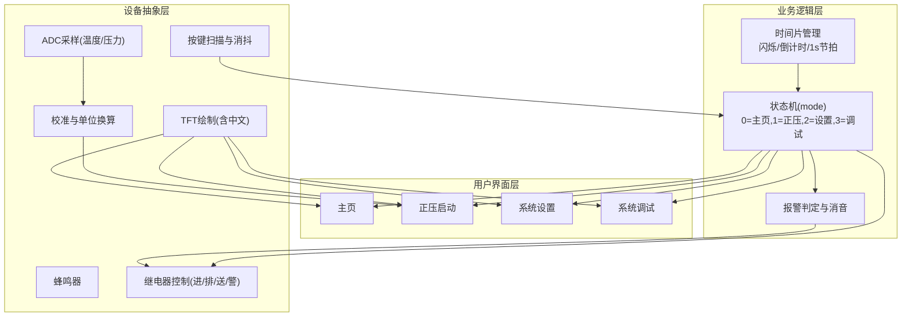
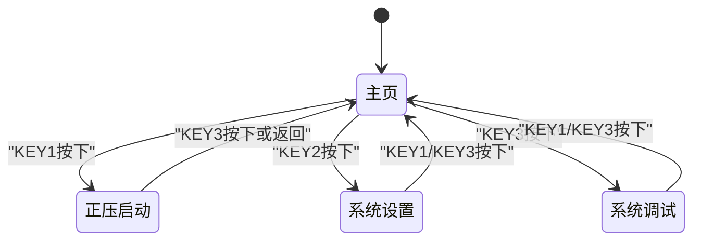
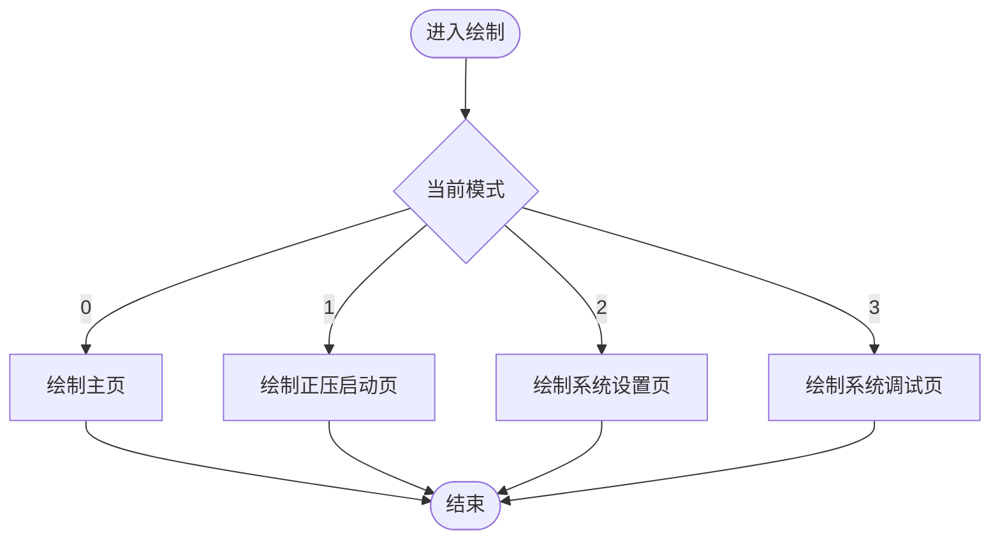
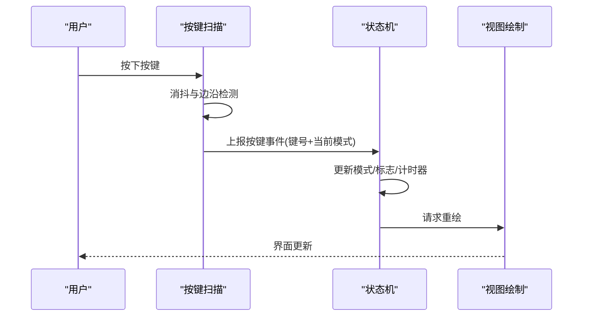
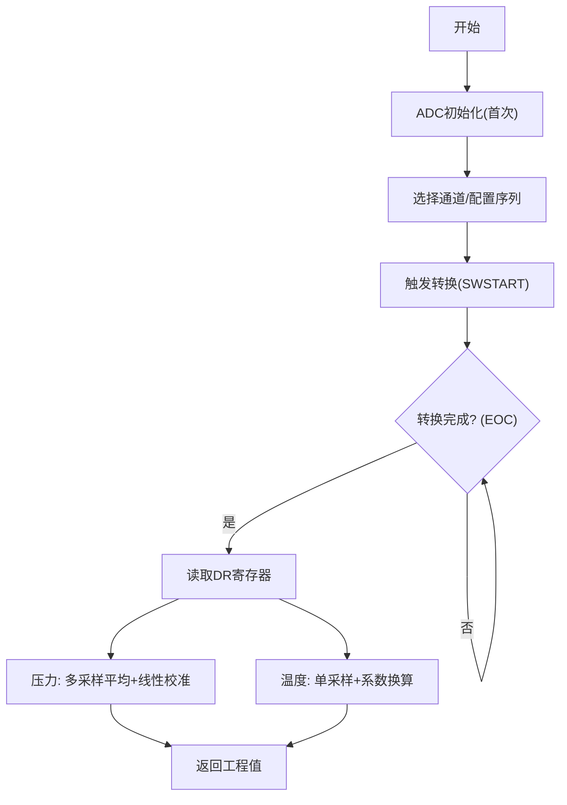
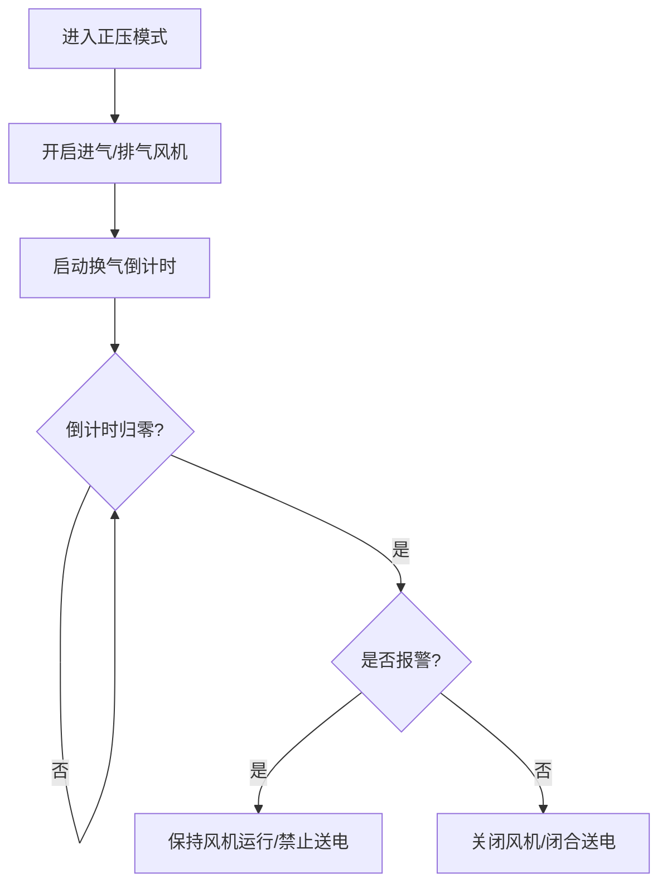
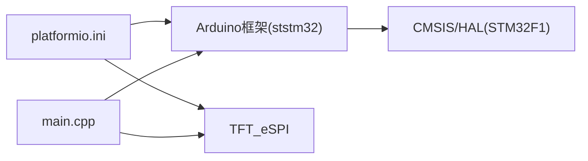

# 软件架构设计

<cite>
**本文引用的文件**   
- [src/main.cpp](file://src/main.cpp)
- [include/User_Setup.h](file://include/User_Setup.h)
- [platformio.ini](file://platformio.ini)
- [src/my_font.h](file://src/my_font.h)
</cite>

## 目录
1. [引言](#引言)
2. [项目结构](#项目结构)
3. [核心组件](#核心组件)
4. [架构总览](#架构总览)
5. [详细组件分析](#详细组件分析)
6. [依赖关系分析](#依赖关系分析)
7. [性能与资源考量](#性能与资源考量)
8. [故障排查指南](#故障排查指南)
9. [结论](#结论)
10. [附录：技术栈与兼容性](#附录技术栈与兼容性)

## 引言
本文件面向GD32F103RCT6嵌入式系统，目标是为“正压防爆控制系统”提供一份可落地的软件架构文档。系统基于Arduino框架与TFT_eSPI库，通过8位并行接口驱动ILI9486控制器TFT屏，采集温度与压力传感器信号，控制继电器执行机构，并通过按键交互完成人机操作。本文从高层设计、架构模式、系统边界、组件交互、数据流、事件驱动机制、状态机设计、分层架构、安全/监控/性能等跨领域关注点出发，给出可视化图示与实现要点，并记录技术决策、权衡与约束条件。

## 项目结构
仓库采用最小化工程组织，核心逻辑集中在单一源文件中，配置与字体资源分离，便于快速迭代与调试。

图表来源
- [platformio.ini:1-45](file://platformio.ini#L1-L45)
- [include/User_Setup.h:1-74](file://include/User_Setup.h#L1-L74)
- [src/main.cpp:1-433](file://src/main.cpp#L1-L433)
- [src/my_font.h:1-845](file://src/my_font.h#L1-L845)

章节来源
- [platformio.ini:1-45](file://platformio.ini#L1-L45)
- [include/User_Setup.h:1-74](file://include/User_Setup.h#L1-L74)
- [src/main.cpp:1-433](file://src/main.cpp#L1-L433)
- [src/my_font.h:1-845](file://src/my_font.h#L1-L845)

## 核心组件
- 应用主循环与状态机：维护系统模式（主页/正压启动/设置/调试），驱动UI刷新与业务逻辑。
- 输入子系统：按键扫描与消抖，蜂鸣器反馈。
- 显示子系统：TFT初始化、页面绘制、中文混合字符串渲染。
- 传感与校准：ADC采样、滤波与线性校准，输出工程值。
- 执行控制：继电器控制（进气/排气/送电/报警）。
- 配置与参数：系统阈值、密码、默认参数与运行时变量。

章节来源
- [src/main.cpp:1-433](file://src/main.cpp#L1-L433)

## 架构总览
系统采用“事件驱动 + 轮询调度 + 显式状态机”的轻量架构。主循环以固定周期轮询时间片，处理按键、更新倒计时与传感器数据，并根据当前模式调用对应绘制函数；状态机由全局模式变量驱动，配合布尔标志位表示运行阶段。

图表来源
- [src/main.cpp:167-309](file://src/main.cpp#L167-L309)
- [src/main.cpp:391-433](file://src/main.cpp#L391-L433)
- [src/main.cpp:317-363](file://src/main.cpp#L317-L363)
- [src/main.cpp:76-101](file://src/main.cpp#L76-L101)
- [src/main.cpp:145-155](file://src/main.cpp#L145-L155)
- [include/User_Setup.h:1-74](file://include/User_Setup.h#L1-L74)

## 详细组件分析

### 状态机与模式切换
- 模式定义：mode=0主页，1正压启动，2系统设置，3系统调试。
- 切换入口：按键按下后根据当前模式进行跳转，并在必要时重置运行标志与计时器。
- 运行标志：inPositiveMode用于区分正压流程的阶段（是否已开启风机与进入倒计时）。
- 超时与复位：倒计时归零时关闭风机，若未报警则闭合送电继电器。

图表来源
- [src/main.cpp:317-363](file://src/main.cpp#L317-L363)
- [src/main.cpp:391-433](file://src/main.cpp#L391-L433)

章节来源
- [src/main.cpp:317-363](file://src/main.cpp#L317-L363)
- [src/main.cpp:391-433](file://src/main.cpp#L391-L433)

### 显示与UI绘制
- 屏幕分辨率：480x320横屏。
- 驱动与引脚：通过User_Setup.h与编译宏启用8位并行总线，选择ILI9486驱动，映射DC/CS/WR/RD/RST及数据总线PB0-PB7。
- 中文支持：自定义字库my_font.h包含常用汉字点阵，结合drawMixedString实现中英文混排。
- 页面函数：drawMainPage/drawPressureScreen/drawSettingsMenu/drawDebugScreen分别负责各模式下的界面绘制。

图表来源
- [src/main.cpp:167-309](file://src/main.cpp#L167-L309)
- [include/User_Setup.h:1-74](file://include/User_Setup.h#L1-L74)
- [src/my_font.h:1-845](file://src/my_font.h#L1-L845)

章节来源
- [src/main.cpp:167-309](file://src/main.cpp#L167-L309)
- [include/User_Setup.h:1-74](file://include/User_Setup.h#L1-L74)
- [src/my_font.h:1-845](file://src/my_font.h#L1-L845)

### 输入与事件处理
- 按键消抖：使用millis()差值与上次电平变化检测下降沿，避免抖动误触发。
- 蜂鸣反馈：每次有效按键触发短促蜂鸣提示。
- 事件分发：根据当前模式将按键事件路由到相应分支，更新状态与界面。

图表来源
- [src/main.cpp:317-363](file://src/main.cpp#L317-L363)
- [src/main.cpp:391-433](file://src/main.cpp#L391-L433)

章节来源
- [src/main.cpp:317-363](file://src/main.cpp#L317-L363)

### 传感采集与校准
- ADC初始化：使能时钟、校准、采样率配置、单次转换。
- 通道读取：按通道编号配置序列寄存器，触发转换并等待EOC标志。
- 压力计算：对多次采样求平均，结合偏移与斜率进行线性校准，限制负值为0。
- 温度计算：单通道采样，结合系数与参考电压换算为工程值。

图表来源
- [src/main.cpp:76-101](file://src/main.cpp#L76-L101)
- [src/main.cpp:145-155](file://src/main.cpp#L145-L155)

章节来源
- [src/main.cpp:76-101](file://src/main.cpp#L76-L101)
- [src/main.cpp:145-155](file://src/main.cpp#L145-L155)

### 执行控制与安全联锁
- 正压流程：进入模式后开启进气与排气风机，启动换气倒计时；倒计时结束且无报警时闭合送电继电器。
- 报警策略：当压力低于下下限或高于上上限时置全局报警标志，界面闪烁提示并可消音。
- 安全联锁：仅在非报警状态下送电，防止危险工况下通电。

图表来源
- [src/main.cpp:391-433](file://src/main.cpp#L391-L433)
- [src/main.cpp:191-252](file://src/main.cpp#L191-L252)

章节来源
- [src/main.cpp:391-433](file://src/main.cpp#L391-L433)
- [src/main.cpp:191-252](file://src/main.cpp#L191-L252)

### 配置与参数管理
- 系统参数数组：存储压力上下限、温度上限、换气时间等。
- 默认参数与密码：提供出厂默认值与目标密码变量。
- 运行时变量：模式、报警、静音、倒计时、传感器值等。

章节来源
- [src/main.cpp:26-43](file://src/main.cpp#L26-L43)

## 依赖关系分析
- 构建与工具链：PlatformIO ststm32平台，Arduino框架，ST-Link烧录与调试。
- 第三方库：TFT_eSPI用于TFT驱动与绘图，版本在配置中声明。
- 硬件抽象：GPIO/ADC/UART通过Arduino HAL暴露，底层由STM32F1系列CMSIS/HAL支撑。

图表来源
- [platformio.ini:1-45](file://platformio.ini#L1-L45)
- [src/main.cpp:10-13](file://src/main.cpp#L10-L13)

章节来源
- [platformio.ini:1-45](file://platformio.ini#L1-L45)
- [src/main.cpp:10-13](file://src/main.cpp#L10-L13)

## 性能与资源考量
- 显示刷新频率：主循环每10ms一次，正压模式下每秒更新一次数值与界面，兼顾实时性与功耗。
- 按键响应：消抖阈值约30ms，保证稳定响应同时避免抖动。
- ADC采样：压力采用8次平均降低噪声；温度单采配合系数换算，满足一般精度需求。
- Flash占用：中文字库位于Flash，需评估字符集规模对ROM的影响。
- 中断与阻塞：当前未使用外部中断，全部在主循环轮询，简化实现但需注意长耗时操作阻塞风险。

[本节为通用指导，不直接分析具体文件]

## 故障排查指南
- 屏幕无显示或花屏
  - 检查User_Setup.h与platformio.ini中的并行引脚与驱动型号是否一致。
  - 确认RST/CS/DC/WR/RD连线正确，供电稳定。
- 按键无响应或误触发
  - 检查INPUT_PULLUP配置与按键电路，确认消抖时间与去抖逻辑。
- 压力/温度读数异常
  - 校验ADC通道映射与采样率，核对校准偏移与斜率参数。
- 报警不触发或无法消音
  - 检查阈值比较逻辑与全局报警标志更新路径，确认消音按钮分支。
- 送电失败
  - 确认仅在非报警状态下闭合送电继电器，检查继电器驱动引脚与负载。

章节来源
- [include/User_Setup.h:1-74](file://include/User_Setup.h#L1-L74)
- [src/main.cpp:317-363](file://src/main.cpp#L317-L363)
- [src/main.cpp:145-155](file://src/main.cpp#L145-L155)
- [src/main.cpp:191-252](file://src/main.cpp#L191-L252)
- [src/main.cpp:391-433](file://src/main.cpp#L391-L433)

## 结论
该架构以极简方式实现了正压防爆控制系统的核心功能：人机界面、状态机控制、传感采集与执行联动。通过事件驱动的按键处理与轮询式时间片管理，系统在资源受限环境下保持了良好的可维护性与扩展性。后续可在不改变整体结构的前提下引入更完善的错误恢复、日志记录与参数持久化能力。

[本节为总结性内容，不直接分析具体文件]

## 附录：技术栈与兼容性
- 平台与框架
  - PlatformIO ststm32平台，board genericSTM32F103RC，framework arduino。
- 关键依赖
  - TFT_eSPI ^2.5.43，用于TFT驱动与图形绘制。
- 构建宏与引脚映射
  - 并行8位总线、Port B数据总线、ILI9486驱动、DC/CS/WR/RD/RST与数据引脚映射。
- 版本兼容
  - GD32F103RCT6与STM32F103RC引脚兼容，使用STM32相关宏与HAL/CMSIS。

章节来源
- [platformio.ini:1-45](file://platformio.ini#L1-L45)
- [include/User_Setup.h:1-74](file://include/User_Setup.h#L1-L74)