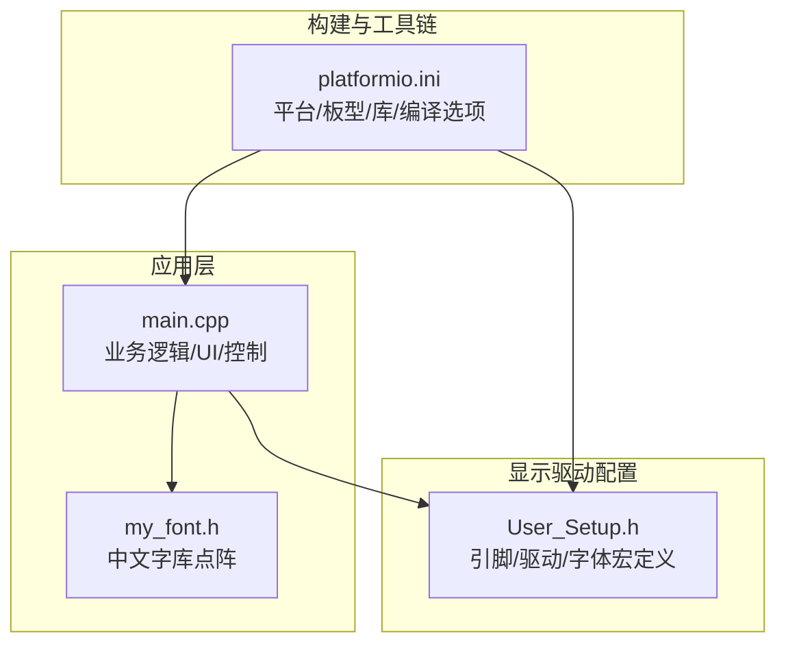
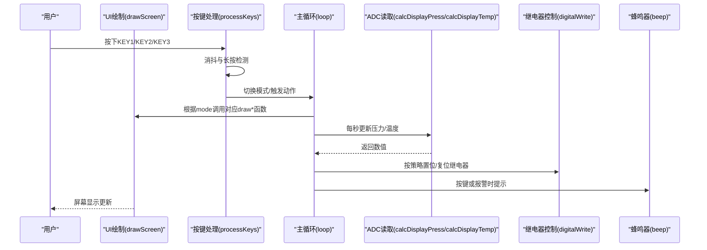
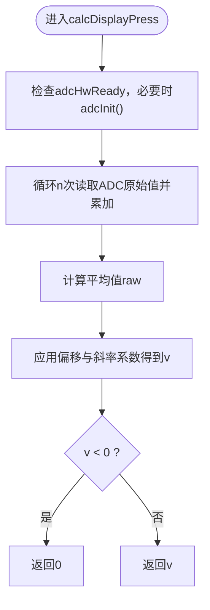
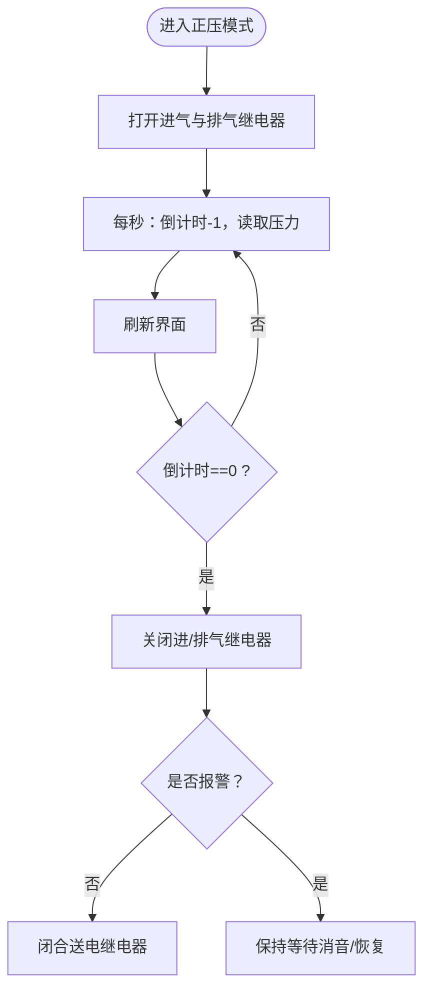
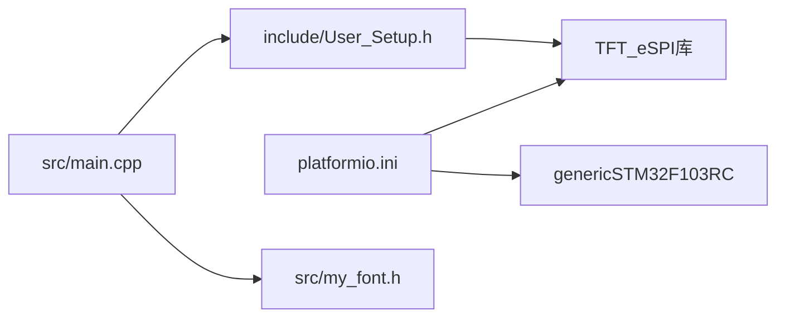

# 部署和测试

<cite>
**本文引用的文件**   
- [platformio.ini](file://platformio.ini)
- [src/main.cpp](file://src/main.cpp)
- [include/User_Setup.h](file://include/User_Setup.h)
- [src/my_font.h](file://src/my_font.h)
- [test/README](file://test/README)
</cite>

## 目录
1. [简介](#简介)
2. [项目结构](#项目结构)
3. [核心组件](#核心组件)
4. [架构总览](#架构总览)
5. [详细组件分析](#详细组件分析)
6. [依赖分析](#依赖分析)
7. [性能考虑](#性能考虑)
8. [故障诊断指南](#故障诊断指南)
9. [结论](#结论)
10. [附录](#附录)

## 简介
本指南面向GD32F103RCT6正压防爆控制系统的部署与测试，覆盖固件编译、烧录流程、硬件测试方法，以及单元测试、集成测试与系统测试的实施步骤。同时提供故障诊断工具与调试技巧，并给出性能基准测试与可靠性验证方法建议。

## 项目结构
本项目基于PlatformIO + Arduino框架，目标板为genericSTM32F103RC（兼容GD32F103RCT6），使用TFT_eSPI库驱动3.5寸480x320横屏ILI9486控制器，通过8位并行总线连接。主程序实现人机界面、按键交互、ADC采集（温度/压力）、继电器控制（进气/排气/送电/警报）及蜂鸣器提示等。

图表来源
- [platformio.ini:1-45](file://platformio.ini#L1-L45)
- [src/main.cpp:1-433](file://src/main.cpp#L1-L433)
- [include/User_Setup.h:1-74](file://include/User_Setup.h#L1-L74)
- [src/my_font.h:1-845](file://src/my_font.h#L1-L845)

章节来源
- [platformio.ini:1-45](file://platformio.ini#L1-L45)
- [src/main.cpp:1-433](file://src/main.cpp#L1-L433)
- [include/User_Setup.h:1-74](file://include/User_Setup.h#L1-L74)
- [src/my_font.h:1-845](file://src/my_font.h#L1-L845)

## 核心组件
- 构建环境：PlatformIO + ststm32平台 + Arduino框架，目标板genericSTM32F103RC，ST-Link下载与调试协议，串口监视波特率115200。
- 显示子系统：TFT_eSPI库，ILI9486驱动，8位并行数据总线（PB0-PB7），控制线PA1/PA2/PA3/PA4/PA5；启用多种内置字体与平滑字体。
- 输入输出：
  - 按键：PC7/PC8/PC9，上拉输入，带消抖与蜂鸣反馈。
  - 执行器：PC0排气、PC1警报、PC2进气、PC3送电，均为数字输出。
  - 传感器：PC4压力(ADC14)、PC5温度(ADC15)，ADC1单通道采样+软件校准。
  - 蜂鸣器：PA12，短促提示音。
- 用户界面：主页、正压启动、系统设置、系统调试四个模式，中文混合显示。
- 安全与报警：压力上下限/上上限/下下限阈值判断，全局报警标志与消音状态，倒计时换气流程。

章节来源
- [platformio.ini:1-45](file://platformio.ini#L1-L45)
- [include/User_Setup.h:1-74](file://include/User_Setup.h#L1-L74)
- [src/main.cpp:1-433](file://src/main.cpp#L1-L433)

## 架构总览
下图展示从用户操作到硬件执行的端到端流程，包括UI刷新、按键处理、正压启动时序与报警判定。

图表来源
- [src/main.cpp:365-433](file://src/main.cpp#L365-L433)
- [src/main.cpp:311-364](file://src/main.cpp#L311-L364)
- [src/main.cpp:144-155](file://src/main.cpp#L144-L155)

## 详细组件分析

### 构建与烧录
- 构建命令
  - 在工程根目录执行PlatformIO构建任务以生成可烧录镜像。
- 下载与调试
  - 使用ST-Link进行下载与在线调试，端口与协议已在配置中指定。
- 串口监视
  - 初始化串口后，可通过串口监视器查看运行信息（当前代码未包含打印语句，可在需要处添加）。

章节来源
- [platformio.ini:1-45](file://platformio.ini#L1-L45)
- [src/main.cpp:365-388](file://src/main.cpp#L365-L388)

### 显示与字体
- 显示驱动配置
  - 选择ILI9486驱动，8位并行总线，数据总线映射至PB0-PB7，控制线映射至PA1/PA2/PA3/PA4/PA5。
- 字体支持
  - 启用GLCD与多号字体，支持平滑字体；自定义中文字库位于独立头文件，采用16x16点阵结构体数组存储。
- 渲染流程
  - 主循环根据当前模式调用相应绘制函数，完成背景、标题、按钮与状态栏的绘制。

章节来源
- [include/User_Setup.h:1-74](file://include/User_Setup.h#L1-L74)
- [src/my_font.h:1-845](file://src/my_font.h#L1-L845)
- [src/main.cpp:167-309](file://src/main.cpp#L167-L309)

### ADC采集与校准
- 初始化
  - 使能ADC1时钟，执行内部校准，配置采样时间，开启转换。
- 读取流程
  - 单次转换模式，选择通道，等待EOC标志，读取结果寄存器。
- 数据处理
  - 压力值采用多次采样平均，结合偏移与斜率系数进行线性换算；温度值按参考电压与系数换算。
- 开机自校准
  - 启动阶段对压力通道进行多次采样取均值作为零点偏移基准。

图表来源
- [src/main.cpp:74-101](file://src/main.cpp#L74-L101)
- [src/main.cpp:144-155](file://src/main.cpp#L144-L155)
- [src/main.cpp:382-386](file://src/main.cpp#L382-L386)

章节来源
- [src/main.cpp:74-101](file://src/main.cpp#L74-L101)
- [src/main.cpp:144-155](file://src/main.cpp#L144-L155)
- [src/main.cpp:382-386](file://src/main.cpp#L382-L386)

### 按键与交互
- 消抖与反馈
  - 使用millis计时进行去抖，按下时触发蜂鸣提示。
- 模式切换
  - KEY1：主页→正压启动；正压启动→取消警报；设置/调试→返回主页。
  - KEY2：主页→系统设置；设置菜单→下一选项。
  - KEY3：主页→系统调试；正压启动→返回主页并关闭相关继电器；设置/调试→返回主页。
- 界面响应
  - 每次按键处理后立即重绘当前界面。

章节来源
- [src/main.cpp:311-364](file://src/main.cpp#L311-L364)
- [src/main.cpp:157-166](file://src/main.cpp#L157-L166)

### 正压启动与安全逻辑
- 启动流程
  - 进入正压模式后，打开进气与排气继电器，开始换气倒计时。
- 周期更新
  - 每秒更新倒计时与压力值，刷新界面。
- 结束条件
  - 倒计时归零后关闭进/排气，若未处于报警状态则闭合送电继电器。
- 报警判定
  - 依据压力阈值区间设置不同颜色与文本提示，超限时置全局报警标志并可消音。

图表来源
- [src/main.cpp:390-433](file://src/main.cpp#L390-L433)
- [src/main.cpp:190-252](file://src/main.cpp#L190-L252)

章节来源
- [src/main.cpp:390-433](file://src/main.cpp#L390-L433)
- [src/main.cpp:190-252](file://src/main.cpp#L190-L252)

## 依赖分析
- 外部库
  - TFT_eSPI：用于TFT显示驱动与绘图API。
- 构建宏与引脚映射
  - platformio.ini集中定义了平台、板型、下载协议、库版本与大量编译宏（驱动型号、接口模式、引脚映射、字体加载等）。
  - User_Setup.h进一步细化了TFT引脚与控制信号映射，确保与硬件一致。
- 耦合关系
  - main.cpp依赖User_Setup.h中的引脚定义与驱动选择；依赖my_font.h中的字库数据；依赖TFT_eSPI提供的绘图与显示能力。

图表来源
- [platformio.ini:1-45](file://platformio.ini#L1-L45)
- [include/User_Setup.h:1-74](file://include/User_Setup.h#L1-L74)
- [src/main.cpp:1-433](file://src/main.cpp#L1-L433)
- [src/my_font.h:1-845](file://src/my_font.h#L1-L845)

章节来源
- [platformio.ini:1-45](file://platformio.ini#L1-L45)
- [include/User_Setup.h:1-74](file://include/User_Setup.h#L1-L74)
- [src/main.cpp:1-433](file://src/main.cpp#L1-L433)
- [src/my_font.h:1-845](file://src/my_font.h#L1-L845)

## 性能考虑
- 显示刷新
  - 每1秒更新一次界面，避免频繁全屏刷新造成卡顿；仅在状态变化区域局部刷新可降低负载。
- ADC采样
  - 压力值采用8次采样平均，兼顾精度与实时性；可根据现场噪声水平调整采样次数。
- 中断与时序
  - 当前按键处理在主循环中轮询，延迟约10ms，满足人机交互需求；如需更高响应速度，可将按键扫描移至定时器中断。
- 内存占用
  - 中文字库与多种字体占用较多Flash空间，需评估最终固件大小与芯片资源匹配度。

[本节为通用指导，不直接分析具体文件]

## 故障诊断指南
- 无法下载/调试
  - 确认ST-Link连接正确，供电稳定；检查platformio.ini中的upload_protocol与debug_protocol配置。
- 屏幕无显示或花屏
  - 核对User_Setup.h中的驱动型号与引脚映射是否与硬件一致；确认并行数据线PB0-PB7与控制线PA1/PA2/PA3/PA4/PA5接线无误。
- 按键无响应
  - 检查按键引脚是否为上拉输入，消抖延时是否合理；确认按键按下电平为低。
- 压力/温度读数异常
  - 检查ADC引脚接线与传感器供电；确认adcInit已执行且adcHwReady为真；核对校准零点与系数。
- 继电器不动作
  - 检查对应GPIO方向与初始电平；确认正压启动流程中逻辑路径是否到达相应digitalWrite调用。
- 串口无输出
  - 确认串口波特率与监视器一致；当前代码未包含打印语句，可按需在关键路径添加输出以便定位问题。

章节来源
- [platformio.ini:1-45](file://platformio.ini#L1-L45)
- [include/User_Setup.h:1-74](file://include/User_Setup.h#L1-L74)
- [src/main.cpp:365-433](file://src/main.cpp#L365-L433)

## 结论
本项目以PlatformIO + Arduino为核心，结合TFT_eSPI与自定义字库实现了正压防爆控制系统的人机交互与基础控制功能。通过合理的构建配置、清晰的模块划分与稳健的按键/ADC/继电器控制逻辑，可满足基本部署与测试需求。建议在后续迭代中完善日志输出、增加单元测试用例，并对性能与可靠性进行系统化验证。

[本节为总结性内容，不直接分析具体文件]

## 附录

### 编译与烧录步骤
- 安装PlatformIO并导入工程。
- 在终端执行构建任务，生成固件镜像。
- 连接ST-Link，执行下载任务。
- 可选：启动串口监视器，设置波特率为115200。

章节来源
- [platformio.ini:1-45](file://platformio.ini#L1-L45)
- [src/main.cpp:365-388](file://src/main.cpp#L365-L388)

### 硬件测试方法
- 显示测试
  - 上电后观察主页是否正常显示，切换各模式验证界面刷新。
- 按键测试
  - 依次按压KEY1/KEY2/KEY3，验证模式切换与蜂鸣反馈。
- 传感器测试
  - 模拟压力/温度变化，观察界面数值与状态条变化是否符合预期。
- 执行器测试
  - 进入正压启动模式，验证进气/排气继电器动作与倒计时；倒计时结束后验证送电继电器状态。
- 报警测试
  - 人为制造超限条件，验证报警标志、闪烁与消音功能。

[本节为通用测试指导，不直接分析具体文件]

### 单元测试、集成测试与系统测试实施步骤
- 单元测试
  - 将ADC采样与换算、阈值判定、按键消抖等纯函数抽取为独立模块，编写断言用例验证边界条件与典型输入。
  - 利用PlatformIO Test Runner组织与执行测试套件。
- 集成测试
  - 在真实硬件上组合UI、按键、ADC与继电器，验证完整业务流程（如正压启动全流程）。
  - 记录关键指标（响应时间、刷新频率、误报率）。
- 系统测试
  - 长时间运行稳定性测试，覆盖极端工况（高低温、电源波动、传感器噪声）。
  - 验证报警与消音、参数修改与恢复出厂等高级功能。

章节来源
- [test/README:1-12](file://test/README#L1-L12)

### 性能基准测试与可靠性验证方法
- 性能基准
  - 界面刷新耗时：统计一次全屏绘制的时间开销。
  - ADC采样延迟：测量从发起转换到读取结果的耗时。
  - 按键响应延迟：从按下到界面/动作响应的时延。
- 可靠性验证
  - 压力阈值漂移测试：在不同温度与供电条件下重复标定与运行，评估稳定性。
  - 长期运行：连续运行72小时以上，监控报警误触发与系统崩溃情况。
  - 断电恢复：模拟掉电重启，验证系统状态与默认参数是否正确恢复。

[本节为通用指导，不直接分析具体文件]