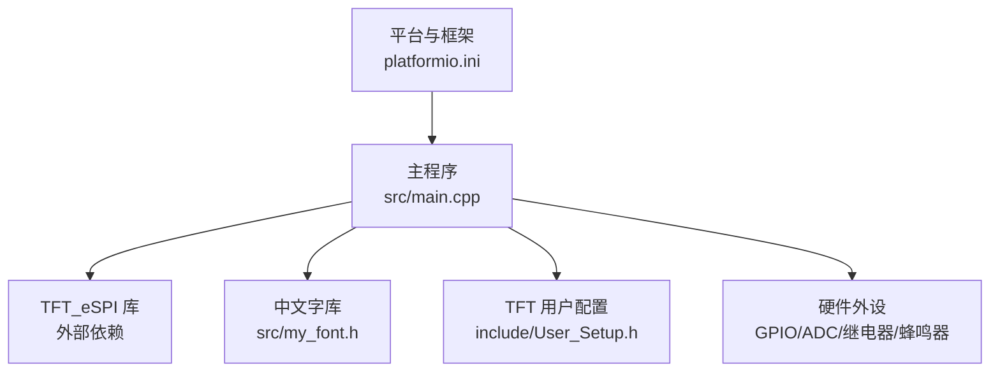
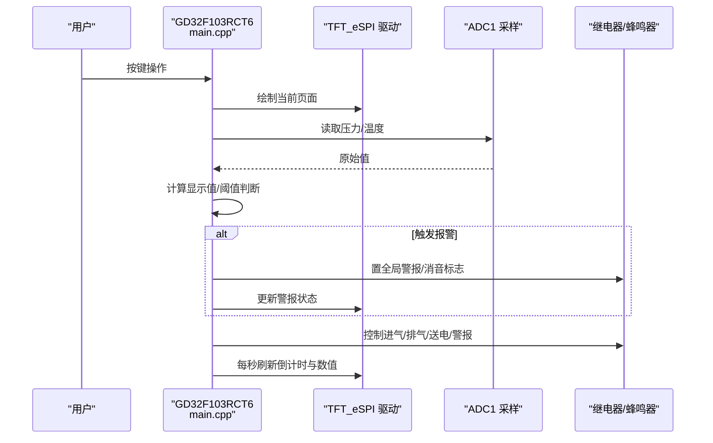
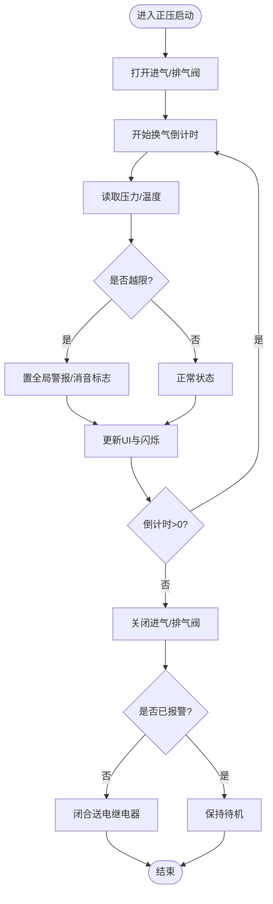
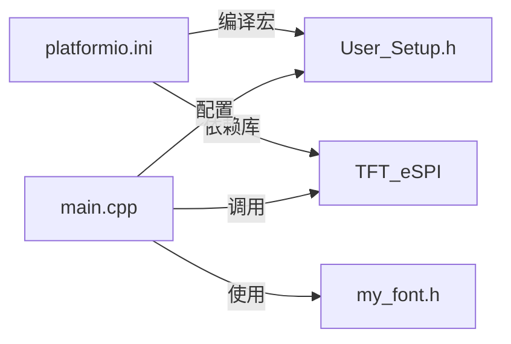

# 项目概述

<cite>
**本文引用的文件**   
- [src/main.cpp](file://src/main.cpp)
- [include/User_Setup.h](file://include/User_Setup.h)
- [platformio.ini](file://platformio.ini)
- [src/my_font.h](file://src/my_font.h)
</cite>

## 目录
1. [简介](#简介)
2. [项目结构](#项目结构)
3. [核心组件](#核心组件)
4. [架构总览](#架构总览)
5. [详细组件分析](#详细组件分析)
6. [依赖关系分析](#依赖关系分析)
7. [性能与实时性考虑](#性能与实时性考虑)
8. [故障排查指南](#故障排查指南)
9. [结论](#结论)
10. [附录：公共接口与使用模式](#附录公共接口与使用模式)

## 简介
本项目面向GD32F103RCT6微控制器，实现一套“正压防爆控制系统”的本地人机交互与控制逻辑。系统通过3.5寸横屏（480x320）提供中文界面，支持正压启动流程、多级报警提示、参数设置与传感器校准等关键功能；同时驱动继电器控制进气/排气/送电/警报执行机构，并通过ADC采集柜内压力与温度，形成闭环监控与可视化展示。

目标用户包括：
- 初学者：理解正压防爆的基本概念、系统组成与操作流程
- 有经验的开发者：掌握硬件引脚映射、显示驱动配置、ADC采样与状态机控制细节

## 项目结构
仓库采用最小化工程结构，核心代码位于src目录，屏幕驱动配置位于include目录，构建配置位于platformio.ini。

图表来源
- [platformio.ini:1-45](file://platformio.ini#L1-L45)
- [src/main.cpp:1-433](file://src/main.cpp#L1-L433)
- [include/User_Setup.h:1-74](file://include/User_Setup.h#L1-L74)
- [src/my_font.h:1-845](file://src/my_font.h#L1-L845)

章节来源
- [platformio.ini:1-45](file://platformio.ini#L1-L45)
- [src/main.cpp:1-433](file://src/main.cpp#L1-L433)
- [include/User_Setup.h:1-74](file://include/User_Setup.h#L1-L74)
- [src/my_font.h:1-845](file://src/my_font.h#L1-L845)

## 核心组件
- 人机界面（HMI）
  - 基于TFT_eSPI驱动的480x320横屏，提供主页、正压启动、系统设置、系统调试四个主要页面
  - 自定义中文字库用于中文显示
- 输入与反馈
  - 三按键（KEY1/KEY2/KEY3）带消抖与蜂鸣反馈
  - 全局警报闪烁与消音状态指示
- 传感器与测量
  - ADC1通道采集压力与温度，内置校准与滤波
- 执行机构控制
  - 继电器控制：进气、排气、送电、警报
  - 蜂鸣器提示
- 运行状态机
  - 多模式切换：主页、正压启动、系统设置、系统调试
  - 倒计时换气流程与阈值判断触发多级报警

章节来源
- [src/main.cpp:15-433](file://src/main.cpp#L15-L433)
- [include/User_Setup.h:14-74](file://include/User_Setup.h#L14-L74)
- [src/my_font.h:1-845](file://src/my_font.h#L1-L845)

## 架构总览
系统以单任务循环为主，结合简单状态机与定时器（基于millis）完成UI刷新、按键处理、传感器采样与执行器控制。

图表来源
- [src/main.cpp:366-433](file://src/main.cpp#L366-L433)
- [src/main.cpp:76-101](file://src/main.cpp#L76-L101)
- [src/main.cpp:145-155](file://src/main.cpp#L145-L155)
- [src/main.cpp:168-309](file://src/main.cpp#L168-L309)

## 详细组件分析

### 硬件与引脚映射
- 屏幕并行总线：PB0-PB7为数据低8位，PA2=DC，PA4=CS，PA5=WR，PA3=RD，PA1=RST
- 按键：PC7=KEY1，PC8=KEY2，PC9=KEY3
- 执行器：PC0=排气，PC1=警报，PC2=进气，PC3=送电
- 传感器：PC5=温度(ADC15)，PC4=压力(ADC14)
- 蜂鸣器：PA12

章节来源
- [src/main.cpp:15-21](file://src/main.cpp#L15-L21)
- [include/User_Setup.h:42-49](file://include/User_Setup.h#L42-L49)
- [platformio.ini:16-36](file://platformio.ini#L16-L36)

### 显示与字体子系统
- 使用TFT_eSPI库进行图形绘制，初始化时设置横屏旋转
- 自定义中文字库my_font.h包含常用汉字点阵，配合drawMixedString实现中英文混排
- 按钮布局统一，便于扩展更多菜单项

章节来源
- [src/main.cpp:10-13](file://src/main.cpp#L10-L13)
- [src/main.cpp:112-142](file://src/main.cpp#L112-L142)
- [src/my_font.h:1-845](file://src/my_font.h#L1-L845)
- [include/User_Setup.h:54-64](file://include/User_Setup.h#L54-L64)

### 传感器与校准
- ADC初始化：复位并校准ADC1，关闭扫描与连续转换，设置采样时间，开启ADON
- 单次采样：选择通道，软件触发，等待EOC标志后读取DR寄存器
- 压力/温度换算：对压力进行滑动平均与线性校准，温度按系数与参考电压换算
- 上电自校准：记录初始零偏，作为后续偏移基准

章节来源
- [src/main.cpp:76-101](file://src/main.cpp#L76-L101)
- [src/main.cpp:145-155](file://src/main.cpp#L145-L155)
- [src/main.cpp:383-386](file://src/main.cpp#L383-L386)

### 控制逻辑与状态机
- 模式定义：0=主页，1=正压启动，2=系统设置，3=系统调试
- 正压启动流程：
  - 进入模式1后，打开进气与排气阀，开始换气倒计时
  - 每秒更新倒计时与压力读数，刷新UI
  - 倒计时归零后关闭阀门，若未报警则闭合送电继电器
- 多级报警：
  - 低于下下限或高于上上限触发严重报警
  - 介于下限/上限与下下限/上上限之间为预警
  - 全局警报可消音，并在UI上闪烁提示
- 按键处理：
  - KEY1：主页→正压启动；正压启动→取消警报；设置/调试→返回主页
  - KEY2：主页→系统设置；设置→下一选项
  - KEY3：主页→系统调试；正压启动→返回主页并停止运行；设置/调试→返回主页

图表来源
- [src/main.cpp:391-433](file://src/main.cpp#L391-L433)
- [src/main.cpp:190-252](file://src/main.cpp#L190-L252)
- [src/main.cpp:317-363](file://src/main.cpp#L317-L363)

章节来源
- [src/main.cpp:31-43](file://src/main.cpp#L31-L43)
- [src/main.cpp:190-252](file://src/main.cpp#L190-L252)
- [src/main.cpp:317-363](file://src/main.cpp#L317-L363)
- [src/main.cpp:391-433](file://src/main.cpp#L391-L433)

### 用户界面与交互
- 主页：欢迎信息与服务电话，三个入口按钮
- 正压启动页：显示倒计时、柜内压力、压力状态条、警报/消音状态、底部操作按钮
- 系统设置页：修改密码、校准传感器、设置参数、恢复出厂
- 系统调试页：危险警告、实时压力/温度、返回与结束按钮

章节来源
- [src/main.cpp:168-188](file://src/main.cpp#L168-L188)
- [src/main.cpp:190-252](file://src/main.cpp#L190-L252)
- [src/main.cpp:254-301](file://src/main.cpp#L254-L301)

## 依赖关系分析
- 构建与工具链
  - PlatformIO环境，ststm32平台，Arduino框架
  - 依赖TFT_eSPI库，启用并行8位总线与STM32优化路径
- 编译宏与引脚映射
  - 通过build_flags定义TFT_DC/CS/WR/RD/RST及数据总线D0-D15
  - 指定ILI9486驱动与字体加载选项
- 运行时依赖
  - main.cpp依赖TFT_eSPI与自定义字库
  - User_Setup.h提供底层端口与驱动选择

图表来源
- [platformio.ini:1-45](file://platformio.ini#L1-L45)
- [include/User_Setup.h:14-74](file://include/User_Setup.h#L14-L74)
- [src/main.cpp:10-13](file://src/main.cpp#L10-L13)
- [src/my_font.h:1-845](file://src/my_font.h#L1-L845)

章节来源
- [platformio.ini:1-45](file://platformio.ini#L1-L45)
- [include/User_Setup.h:14-74](file://include/User_Setup.h#L14-L74)
- [src/main.cpp:10-13](file://src/main.cpp#L10-L13)

## 性能与实时性考虑
- UI刷新频率：每秒更新一次倒计时与压力，避免频繁全屏重绘
- 按键响应：每loop检测，加入消抖与蜂鸣反馈，提升交互体验
- ADC采样：单次转换+等待EOC，适合低频采样场景；如需更高精度可增加滤波与多次采样
- 资源占用：中文字库较大，注意Flash空间；必要时精简字符集或改用外存字库

[本节为通用指导，不直接分析具体文件]

## 故障排查指南
- 屏幕无显示或乱码
  - 检查并行总线引脚映射与User_Setup.h中的驱动选择是否与实际硬件一致
  - 确认RST/CS/WR/RD时序与电平符合ILI9486要求
- 压力/温度读数异常
  - 核对ADC通道与引脚对应关系
  - 检查上电自校准步骤是否执行，必要时重新校准零点
- 报警不触发或误报
  - 校验sysParams阈值数组顺序与单位
  - 观察UI状态条颜色与文本是否与预期一致
- 继电器不动作
  - 检查对应GPIO输出方向与初始电平
  - 确认外部负载与供电回路正常

章节来源
- [include/User_Setup.h:30-49](file://include/User_Setup.h#L30-L49)
- [src/main.cpp:76-101](file://src/main.cpp#L76-L101)
- [src/main.cpp:190-252](file://src/main.cpp#L190-L252)
- [src/main.cpp:366-388](file://src/main.cpp#L366-L388)

## 结论
本项目在GD32F103RCT6上实现了正压防爆控制系统的核心功能：中文人机界面、正压启动流程、多级报警与基础参数设置。整体架构简洁清晰，易于扩展与维护。建议后续引入非易失存储保存参数与密码，完善权限管理，并增加更丰富的诊断信息与日志输出。

[本节为总结性内容，不直接分析具体文件]

## 附录：公共接口与使用模式

### 主要函数与职责
- setup()
  - 初始化串口、TFT、GPIO、ADC，执行上电自校准，绘制主页
- loop()
  - 主循环：按键处理、正压启动流程、UI刷新与延时
- drawScreen()
  - 根据mode调度各页面绘制函数
- processKeys()
  - 按键消抖与事件分发，含蜂鸣反馈
- adcInit()/adcReadChannel()
  - ADC初始化与单次通道读取
- calcDisplayPress()/calcDisplayTemp()
  - 将ADC原始值转换为显示用压力/温度值
- beep(n, onMs, offMs)
  - 蜂鸣器发声控制
- drawChineseChar()/drawMixedString()
  - 中文字符与中英文混排绘制
- drawBtn()/drawMainPage()/drawPressureScreen()/drawSettingsMenu()/drawDebugScreen()
  - 按钮与页面绘制

章节来源
- [src/main.cpp:366-388](file://src/main.cpp#L366-L388)
- [src/main.cpp:391-433](file://src/main.cpp#L391-L433)
- [src/main.cpp:304-309](file://src/main.cpp#L304-L309)
- [src/main.cpp:317-363](file://src/main.cpp#L317-L363)
- [src/main.cpp:76-101](file://src/main.cpp#L76-L101)
- [src/main.cpp:145-155](file://src/main.cpp#L145-L155)
- [src/main.cpp:104-109](file://src/main.cpp#L104-L109)
- [src/main.cpp:112-142](file://src/main.cpp#L112-L142)
- [src/main.cpp:158-188](file://src/main.cpp#L158-L188)
- [src/main.cpp:190-252](file://src/main.cpp#L190-L252)
- [src/main.cpp:254-301](file://src/main.cpp#L254-L301)

### 配置项与默认值
- sysParams[6]：压力下限、下下限、上限、上上限、温度上限、换气时间（秒）
- DEFAULT_PASSWORD：默认管理员密码
- 屏幕尺寸：W=480，H=320（横屏）
- 驱动与引脚：见User_Setup.h与platformio.ini

章节来源
- [src/main.cpp:22-31](file://src/main.cpp#L22-L31)
- [include/User_Setup.h:14-74](file://include/User_Setup.h#L14-L74)
- [platformio.ini:10-44](file://platformio.ini#L10-L44)

### 典型用例
- 启动正压防爆流程
  - 从主页点击“正压启动”，系统自动打开进气/排气阀并开始换气倒计时
  - 期间实时显示压力与状态，若越限则触发报警并可消音
  - 倒计时结束后关闭阀门，若无报警则闭合送电
- 查看系统调试信息
  - 从主页进入“系统调试”，查看实时压力与温度，退出后回到主页
- 进入系统设置
  - 从主页进入“系统设置”，可进行修改密码、校准传感器、设置参数、恢复出厂等操作

章节来源
- [src/main.cpp:168-188](file://src/main.cpp#L168-L188)
- [src/main.cpp:190-252](file://src/main.cpp#L190-L252)
- [src/main.cpp:254-301](file://src/main.cpp#L254-L301)
- [src/main.cpp:391-433](file://src/main.cpp#L391-L433)