# 正压防爆控制系统使用说明书

正压防爆控制系统

使用说明书

（软件版本 V1.0.1）

谷子防爆电气有限公司

服务电话：13023456789

## 目  录

一、产品概述

二、安全警示

三、产品组成与面板布局

四、按键与通用操作说明

五、操作说明

六、报警与保护功能说明

七、系统参数一览

八、常见问题与处理

九、售后服务

## 一、产品概述

本系统是为正压防爆柜配套设计的智能控制装置，采用 GD32F103RCT6 主控芯片，配备 3.5 英寸（480×320）彩色液晶显示屏与三个操作按键，可对柜内压力、温度进行实时监测，并自动控制进气、排气、送电与警报回路，保障防爆柜在安全压力范围内可靠运行。

系统主要功能：

正压启动与换气控制：启动后按设定时间对柜内换气，换气期间根据压力自动控制进气/排气方向；

压力稳压控制：压力低于下限时自动补气、高于上限时自动泄压，稳定在设定区间中点附近；

送电保护：换气完成且压力正常后自动向柜内设备送电；欠压持续 10 秒自动切断送电；

超限报警：压力越限或传感器异常时触发警报继电器并声光提示，支持手动消音；

参数设置：密码保护，可修改密码、校准传感器、设置压力/温度/换气参数、恢复出厂。

## 二、安全警示

本设备为防爆安全装置，安装、接线、维护必须由专业人员进行，并遵守现场防爆安全规定。

「系统调试」功能会直接接通送电继电器，仅允许在安全区域由专业人员使用，严禁在危险（爆炸性）区域现场使用，否则可能导致爆炸！

严禁擅自修改压力保护参数。参数设置不当可能导致保护失效，引发安全事故。

设备出现持续报警、压力异常且无法恢复时，应立即切断相关电源并联系售后服务。

请勿遮挡进、排气通道，保持气路畅通。

## 三、产品组成与面板布局

### 3.1 硬件组成

| 部件 | 规格 / 说明 |
| --- | --- |
| 主控制器 | GD32F103RCT6 |
| 显示屏 | 3.5 英寸彩色液晶屏，分辨率 480×320，横屏显示 |
| 操作按键 | 按键1、按键2、按键3（轻触按键） |
| 蜂鸣器 | 按键提示与报警提示音 |
| 继电器输出 | 进气、排气、警报、送电 共 4 路 |
| 传感器输入 | 柜内温度传感器、柜内压力传感器 |

### 3.2 面板布局

面板左侧为显示屏，右侧自上而下为按键1、按键2、按键3，蜂鸣器位于按键下方，见下图。

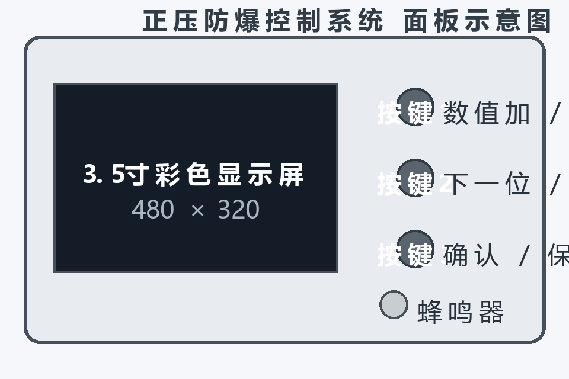

图1  控制面板布局示意图

## 四、按键与通用操作说明

### 4.1 按键基本定义

| 按键 | 短按（常规含义） | 长按 3 秒（常规含义） |
| --- | --- | --- |
| 按键1 | 数值加 1 / 取消警报 / 返回 | 退出当前编辑返回上一级 |
| 按键2 | 移动光标（下一位）/ 下一选项 | 放弃修改 |
| 按键3 | 确认 / 下一项 / 返回 | 保存 / 恢复出厂（特定页面） |

具体每个界面的按键功能以该界面底部菜单显示的文字为准。

### 4.2 数字输入方法

在密码、校准、参数等编辑界面，需要修改的某一位数字以黄色高亮并带黄色三角光标指示：短按按键1使该位数字加 1（0~9 循环）；短按按键2移动到下一位；编辑完成后长按按键3保存，或长按按键2放弃修改。

### 4.3 自动息屏与自动返回

在主页等界面连续 3 分钟无操作，屏幕自动熄灭以延长寿命；按下任意按键即可唤醒。在设置类界面连续 2 分钟无操作将自动返回主界面。报警、正压启动、调试等关键状态下系统不会自动息屏。

## 五、操作说明

### 5.1 开机

设备上电后，屏幕显示开机画面：公司标志、公司名称、版本号及加载进度条，约 3 秒后自动进入系统主界面。

图2  开机界面

### 5.2 系统主界面

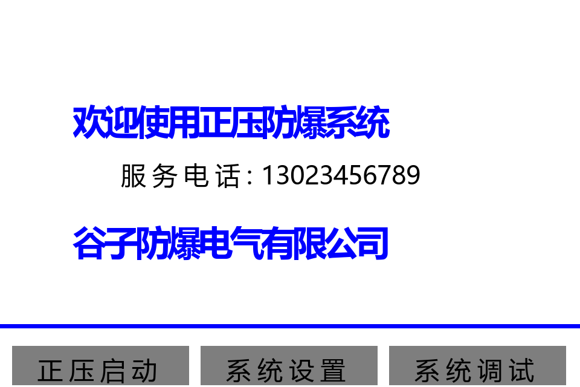

图3  系统主界面

主界面显示欢迎信息、服务电话与公司名称，屏幕下方为三个功能菜单：

| 菜单 | 对应按键 | 功能 |
| --- | --- | --- |
| 正压启动 | 按键1 | 启动换气与正压控制流程；报警时该菜单变为「取消报警」 |
| 系统设置 | 按键2 | 输入密码后进入设置菜单 |
| 系统调试 | 按键3 | 输入密码后进入调试模式（仅限专业人员） |

系统启动运行后，主界面顶部显示「进气 / 排气 / 送电 / 警报」状态指示条，可实时查看各路输出状态。

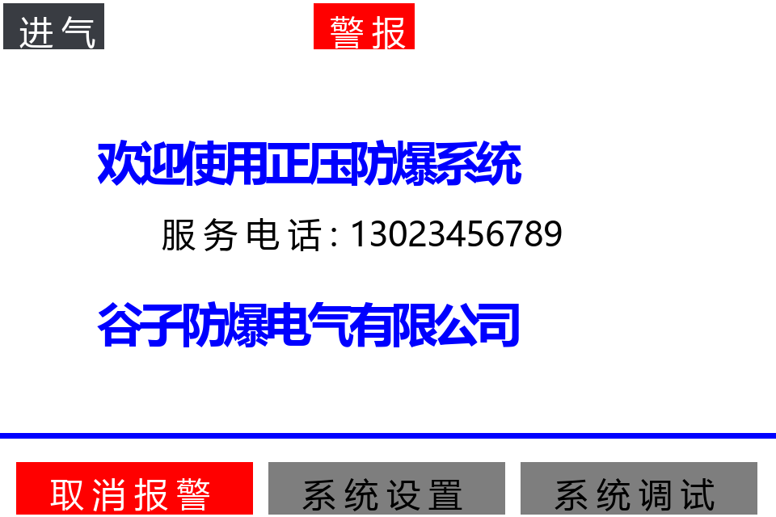

图4  主界面（报警状态）

当系统处于报警状态时，主界面顶部状态条红色闪烁显示「警报」，底部第一个菜单变为红色「取消报警」；短按按键1可消音，顶部转为黄色「消音」。

### 5.3 正压启动

在主界面短按按键1（正压启动），系统进入正压启动流程：先按「总换气时间」进行换气倒计时，倒计时期间根据当前压力自动控制进气/排气方向；倒计时结束后若压力正常，系统自动向柜内设备送电并转入正常运行监视状态。

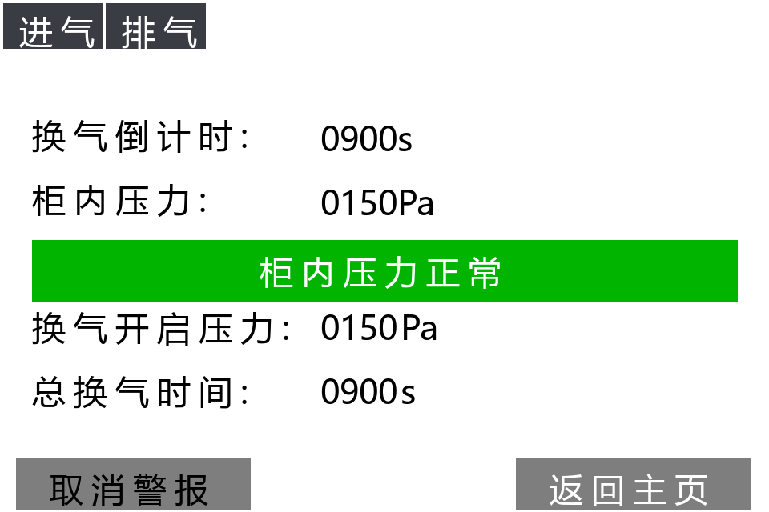

图5  正压启动界面（换气倒计时阶段）

换气阶段屏幕显示：换气倒计时、柜内压力（实时）、当前压力状态、换气开启压力、总换气时间。顶部状态条中「进气」「排气」点亮表示对应阀门正在工作。

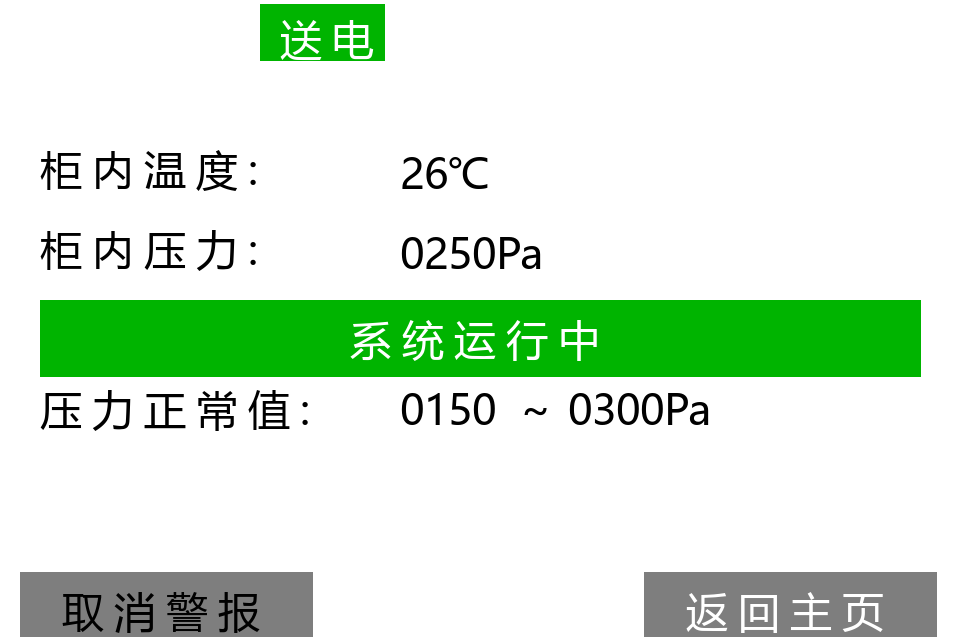

图6  正压启动界面（正常运行阶段）

换气完成且压力进入正常区间后，界面自动切换为运行监视布局，显示柜内温度、柜内压力、压力正常值范围；送电建立后状态条显示绿色「系统运行中」。

#### 5.3.1 压力状态显示

| 柜内压力范围（默认值） | 屏幕状态显示 | 系统动作 |
| --- | --- | --- |
| 低于压力下下限（<80Pa） | 「柜内压力低」红色闪烁，顶部显示警报 | 警报继电器动作；欠压持续10秒切断送电 |
| 压力下下限 ~ 压力下限 | 「柜内压力低」红色闪烁 | 自动补气（进气开启） |
| 压力下限 ~ 压力上限（150~300Pa） | 「柜内压力正常」/「系统运行中」绿色 | 正常运行，停止补排气 |
| 压力上限 ~ 压力上上限 | 「柜内压力高」红色闪烁 | 自动泄压（排气开启） |
| 高于压力上上限（>400Pa） | 「柜内压力高」红色闪烁，顶部显示警报 | 警报继电器动作并断开送电 |

#### 5.3.2 警报与消音

压力越限或传感器异常时，顶部出现红色闪烁「警报」并接通警报继电器。此时短按按键1可消音（警报继电器断开，顶部变为黄色「消音」），消音状态在主页与运行界面保持一致；当压力恢复正常后警报自动解除。运行界面左下角按钮可在「取消警报 / 取消消音」间切换，右下角「返回主页」短按按键3返回。

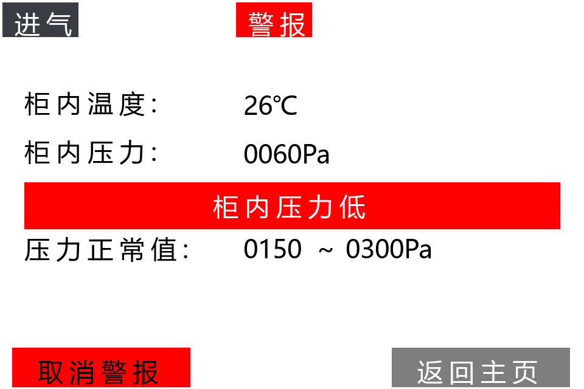

图7  压力报警状态界面

### 5.4 系统设置

在主界面短按按键2，进入密码验证界面。

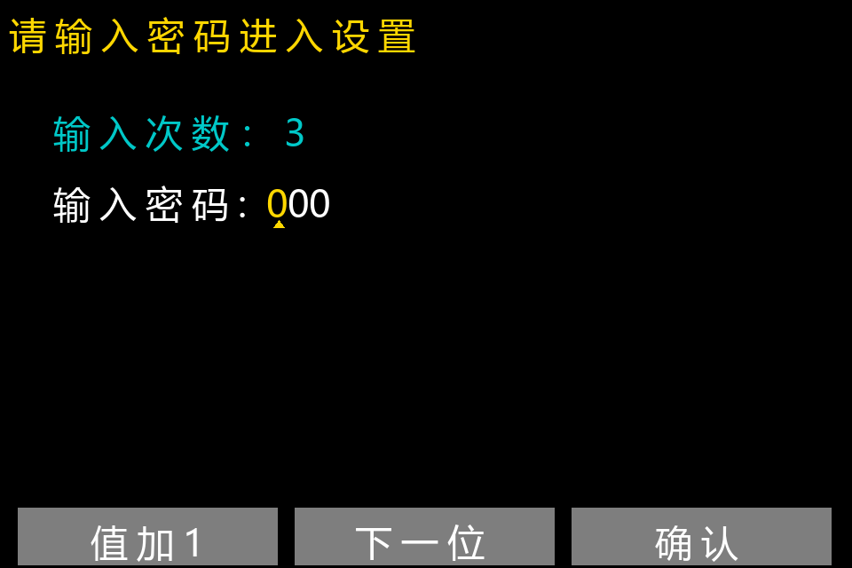

图8  密码输入界面

屏幕显示剩余输入次数（3 次）。输入方法：短按按键1使黄色光标位数字加 1，短按按键2移动光标位，短按按键3确认。密码正确进入设置菜单；密码错误可重新输入，连续 3 次错误自动返回主界面。出厂默认密码为 555；如忘记密码，可输入万能密码 995 进入设置。

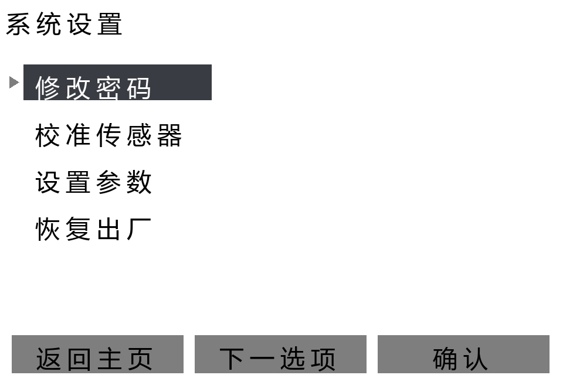

图9  系统设置菜单

设置菜单含四个选项：修改密码、校准传感器、设置参数、恢复出厂。短按按键2（下一选项）移动选中项（深灰底+三角指示），短按按键3（确认）进入，短按按键1（返回主页）退出。

#### 5.4.1 修改密码

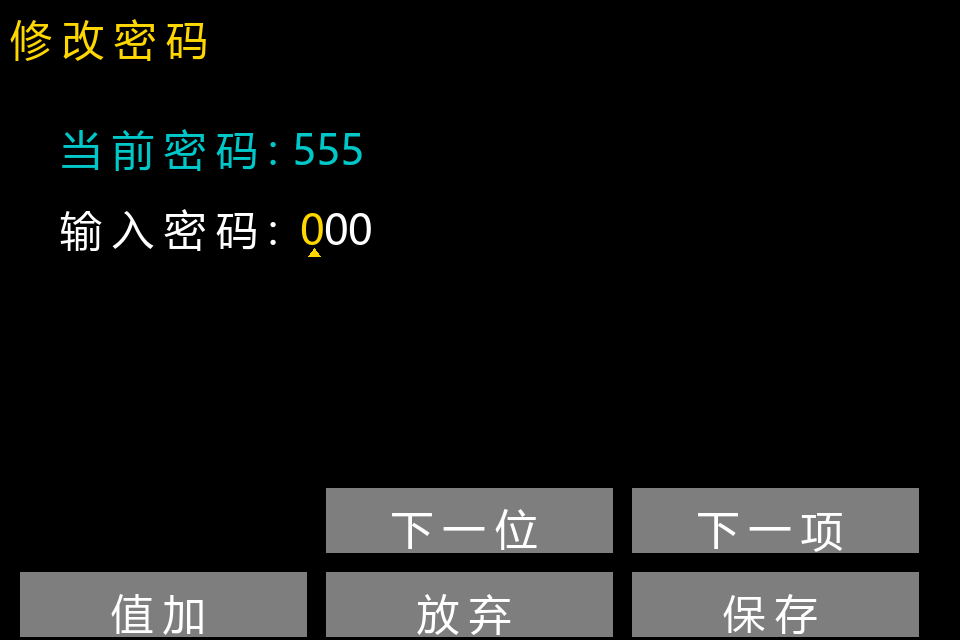

图10  修改密码界面

界面顶部显示当前密码。按数字输入方法输入新密码后，长按按键3保存，屏幕提示「密码已修改」并返回设置菜单；长按按键1可放弃并返回。新密码掉电不丢失。

#### 5.4.2 校准传感器

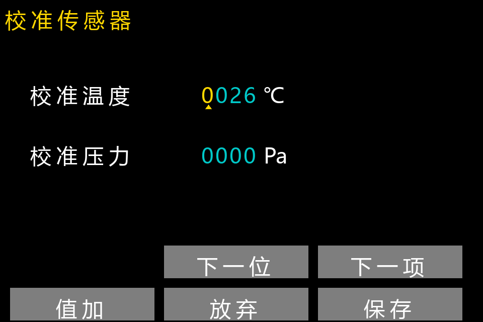

图11  校准传感器界面

用标准温度计/压力计读取当前实际值，将「校准温度」「校准压力」修改为实际值后长按按键3保存，系统即按新基准显示。短按按键3在温度/压力两项间切换（下一项），短按按键2移动数字位，长按按键2放弃修改。校准数据掉电保存。

#### 5.4.3 设置参数

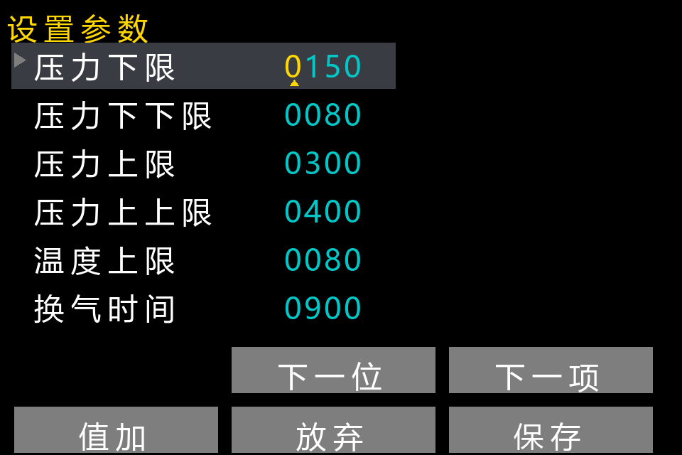

图12  设置参数界面

可设置六项参数：压力下限、压力下下限、压力上限、压力上上限、温度上限、换气时间。短按按键3（下一项）切换参数行，短按按键2（下一位）移动数字位，短按按键1（值加）修改数字，长按按键3保存并提示「参数已保存」，长按按键2放弃修改。

参数关系要求：压力下下限 < 压力下限 < 压力上限 < 压力上上限。修改参数请务必由专业人员进行。

#### 5.4.4 恢复出厂

在设置菜单选中「恢复出厂」后，长按按键3约 3 秒，屏幕提示「已恢复出厂」，所有参数恢复为出厂默认值、密码恢复为 555，并返回主界面。

### 5.5 系统调试（专业人员专用）

图13  系统调试安全警示界面

在主界面短按按键3并输入密码后进入调试警示界面，屏幕以红色大字提示「危险区域严禁在现场使用、可能导致爆炸请确认安全」。确认现场安全后短按按键3（确认调试），系统立即接通送电继电器，右上角显示红色「送电」，并实时显示当前压力、温度，供检修人员测试。

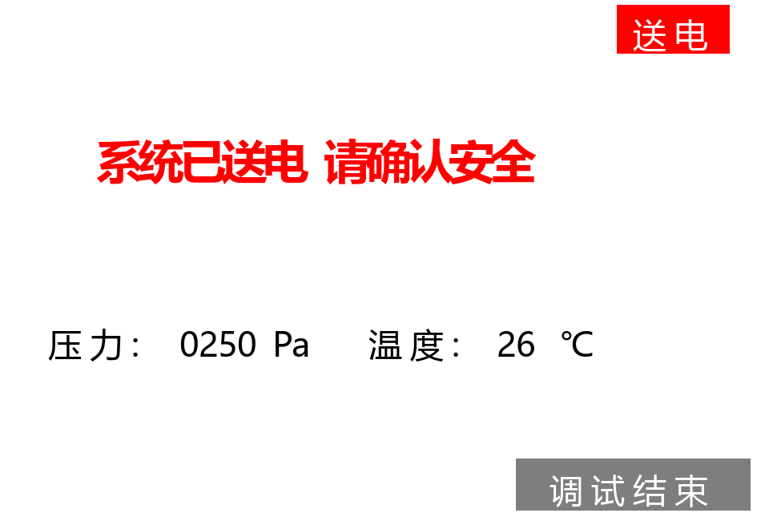

图14  调试送电界面

调试完成后短按按键3（调试结束），断开送电并返回主界面。调试期间系统暂停自动压力控制，请务必有人值守。

## 六、报警与保护功能说明

| 保护功能 | 触发条件 | 系统行为 |
| --- | --- | --- |
| 欠压断电保护 | 柜内压力低于压力下下限持续 10 秒 | 自动断开送电继电器；压力恢复后自动解除锁定 |
| 超压/欠压警报 | 压力低于压力下下限或高于压力上上限 | 警报继电器接通，屏幕红色闪烁「警报」，可按键消音 |
| 传感器异常报警 | 温度或压力传感器信号超出有效范围 | 触发警报并在安全状态下唤醒屏幕提示 |
| 自动稳压 | 压力低于下限 / 高于上限 | 自动补气至区间中点 / 自动泄压至区间中点 |
| 换气保护 | 正压启动后压力未达压力下下限 | 换气倒计时暂停，直至压力恢复 |
| 屏幕保护 | 非关键状态 3 分钟无操作 | 自动息屏，任意按键唤醒 |

## 七、系统参数一览（出厂默认值）

| 参数名称 | 含义 | 默认值 | 单位 |
| --- | --- | --- | --- |
| 压力下限 | 正常运行压力下限，低于此值自动补气 | 150 | Pa |
| 压力下下限 | 欠压报警与断电保护阈值 | 80 | Pa |
| 压力上限 | 正常运行压力上限，高于此值自动泄压 | 300 | Pa |
| 压力上上限 | 超压报警阈值 | 400 | Pa |
| 温度上限 | 柜内温度报警阈值 | 80 | ℃ |
| 换气时间 | 正压启动时换气倒计时时长 | 900 | s |
| 用户密码 | 进入系统设置/调试的密码 | 555 | — |

## 八、常见问题与处理

| 现象 | 可能原因 | 处理方法 |
| --- | --- | --- |
| 屏幕不亮 | 未上电 / 处于自动息屏状态 | 检查供电；按任意键唤醒 |
| 忘记设置密码 | — | 使用万能密码 995 进入设置后重新修改密码 |
| 显示「柜内压力低」并报警 | 气源不足或柜体泄漏 | 检查气源与柜门密封；压力恢复后报警自动解除 |
| 报警后已消音仍显示黄色「消音」 | 压力尚未恢复正常 | 属正常提示；压力恢复正常后自动消失 |
| 换气倒计时不走 | 当前压力低于压力下下限 | 先排查气源，压力恢复后倒计时继续 |
| 压力正常但不送电 | 曾发生欠压断电保护 / 未完成换气 | 确认压力≥压力下限且换气倒计时已结束 |
| 显示值与实际值偏差大 | 传感器漂移 | 在设置中重新校准传感器 |

## 九、售后服务

本产品自出厂之日起享受保修服务。设备出现故障时，请勿自行拆解，请联系售后服务：

谷子防爆电气有限公司

服务电话：13023456789

联系时请提供设备版本号（见开机界面，当前版本 V1.0.1）及故障现象描述。

内容由 AI 生成
